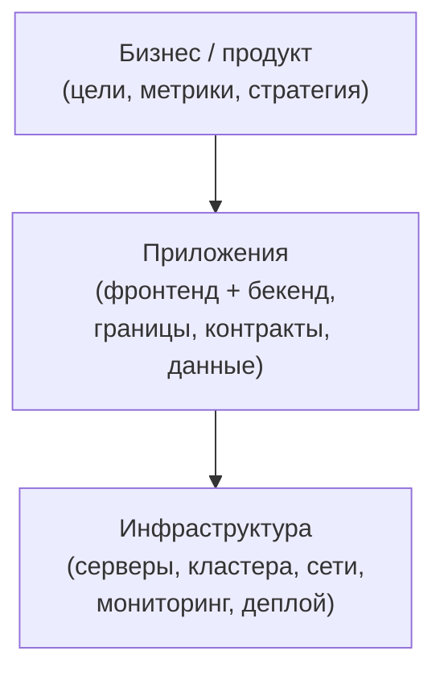
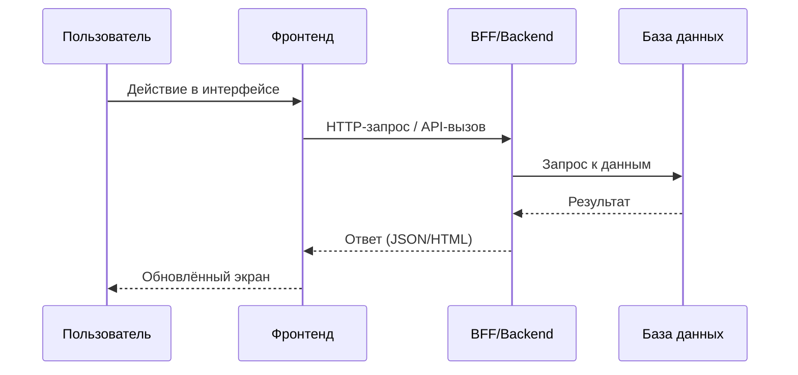

[← Назад к индексу части 0](index.md)

## 0.2. Границы: что входит в трек «Архитектуры (Backend & Frontend)»

### Цель раздела

Чётко очертить, о чём **этот** трек и где заканчивается его зона ответственности: что мы называем архитектурой приложений (бекенд и фронтенд), а какие темы остаются «на стыке» или за пределами плана.

### В этом разделе главное

- Мы фокусируемся на **архитектуре приложений**, а не на управлении людьми и процессами.
- В трек входят решения про **структуру бекенда и фронтенда, данные, контракты, развёртывание и эволюцию**.
- Мы опираемся на инфраструктуру (облака, Kubernetes, CI/CD), но **не превращаем трек в курс по DevOps**.

### Термины

- **Архитектура приложения** — структура и решения внутри самого продукта: бекенд, фронтенд, данные, API.
- **Инфраструктура** — окружение, на котором всё крутится: сервера, контейнеры, сети, хранилища, мониторинг.
- **Оргструктура и процессы** — как устроена команда, кто принимает решения, как идут релизы.

### Теория и правила

С точки зрения глобального плана по архитектурам:

- **Входит в тему:**
  - выбор архитектурного стиля бекенда (монолит, модульный монолит, микросервисы, EDA и т.д.);
  - выбор архитектуры фронтенда (MPA, SPA, SSR, Islands, микрофронтенды);
  - проектирование контрактов (REST/GraphQL/gRPC, BFF, API Gateway);
  - моделирование данных и границ (границы сервисов, контексты, взаимодействия);
  - эволюция архитектуры: миграции, переход монолита к модульному монолиту или микросервисам;
  - связка фронтенда и бекенда (части 30–33 глобального плана).

- **Частично затрагивается:**
  - безопасность (как часть архитектуры систем, а не полный курс по информационной безопасности);
  - наблюдаемость (логи, метрики, трейсы как архитектурное требование, а не только инструмент);
  - эксплуатация и надёжность (паттерны отказоустойчивости, graceful shutdown, стратегии деплоя).

- **Не входит как отдельные курсы:**
  - тактическое DDD «вглубь» (агрегаты, domain events и т.п.) — будет упоминаться как контекст;
  - управление людьми и проектами;
  - низкоуровневые детали сетевых протоколов.

### Простыми словами

В этой программе ты не учишься:

- «как настроить Kubernetes кластер с нуля»;
- «как писать контракт в юрическом смысле»;
- «как управлять командой из 50 человек».

Ты учишься:

- **как разложить продукт на понятные части** (слои, сервисы, компоненты);
- **как эти части общаются между собой** (контракты, API, события);
- **как фронтенд и бекенд влияют друг на друга**;
- **какие архитектурные стили бывают** и чем один лучше/хуже другого в конкретном контексте.

### Картинка в голове

Представь трёхуровневую схему:

- **Верхний уровень** — бизнес и продукт: цели, метрики, стратегия.
- **Средний уровень** — архитектура приложений: слои, компоненты, сервисы, фронтенды, контракты.
- **Нижний уровень** — инфраструктура и эксплуатация: сервера, контейнеры, сети, мониторинг.

То же самое можно увидеть как слоёную диаграмму:

Этот трек в основном **про средний уровень**, но постоянно смотрит вверх и вниз:

- вверх — чтобы архитектура служила бизнес‑целям;
- вниз — чтобы решения были реализуемы на доступной инфраструктуре.

### Как запомнить

Простое правило:

> Если вопрос звучит как «**из каких частей состоит система и как они общаются**?» — это про архитектуру приложений.  
> Если как «**на чём это крутится и как деплоится**?» — это про инфраструктуру (DevOps/SRE).

### Примеры

**Пример 1. Монолит в облаке**

- Архитектура приложений:
  - монолитное приложение с чёткими слоями (контроллеры → сервисы → репозитории);
  - SPA‑фронтенд, общающийся с этим монолитом через REST;
  - одна общая БД.
- Инфраструктура:
  - деплой через Docker;
  - Kubernetes как оркестратор;
  - мониторинг через Prometheus + Grafana.

**Пример 2. Микросервисы и микрофронтенды**

- Архитектура приложений:
  - несколько доменных сервисов (заказы, пользователи, отчёты);
  - несколько микрофронтендов, каждый отвечает за свой домен в интерфейсе;
  - BFF‑слой между фронтом и бекендом.
- Инфраструктура:
  - managed‑кластер в облаке;
  - сервисная mesh‑сеть, инструменты observability.

Упрощённое взаимодействие фронтенда и бекенда можно представить так:

### Типичные ошибки

- Пытаться «впихнуть» в архитектуру всё: HR‑процессы, оргструктуру, бюджет.
- Игнорировать инфраструктурные ограничения (например, «мы сделаем глобальный low‑latency микросервисный зоопарк», но у команды нет опыта и ресурсов).
- Считать, что фронтенд‑архитектура — это «просто выбор фреймворка».

### Что будет, если…

- …не понимать границы темы:
  - легко требовать от архитектуры того, что зависит от процессов (например, «архитектура должна решать, что продукт менеджеры плохо приоритизируют»);
  - путать технический долг с организационным.

### Проверь себя

1. Какие три уровня (бизнес, приложения, инфраструктура) ты видишь в своём текущем проекте? Где находится то, что ты изучаешь в этом треке?  
   

Ответ

   На верхнем уровне — бизнес‑цели и продуктовые решения, на среднем — структура приложений (бекенд, фронтенд, данные, интеграции), на нижнем — инфраструктура (серверы, кластера, сети, мониторинг). Трек по архитектурам в основном про средний уровень, но с постоянными ссылками на верхний и нижний.
   

2. Как ты объяснишь разницу между архитектурой приложения и инфраструктурой на примере любого веб‑проекта?  
   

Ответ

   Архитектура приложения отвечает за то, из каких модулей/сервисов состоит система, какие у них контракты, какие данные и потоки. Инфраструктура — за то, где это всё крутится (серверы, контейнеры, сети), как раскатывается и мониторится. Развернуть монолит в Kubernetes можно по‑разному, но это разные уровни решений.
   

3. Какие темы в треке «Архитектуры (Backend & Frontend)» ты ожидаешь увидеть именно как архитектурные, а какие — только как контекст?  
   

Ответ

   Архитектурные: выбор стиля бекенда (монолит/микросервисы и т.п.), тип фронтенда (MPA/SPA/SSR/Islands), контракты, BFF, эволюция архитектуры, границы сервисов и модулей. Контекстные: конкретные CI/CD‑пайплайны, настройки Kubernetes, процесс управления задачами, оргструктура.
   

### Запомните

- Трек про архитектуры — это про **структуру приложений и их взаимодействия**, а не про все технические темы разом.

---
