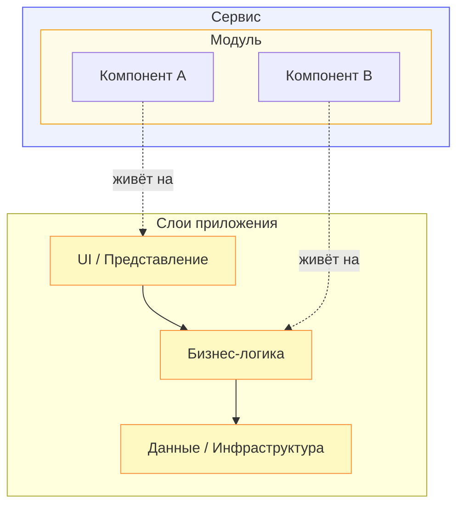

[← Назад к индексу части 1](index.md)

## 1.1. Компонент, модуль, слой, сервис

### Цель раздела

Сделать так, чтобы слова **«компонент», «модуль», «слой» и «сервис»** имели для тебя **чёткие, различимые значения**, и ты мог(ла) уверенно использовать их, описывая архитектуру бекенда и фронтенда.

### В этом разделе главное

- Компонент, модуль, слой и сервис — это **разные проекции на систему**, а не взаимозаменяемые слова.
- **Компонент** — логическая часть системы, **модуль** — единица поставки/сборки, **слой** — положение в вертикали, **сервис** — сетевой участник с API.
- В монолите и микросервисной архитектуре эти понятия используются немного по‑разному, но **базовые идеи совпадают**.
- На фронтенде тоже есть компоненты, модули и слои (UI, состояние, данные), а иногда и «фронтенд‑сервисы» (BFF, микрофронтенды).

### Термины

- **Компонент** — логически цельная часть системы с понятной ответственностью и границей.
- **Модуль** — единица развёртывания или сборки (пакет, библиотека, микросервис).
- **Слой** — горизонтальный уровень (UI, бизнес‑логика, данные и т.п.) с правилами зависимостей «кто кого может вызывать».
- **Сервис** — компонент, с которым общаются по сети через контракт (API).

### Теория и правила

1. **Компонент: «о чём этот кусок системы?»**  
   Компонент определяют через:
   - ответственность: за что он отвечает (заказы, каталог, оплата, профиль пользователя);
   - границу: что внутри (реализация) и что снаружи (интерфейс/контракт);
   - контекст: в монолите компонент может быть пакетом; в фронтенде — набором связанных React‑компонентов и хуков.

2. **Модуль: «как мы это собираем и поставляем?»**  
   Модуль — это:
   - артефакт сборки: `jar`, `npm package`, библиотека, микросервисный контейнер;
   - минимальная единица, которую мы можем **отдельно собирать, тестировать, версионировать**;
   - внутри модуля может быть несколько компонентов.

3. **Слой: «на каком уровне архитектуры это живёт?»**  
   Слой определяет:
   - вертикальное положение: UI, бизнес‑логика, доступ к данным, инфраструктура;
   - правило зависимостей: в классической слоистой архитектуре зависимости **идут только вниз**;
   - часто слои совпадают и на фронтенде, и на бекенде (слой представления, слой домена, слой данных).

4. **Сервис: «кто это в мире сетевых взаимодействий?»**  
   Сервис:
   - доступен по сети (HTTP, gRPC, WebSocket и т.п.);
   - имеет **сетевой контракт** (API, протокол, схема);
   - обычно — отдельный модуль/процесс/контейнер.

5. **Связь понятий между собой.**
   - Один **модуль** может содержать несколько **компонентов**.
   - Несколько модулей могут принадлежать одному **слою**.
   - **Сервис** почти всегда является модулем (его можно отдельно деплоить) и содержит один или несколько компонентов.

6. **Путаница контекстов.**
   - В UML под компонентом часто понимают «физический блок деплоя».
   - В UI (React/Vue) под компонентом понимают «видимый кусочек интерфейса».
   - В архитектуре приложений «компонент» шире: это логическая часть, которая может быть реализована разными модулями и слоями.

### Пошагово: как разобраться, что перед тобой

1. Задай вопрос: **«За что это отвечает?»**  
   - Если ответ «за заказы», «за оплату» — вероятно, компонент или доменный модуль.
   - Если ответ «это библиотека для логирования» — модуль поддержки/инфраструктуры.

2. Спроси: **«Как это поставляется/деплоится?»**  
   - Отдельный контейнер или процесс → модуль уровня сервиса.
   - Библиотека, которую подключают другие → модуль‑библиотека.

3. Определи **слой**, где это живёт:
   - пользовательский интерфейс? бизнес‑логика? работа с БД? интеграции?

4. Спроси: **«Есть ли у этого сетевой API?»**  
   - Если да — это сервис (либо часть сервиса).
   - Если нет — это внутренний модуль/компонент.

### Простыми словами

Представь интернет‑магазин:

- **Компонент** — «каталог товаров», «корзина», «оформление заказа».
- **Модуль** — отдельное веб‑приложение `catalog-service`, библиотека `pricing-lib`, npm‑пакет `ui-kit`.
- **Слой** — «страницы и API фронтенда», «бизнес‑логика расчёта цен», «хранение в PostgreSQL».
- **Сервис** — `catalog-service` как отдельный backend‑сервис с REST API или `orders-bff` как BFF.

На фронтенде:

- компонентом UI может быть **страница оформления заказа**;
- модулем может быть **папка `checkout` с собственным роутингом и состоянием**;
- слой UI — визуальные компоненты и верстка, слой состояния — хранилище (Redux/Zustand/Signals), слой данных — клиенты API;
- если есть несколько SPA/микрофронтендов, каждый из них можно считать отдельным «фронтенд‑сервисом».

### Картинка в голове

Удобная метафора:

- **компоненты** — «комнаты» в доме (кухня, спальня, ванная);
- **модули** — «блоки постройки» (квартира, этаж, отдельное крыло здания), которые можно продавать/сдавать как целое;
- **слои** — «этажи» (подвал с коммуникациями, жилые этажи, крыша с инфраструктурой);
- **сервисы** — «отдельные здания», у которых есть адрес и входная дверь (API).

Можно представить это и как простую диаграмму:

### Как запомнить

- **Компонент** — *что делает?* (ответственность).
- **Модуль** — *как поставляется?* (артефакт).
- **Слой** — *где в вертикали?* (уровень).
- **Сервис** — *доступен ли по сети?* (API).

Можно запомнить и в виде мини‑таблицы:

| Вопрос | Компонент | Модуль | Слой | Сервис |
|--------|-----------|--------|------|--------|
| **За что отвечает?** | За одну область функции/домена («заказы», «оплата»). | За группу компонентов и кода, поставляемых вместе. | За тип задач (UI, бизнес‑логика, данные). | За набор возможностей, доступных по сети. |
| **Как поставляется?** | Обычно как часть модуля. | Как артефакт (библиотека, пакет, контейнер). | Не поставляется сам по себе, это логический уровень. | Как отдельный процесс/контейнер. |
| **Есть ли сетевой API?** | Не обязательно. | Не обязательно. | Нет, это уровень, а не сущность. | Да, это его суть. |
| **Пример** | «Каталог товаров» в монолите или SPA. | `catalog-service`, `ui-kit`, `billing-lib`. | UI / Domain / Data. | `orders-service`, `auth-service`, `bff-web`. |

### Примеры (бекенд и фронтенд)

**Бекенд:**

- Микросервис `billing-service`:
  - сервис — сам `billing-service` как отдельный процесс;
  - слой бизнес‑логики внутри — модуль `billing.domain`;
  - слой данных — модуль `billing.persistence`;
  - компоненты — «расчёт инвойса», «проведение платежа».

**Фронтенд:**

- SPA на React:
  - слой UI — компоненты страниц и виджетов;
  - слой состояния — модули `store/orders`, `store/cart`;
  - слой данных — модули `api/orders`, `api/catalog`;
  - компонентом может быть «карточка товара», модулем — `features/cart`.

### Практика / реальные сценарии

В реальных проектах путаница терминов порождает реальные проблемы:

- архитектор говорит: «выделим сервис», имея в виду **отдельный процесс**, а разработчик понимает **класс `UserService` внутри монолита**;
- фронтенд‑команда говорит «монолитный компонент», имея в виду **одну большую страницу**, а архитектор думает о **монолитном приложении**;
- менеджер просит «разделить модуль оплаты на микросервисы», но на самом деле речь про **рефакторинг бизнес‑логики внутри одного сервиса**.

Чёткие термины помогают:

- избегать недопонимания между командами;
- правильно планировать разбиение системы;
- уменьшать риск «разрезать не там».

### Типичные ошибки

- Называть **любой класс со словом `Service` «сервисом»** в архитектурном смысле.
- Смешивать уровни: говорить «слой оплаты» и «модуль оплаты», не различая вертикаль (слой) и единицу поставки (модуль).
- Считать, что **любой модуль = микросервис**, и пытаться развёртывать каждую библиотеку отдельно.

### Что будет, если…

- …путать эти понятия:
  - архитектурные обсуждения превращаются в «разговор слепых с глухими»;
  - принимаются неверные решения («надо 50 микросервисов», а по факту нужны 3 модуля в одном монолите).
- …сознательно **развести термины**:
  - проще объяснять архитектуру новичкам;
  - легче проектировать границы (что вынести в отдельный сервис, а что оставить модулем).

### Проверь себя

1. Придумай пример компонента, который **не является** отдельным сервисом.  
   

Ответ

   Например, компонент «поиск по каталогу» в монолитном приложении. Он реализован как набор классов/функций внутри одного бекенд‑приложения и не имеет собственного API, доступного снаружи как отдельный сервис. С точки зрения архитектуры это компонент внутри модуля/монолита, а не самостоятельный сетевой сервис.
   

2. Чем отличается **компонент** от **слоя** на примере любого веб‑приложения?  
   

Ответ

   Компонент — это часть системы, отвечающая за конкретную предметную область или функцию (например, «каталог товаров», «оформление заказа»). Слой — это уровень архитектуры (UI, бизнес‑логика, данные), через который проходят многие компоненты. Один и тот же компонент частично реализуется в нескольких слоях: у него есть UI‑часть, бизнес‑логика и доступ к данным, но слой при этом остаётся логическим уровнем, а не «кусочком домена».
   

3. Чем отличается «слой данных» от «модуля доступа к данным»?  
   

Ответ

   Слой данных — это уровень архитектуры в целом (всё, что отвечает за работу с хранилищами). Модуль доступа к данным — конкретная единица реализации внутри этого слоя (например, библиотека `user-repository` или пакет `persistence`). В одном слое данных может быть несколько модулей.
   

4. Почему неправильно называть любой класс `UserService` «микросервисом»?  
   

Ответ

   Потому что микросервис — это отдельный сервис с собственным процессом/контейнером и сетевым API. Класс `UserService` внутри монолита — это часть внутренней реализации (компонент/класс в модуле), а не самостоятельная архитектурная единица на уровне сервисов.
   

### Запомните

- Компонент, модуль, слой и сервис — **четыре разных линзы** на систему.
- Чёткие определения помогают **не резать архитектуру «по названиям классов»** и избегать ненужных усложнений.

---
