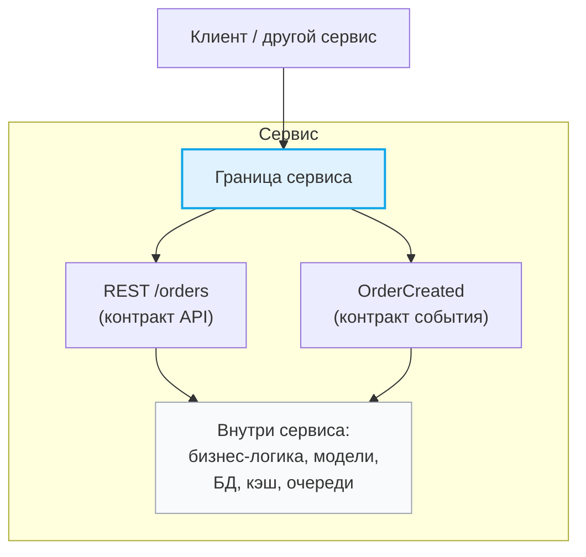

[← Назад к индексу части 1](index.md)

## 1.2. Контракт и граница

### Цель раздела

Показать, что **контракты и границы** — это основа управляемой архитектуры: без них части системы срастаются в «комок грязи», а с ними можно **эволюционировать, менять реализации и держать сложность под контролем**.

### В этом разделе главное

- **Контракт** — это формальное соглашение о взаимодействии, а не просто «мы договорились в чате».
- **Граница** — это линия, которую можно пересекать только через контракт.
- Хорошие границы и контракты позволяют:
  - заменять реализацию без поломки потребителей;
  - тестировать части системы по отдельности;
  - разделять ответственность между командами.
- Плохие контракты (например, общая БД) приводят к хрупким системам и «распределённым монолитам».

### Термины

- **Контракт** — явное, по возможности формализованное описание взаимодействия между частями системы.
- **Граница** — раздел между компонентами/модулями/сервисами; всё, что «за границей», видно только через контракт.
- **Инкапсуляция** — сокрытие внутренней реализации за границей.

### Теория и правила

1. **Контракт = что, но не как.**  
   Контракт описывает:
   - какие операции доступны (эндпоинты, методы, события);
   - какие данные принимаются и возвращаются (схемы, типы);
   - какие гарантии даются (коды ошибок, идемпотентность, порядок, SLA).
   Контракт **не описывает** внутреннюю реализацию (какая БД, какой фреймворк, какие структуры данных внутри).

2. **Формальность контракта.**
   - На маленьком проекте контракт может быть «устным» (описание в README, договорённость в чате).
   - В растущей системе контракт должен быть **формальным**:
     - OpenAPI/Swagger для REST;
     - protobuf/gRPC‑описания;
     - GraphQL‑схема;
     - схема событий (Avro/JSON‑schema) для топиков;
     - интерфейсы в коде.

3. **Граница: где заканчивается «моё» и начинается «чужое».**
   - Граница определяет **владение**: какие данные и правила принадлежат этому компоненту/сервису;
   - за границей мы видим только контракт, а **детали реализации мы не трогаем**;
   - внутри границы команда может менять реализацию, пока не ломает контракт.

4. **Плохие контракты и «дырявые» границы.**
   - Общая таблица БД для нескольких сервисов — пример **неявного контракта**;
   - доступ к внутренним структурам другого модуля — пример нарушения границы;
   - «договорились, что поле `status` будет означать одно и то же во всех системах» без формальной схемы — скрытый источник багов.

5. **Эволюция контрактов.**
   - Контракты должны быть **эволюционируемыми**:
     - добавление новых полей без ломания старых клиентов;
     - явная политика версионирования (v1, v2; заголовки; схемы);
     - deprecation‑политика.
   - Без этого любая попытка менять реализацию превращается в серию production‑инцидентов.

### Пошагово: как описать границу

1. Определи, **какие данные и операции** внутри границы:
   - какие сущности «живут» здесь (заказы, пользователи, платежи);
   - какие действия выполняются (создать, обновить, отменить, рассчитать).
2. Сформулируй **контракт**:
   - для API: URI, методы, форматы, коды ошибок;
   - для событий: название, поля, контекст;
   - для очередей: типы сообщений, гарантии доставки.
3. Явно запиши, **что запрещено делать снаружи**:
   - нельзя ходить в БД напрямую;
   - нельзя полагаться на внутренние типы/таблицы.
4. Подумай, **как контракт будет меняться**:
   - какие поля могут появиться;
   - какие сценарии устаревания ты видишь.

### Простыми словами

Контракт — это как **договор с сервисной компанией**:

- ты знаешь, **что** они сделают (починят стиральную машину);
- ты знаешь, **как с ними связаться** (телефон, форма на сайте);
- ты не знаешь и не должен знать, **как именно** они организуют бригаду, склад и логистику.

Граница — это дверь в их офис:

- ты **не ходишь на их склад сам**, не копаешься в их внутренних документах;
- ты взаимодействуешь только через **официальный канал** по контракту.

В архитектуре:

- контракт — это API или схема события;
- граница — это линейка вокруг сервиса/модуля:
  - «внутри» — его БД, структуры данных;
  - «снаружи» — только то, что описано в контракте.

### Картинка в голове

Представь прямоугольник (сервис или модуль), вокруг него рамка — **граница**.  
На рамке нарисованы:

- маленькие прямоугольники с подписями `REST /users`, `POST /orders`, `OrderCreated` — это **контракты**;
- внутри прямоугольника куча деталей: классы, таблицы, кэш, настройки — всё это **скрыто** за границей.

То же самое можно отобразить через Mermaid:

### Как запомнить

- Контракт — **«обещания наружу»** (что и как я делаю).
- Граница — **«мой забор»** (что внутри забора — моё дело; снаружи видно только обещания).

### Примеры (бекенд и фронтенд)

**Бекенд:**

- Хороший контракт:
  - REST‑API `/api/orders` с формальной OpenAPI‑спецификацией;
  - JSON‑событие `OrderPaid` с описанной схемой;
  - gRPC‑метод `ProcessPayment` с protobuf‑описанием.
- Плохой контракт:
  - три сервиса напрямую читают одну и ту же таблицу `orders` в БД;
  - один сервис пишет в таблицу поля, про которые другие сервисы ничего не знают, но зависят от них по факту.

**Фронтенд:**

- Хороший контракт:
  - BFF с чётким API под конкретное SPA (отдаёт данные ровно в нужном формате);
  - типизированный клиент (например, сгенерированный по OpenAPI/GraphQL‑схеме).
- Плохой контракт:
  - фронт напрямую ходит в несколько бекенд‑сервисов, каждый со своей схемой и особенностями;
  - фронт зависит от внутренних полей, которые бекенд не считает частью официального API.

### Практика / реальные сценарии

Типичный сценарий:

- у вас монолит и несколько микросервисов;
- «временное решение»: фронт и один из сервисов читают таблицу `orders` напрямую;
- через год:
  - таблица разрослась;
  - каждый сервис и фронт по‑своему интерпретируют `status`;
  - изменить схему становится почти невозможно, не поломав что‑то.

Правильный путь:

- выделить **контракт** (API или события) для работы с заказами;
- ограничить доступ к таблице `orders` только сервисом «Заказы»;
- провести **границу владения данными**: кто отвечает за истину о заказах.

### Типичные ошибки

- Использовать **общую БД как контракт** между сервисами.
- Оставлять контракты неформальными («посмотри в коде, как оно там работает»).
- Протаскивать наружу **внутренние детали реализации** (имена таблиц, внутренних типов), а потом бояться их менять.

### Что будет, если…

- …не определить границы и контракты:
  - система превратится в «большой шар грязи»;
  - любое изменение в одном месте ломает пол‑системы;
  - невозможно развивать разные части независимо.
- …явно определить и поддерживать контракты:
  - можно **менять реализацию** без поломки потребителей;
  - проще тестировать по границам;
  - можно разделять ответственность между командами.

### Проверь себя

1. Почему общая таблица БД для двух сервисов — плохой контракт?  
   

Ответ

   Потому что это неявный, неформальный контракт: сервисы зависят от внутренней схемы данных друг друга. Любое изменение таблицы (переименование поля, изменение типа) может сломать другой сервис. Граница владения данными размыта, нарушается инкапсуляция и становится почти невозможно эволюционировать схему без массовых правок.
   

2. Приведи пример хорошего контракта между фронтендом и бекендом.  
   

Ответ

   Например, REST‑API `/api/orders` с OpenAPI‑описанием, где чётко определены запросы, ответы и ошибки. Фронт использует сгенерированный типизированный клиент, а изменения в контракте проходят через процесс версионирования и согласования, что позволяет эволюционировать API без скрытых ломаний.
   

3. Что означает «граница владения данными»?  
   

Ответ

   Это договорённость, что за определённый набор данных (например, заказы) отвечает один конкретный компонент/сервис. Только он имеет право напрямую работать с этими данными в хранилище, а остальные обращаются к ним через его контракт (API или события). Это позволяет чётко определить, кто меняет структуру данных и несёт ответственность за их целостность.
   

4. Чем отличается формальный контракт (например, OpenAPI или protobuf‑схема) от «контракта по договорённости в чате» в долгоживущем продукте?  
   

Ответ

   Формальный контракт зафиксирован в виде артефакта (схема, IDL, спецификация), который можно валидировать, версионировать и использовать для генерации клиентов/серверов и тестов. Он переживает смену людей и масштабирование команды. «Контракт по договорённости в чате» живёт в головах и скриншотах: со временем его трактуют по‑разному, новые люди не знают деталей, а любые изменения легко ломают других потребителей, потому что нет единого источника правды о формате и гарантиях.
   

### Запомните

- Контракты и границы — **скелет архитектуры**. Если скелет «резиновый» и неявный, система разваливается под собственной тяжестью.

---
