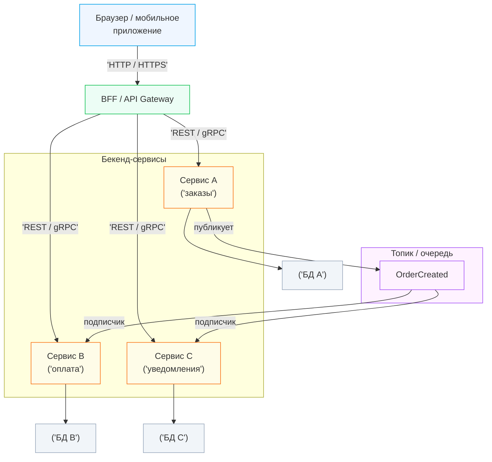

[← Назад к индексу части 1](index.md)

## 1.4. Базовые сущности архитектуры

### Цель раздела

Свести в одну картину базовые сущности, которые будут постоянно встречаться дальше: **API, события, очереди, хранилища, интерфейс и реализация** — и показать, как они работают вместе в архитектуре бекенда и фронтенда.

### В этом разделе главное

- API, события, очереди и хранилища — это **строительные блоки архитектуры**.
- Один и тот же продукт может использовать разные формы API и разные виды хранилищ.
- Важно чётко различать **интерфейс (контракт)** и **реализацию**.
- Понимание этих сущностей сейчас сильно упростит восприятие частей 3–20 (монолит, микросервисы, EDA, CQRS, Event Sourcing, данные и масштабирование).

### Термины

- **API (Application Programming Interface)** — интерфейс запрос‑ответ.
- **Событие** — неизменяемое сообщение о факте в прошлом.
- **Очередь/топик** — механизм доставки сообщений.
- **Хранилище** — место долговременного хранения данных (source of truth для конкретного типа данных или вспомогательное хранилище, например кэш).
- **Интерфейс** — контракт, который обещает набор операций.
- **Реализация** — конкретный код, который этот контракт выполняет.

### Теория и правила

1. **API: синхронное взаимодействие.**
   - Клиент делает запрос (HTTP/gRPC/GraphQL), сервер отвечает;
   - важно думать про:
     - **идемпотентность**: повторный запрос (например, при retry) не должен приводить к «двойной оплате» или созданию дубликатов, если так не задумано;
     - **безопасность методов**: GET не должен изменять состояние; POST/PUT/PATCH/DELETE — изменяют, но должны быть спроектированы так, чтобы их повторы не ломали данные;
     - **коды ошибок и формат ответов**: единообразные коды и структура тела ошибки (например, `code`, `message`, `details`) снимают много боли у клиентов;
     - **версионирование**: как менять контракт, не ломая клиентов (версии в пути/заголовках, расширяемые схемы, deprecation‑политика).

2. **События: асинхронное взаимодействие.**
   - Событие описывает **факт**: `OrderCreated`, `PaymentFailed`.
   - Публикуется один раз, может быть прочитано многими потребителями.
   - Важно:
     - чётко описывать схему события;
     - понимать **гарантии доставки** (at‑most‑once, at‑least‑once, иногда exactly‑once на уровне платформы) и проектировать обработчики под них;
     - делать обработчики **идемпотентными** (повторная обработка того же события не ломает состояние);
     - учитывать задержку доставки и возможное «отставание» потребителей.

3. **Очереди и топики.**
   - Очередь:
     - обычно один потребитель (или группа, но сообщение обрабатывается один раз);
     - применима для задач, которые нужно «разгрузить» во времени.
   - Топик:
     - несколько независимых подписчиков;
     - подходит для событийной архитектуры (EDA).

4. **Хранилища.**
   - Реляционные БД (PostgreSQL, MySQL);
   - документные (MongoDB);
   - key‑value (Redis);
   - blob‑хранилища (S3‑подобные);
   - кэш как отдельный уровень.
   - Архитектура всегда отвечает на вопрос **«где живут какие данные и почему»**.

5. **Интерфейс vs реализация.**
   - Интерфейс/контракт фиксирует:
     - имена операций;
     - типы входов/выходов;
     - ожидаемое поведение.
   - Реализация может:
     - меняться;
     - использовать разные БД, фреймворки;
     - оптимизироваться, пока не ломает контракт.

### Пошагово: мысленный конструктор

Возьмём простой сценарий — **создание заказа в интернет‑магазине**:

1. Фронтенд вызывает **API** `POST /api/orders`.
2. Бекенд:
   - валидирует запрос;
   - пишет заказ в **хранилище** (БД);
   - публикует **событие** `OrderCreated` в топик/очередь.
3. Другие компоненты:
   - сервис уведомлений читает событие и отправляет e‑mail;
   - сервис аналитики обновляет отчёт.

Здесь задействованы:

- API (между фронтендом и бекендом);
- хранилище (БД заказов);
- события и очередь/топик (между сервисами);
- интерфейсы (контракты API и событий) и реализации (конкретный код, БД).

### Простыми словами

Можно думать так:

- API — это **дверь, в которую стучится клиент** (браузер, мобильное приложение, другой сервис).
- События — это **объявление по громкой связи**, что что‑то случилось.
- Очередь/топик — это **доска объявлений или конвейер**, по которому сообщения доходят до обработчиков.
- Хранилище — это **архив**, где мы храним факты в долговременной форме.
- Интерфейс — это **вывеска и меню** (что мы умеем делать).
- Реализация — это **кухня и повара**, которые это делают.

### Картинка в голове

Нарисуй себе:

- слева — фронтенд (браузер, мобильное приложение);
- по центру — API‑шлюз/BFF;
- за ним — несколько сервисов;
- между сервисами — стрелки событий через топики;
- снизу — хранилища данных (БД, кэши);
- у каждого сервиса есть **интерфейсы** (API/события) и **реализация** (код, БД).

Пример в виде Mermaid‑диаграммы:

### Как запомнить

- API — когда нужен **ответ здесь и сейчас**.
- Событие + очередь/топик — когда можно **развести по времени** и подключить много подписчиков.
- Хранилище — **источник истины**; всегда задавай вопрос «какое хранилище и почему».

### Примеры (бекенд и фронтенд)

**Бекенд:**

- REST‑API `/api/users` ⇄ Postgres;
- события `UserRegistered`, `UserDeleted` в Kafka;
- очередь задач на отправку писем в RabbitMQ;
- кэш профилей в Redis.

**Фронтенд:**

- вызов BFF по HTTP;
- подписка на события через WebSocket/SSE (уведомления, обновление ленты);
- локальное хранилище (IndexedDB/localStorage) как мини‑хранилище на клиенте.

### Практика / реальные сценарии

В реальной жизни:

- один и тот же продукт может иметь:
  - публичный REST‑API для внешних интеграций;
  - внутренний gRPC‑API между сервисами;
  - события в Kafka для аналитики и реакций;
  - несколько хранилищ (OLTP‑БД, аналитическое хранилище, кэши).

Важно:

- не путать интерфейс с реализацией;
- явно выбирать, **где API, где события, где какое хранилище**;
- понимать, что эти решения — **архитектурные**, а не «детали реализации».

### Типичные путаницы терминов (живые примеры)

Эти путаницы встречаются постоянно и ведут к неправильным решениям (особенно у людей с низким порогом входа). Старайся ловить их в речи команды.

#### 1) “У нас микросервис” (на самом деле: класс `Service` в монолите)

- **Как звучит**: «я написал сервис пользователей» (и показывают папку `services/UserService.ts`).  
- **Что на самом деле**: это *слой/класс* внутри одной единицы развёртывания.  
- **Как правильно уточнять**: «Это отдельный процесс/деплой с сетевым контрактом? Есть ли владение данными?»

Мини‑правило: **микросервис = независимый деплой + сетевой контракт + (обычно) владение данными**. Иначе это не микросервис, а внутренняя структура монолита.

#### 2) “Модуль = папка”

- **Как звучит**: «у нас модуль заказов» (и показывают папку `orders/`).  
- **Где ловушка**: папка сама по себе не создаёт границу: из неё всё ещё можно импортировать всё подряд.  
- **Что делает модуль модулем**: **публичный API** (что разрешено использовать снаружи) + **запреты зависимостей** (что нельзя).

Быстрый тест: «Могу ли я удалить/заменить внутренности `orders`, не ломая внешний код, если сохраню публичный интерфейс?»

#### 3) “Слой (layer) = tier (уровень развертывания)”

- **Как звучит**: «у нас 3 слоя: фронт, бек, база» (это скорее tiers).  
- **Правильно**:
  - **tier** — физическое разбиение/развёртывание (процессы/узлы/инфраструктура),
  - **layer** — логическое разбиение ответственности (UI/домены/данные) и **правила зависимостей**.

Зачем различать: можно иметь **один tier (монолитный процесс)** и при этом **несколько layers** внутри.

#### 4) “Контракт = урл эндпоинта”

- **Как звучит**: «контракт — это `/api/users`».  
- **Что пропущено**: контракт — это ещё и **схема полей**, **коды ошибок**, **семантика** (идемпотентность), **ограничения** (пагинация/лимиты), **правила эволюции**.  

Мини‑правило: если вы не можете ответить «что будет, если поле исчезнет» — контракт у вас не зафиксирован.

#### 5) “Связанность = много вызовов” (путают coupling и latency)

- **Связанность (coupling)** — зависимость по изменениям и знанию деталей: «если поменяли там — ломается тут».  
- **Латентность/сеть** — скорость обмена: «много hop’ов, долго».

Система может быть:
- **быстрой, но сильно связанной** (общая БД, общий формат, общие “хелперы”),
- **медленной, но с хорошими границами** (слишком много сетевых вызовов без агрегации).

И лечится это разными лекарствами (модульность/контракты vs BFF/кэш/агрегация).

### Типичные ошибки

- Использовать только REST‑API, даже там, где нужны события и очереди (нагрузка, отложенная обработка).
- Пытаться решать всё через одну БД, не вводя специализированные хранилища или кэши.
- Не разделять интерфейс и реализацию: например, API «зашит» в код без схем и документации.

### Что будет, если…

- …не различать эти сущности:
  - сложно проектировать архитектуры (микросервисы, EDA, CQRS);
  - ошибки в выборе механизмов коммуникации и хранения.
- …чётко понимать их роли:
  - легче выбирать архитектурные стили;
  - легче объяснять и обсуждать решения в команде.

### Проверь себя

1. В каких случаях для коммуникации между сервисами уместнее использовать события, а не синхронный API?  
   

Ответ

   Когда не требуется немедленный ответ и можно развести обработку по времени (уведомления, обновление проекций, аналитика), а также когда несколько независимых потребителей должны реагировать на один факт. События позволяют слабее связать сервисы и избегать каскадных зависимостей по доступности.
   

2. Чем отличается интерфейс (контракт) от реализации на примере API?  
   

Ответ

   Интерфейс/контракт описывает доступные эндпоинты, поля, форматы, коды ошибок и ожидания по поведению (например, идемпотентность). Реализация — это конкретный код контроллеров, сервисов, репозиториев и настроек БД, который выполняет этот контракт. Реализацию можно менять (оптимизировать, переписывать), пока контракт остаётся совместимым.
   

3. Приведи пример, когда одно и то же хранилище используется и как основное, и как кэш — и почему это опасно.  
   

Ответ

   Например, когда Redis изначально использовался как кэш для профилей, но со временем начали писать туда данные «на постоянку» без БД. В итоге часть кода считает Redis источником истины, часть — кэшем. При сбое или очистке кэша данные теряются, хотя система «думала», что они персистентны. Поэтому важно явно различать роли хранилища.
   

4. Почему важно различать OLTP‑хранилище (операционная БД), аналитическое хранилище и кэш уже на уровне архитектурных терминов, а не считать их просто «местами для данных»?  
   

Ответ

   Потому что у этих хранилищ разные задачи, нагрузки и гарантии: OLTP‑БД обслуживает частые маленькие транзакции и является источником истины для доменных данных; аналитическое хранилище агрегирует и денормализует данные для отчётов с другой схемой доступа и допускает задержку; кэш хранит копии и может быть очищен в любой момент. Если не различать эти роли, архитектурные решения (например, где считать деньги, откуда строить отчёты, на что опирается бизнес‑логика) становятся хрупкими и приводят к инцидентам при сбоях или миграциях.
   

### Запомните

- API, события, очереди, хранилища, интерфейс и реализация — **алфавит архитектуры**. Последующие части будут собирать из этого алфавита разные «слова» и «предложения».

---
