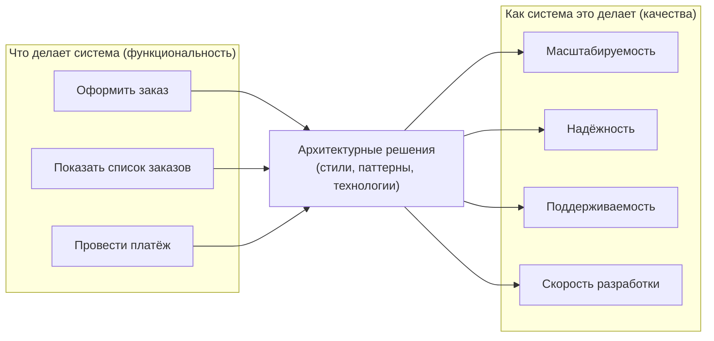

[← Назад к индексу части 2](index.md)

## 2.1. Зачем архитектуре цели и как думать о качествах системы

### Цель раздела

Сместить фокус с вопроса **«какая архитектура моднее»** на вопрос **«какие цели системы мы пытаемся поддержать архитектурой»**, и дать удобный язык для разговора об этих целях — **качества системы (quality attributes)**.

### В этом разделе главное

- Любая архитектура **служит целям системы**; без понимания этих целей разговор про архитектуру превращается в спор вкусов.
- Цели системы раскладываются на **функциональные требования** («что система делает») и **нефункциональные требования / качества системы** («как она это делает во времени»).
- Архитектура в первую очередь работает именно с **качествами**: масштабируемостью, надёжностью, безопасностью, поддерживаемостью, тестируемостью, стоимостью владения.
- Один и тот же продукт может требовать **разных архитектур** в зависимости от приоритетов качеств и ограничений.
- Правильные вопросы к архитектуре начинаются с **«что для нас важнее всего и в каких сценариях?»**.

### Термины

- **Функциональные требования** — что система должна уметь делать: фичи, сценарии пользователя, API‑операции.
- **Нефункциональные требования / качества системы (quality attributes)** — как система должна себя вести: по нагрузке, надёжности, безопасности, времени отклика, удобству развития.
- **Цели архитектуры** — набор приоритетных качеств и ограничений, под которые проектируются архитектурные решения.

### Теория и правила

1. **Функциональные vs нефункциональные требования.**
   - Функциональные:
     - «пользователь может оформить заказ»;
     - «фронтенд показывает список заказов»;
     - «API возвращает историю платежей».
   - Нефункциональные:
     - «система выдерживает до 1000 заказов в минуту»;
     - «новую фичу можно внедрить за 1–2 недели без тотального переписывания»;
     - «ошибка одного сервиса не роняет весь продукт»;
     - «среднее время ответа фронта до 200 мс для 95 % запросов».

2. **Архитектура сильнее всего влияет именно на нефункциональные требования.**
   - Функциональность можно реализовать **почти в любой архитектуре**;
   - но:
     - реализовать «тот же функционал» в плохо спроектированном монолите и в аккуратном модульном монолите — **разная стоимость и скорость изменений**;
     - выдержать ту же нагрузку в «случайном» SPA+API и в системе с продуманной кэш‑ и очередями — **разная надёжность и масштабируемость**.

3. **Качества системы конфликтуют между собой.**
   - Примеры конфликтов:
     - высокая гибкость и простота архитектуры vs максимальная производительность;
     - абсолютная безопасность vs удобство разработки и UX;
     - скорость вывода фич vs глубина анализа всех последствий.
   - Поэтому **невозможно** построить архитектуру, которая будет «идеальной по всем качествам» — всегда есть выбор **приоритетов**.

4. **Цели архитектуры должны быть привязаны к контексту.**
   - Для стартапа на ранней стадии:
     - критично: скорость вывода фич, время до рынка, возможность быстро менять направление;
     - менее критично: идеальная масштабируемость на миллионы пользователей.
   - Для банковской системы:
     - критично: надёжность, консистентность данных, соответствие регуляторике;
     - менее критично: сверхбыстрая разработка радикально новых фич.

5. **Явная формулировка целей архитектуры — часть инженерной работы.**
   - Важно зафиксировать:
     - какие сценарии и метрики **приоритетны**;
     - какие компромиссы считаются **приемлемыми**;
     - какие риски считаются **критичными**.
   - Это можно оформить:
     - в виде короткого раздела в документации архитектуры;
     - в виде ADR (Architecture Decision Record) с указанием целей и trade‑offs.

### Пошагово: как сформулировать цели архитектуры

1. **Определи ключевые сценарии.**
   - Для бекенда:
     - сколько запросов в секунду ожидается сейчас и через год;
     - какие сценарии особенно критичны (оплата, авторизация, отчёты);
     - где допустимы задержки, а где нет.
   - Для фронтенда:
     - какие устройства и сети (мобильные, десктоп, слабый интернет);
     - какие страницы самые важные по трафику;
     - какие операции должны ощущаться «мгновенными».

2. **Сформулируй 3–5 целевых качеств.**
   - Например:
     - «система должна выдерживать рост нагрузки в 10 раз без полного переписывания»;
     - «новая фича должна проходить от идеи до продакшена максимум за 2 недели»;
     - «ошибка отдельного микросервиса не должна ронять весь фронтенд».

3. **Привяжи качества к метрикам.**
   - Примеры:
     - время ответа \(p95\) < 300 мс;
     - деплой без даунтайма;
     - процент успешно обработанных событий не ниже 99.9 %;
     - средний размер фронтенд‑бандла до 300–500 КБ сжатого JS.

4. **Согласуй цели с бизнесом и командой.**
   - Обсуди:
     - какие из качеств **реально важны** сейчас;
     - какие допускают временное ухудшение ради скорости или экономии;
     - какие сценарии являются **«линией смерти»** (то, что ломаться не может).

### Простыми словами

Можно думать так:

- **Функциональные требования** — это «что наш интернет‑магазин умеет»:
  - корзина;
  - каталог;
  - оплата;
  - личный кабинет.
- **Качества системы** — это «как он себя ведёт»:
  - выдерживает ли Чёрную пятницу;
  - падает ли при сбое одного сервиса;
  - насколько быстро команда добавляет новые способы доставки;
  - насколько безопасно хранятся данные пользователей;
  - сколько это всё стоит в поддержке и инфраструктуре.

Архитектура — это **набор решений, который «обеспечивает» нужные «как» под заданное «что»**.

### Картинка в голове

Представь доску с двумя колонками:

- слева — **«Что делает система»** (фичи, API, сценарии);
- справа — **«Как она это делает»** (качества: скорость, надёжность, масштабируемость, цена, удобство разработки).

Архитектурные решения в основном живут **в правой колонке**:

- «делаем модульный монолит» → влияет на поддерживаемость и скорость изменений;
- «делаем микросервисы» → влияет на масштабируемость, независимость команд и стоимость эксплуатации;
- «делаем SPA + BFF» → влияет на UX, скорость фронта и сложность связки.

В виде простой схемы:

### Как запомнить

- Вопрос **«что мы делаем?»** — это про функциональные требования.
- Вопрос **«как хорошо и при каких условиях это должно работать?»** — это про качества системы и цели архитектуры.
- Если обсуждение архитектуры идёт без явного разговора о **качествах и ограничениях**, то вы, скорее всего, обсуждаете **вкус и привычки**, а не инженерные решения.

### Примеры (бекенд и фронтенд)

**Пример 1. Внутренний CRM‑инструмент для 20 сотрудников**

- Функционально:
  - вести клиентов;
  - регистрировать сделки;
  - строить отчёты.
- Качества:
  - пользователи только из внутренней сети;
  - нагрузка невысокая;
  - критично, чтобы фичи быстро появлялись;
  - допустимы небольшие задержки и редкие простои.
- Вывод:
  - можно выбрать **простой монолитный бекенд** и **классический MPA/SPA** без сложного масштабирования и микросервисов;
  - цель — **скорость разработки** и **поддерживаемость**, а не масштаб на миллионы пользователей.

**Пример 2. Публичный маркетплейс**

- Функционально:
  - большое количество продавцов и покупателей;
  - поиск, фильтры, заказы, платежи.
- Качества:
  - тысячи запросов в секунду;
  - пользователи со всего мира, разные устройства и сети;
  - ошибки платежей и заказов — критичные инциденты;
  - SEO и скорость загрузки страниц важны.
- Вывод:
  - для бекенда — нужны архитектурные решения под **масштаб и надёжность** (модульный монолит → микросервисы, очереди, кэш, репликация БД);
  - для фронтенда — **SSR/Islands, оптимизация бандла, грамотный роутинг и кэширование**;
  - архитектура завязана на качества, а не просто «на модный стек».

### Практика / реальные сценарии

В реальных проектах отсутствие явных целей архитектуры проявляется так:

- команды спорят «монолит vs микросервисы», не договорившись, **какие качества важны**;
- фронтендеры и бекендеры выбирают SPA/SSR/BFF **по привычке**, а не исходя из UX, SEO и ограничений по нагрузке;
- бизнес спрашивает «почему так дорого/долго», а команда не может связать архитектурные решения с качествами, которые они обеспечивают.

Когда цели сформулированы:

- проще объяснять, **почему** вы не делаете микросервисы в маленьком продукте;
- проще обосновать **временное упрощение** (например, общий монолитный бекенд под несколько фронтов) как осознанный этап;
- легче обсуждать, какие качества нужно подтянуть дальше (например, наблюдаемость или безопасность).

### Типичные ошибки

- Начинать проект с выбора **технологий и паттернов**, не обсудив, **какие качества важны**.
- Считать, что все качества одинаково важны, и пытаться «оптимизировать всё сразу».
- Оставлять цели архитектуры **«по умолчанию в головах»**, не фиксируя их явно.

### Что будет, если…

- …не формулировать цели архитектуры:
  - решения принимаются **реактивно** («лепим микросервисы, потому что система тормозит»);
  - возрастает риск выбрать **слишком тяжёлую** или **слишком лёгкую** архитектуру под контекст;
  - сложно объяснить бизнесу, **зачем** нужны те или иные сложные изменения.
- …явно формулировать цели и качества:
  - архитектурные решения становятся **прозрачными и объяснимыми**;
  - легче приоритизировать задачи по архитектуре;
  - проще понимать, **когда пришло время эволюции** архитектуры.

### Проверь себя

1. Чем отличаются функциональные требования от нефункциональных (качеств системы) на примере любого знакомого тебе проекта?  
   

Ответ

   Функциональные требования описывают, что система должна делать: например, «позволять пользователю оформить заказ и оплатить его банковской картой». Нефункциональные требования описывают, как система должна это делать: «обрабатывать до 100 заказов в минуту», «не терять заказы при сбое», «давать ответ за 300 мс в 95 % случаев». Архитектура в основном отвечает за второе — за то, как система ведёт себя во времени и под нагрузкой.
   

2. Почему нельзя сказать, что «хорошая архитектура» всегда одна и та же для любого проекта?  
   

Ответ

   Потому что разные проекты имеют разные цели и ограничения: где‑то критична скорость вывода фич, где‑то — регуляторика и надёжность, где‑то — экстремальная масштабируемость. Одна и та же архитектура (например, микросервисы) может быть избыточной и вредной для маленького проекта и необходимой для большого, распределённого продукта. «Хорошесть» архитектуры всегда определяется её соответствием целям и контексту.
   

3. Какие 2–3 качества системы ты считаешь приоритетными в своём текущем или учебном проекте?  
   

Ответ

   Возможный ответ: «В учебном проекте для меня важнее всего скорость разработки и понятность кода (поддерживаемость), поэтому я выбираю простой монолит и минимальную инфраструктуру. В рабочем продукте приоритеты: надёжность платежей и масштабируемость, поэтому мы вкладываемся в очереди, репликацию БД и развёрнутую наблюдаемость, а некоторые фичи делаем не сразу, чтобы не раздувать сложность».
   

4. Как бы ты сформулировал(а) цели архитектуры для системы, где бизнес говорит только «должно быть быстро и надёжно»?  
   

Ответ

   Нужно развернуть общие слова в конкретные качества и метрики: «быстро» — это, например, p95 времени ответа до 300 мс для ключевых сценариев и выпуск фич не реже раза в две недели; «надёжно» — это, например, доступность 99.9 %, отсутствие потери заказов при сбоях, возможность восстановиться из резервных копий за час. После этого можно связать эти цели с архитектурными решениями (кэширование, очереди, модульность, наблюдаемость) и обсудить, какие компромиссы допустимы.
   

### Запомните

- Архитектура имеет смысл **только в связке с целями системы и её качествами**.
- Функционал можно «накрутить» почти на любой архитектуре, но цена и риск будут разными.
- Без разговора о целях и качествах обсуждение архитектуры легко превращается в спор вкусов и модных слов.

---
