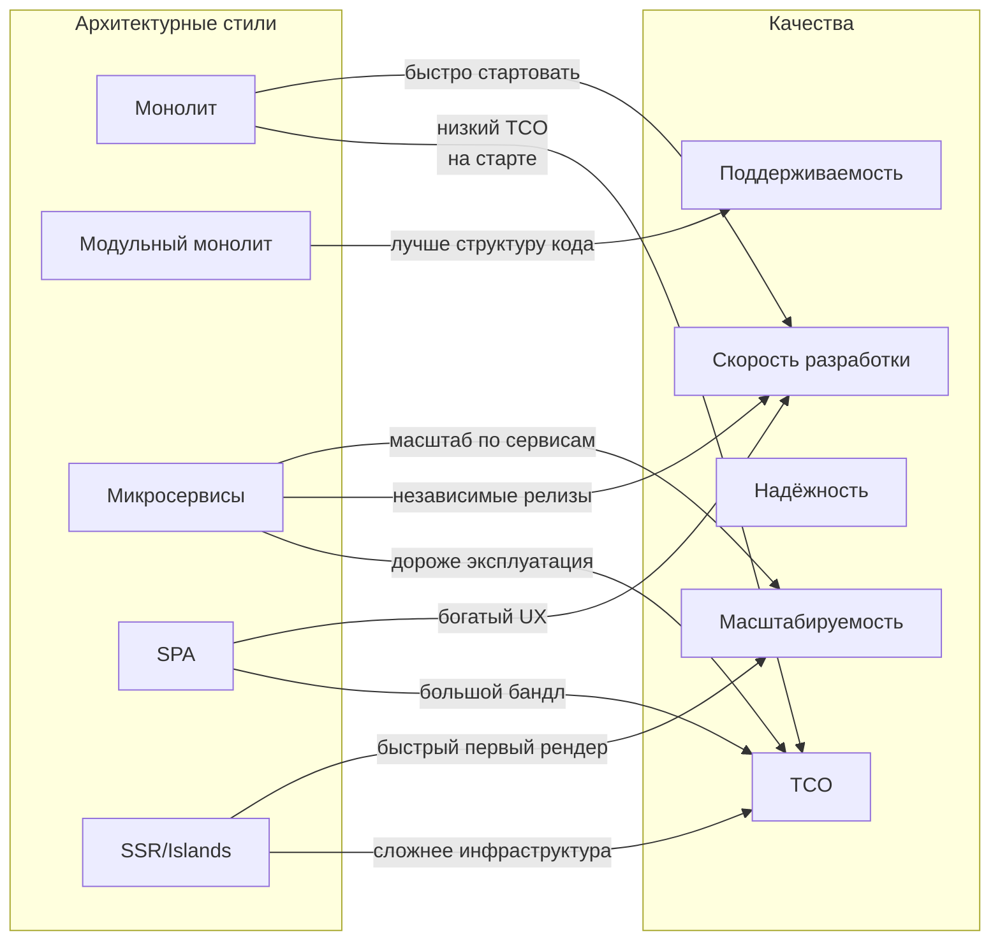

[← Назад к индексу части 2](index.md)

## 2.2. Ключевые цели и качества архитектуры

### Цель раздела

Развернуть абстрактные слова «масштабируемость», «поддерживаемость», «надёжность», «безопасность», «стоимость владения» в **конкретные инженерные качества**, которые можно обсуждать, измерять и улучшать как в бекенде, так и во фронтенде.

### В этом разделе главное

- Архитектура работает с **качествами системы**, а не только с функциональностью.
- Важно не просто перечислять качества, а **понимать их проявления и метрики**.
- Разные архитектурные стили по‑разному влияют на качества:
  - монолит vs микросервисы;
  - SPA vs MPA/SSR/Islands;
  - модульный монолит vs «большой шар грязи».
- Между качествами почти всегда есть **компромиссы**.
- Невозможно «оптимизировать всё сразу» — нужно выбирать приоритеты.

### Термины

- **Масштабируемость (scalability)** — способность системы эффективно расти по нагрузке (запросы, данные, пользователи) без непропорционального роста стоимости и сложности.
- **Поддерживаемость (maintainability)** — лёгкость внесения изменений, исправления ошибок, модернизации системы.
- **Тестируемость (testability)** — лёгкость написания и запуска тестов, покрывающих поведение системы.
- **Надёжность / отказоустойчивость (reliability / resilience)** — способность системы корректно работать при сбоях и быстро восстанавливаться.
- **Безопасность (security)** — защита от несанкционированного доступа и злоупотреблений.
- **Скорость разработки / time‑to‑market** — насколько быстро команда может доставлять ценность пользователям.
- **Стоимость владения (Total Cost of Ownership, TCO)** — суммарная стоимость разработки, поддержки и эксплуатации системы.

### Теория и правила

Разберём каждое качество: **что значит**, **как проявляется** и **как архитектура помогает/мешает**.

#### 1. Масштабируемость

- Вопросы:
  - Как система ведёт себя при росте нагрузки?
  - Что нужно поменять, если нагрузка выросла в 10 раз?
- Признаки хорошей масштабируемости:
  - можно добавить ещё экземпляров сервиса без тотального переписывания;
  - есть чёткие узкие места (БД, очередь, кэш), которые можно отдельно усиливать;
  - фронтенд умеет **адекватно кэшировать и пагинировать** данные.
- Архитектурные решения, влияющие на масштабируемость:
  - модульный монолит или микросервисы;
  - use‑case‑ориентированные API (BFF, агрегация запросов);
  - кэши, очереди, репликация БД;
  - на фронте — SSR/Islands, lazy‑loading, код‑сплиттинг, CDN.

#### 2. Поддерживаемость

- Вопросы:
  - Сколько мест нужно поменять, чтобы добавить одну фичу?
  - Насколько легко новому человеку разобраться в коде и архитектуре?
- Признаки высокой поддерживаемости:
  - понятная структура модулей/слоёв на бекенде и фронтенде;
  - высокая связность и низкая связанность (из части 1);
  - наличие тестов и возможности запускать их быстро;
  - документация по архитектуре и ключевым решениям.
- Плохие сигналы:
  - «любое изменение — это страшно»;
  - «одна фича требует PR в десятки файлов по всему репо»;
  - «никто не понимает, как всё работает целиком».

#### 3. Тестируемость

- Вопросы:
  - насколько легко тестировать отдельные модули и сервисы?
  - насколько легко прогнать end‑to‑end сценарии?
- Влияние архитектуры:
  - чёткие границы и контракты → проще писать модульные и контрактные тесты;
  - слоистая архитектура и порты/адаптеры → проще подменять внешние зависимости;
  - на фронтенде — компонентный подход и разделение UI/состояния → проще юнит‑тесты и интеграционные тесты.
- Плохие сигналы:
  - для любого теста нужно поднимать «полсистемы»;
  - тесты хрупкие и часто «падают от ветра» из‑за тесной связанности.

#### 4. Надёжность / отказоустойчивость

- Вопросы:
  - что происходит, если один из сервисов упал?
  - что происходит, если внешний API недоступен?
  - как система ведёт себя при частичных сбоях?
- Архитектурные решения:
  - **повторные попытки (retry) с backoff** и circuit‑breaker;
  - очереди и события вместо жёсткой синхронной цепочки;
  - репликация БД, health‑checks, graceful shutdown;
  - на фронтенде — оффлайн‑режимы, PWA‑кэш, graceful degradation.

#### 5. Безопасность

- Вопросы:
  - как управляется аутентификация и авторизация?
  - как ограничен доступ к данным и операциям?
  - как минимизируются последствия взлома одного компонента?
- Архитектурные решения:
  - BFF как точка консолидации аутентификации и авторизации для фронта;
  - чёткие границы владения данными;
  - отдельные контуры для административных операций;
  - минимизация количества мест, где хранятся чувствительные данные.

#### 6. Скорость разработки / time‑to‑market

- Вопросы:
  - насколько быстро команда может выпускать фичи?
  - насколько много согласований и зависимостей между командами?
- Архитектурные решения:
  - модульный монолит в начале пути вместо преждевременных микросервисов;
  - микрофронтенды и микросервисы там, где действительно нужна независимость команд;
  - BFF, снимающий часть сложности с фронтенда;
  - разумный уровень абстракций (без «архитектуры ради архитектуры»).

#### 7. Стоимость владения (TCO)

- Вопросы:
  - сколько стоит поддержка инфраструктуры и лицензий?
  - сколько людей нужно, чтобы поддерживать систему в рабочем состоянии?
  - сколько стоит «каждый дополнительный микросервис или микрофронтенд»?
- Архитектурные решения:
  - разумное количество сервисов и фронтов;
  - простые решения там, где не нужен «enterprise‑уровень»;
  - автоматизация рутинных задач (CI/CD, инфраструктура как код);
  - выбор managed‑сервисов vs self‑hosted.

### Пошагово: как применить качества к своему проекту

1. Выпиши список качеств (масштабируемость, поддерживаемость, тестируемость, надёжность, безопасность, скорость разработки, TCO).
2. Поставь **приоритет** каждому качеству по шкале, например: высоко / средне / низко.
3. Для каждого качества:
   - задай вопрос «что это значит конкретно для нашей системы?»;
   - попытайся придумать **1–2 метрики** или признака.
4. Посмотри на текущую архитектуру:
   - какие решения помогают этим качествам;
   - какие, наоборот, мешают (например, отсутствие кэша при необходимости масштабируемости).

### Простыми словами

Можно представить качества как **«ползунки на пульте»**:

- один ползунок — масштабируемость;
- другой — удобство разработки;
- третий — безопасность;
- четвёртый — стоимость владения;
- пятый — скорость фронтенда;
- шестой — удобство тестирования.

Разные архитектуры просто **ставят ползунки в разные комбинации**. Твоя задача — понять:

- какие ползунки **обязаны быть высоко**;
- где можно временно «убрать» качество, чтобы не переплачивать сложностью.

### Картинка в голове

Нарисуй себе матрицу:

- строки — архитектурные стили (монолит, модульный монолит, микросервисы, SPA, MPA/SSR, микрофронтенды и т.д.);
- столбцы — качества (масштабируемость, поддерживаемость, тестируемость, надёжность, безопасность, скорость разработки, TCO).

В каждой ячейке — плюс/минус/комментарий: **как конкретный стиль влияет на конкретное качество**. Детально это будет разобрано в частях 3–9 и 21–29, а здесь важно **привыкнуть думать так**.

Мини‑пример такой матрицы:

### Примеры (бекенд и фронтенд)

**Пример 1. Монолитный бекенд + SPA**

- Плюсы:
  - высокая скорость разработки (одна кодовая база, простая инфраструктура);
  - низкий TCO на старте;
  - простая отладка (один процесс, одна БД).
- Минусы:
  - ограниченная масштабируемость по командам (сложно параллелить работу множества команд);
  - возможный рост сложности кода;
  - SPA может страдать по SEO и времени первого рендера на медленных устройствах.

**Пример 2. Микросервисы + микрофронтенды**

- Плюсы:
  - высокая независимость команд;
  - гибкое масштабирование по сервисам и фронтам;
  - можно выбирать стек под команды.
- Минусы:
  - высокая стоимость эксплуатации (оркестрация, наблюдаемость, DevOps);
  - сложная отладка и тестирование end‑to‑end;
  - повышенные требования к зрелости команды и процессов.

#### 8. Мини‑таблица: качества → примеры на бекенде и фронтенде

| Качество | Бекенд: пример проявления | Фронтенд: пример проявления |
|---------|---------------------------|-----------------------------|
| Масштабируемость | Легко добавить ещё инстансы сервиса, узкие места изолированы (БД, очередь, кэш), есть горизонтальное масштабирование. | Лёгкая раздача статики через CDN, код‑сплиттинг и lazy‑loading, минимизация тяжёлых запросов. |
| Поддерживаемость | Модульный монолит/микросервисы с понятными границами, отсутствие циклических зависимостей, ясно структурированный репозиторий. | Компонентная архитектура (FSD/Atomic), разделение UI/состояния/данных, понятный роутинг и слои. |
| Тестируемость | Можно запускать unit/интеграционные/контрактные тесты отдельных модулей и сервисов без поднятия всей системы. | Компоненты юнит‑тестируются в изоляции, есть интеграционные тесты фич и e2e‑тесты ключевых сценариев. |
| Надёжность | Используются retry/circuit‑breaker, очереди, идемпотентные хендлеры, репликация БД, health‑checks. | Есть graceful degradation, оффлайн‑режим/кэш, устойчивость к частичным сбоям API (fallback‑UI). |
| Безопасность | Централизованная аутентификация/авторизация, минимизация зон доступа к данным, чёткие границы владения. | Безопасная работа с токенами, минимум чувствительных данных на клиенте, опора на BFF/аппарат бекенда. |
| Скорость разработки | Простая, понятная архитектура, изолированные доменные модули, автоматика CI/CD, быстрое локальное окружение. | Предсказуемая структура проекта, переиспользуемые компоненты и дизайн‑система, быстрый dev‑сервер. |
| Стоимость владения (TCO) | Разумное количество сервисов, использование managed‑инфраструктуры, отсутствие «зоопарка» стеков без нужды. | Без излишнего дробления на десятки микрофронтендов, контролируемый размер бандла, простая сборка. |

### Практика / реальные сценарии

Типовые ситуации:

- «У нас всё медленно и ломается, но мы не понимаем, **какое именно качество страдает**»:
  - архитектура принимает на себя роль «козла отпущения», но проблема может быть в том, что цели не сформулированы или нарушены.
- «Мы сделали красивую микросервисную архитектуру, но новых фич нет»:
  - приоритетом фактически была скорость разработки и бизнес‑гибкость, но архитектура была выбрана под масштабируемость и независимость команд, которые пока не используются.
- «Фронт очень быстрый, но поддерживать его невозможно»:
  - все усилия были вложены в оптимизацию перфоманса (бандл, SSR), но архитектура фронта (структура компонентов, состояние, роутинг) была спроектирована слабо.

### Типичные ошибки

- Оценивать архитектуру в целом фразой «нравится / не нравится», не раскладывая на качества.
- Объявлять одним приоритетом «всё важно» — это эквивалент отсутствия приоритета.
- Декларировать одни цели (например, скорость вывода фич), а архитектуру строить под другие (например, максимальную «чистоту» и формальную правильность).

### Что будет, если…

- …игнорировать конкретику в качествах:
  - ты будешь выбирать архитектуры **по вкусу или моде**;
  - будет сложно объяснить, почему именно эта архитектура «лучше»;
  - качество системы будет «тонуть» в субъективных оценках.
- …привязать качества к метрикам и сценариям:
  - легче принимать и обосновывать решения;
  - легче видеть, какие улучшения архитектуры дают максимальный эффект;
  - легче строить **дорожную карту архитектурного развития**.

### Проверь себя

1. Выбери любое качество (например, масштабируемость или поддерживаемость) и сформулируй для него один конкретный показатель для своего проекта.  
   

Ответ

   Например: для учебного проекта «поддерживаемость» можно измерять числом модулей, которые нужно поменять для одной фичи: цель — не более 2–3. Для продакшен‑системы по масштабируемости можно сформулировать цель: «приложение выдерживает рост RPS в 5 раз при добавлении не более 3–4 новых экземпляров сервиса без изменения кода».
   

2. Почему нельзя оценить архитектуру одним словом «масштабируемая» без уточнения контекста?  
   

Ответ

   Потому что для маленького проекта «масштабируемость» может означать рост нагрузки с 10 до 100 RPS, а для глобального сервиса — рост с 10 000 до миллиона RPS с обеспечением геораспределения и кворумов. Без уточнения контекста и метрик слово «масштабируемая» ничего не говорит о том, какие решения приняты и достаточно ли они хороши для конкретной ситуации.
   

3. Приведи пример, когда улучшение одного качества ухудшает другое.  
   

Ответ

   Например, внедрение сложной микросервисной архитектуры ради масштабируемости и независимых деплоев повышает независимость команд и потенциальную масштабируемость, но ухудшает TCO (нужно больше DevOps‑ресурсов, сложнее наблюдаемость) и увеличивает сложность end‑to‑end тестирования. Другой пример: агрессивная оптимизация перфоманса фронтенда (ручной код‑сплиттинг, сложные кеширующие слои) улучшает время загрузки, но может ухудшить поддерживаемость кода.
   

4. Как ты использовал(а) бы матрицу «архитектурные стили × качества» при выборе архитектуры для нового проекта?  
   

Ответ

   Сначала нужно отметить приоритетные качества для проекта (например, скорость разработки и надёжность). Затем, заполнив матрицу оценками влияния разных архитектур (монолит, модульный монолит, микросервисы, SPA, SSR и т.д.) на эти качества, можно отфильтровать варианты, которые явно не подходят, и сосредоточиться на 1–2 разумных кандидатах. Дальше матрица служит основой для обсуждения trade‑offs и фиксации решения в ADR.
   

### Запомните

- Качества системы — это **язык, на котором разговаривает архитектура**.
- Разные архитектурные стили просто **делают разные ставки** по этим качествам.
- Нельзя оптимизировать всё сразу; важно выбрать приоритеты и осознанные компромиссы.

---
