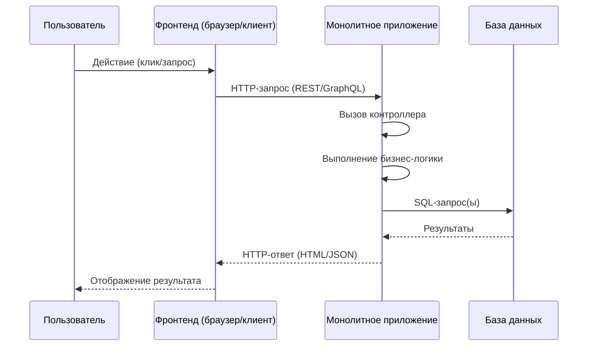
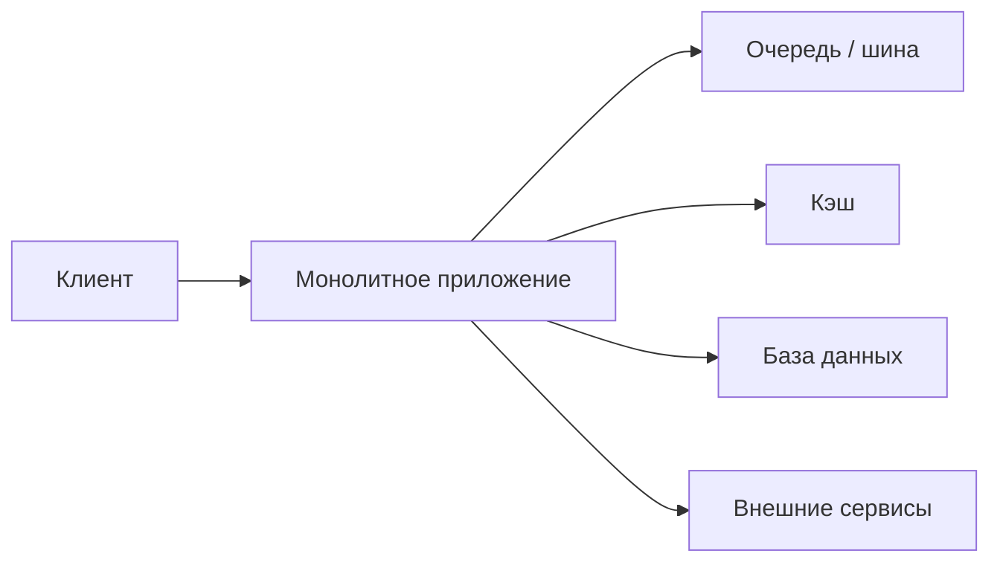

[← Назад к индексу части 3](index.md)

## 3.1. Что такое монолит: 2/3/4‑tier

### Цель раздела

Снять путаницу вокруг слова **«монолит»** и показать, как он выглядит **на реальных схемах**: от простой 2‑tier модели до 4‑tier с дополнительными слоями, при этом всё ещё остающейся **одной монолитной системой**.

### В этом разделе главное

- Монолит — это **не ругательство**, а архитектурный стиль: один деплой, одна основная кодовая база, одна логическая система.
- 2/3/4‑tier — это всё варианты **монолитной архитектуры**, отличающиеся количеством слоёв и инфраструктурой.
- Монолит может быть **здоровым и структурированным**, а может быть «шаром из грязи» — это вопрос **внутренней организации**, а не названия.
- Понимание того, что именно у тебя монолитом считается, важно для выбора **следующих шагов эволюции**.

### Термины

- **Монолит** — основная бизнес‑логика системы живёт в одном приложении (или тесно связанных процессах), разворачиваемом как **единое целое**.
- **2‑tier** — клиент ↔ БД (или клиент ↔ примитивный сервер ↔ БД), без ярко выделенного слоя приложений.
- **3‑tier** — клиент → сервер приложений → БД; наиболее типичный случай монолита.
- **4‑tier / N‑tier** — между приложением и БД/внешним миром есть дополнительные инфраструктурные слои (очереди, кэш, интеграционные сервисы).

### Теория и правила

1. **Монолит = единица развёртывания, а не «один язык/репозиторий».**  
   Монолитом считается:
   - один `jar/war` в Java‑мире;
   - одна `ASP.NET`‑приложение;
   - один `Node.js`‑сервис;
   - один Python‑сервис с несколькими воркерами.  
   Важно, что:
   - **весь основной бекенд** выкатывается вместе;
   - границы внутри обычно **логические**, а не деплойные.

2. **2‑tier — исторический и крайний простой случай.**  
   - Толстый клиент (десктоп‑приложение) напрямую ходит в БД.
   - Веб‑клиент, который отправляет запросы в небольшой скрипт/сервер, а тот почти прозрачно дергает БД.  
   Сегодня такой подход редко используется как целевая архитектура, но:
   - важно понимать его как **исторический и учебный пример**;
   - многие легаси‑системы формально всё ещё живут в такой модели.

3. **3‑tier — наш «дефолтный» монолит.**  
   Классическая картина:


- На стороне `App` у нас:
  - слой контроллеров/хендлеров (REST/GraphQL и т.п.);
  - слой бизнес‑логики/домена;
  - слой доступа к данным (ORM, репозитории).
- Всё это собирается и деплоится как **одно приложение**.

Для ещё большей наглядности можно посмотреть на **жизненный цикл одного запроса**:



Здесь важный момент: **все шаги на сервере происходят внутри одного приложения `App`**, без переходов между независимыми сервисами по сети — это и есть суть монолита.

4. **4‑tier / N‑tier — монолит с инфраструктурными «прослойками».**  
   Часто в системе появляются:
   - очередь сообщений;
   - отдельный кэш;
   - несколько БД или внешних API.



- Монолит остаётся **сердцем**:
  - именно он решает бизнес‑логику;
  - он же общается с очередями, кэшем и внешними API.

5. **Вертикальные срезы и слои внутри монолита.**  
   Даже в самом простом монолите уже есть:
   - **слои** (контроллеры → домен → данные);
   - **вертикальные срезы** (фичи: заказы, оплата, пользователи).  
   От того, насколько ты **осознанно выделяешь слои и срезы**, зависит, станет ли монолит:
   - базой для **модульного монолита** (часть 5);
   - или «шаром из грязи», который невозможно поддерживать.

### Простыми словами

Представь **город**:

- Вариант монолита — это когда **весь город управляется одной мэрией**:
  - один центр принятия решений;
  - единые правила;
  - общий бюджет и инфраструктура.
- Внутри города уже может быть:
  - транспорт, водоканал, электричество, школы — **отдельные службы** (аналоги модулей/слоёв),
  - но они всё равно подчиняются одной мэрии и живут в одной системе.

2/3/4‑tier — это как:

- 2‑tier — маленький городок: мэрия сидит в том же здании, что и основные службы.
- 3‑tier — нормальный город: есть мэрия, подчинённые службы и «склад ресурсов» (БД).
- 4‑tier — город с развитой инфраструктурой: добавили логистический центр, распределительные станции и т.п.

### Картинка в голове

- **Монолит** — это **одна большая коробка**, внутри которой много полочек:

```text
[ Монолитное приложение ]
  ├─ HTTP-контроллеры / API
  ├─ Сервисный слой (бизнес-логика)
  ├─ Доменные модели
  ├─ Доступ к данным (репозитории)
  ├─ Интеграции (клиенты внешних API)
  └─ Инфраструктура (логирование, конфиги, кэш-клиенты)
```

- **2/3/4‑tier** — это про **то, сколько уровней у коробки снаружи** (клиент, сервер, БД, очереди), а не про то, сколько сервисов у тебя в Kubernetes.

### Как запомнить

Формула:

> **Монолит = одна основная единица развёртывания бекенда**, внутри которой можно (и нужно) строить здоровую структуру слоёв и модулей.

Если у тебя:

- один бекенд‑сервис;
- одна основная БД (или пара/несколько, но за ними всё равно стоит один сервис);
- один общий деплой —  
скорее всего, у тебя **монолит**, даже если он «современный» и живёт в контейнерах.

### Примеры

1. **Учебный интернет‑магазин.**
   - `backend` — один `Node.js`‑сервис (`/api`), который:
     - принимает HTTP‑запросы от SPA;
     - ходит в PostgreSQL;
     - пишет логи в файл.
   - Всё собирается и выкатывается как **один контейнер** + **одна БД**.

2. **Корпоративный портал.**
   - Одно `Java`‑приложение (Spring Boot):
     - модули для профилей, задач, новостей;
     - один `war/jar`;
     - одна БД Oracle.
   - Вокруг — прокси, балансировщик, мониторинг, но бекенд всё равно **один**.

3. **Монолит с очередью.**
   - То же Java‑приложение:
     - обрабатывает HTTP‑запросы пользователей;
     - отправляет сообщения в RabbitMQ;
     - потребляет сообщения фоновыми воркерами (но в том же приложении);
     - работает с БД.  
   - Это всё ещё **монолит**, просто с дополнительной инфраструктурой.

### Практика / реальные сценарии

- Новые продукты и стартапы чаще всего начинают с **монолитного бекенда**:
  - проще деплоить;
  - проще отлаживать;
  - проще держать в голове.
- Крупные компании часто **держат критические системы монолитами**:
  - банковские АБС;
  - биллинговые системы;
  - внутренние back‑office.
  Причина — **устойчивость и предсказуемость**.

### Граничные сценарии и нетривиальные варианты

Иногда в практике встречаются «пограничные» случаи, которые сбивают с толку:

- **Монолит в Kubernetes.**  
  Частая ситуация: один и тот же контейнер (монолит) разворачивается в k8s в виде нескольких реплик за балансировщиком.  
  Это всё ещё монолит:
  - код один и тот же;
  - единый артефакт;
  - релизы синхронные для всех реплик.  
  Kubernetes в этом случае — просто **платформа для деплоя**, а не признак микросервисности.

- **Монолит с несколькими БД.**  
  Иногда монолит работает:
  - с OLTP‑БД (PostgreSQL),
  - с аналитическим хранилищем (ClickHouse/BigQuery),
  - с поиском (Elasticsearch).  
  Это по‑прежнему монолит:
  - вся логика доступа к этим БД в одном приложении;
  - нет отдельных сервисов‑владельцев этих данных;
  - масштабирование и релизы всё равно общие.

- **Монолит, разделённый на несколько процессов.**  
  Например:
  - HTTP‑сервер,
  - фоновые воркеры,
  - cron‑задачи.  
  Если:
  - это единая кодовая база;
  - общие доменные модули;
  - общий жизненный цикл релизов —  
  мы говорим о монолите с **несколькими ролями процессов**, а не о микросервисной системе.

### Типичные ошибки

- Считать, что «монолит = плохо, микросервисы = хорошо» без учёта контекста.
- Называть микросервисами набор модулей внутри монолита.
- Не рисовать схему 2/3/4‑tier и не понимать, **как на самом деле идут запросы**.

#### Мини‑проверка по разделу 3.1

1. Почему важно отличать «монолит как единица развёртывания» от «просто один репозиторий кода»?  
   <details><summary>Ответ</summary>
   Потому что репозиториев может быть несколько (например, фронтенд и бекенд в разных репо), а монолит в архитектурном смысле описывает именно то, как **разворачивается и живёт бекенд**: один артефакт/приложение, единый цикл релизов, общая бизнес‑логика. Путая эти понятия, легко недооценить реальные границы системы и переоценить её «микросервисность».
   </details>

2. В чём ключевое отличие 3‑tier и 4‑tier монолита, если смотреть не на технологии, а на архитектурную суть?  
   <details><summary>Ответ</summary>
   В 3‑tier у нас по сути три уровня: клиент, сервер приложений (монолит) и БД. В 4‑tier появляются дополнительные инфраструктурные уровни (очереди, кэш, интеграционные сервисы), через которые монолит общается с внешним миром и данными. Но при этом **ядро бизнес‑логики по‑прежнему одно приложение**, поэтому архитектура остаётся монолитной.
   </details>

3. Какой из граничных сценариев (монолит в Kubernetes, монолит с несколькими БД, монолит с несколькими процессами) ближе всего к твоему текущему проекту и почему его легко перепутать с микросервисами?  
   <details><summary>Ответ</summary>
   Часто это «монолит в Kubernetes»: внешне он выглядит как набор реплик, подов, сервисов, может быть несколько контейнеров (web + worker), и создаётся иллюзия распределённой системы. Но если все эти реплики собраны из **одного и того же артефакта**, делят одну доменную модель и релизятся синхронно, то это всё ещё монолит, а не набор независимых сервисов.
   </details>

### Что будет, если…

- **…не понять, что у тебя монолит?**  
  Ты можешь:
  - думать, что у тебя «почти микросервисы»;
  - принимать решения, не соответствующие реальности (например, пытаться масштабировать только одну «часть», которая на деле жёстко связана со всем).

- **…пытаться сделать вид, что монолита нет, и пилить «локальные микросервисы» внутри него?**  
  Скорее всего получится:
  - ещё более запутанная архитектура;
  - двойная сложность: и монолит, и «псевдо‑сервисы».

### Проверь себя

1. Почему 3‑tier приложение (клиент → сервер → БД) считается монолитом?  
2. В чём принципиальное отличие монолита от микросервисов, если забыть про язык/фреймворк?  
3. Может ли система с очередью и кэшем всё ещё быть монолитом?  
4. Чем 2‑tier архитектура принципиально отличается от 3‑tier, и почему обе могут быть монолитами?  
5. Что в жизненном цикле одного запроса (по sequence‑диаграмме) указывает на то, что система монолитная, а не микросервисная?

<details>
<summary>Ответ</summary>

1. Потому что основная бизнес‑логика живёт в **одном приложении**, которое деплоится и развивается как единое целое; клиент и БД — это внешние по отношению к нему уровни.  
2. Монолит — это **одна единица развёртывания**, микросервисы — множество **независимо развёртываемых сервисов** с явными сетевыми границами и контрактами.  
3. Да. Наличие очереди и кэша не делает систему микросервисной; если вся бизнес‑логика сосредоточена в одном приложении, это всё ещё монолит с инфраструктурой.  
4. В 2‑tier толстый клиент почти напрямую работает с БД (часто без явного слоя приложений), в 3‑tier есть отдельный сервер приложений; в обоих случаях бизнес‑логика сосредоточена в одном приложении/клиенте, который развёртывается как единое целое — поэтому это всё ещё монолитные варианты.  
5. Тем, что на стороне сервера **все шаги выполняет один участник `Монолитное приложение`**: контроллер, бизнес‑логика и обращения к БД происходят внутри одного процесса, без сетевых вызовов между разными сервисами.

</details>

### Запомните

- Монолит — это **архитектура развёртывания**, а не «кривой код».
- 2/3/4‑tier — всё ещё **монолитные варианты**, отличающиеся количеством слоёв и инфраструктуры.
- Чтобы осознанно развивать систему, сначала **принять и описать свой монолит**, а уже потом думать, куда его эволюционировать.

---
