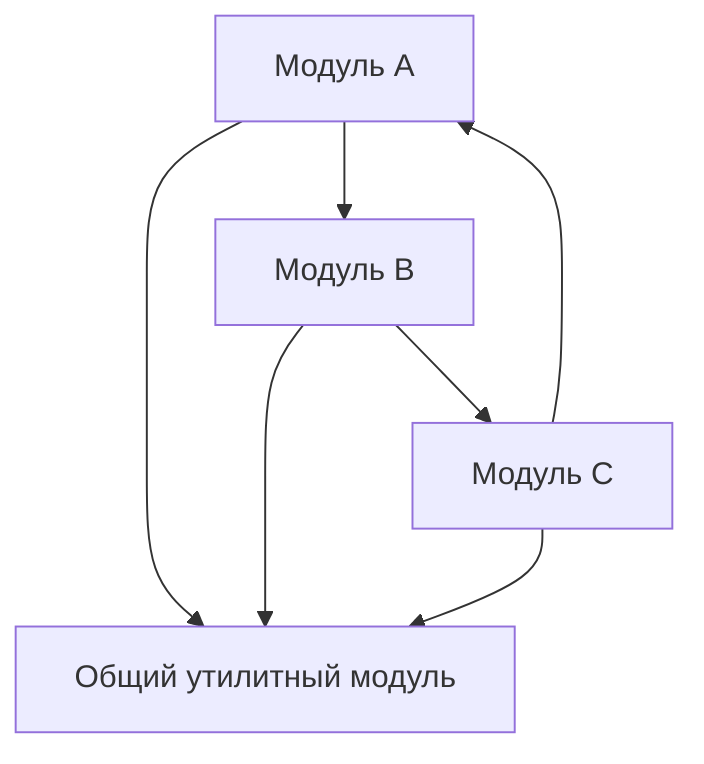

[← Назад к индексу части 3](index.md)

## 3.3. Ограничения и типичные ошибки монолита

### Цель раздела

Показать **реальные ограничения монолита** и набор ошибок, которые превращают его из полезного инструмента в архитектурный кошмар, чтобы ты мог(ла) **рано заметить запахи** и не доводить систему до состояния «переписывать всё».

### В этом разделе главное

- Монолит ограничивает **масштабирование команды и независимые релизы**.
- Плохая внутренняя структура приводит к **высокой связанности и низкой связности**.
- Непродуманная работа с производительностью и отказоустойчивостью в монолите приводит к **единым точкам отказа**.
- Большинство проблем монолита — это **не сам факт монолита**, а **архитектурные ошибки внутри**.

### Термины

- **Ball of mud (шар из грязи)** — крайне запутанная архитектура без явных модулей и границ, где «всё связано со всем».
- **Точка отказа (single point of failure)** — элемент системы, отказ которого роняет всё.
- **Глобальное изменение** — изменение, которое требует трогать множество областей кода одновременно.
- **Распределённый монолит** — система, формально разрезанная на несколько сервисов, но сохранившая свойства «шара из грязи»: общая БД, сильная связанность, отсутствие чётких границ.

### Теория и правила

1. **Масштабирование команды.**
   - Монолит хорошо работает:
     - для **1–2** команд;
     - до **десятка разработчиков** (условно, порядок).  
   - Дальше:
     - всё чаще возникают конфликты по структуре кода;
     - растёт нагрузка на общие соглашения;
     - сложнее синхронизировать релизы.

2. **Независимые релизы.**
   - В монолите обычно:
     - один релиз для всех изменений;
     - откат релиза откатывает и фичи, и фиксы.  
   - При большом количестве команд это становится:
     - источником конфликтов;
     - тормозом для time‑to‑market.

3. **Производительность и масштабирование.**
   - Масштабировать монолит можно:
     - **вертикально** (больше ресурсов на один инстанс);
     - **горизонтально** (больше копий того же монолита).  
   - Ограничения:
     - сложнее точечно масштабировать только одну «горячую» часть;
     - вся нагрузка упирается в общую БД.

4. **Отказоустойчивость.**
   - Монолит часто:
     - живёт в одном процессе;
     - работает с одной БД.  
   - Без продуманной архитектуры:
     - падение процесса роняет всё;
     - проблемы с БД мгновенно проявляются для всех пользователей.

5. **Организационное масштабирование и закон Конуэя.**
   - Структура монолита почти всегда **отражает структуру команды**:
     - если есть одна команда «на всё», часто получается один большой «комок» без явных модулей;
     - если домены и зоны ответственности в команде не выделены, то и модули внутри монолита размыты.
   - При росте:
     - появление отдельных доменных команд (заказы, платежи, каталог) требует отразить это в архитектуре и ввести модули/границы;
     - если этого не сделать, монолит начинает **тормозить организационный рост**: команды постоянно конфликтуют в одних и тех же местах кода и релизов.

6. **Внутренняя структура: путь к «шару из грязи».**
   - Признаки:
     - модули импортируют друг друга **в любом направлении**;
     - бизнес‑логика размазана по контроллерам, репозиториям и утилитам;
     - нет явного слоя домена;
     - общие «бог‑объекты», которые знают всё обо всём.



- Такой граф зависимостей делает:
  - рефакторинг болезненным;
  - тестирование сложным;
  - понимание системы — задачей для «избранных старожилов».

### Простыми словами

Монолит — это как **общая кухня в большой команде**:

- Пока вас немного:
  - удобно готовить вместе;
  - не нужно много правил;
  - каждый видит, что происходит.
- Когда людей становится много и нет правил:
  - все начинают мешать друг другу;
  - посуда, продукты и приборы перемешиваются;
  - никто не знает, где что лежит;
  - мало кто берёт на себя ответственность за порядок.

Проблема не в самом факте одной кухни, а в **отсутствии структуры и правил**.

### Картинка в голове

- **Здоровый монолит**:

```text
[ Монолит ]
  ├─ Модули: Заказы, Платежи, Пользователи
  ├─ Слои: Контроллеры, Домен, Доступ к данным
  └─ Общая инфраструктура: логирование, конфигурация
```

- **Больной монолит**:

```text
[ Монолит ]
  ├─ Модуль "Common", куда складывают всё подряд
  ├─ Сервис "Manager", который знает всё обо всём
  ├─ Контроллеры с бизнес-логикой и SQL вперемешку
  └─ Куча циклических зависимостей между пакетами
```

### Как запомнить

Формула:

> **Монолит ломает не факт «одного приложения», а плохая внутренняя организация.**

Если ты видишь:

- отсутствие явных модулей;
- хаотические зависимости;
- «бог‑классы» и «общие утилиты на всё» —  
это запахи, что монолит **развивается в неправильную сторону**.

### Примеры

1. **Общий «Core»‑модуль.**
   - В монолите создают пакет/модуль `core` или `common`;
   - туда складывают всё, что «непонятно куда деть»;
   - постепенно от него зависят все остальные модули;
   - любые изменения в `core` могут сломать что угодно.

2. **SQL в контроллерах.**
   - Разработчики пишут SQL‑запросы прямо в контроллерах;
   - бизнес‑логика распределена по `Controller`, `Repository`, `Util`;
   - рефакторинг любой фичи требует правок в десятке мест.

3. **Отсутствие ограничений в БД.**
   - Для скорости разработки не ставят foreign keys и проверки;
   - за годы появляются:
     - дублирующиеся записи;
     - «висящие» ссылки;
     - невалидные состояния.  
   - Попытка исправить приводит к долгим миграциям и простоям.

### Практика / реальные сценарии

- Большинство «страшных историй» про монолиты — это **не про монолит как стиль**, а про:
  - отсутствие модульности;
  - отсутствие тестов;
  - спонтанные архитектурные решения;
  - непроработанные границы в коде и данных.

### Типичные ошибки

- Использовать монолит как оправдание: «потом всё равно перепишем на микросервисы».
- Долго не вводить **архитектурные стандарты** (слои, границы, названия модулей).
- Игнорировать сигналы:
  - релизы всё чаще ломают неожиданные части;
  - никто не может объяснить структуру системы целиком;
  - любое изменение затрагивает огромное количество файлов.

### Что будет, если…

- **…не замечать архитектурные запахи монолита?**  
  Через несколько лет:
  - любой рефакторинг становится непомерно дорогим;
  - команда боится трогать старый код;
  - появляется соблазн «переписать всё заново», что само по себе рискованно.

- **…пытаться лечить все проблемы монолита микросервисами?**  
  Ты перенесёшь:
  - те же архитектурные ошибки;
  - плюс привнесёшь сложности распределённой системы.

### Проверь себя

1. Назови три признака того, что монолит начал превращаться в «шар из грязи».  
2. Как монолит ограничивает масштабирование команды и релизов?  
3. Почему попытка «переписать монолит на микросервисы» не всегда решает проблемы?  
4. Какие архитектурные решения внутри монолита ведут к появлению единой точки отказа?  
5. Как бы ты диагностировал по коду и диаграммам, что у монолита проблемы с модульностью и слоями?

<details>
<summary>Ответ</summary>

1. Хаотические зависимости между модулями (все зависят от всех), отсутствие явных границ и слоёв, «бог‑объекты» и общие модули вроде `Common/Core`, в которые складывают всё подряд.  
2. Все изменения выкатываются **одним релизом**, поэтому нужно синхронизировать множество команд; откат затрагивает сразу несколько фич; сложно параллельно развивать независимые направления.  
3. Потому что коренные проблемы — в **архитектурном мышлении и организации кода**; если их не исправить, то в микросервисной архитектуре появятся те же запахи, плюс добавится сложность распределённой системы.  
4. Например, отсутствие репликации/кластеризации БД и приложения (один инстанс всего), использование одного критичного модуля/сервиса, через который проходят почти все операции, отсутствие graceful‑shutdown и механизмов перезапуска — отказ этого элемента роняет всё приложение.  
5. Я бы посмотрел на граф зависимостей модулей (есть ли циклы, «центральные» модули, от которых зависят все остальные), на то, как распределена бизнес‑логика (размазана по контроллерам/репозиториям или собрана в доменном слое), и на реальные диаграммы/структуру пакетов: если слои перемешаны, модули импортируют друг друга во все стороны и есть гигантские общие модули — модульность и слоистость нарушены.

</details>

### Запомните

- Монолит имеет реальные ограничения, особенно при росте команды и продукта.
- Большинство проблем монолита — следствие **плохой внутренней архитектуры**, а не самого факта монолитности.
- Уходить в микросервисы стоит **только после** наведения порядка внутри монолита и ясного понимания, какие ограничения ты пытаешься снять.

---
