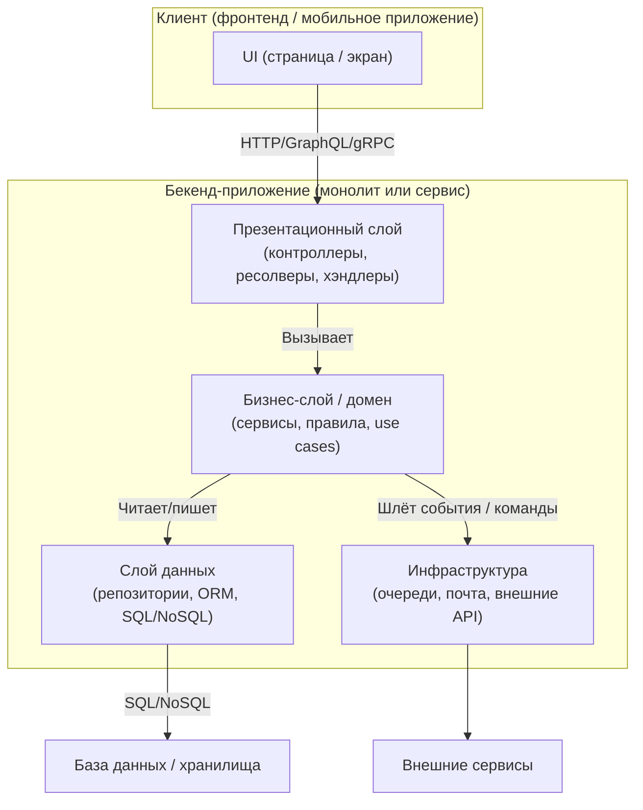
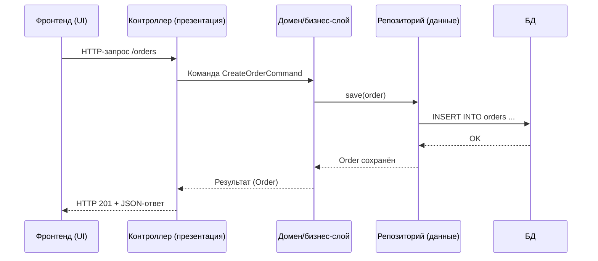

[← Назад к индексу части 4](index.md)

## 4.1. Что такое слоёная (N‑tier) архитектура

### Цель раздела

Сформировать у тебя **чёткую и наглядную картину**, что такое слоёная (N‑tier) архитектура, как выглядят её слои и чем она отличается от просто «проекта с папками» или от понятия «монолит».

### В этом разделе главное

- Слоёная архитектура — это **про уровни ответственности и зависимости вниз**, а не только про количество прямоугольников на схеме.
- Есть различие между **физическими tier‑ами** (клиент, сервер, БД) и **логическими слоями внутри бекенда** (контроллеры, домен, данные).
- Поток запроса от фронтенда почти всегда идёт **сквозь несколько слоёв**, а не «сразу в БД».
- Слоёная архитектура может быть как внутри монолита, так и внутри каждого микросервиса.
- Без понимания слоёв сложно говорить о **модульном монолите, гексагональной архитектуре и Clean Architecture** — они опираются на эту картину.

### Термины

- **Слой** — логический уровень кода с чёткой ответственностью и правилами зависимостей.
- **Tier (звенó)** — физический уровень развёртывания (клиент, сервер, БД).
- **Вертикальный срез** — прохождение одного бизнес‑сценария от верхнего слоя до нижнего (и обратно).

### Теория и правила

1. **Слоёная архитектура — это про разделение обязанностей.**  
   Мы делим систему на слои, чтобы:
   - каждый слой отвечал за **свой тип задач**;
   - изменения в одном слое **минимально затрагивали другие**;
   - можно было **подменять детали** (например, БД или протокол) без переписывания бизнес‑логики.

2. **Классическая трёхслойка внутри бекенда.**  
   Внутри бекенд‑приложения чаще всего выделяют:
   - **презентационный слой (transport/UI)** — HTTP‑контроллеры, REST/GraphQL/gRPC‑эндпоинты;
   - **слой бизнес‑логики (domain/application)** — доменные правила, сценарии, сервисы приложения;
   - **слой данных (data access)** — репозитории, ORM, SQL/NoSQL‑доступ.

3. **Физические tier‑ы vs логические слои.**  
   - Tier‑ы: клиент → сервер приложений → БД (часть 3).
   - Слои: разные уровни внутри **самого сервера приложений**.
   - Один сервер (tier) может содержать несколько слоёв.

4. **Эволюция к N‑tier.**  
   Со временем между слоями могут появляться:
   - кеш‑слой;
   - слой интеграции с внешними сервисами;
   - слой BFF между фронтом и бекенд‑ядром;
   - отдельные слои валидации или анти‑коррапшн.  
   Но базовая идея остаётся: **каждый слой опирается на нижележащие, не зная деталей выше**.

5. **Слои и вертикальные срезы.**  
   - Каждый реальный сценарий (например, «создать заказ») проходит:
     - через контроллер;
     - доменную/аппликационную логику;
     - слой данных;
     - инфраструктуру (очереди, email и т.п.).
   - На схеме это выглядит как **вертикальная стрелка**, пересекающая несколько горизонтальных слоёв.

### Простыми словами

Представь, что ты строишь дом:

- **Этажи** — это слои:
  - самый верхний этаж — **презентация**: комнаты, интерьер, то, что видит пользователь;
  - средний — **функциональная часть**: проводка, разводка воды и воздуха, скрытые механизмы;
  - нижний — **фундамент и коммуникации**: трубы, кабели, соединения с внешним миром.
- **Задача архитектуры** — сделать так, чтобы:
  - можно было **обновить интерьер**, не переливая фундамент;
  - можно было **поменять трубу в подвале**, не ломая все стены.

Если этого разделения нет — дом превращается в хаос: любая мелкая правка тянет за собой ремонт половины здания.

С программами так же:

- если всё в одном слое (например, в контроллере) — любая фича требует трогать «всё сразу»;
- если слои выделены и уважают границы —:
  - меняешь API (презентационный слой) без переписывания бизнес‑правил;
  - можешь заменить PostgreSQL на другую БД, не трогая домен.

### Картинка в голове

Базовая схема слоёной архитектуры бекенда с учётом фронтенда может выглядеть так:

Важно: стрелки **внутри бекенда** показывают **направление зависимостей** — сверху вниз.

Чтобы увидеть **динамику запроса во времени**, полезно ещё и пошаговое представление:

Эта диаграмма подчёркивает: запрос спускается **вниз по слоям**, а ответ поднимается **вверх**, но **на каждом шаге остаётся свой уровень ответственности**.

### Как запомнить

Короткая формула:

> **«Слои — это этажи обязанностей, а tier‑ы — это здания»**.

- Слои — логические этажи внутри одного «здания» (службы/монолита).
- Tier‑ы — сами здания (клиент, серверы, БД).

Когда слышишь «N‑tier», мысленно раздели:

1. Сколько **зданий** участвует (клиент, бекенд, БД, очереди, CDN).
2. Какие **этажи** есть в каждом здании (слои).

### Примеры

**Пример 1. Простой интернет‑магазин**

- Фронтенд — SPA на React.
- Бекенд — один монолитный сервис.
- Слои:
  - контроллеры `OrderController`, `CatalogController`;
  - доменные сервисы `OrderService`, `PricingService`;
  - репозитории `OrderRepository`, `ProductRepository`.

Поток запроса:

1. React‑страница `Checkout` отправляет `POST /orders`.
2. Контроллер `OrderController.createOrder`:
   - мапит HTTP‑запрос в `CreateOrderCommand`;
   - вызывает `OrderService.createOrder`.
3. `OrderService`:
   - валидирует бизнес‑правила (лимиты, наличие товаров);
   - вызывает `OrderRepository` для сохранения;
   - шлёт событие «Заказ создан» через инфраструктурный слой.

**Пример 2. BFF между SPA и бекенд‑ядром**

- SPA → BFF → бекенд‑ядро (монолит).
- В BFF свои слои:
  - транспорт (GraphQL/REST API для фронта);
  - оркестрация вызовов бекенд‑ядра;
  - слой данных BFF (кэши, агрегация).
- В бекенд‑ядре — «классическая» трёхслойка.

### Практика / реальные сценарии

- **Новый разработчик приходит в проект.**  
  Если слои выделены и описаны, ему легче:
  - понять, куда класть новый код;
  - предсказать, что он затронет;
  - не сломать чужую логику.

- **Команда решает «поднять» часть логики в BFF.**  
  Если слои в бекенд‑ядре понятны, проще:
  - решить, что остаётся в домене;
  - что можно вынести в оркестрацию BFF;
  - где провести границу ответственности.

- **Проект растёт, появляется необходимость в кэше и очередях.**  
  Слои помогают:
  - вставить кэш между бизнес‑слоем и слоем данных;
  - добавить инфраструктурный слой для событий и очередей;
  - не ломая уже написанную доменную логику.

#### Проверь себя по сценариям

1. Как бы ты объяснил(а), зачем выделять слои в проекте, опираясь на ситуацию с новым разработчиком в команде?  
   

Ответ

   Выделенные слои:
   - дают понятную «карту» проекта (где контроллеры, где домен, где данные);  
   - позволяют новичку быстро понять, куда класть новый код и какие слои он затронет;  
   - уменьшают риск случайного нарушения границ и появления «толстых» контроллеров или бизнес‑логики в данных.  
   То есть слои снижают цену входа в кодовую базу и делают изменения более предсказуемыми.
   

2. В примере с «поднятием логики в BFF» какие критерии помогают решить, что должно остаться в домене, а что можно вынести в BFF?  
   

Ответ

   В домене остаётся логика, которая:  
   - описывает **правила предметной области** (например, допустимые статусы заказа, расчёт итоговой суммы);  
   - должна быть **единой** для всех клиентов (web, mobile, интеграции).  
   В BFF можно вынести:  
   - агрегацию и «подгонку» данных под конкретный UI;  
   - кэширование, специализацию ответов под клиент;  
   - оркестрацию вызовов нескольких доменных модулей.  
   Грубо: BFF адаптирует и агрегирует, а домен решает, «что правильно по бизнесу».
   

3. В сценарии с добавлением кэша и очередей какие слои меняются и почему это меньше бьёт по домену при правильно выстроенной архитектуре?  
   

Ответ

   Меняются в первую очередь:  
   - слой данных (добавляются кэши, инвалидация, изменения в репозиториях);  
   - инфраструктурный слой (обработка событий, очереди, интеграции).  
   Если домен зависит только от абстракций (интерфейсов репозиториев и шлюзов), а не от конкретных реализаций, то:  
   - доменные сервисы и use case‑ы почти не затрагиваются;  
   - изменения локализуются в адаптерах и реализации интерфейсов.  
   Это и есть практический выигрыш слоёной архитектуры.
   

### Типичные ошибки

- Путать **слои** и **tier‑ы** и обсуждать «трёхслойную архитектуру», имея в виду только «клиент → сервер → БД».
- Считать, что наличие директорий `controllers/`, `services/`, `repositories/` **автоматически даёт слоёную архитектуру** (без соблюдения правил зависимостей это просто структура папок).
- Полагать, что слоёная архитектура — это **только про монолит**, и «в микросервисах она не нужна» (на практике внутри каждого сервиса всё равно есть слои).

### Что будет, если…

- **…игнорировать слои и писать «как пойдёт»?**  
  Код быстро превратится в смесь:
  - контроллеров с SQL‑запросами;
  - доменных сущностей, знающих о HTTP;
  - утилит‑богов, которые используются отовсюду.  
  Любое изменение станет дорогим и рискованным.

- **…перегнуть и сделать слишком много слоёв без реальной нужды?**  
  Появится:
  - чрезмерное количество «прокладок»;
  - дублирующийся код маппинга и конвертаций;
  - путаница, где какая логика должна жить.  
  Важно держать **здравый баланс**: слоёв ровно столько, сколько отражает реальные уровни ответственности.

### Проверь себя

1. Чем отличаются **слои** от **tier‑ов** в контексте архитектуры бекенда?  
   

Ответ

   Слои — это **логические уровни внутри приложения** (контроллеры, домен, данные, инфраструктура), определяющие ответственность и направление зависимостей. Tier‑ы — это **физические уровни развёртывания** (клиент, сервер, база, очереди). Один tier (сервер приложений) может содержать несколько слоёв.
   

2. Зачем нам вообще делить бекенд на слои, если можно просто писать код в контроллерах и репозиториях?  
   

Ответ

   Деление на слои:
   - упрощает понимание и навигацию по коду;
   - снижает связность между частями системы;
   - позволяет менять детали (БД, протоколы, кэши) без переписывания бизнес‑логики;
   - облегчает тестирование (можно тестировать домен отдельно от транспорта и данных).  
   Без слоёв изменения становятся дороже и рискованнее, архитектура быстрее деградирует.
   

3. Что такое **вертикальный срез** в слоёной архитектуре и почему о нём важно думать?  
   

Ответ

   Вертикальный срез — это прохождение одного бизнес‑сценария через все слои: от контроллера (или BFF) через домен и слой данных до БД/очередей и обратно.  
   Он важен, потому что:
   - показывает, **как реально реализуется ценность** для пользователя;
   - помогает увидеть, не прыгает ли код хаотично между слоями;
   - позволяет анализировать, где возникают узкие места и архитектурные запахи.
   

### Запомните

- Слоёная архитектура — это **не про папки**, а про **ответственность и зависимости вниз**.
- Различайте **физические уровни (tier‑ы)** и **логические уровни (слои)**.
- Каждый реальный сценарий — это **вертикальный срез через слои**; по нему удобно диагностировать качество архитектуры.

---
