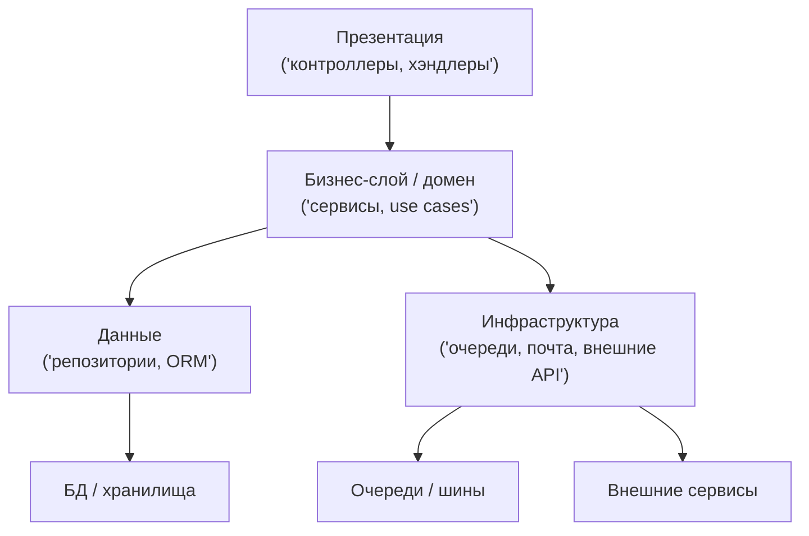

[← Назад к индексу части 4](index.md)

## 4.2. Основные слои бекенда и правило зависимостей вниз

### Цель раздела

Сделать так, чтобы ты **уверенно различал(а) слои внутри бекенд‑приложения**, понимал(а) их ответственность и мог(ла) применять **правило зависимостей только вниз** на практике.

### В этом разделе главное

- Классическая слоёная архитектура бекенда предполагает минимум три слоя: **презентация → бизнес‑логика → данные**, плюс инфраструктура.
- **Презентационный слой** общается с внешним миром и мапит вход/выход на внутренние модели.
- **Бизнес‑слой** реализует правила предметной области и не должен знать о HTTP, JSON, SQL и т.п.
- **Слой данных** инкапсулирует доступ к БД/кэшам/хранилищам, чтобы домен не зависел от конкретной СУБД.
- **Инфраструктурный слой** оборачивает внешние системы (очереди, почта, внешние API).
- Главное правило: **зависимости идут только вниз**, а детали нижних слоёв не должны «просачиваться» наверх.

### Термины

- **Презентационный слой (transport/UI)** — контроллеры, хэндлеры, ресолверы, конвертация HTTP/JSON/GraphQL ↔ внутренние модели.
- **Бизнес‑слой / домен / application** — доменные сущности, сервисы, use cases.
- **Слой данных / репозитории** — доступ к БД, ORM, клиенты к хранилищам.
- **Инфраструктурный слой** — интеграции с внешними системами, очереди, email‑провайдеры, логирование и т.п.
- **DTO (Data Transfer Object)** — объект для переноса данных между слоями/границами.
- **Направление зависимости** — кто импортирует/использует чей код.

### Теория и правила

1. **Презентационный слой: адаптер между внешним миром и доменом.**
   - Отвечает за:
     - приём запросов (HTTP, gRPC, GraphQL, WebSocket);
     - валидацию на уровне протокола (формат, обязательные поля);
     - маппинг во внутренние команды/DTO;
     - формирование ответа наружу.
   - Не должен:
     - содержать сложную бизнес‑логику;
     - напрямую ходить в БД;
     - зависеть от деталей слоя данных (SQL, ORM‑модели).

2. **Бизнес‑слой: сердце приложения.**
   - Содержит:
     - доменные сущности (`Order`, `Cart`, `User`);
     - доменные сервисы (`OrderService`, `PricingService`);
     - сценарии/команды (`CreateOrderUseCase`).
   - Работает на **своих моделях** (доменных), не зависящих от:
     - HTTP‑библиотек;
     - конкретной ORM;
     - форматов сериализации.

3. **Слой данных: инкапсуляция работы с хранилищами.**
   - Реализует контракты, ожидаемые доменом (например, интерфейс `OrderRepository`).
   - Содержит:
     - конкретные реализации для PostgreSQL, MongoDB и т.п.;
     - маппинг доменных сущностей в таблицы/документы.
   - Может использовать ORM, конструкторы запросов и т.п.

4. **Инфраструктурный слой: обвязка внешнего мира.**
   - Содержит клиентов:
     - очередей (Kafka, RabbitMQ);
     - email/SMS‑провайдеров;
     - внешних API.
   - Доменные сервисы общаются с ними через **интерфейсы**, чтобы можно было тестировать домен без реальных внешних систем.

5. **Правило зависимостей: сверху вниз.**
   - Презентационный слой может зависеть от:
     - бизнес‑слоя;
     - DTO и мапперов.
   - Бизнес‑слой может зависеть от:
     - абстракций слоя данных (интерфейсы репозиториев);
     - абстракций инфраструктуры (интерфейсы шлюзов).
   - Слой данных и инфраструктура **не должны** зависеть от контроллеров/transport‑моделей.

6. **DTO и маппинг между слоями.**
   - DTO помогают:
     - отделить внешние контракты (API‑модели) от внутренних доменных моделей;
     - отделить домен от схемы БД.
   - Да, это дополнительный код, но он **покупает независимость слоёв**.

### Пошагово: как спроектировать слои под новый бекенд

1. **Определи внешние интерфейсы.**
   - Какие клиенты есть сейчас и появятся в ближайшее время (веб, мобильный, интеграции)?
   - Какие протоколы нужны: REST, GraphQL, gRPC, очереди?
   - Это зафиксирует требования к **презентационному слою**.
2. **Опиши основные бизнес‑сценарии.**
   - Например: «создать заказ», «оплатить заказ», «отменить заказ».
   - Для каждого сценария сформулируй:
     - входные данные (команды);
     - ожидаемый результат;
     - возможные ошибки/ограничения.
3. **Выдели доменные сущности и сервисы.**
   - Какие сущности участвуют (Order, User, Product и т.п.)?
   - Какие правила над ними действуют (скидки, статусы, лимиты)?
   - Оформи это в виде **use cases**/сервисов домена.
4. **Сформулируй интерфейсы слоя данных и инфраструктуры.**
   - Какие операции нужны домену: `OrderRepository.save/findById`, `PaymentGateway.charge`?
   - Определи их как **интерфейсы**, не привязанные к конкретной технологии.
5. **Реализуй презентационный слой как тонкий адаптер.**
   - Каждый эндпоинт:
     - принимает запрос;
     - валидирует формат;
     - мапит в команду;
     - вызывает соответствующий use case;
     - мапит результат в DTO ответа.
6. **Реализуй слой данных и инфраструктуры.**
   - Создай реализации интерфейсов для выбранной СУБД, брокера, внешних сервисов.
   - Следи, чтобы эти реализации **не тянули зависимости вверх**.

### Простыми словами

Можно думать так:

- **Презентационный слой** — это **ресепшен** в компании:
  - принимает клиентов (запросы),
  - проверяет, всё ли заполнено,
  - перенаправляет к нужному отделу (домену),
  - оформляет документы на выходе (ответы).

- **Бизнес‑слой** — это **сами отделы компании**:
  - продажи, бухгалтерия, логистика;
  - принимают решения по правилам бизнеса;
  - не должны заниматься подвозом бумаги или настройкой серверов.

- **Слой данных и инфраструктура** — это **склад и подрядчики**:
  - хранят товары и документы (БД);
  - доставляют письма и грузы (email, курьеры, очереди).

Важно: клиенты **не должны напрямую ходить на склад** или к подрядчикам — всё через «отделы» (домен) и «ресепшен» (презентацию).

### Картинка в голове

Схематично слои и зависимости можно нарисовать так:



Стрелки показывают **допустимые зависимости**. Обратных стрелок (например, от D к B или от I к P) быть не должно.

### Как запомнить

Формула:

> **«Контроллеры говорят с бизнесом, бизнес говорит с репозиториями и инфраструктурой, БД и внешние системы молчат»**.

- Контроллеры **ничего не знают** про SQL/ORM.
- Бизнес **ничего не знает** про HTTP/JSON.
- Репозитории **ничего не знают** про контроллеры и DTO для API.

### Примеры

**Пример 1. Код на псевдо‑Java/TypeScript (REST API)**

```ts
// Презентация
class OrderController {
  constructor(private createOrder: CreateOrderUseCase) {}

  async create(req, res) {
    const dto = CreateOrderRequest.fromHttp(req); // валидация протокола
    const command = dto.toCommand();              // маппинг во внутреннюю модель
    const result = await this.createOrder.execute(command);
    return res.status(201).json(OrderResponse.fromResult(result));
  }
}

// Бизнес-слой
class CreateOrderUseCase {
  constructor(
    private orders: OrderRepository,
    private pricing: PricingService,
    private eventBus: DomainEventBus,
  ) {}

  async execute(command: CreateOrderCommand): Promise<Order> {
    const itemsPrice = await this.pricing.calculate(command.items);
    const order = Order.create(command.customerId, command.items, itemsPrice);
    await this.orders.save(order);
    this.eventBus.publish(new OrderCreated(order.id, order.total));
    return order;
  }
}
```

Здесь:

- контроллер ничего не знает о БД и событиях;
- `CreateOrderUseCase` не знает о HTTP‑запросе и формате ответа.

**Пример 2. Нарушение слоёв (как делать не надо)**

```ts
// "Толстый" контроллер
async function createOrder(req, res) {
  // Валидация HTTP + бизнес-правила + SQL вперемешку
  if (!req.body.customerId) throw new Error("No customer");
  const items = req.body.items.map(/* ... */);

  const existing = await db.query("SELECT ..."); // прямой SQL в контроллере
  if (existing.total > 1000) { /* бизнес-правило */ }

  await db.query("INSERT INTO orders ..."); // ещё SQL
  await axios.post("https://email-service/send", {/* ... */}); // интеграция
  res.status(201).json({ ok: true });
}
```

Такой код:

- тяжело тестировать изолированно;
- сложно рефакторить;
- сложно переносить в другой протокол (например, gRPC).

### Практика / реальные сценарии

- **Переезд с REST на GraphQL.**  
  Если бизнес‑слой и слой данных отделены:
  - меняется только презентационный слой (ресолверы вместо контроллеров);
  - доменные сервисы и репозитории остаются прежними.

- **Смена СУБД или добавление кэша.**  
  Если домен работает через абстракции репозиториев:
  - можно реализовать новый `OrderRepositoryPostgres` и/или `OrderRepositoryCached`;
  - домен и контроллеры не меняются.

- **Выделение BFF‑слоя.**  
  Если в монолите есть чёткий презентационный и бизнес‑слой:
  - часть логики презентации можно вынести в BFF;
  - бизнес‑слой остаётся ядром, к которому обращается BFF.

#### Проверь себя по сценариям слоёв

1. Как изменение протокола (REST → GraphQL) влияет на слои в примере и почему это изменение должно быть локализовано?  
   <details><summary>Ответ</summary>
   При смене REST → GraphQL:  
   - меняется только **презентационный слой** (контроллеры/ресолверы, маппинг запросов/ответов);  
   - доменный слой (use case‑ы, сущности) и слой данных (репозитории) могут остаться прежними.  
   Это возможно именно потому, что:  
   - домен не знает о протоколе;  
   - слой данных не знает о DTO/форматах API;  
   - между слоями есть чёткие границы и маппинг.
   </details>

2. В примере смены СУБД или добавления кэша какие зависимости упрощают работу и какие сделали бы её крайне болезненной?  
   <details><summary>Ответ</summary>
   Упрощает работу:  
   - домен зависит от абстракций `OrderRepository`, а не от конкретной ORM/SQL;  
   - контроллеры работают с доменными моделями/DTO, а не с ORM‑сущностями.  
   Усложняет работу:  
   - прямые SQL‑запросы в контроллерах/домене;  
   - жёсткая зависимость домена от конкретной ORM‑модели;  
   - смешение API‑DTO и сущностей БД.  
   В первом случае можно заменить реализацию репозитория/добавить кэш; во втором — придётся переписывать большое количество кода во всех слоях.
   </details>

3. Почему сценарий «выделение BFF‑слоя» в примере рекомендуется делать после наведения порядка в слоях, а не до этого?  
   <details><summary>Ответ</summary>
   Если слои внутри ядра уже в порядке:  
   - презентация и домен разделены;  
   - домен и данные разделены;  
   - есть чёткие интерфейсы и DTO.  
   Тогда BFF можно построить как **тонкий адаптер** над доменом ядра.  
   Если же слоистости нет, BFF придётся компенсировать внутренний хаос, дублируя бизнес‑логику и привязываясь к деталям реализации, что превратит его в ещё один «комок грязи».
   </details>

### Типичные ошибки

- Валидация бизнес‑правил (а не только формата) в контроллерах.
- Репозитории, которые возвращают DTO из API вместо доменных моделей.
- Доменные сервисы, которые принимают `HttpRequest` или `Response` как аргументы.
- Инфраструктурные детали (конкретные HTTP‑клиенты, SQL‑конструкции) торчат в домене.

### Что будет, если…

- **…презентационный слой начнёт знать о SQL и схемах БД?**  
  Любое изменение в БД (переименование колонок, разбиение таблиц) потребует:
  - правок во множестве контроллеров;
  - повышенного риска ошибок;
  - сложной миграции.

- **…домен начнёт знать о HTTP‑запросах/ответах?**  
  Станет:
  - сложно переиспользовать логику в другом протоколе (gRPC, CLI, очереди);
  - сложнее тестировать домен (придётся мокать веб‑фреймворк).

### Проверь себя

1. Какую ответственность несёт **презентационный слой**, а какую — **бизнес‑слой**?  
   <details><summary>Ответ</summary>
   Презентационный слой:
   - принимает запросы от внешнего мира;
   - валидирует данные на уровне протокола;
   - мапит их во внутренние команды/DTO;
   - формирует ответы наружу.  
   Бизнес‑слой:
   - реализует правила предметной области;
   - принимает решения о том, что можно и нельзя;
   - оркестрирует работу с репозиториями и инфраструктурой.  
   Он не должен знать о HTTP/JSON, SQL и конкретных протоколах.
   </details>

2. Почему полезно использовать **DTO** между слоями, а не передавать прямо объекты ORM или HTTP‑модели?  
   <details><summary>Ответ</summary>
   DTO отделяют:
   - внешний контракт (API) от внутренних моделей домена;
   - домен от схемы БД и ORM‑деталей.  
   Это позволяет:
   - менять API без переписывания домена;
   - менять схему БД/ORM без переписывания домена и API;
   - уменьшить количество утечек абстракций и связность между слоями.
   </details>

3. Придумай пример, когда **инфраструктурный слой** важен даже в маленьком приложении.  
   <details><summary>Ответ</summary>
   Например, маленькое приложение:
   - пишет логи в внешний сервис (Sentry, Logstash);
   - отправляет email через сторонний SMTP‑провайдер;
   - пушит события в message‑broker (Kafka, RabbitMQ).  
   Если обернуть это в инфраструктурный слой (интерфейсы, адаптеры), домен:
   - не зависит от конкретных SDK;
   - легче тестируется;
   - остаётся стабильным при смене провайдера/брокера.
   </details>

### Запомните

- Презентация — «лицо» сервиса; домен — «мозг»; данные/инфраструктура — «память и мышцы».
- Главное правило: **зависимости вниз, детали спрятаны**, домен максимально независим.
- DTO и интерфейсы — инструмент, который позволяет **развязать слои** и сохранить архитектуру управляемой.

---
