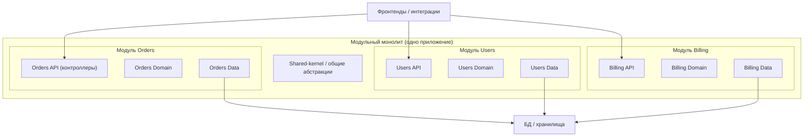

[← Назад к индексу части 5](index.md)

## 5.1. Что такое модульный монолит и зачем он нужен

### Цель раздела

Сформировать у тебя **чёткую интуицию и формальное определение**, что такое модульный монолит, зачем он нужен и как он соотносится с обычным монолитом и микросервисами.

### В этом разделе главное

- Модульный монолит — это **монолитное приложение с явными доменными модулями и ограниченными зависимостями между ними**.
- Единица развёртывания **по‑прежнему одна**, но внутри есть **квазисервисы‑модули**.
- Модульный монолит позволяет получить **часть выгод микросервисов (модульность, независимость областей)** без операционной сложности распределённой системы.
- Для многих продуктов модульный монолит — **конечная архитектура**, а не «промежуточная ступень, которая стыдно».
- Если всё сделать плохо, модульный монолит легко превратить в **распределённый монолит** при переходе к микросервисам.

### Термины

- **Модульный монолит** — монолитное приложение, внутри которого код разделён на **доменные модули** с жёстко контролируемыми зависимостями и контрактами.
- **Доменный модуль** — часть системы, которая отвечает за **конкретную область предметной области** (заказы, каталог, пользователи, биллинг).
- **Квазисервис** — доменный модуль в модульном монолите, который **по сути похож на сервис**, но живёт в рамках одного процесса/деплоя.

### Теория и правила

1. **От монолита к модульному монолиту.**  
   В части 3 мы считали монолитом любое приложение, где:
   - единица развёртывания одна;
   - основная бизнес‑логика живёт в одном процессе/приложении.  
   Если внутри:
   - нет явных модулей;
   - зависимости хаотичны;
   - слои только на бумаге — это просто **монолит** (здоровый или нет).  
   Модульный монолит — это следующий шаг:
   - мы **осознанно вводим доменные модули**;
   - задаём **правила зависимостей** между ними;
   - следим за соблюдением этих правил инструментами.

2. **Сравнение: обычный монолит vs модульный монолит.**

```text
Обычный монолит:

[ Приложение ]
  ├─ controllers
  ├─ services
  ├─ repositories
  ├─ utils/common
  └─ (куча доменов вперемешку)

Модульный монолит:

[ Приложение ]
  ├─ module: orders
  │    ├─ api (контроллеры/эндпоинты для заказов)
  │    ├─ domain (сущности, правила заказов)
  │    ├─ infra (репозитории, интеграции заказов)
  │    └─ public API (фасады/интерфейсы для других модулей)
  ├─ module: users
  ├─ module: billing
  └─ shared-kernel (общие, действительно нейтральные вещи)
```

3. **Сравнение с микросервисами.**

- Микросервисы:
  - каждая доменная область → **отдельный сервис и деплой**;
  - коммуникация по сети (HTTP/gRPC/события);
  - отдельные БД (часто) и инфраструктура.
- Модульный монолит:
  - доменные области → **модули внутри одного деплоя**;
  - коммуникация **через вызовы в памяти** (методы/интерфейсы), иногда через доменные события;
  - БД может быть общая, но с **чётким владением** таблиц по модулям.

Смысл: модульный монолит даёт:

- изоляцию по доменам;
- понятные границы;
- возможность локального развития модулей;

но без обязательств:

- отдельной инфраструктуры;
- сложного сетевого взаимодействия;
- раздельных пайплайнов деплоя.

4. **Где модульный монолит — конечная точка.**

Для многих продуктов (B2B‑системы, внутренние порталы, умеренные SaaS) достаточно:

- одной команды или нескольких небольших команд;
- одного приложения;
- ясного деления на модули по доменам.  

Переход к микросервисам:

- добавляет операционную сложность;
- оправдан только при **действительно больших масштабах**:
  - много команд;
  - жёсткие требования по независимым релизам;
  - серьёзная нагрузка и регуляторика.

5. **Где модульный монолит — ступень к сервисам.**

Если ты понимаешь, что:

- команда и продукт сильно вырастут;
- нужны независимые релизы по доменам;
- будут разные регуляторные требования к разным областям,  

модульный монолит:

- помогает **вырастить правильные границы**;
- позволяет «обкатать» доменную модель;
- снижает риск получить **распределённый монолит**, когда разрезание сделано в спешке.

### Простыми словами

Представь **большой офис**:

- Обычный монолит — это когда все сидят в одном open space:
  - кто‑то примерно отвечает за заказы;
  - кто‑то — за оплату;
  - но границы размыты, все подходят к друг другу напрямую и спрашивают «а давай я у тебя это возьму».

- Модульный монолит — это когда тот же офис, но:
  - сотрудники **поделены на отделы по доменам**: «Отдел заказов», «Отдел пользователей», «Отдел биллинга»;
  - у каждого отдела есть **своя зона и руководитель**;
  - между отделами есть **формальные правила взаимодействия**: через письма, заявки, регламенты.

- Микросервисы — это когда каждый отдел переезжает в **своё отдельное здание**:
  - у каждого — своя охрана, своя инфраструктура;
  - взаимодействие — только через официальные каналы (API, шины).

Модульный монолит — это **всё ещё один офис**, но **организованный**, а не «рынок».

### Картинка в голове

Диаграмма, показывающая модульный монолит как сочетание слоёв (вертикаль) и модулей (горизонталь):



Здесь важно:

- модули (`Orders`, `Users`, `Billing`) **изолированы**;
- есть общий слой `Shared`, но он **не знает** о конкретных доменах.

### Как запомнить

Формула:

> **Модульный монолит = монолит + чёткие доменные модули + правила зависимостей.**

Если:

- модулей по доменам нет;
- или правила зависимостей не соблюдаются;  

то это **не модульный монолит**, а просто монолит «с красивыми папками».

### Примеры

**Пример 1. Небольшой e‑commerce в модульном монолите**

- Модули:
  - `orders` — управление заказами;
  - `catalog` — товары, категории;
  - `users` — аккаунты и профили;
  - `billing` — платежи и инвойсы.
- Каждый модуль:
  - имеет свой публичный фасад (`OrdersFacade`, `UsersFacade` и т.п.);
  - обращается к другим модулям **через фасады**, а не напрямую в их БД;
  - хранит свои таблицы (с префиксами или схемами).

**Пример 2. Внутренняя CRM крупной компании**

- Монолит развивался несколько лет.
- Чтобы не уходить в микросервисы, команда:
  - ввела доменные модули: `customers`, `leads`, `tasks`, `reports`;
  - описала правила зависимостей (ArchUnit);
  - создала `shared-kernel` только для **базовых доменных типов** (идентификаторы, базовые интерфейсы событий).

### Практика / реальные сценарии

- **Тебе говорят: «Нам нужны микросервисы, монолит душит»**, но:
  - слои кое‑как есть;
  - модули не выделены;
  - зависимости хаотичны.  

  В такой ситуации:

  - переход в микросервисы почти гарантированно даст **распределённый монолит**;
  - разумный шаг — **сначала модульный монолит**, потом смотреть на реальные проблемы.

- **Команда быстро растёт с 3 до 12 человек.**
  - Пока все сидели в одном модуле — было терпимо;
  - теперь начинают мешать друг другу, merge‑конфликты, спор за общие файлы.
  - Введение модулей по доменам:
    - снижает конфликтность;
    - даёт понятные зоны ответственности;
    - готовит архитектуру к возможному выносу модулей.

### Типичные ошибки

- Считать модульный монолит «псевдомикросервисами в одном репо» и:
  - пытаться симулировать сетевое общение там, где оно не нужно;
  - усложнять инфраструктуру внутри одного процесса.
- Путать **модуль** с **слоем** и делать модули `controllers`, `services`, `repositories` вместо доменных модулей `orders`, `users`, `billing`.
- Объявлять «у нас модульный монолит», но:
  - все модули импортируют друг друга во все стороны;
  - есть огромный `common`, от которого зависят все;
  - архитектурных тестов нет.

### Что будет, если…

- **…остаться на «обычном монолите», когда продукт и команда растут?**  
  Монолит начнёт:
  - замедлять развитие (любая фича касается десятка участков);
  - создавать конфликты между командами;
  - становиться кандидатом на «большую переписку».

- **…сразу прыгнуть в микросервисы, минуя модульный монолит?**  
  Скорее всего:
  - границы сервисов будут проведены «по боли» и случайным признакам;
  - появится **распределённый монолит**: общая БД, сильная связанность, сложное тестирование;
  - операционная сложность вырастет, а архитектурные проблемы останутся.

### Проверь себя

1. В чём принципиальное отличие модульного монолита от «просто монолита с папками `orders/`, `users/`, `billing/`»?  
   <details><summary>Ответ</summary>
   В модульном монолите есть **формальные границы и правила зависимостей** между модулями: каждый модуль имеет свой публичный API, есть запреты на прямые зависимости и циклы, границы проверяются архитектурно (в том числе инструментами). Просто папки по доменам без таких правил и проверок ещё не дают модульности — код по‑прежнему может зависеть от чего угодно.
   </details>

2. Почему модульный монолит часто оказывается более реалистичной цельной архитектурой, чем «полные микросервисы» для большинства продуктов?  
   <details><summary>Ответ</summary>
   Потому что он сочетает **модульность и изоляцию доменов** с **низкой операционной сложностью**: один деплой, один пайплайн, одна основная БД. Для большинства продуктов нет такой нагрузки или организационного масштаба, чтобы оправдывать стоимость распределённой системы. Модульный монолит даёт «90 % пользы микросервисов» (ясные границы, независимое развитие областей) при гораздо меньших затратах.
   </details>

3. В каких ситуациях модульный монолит стоит рассматривать как **ступень к микросервисам**, а не как конечную архитектуру?  
   <details><summary>Ответ</summary>
   Когда ожидается существенный рост: команды, нагрузки, регуляторных требований — и ты понимаешь, что через 1–3 года понадобится независимый деплой и масштабирование разных областей (например, платежи, отчёты, аналитика). В такой ситуации модульный монолит позволяет заранее отработать правильные границы доменов и контрактов, чтобы потом выносить модули в сервисы по отлаженным границам, а не в спешке.
   </details>

4. Как ты объяснишь не‑техническому стейкхолдеру, почему команда выбирает модульный монолит, а не микросервисы «как у больших компаний»?  
   <details><summary>Ответ</summary>
   Можно сказать так: «Мы разделяем систему на понятные блоки (заказы, пользователи, оплата), чтобы каждый блок можно было развивать отдельно. При этом всё живёт в одном приложении, поэтому запуск и сопровождение остаются простыми и дешёвыми. Микросервисы дают похожую модульность, но требуют сложной инфраструктуры, множества сервисов и команд; на нашем масштабе это даст больше издержек, чем пользы. Модульный монолит даёт нам нужную структурированность без лишней сложности».
   </details>

5. Как модульный монолит помогает управлять архитектурным долгом по сравнению с «обычным» монолитом?  
   <details><summary>Ответ</summary>
   В обычном монолите архитектурный долг часто размазан по всей кодовой базе: трудно понять, какие части за что отвечают и где именно «болит». В модульном монолите долг можно привязывать к конкретным модулям и их границам (например, «модуль orders слишком сильно зависит от users»), планируя локальные улучшения: рефакторинг фасада, очистку зависимостей, вынос части логики. Это делает долг обозримым, измеримым и управляемым, а не «чёрной дырой» во всём приложении.
   </details>

### Запомните

- Модульный монолит — это **не «монолит, который мы стыдимся», а архитектура, которую мы сознательно спроектировали**.
- Он даёт:
  - **структуру по доменам**;
  - **контролируемые зависимости**;
  - **маршрут эволюции** — при необходимости.
- Без модульного мышления любой переход к сервисам почти гарантированно ведёт к **распределённому монолиту**.

---
