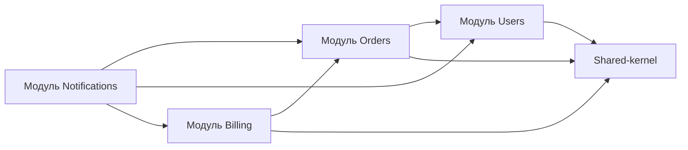

[← Назад к индексу части 5](index.md)

## 5.3. Зависимости внутри и между модулями; архитектурные тесты

### Цель раздела

Дать тебе **конкретные правила и приёмы управления зависимостями** в модульном монолите и показать, как с помощью архитектурных тестов и инструментов удерживать эти правила в живом коде.

### В этом разделе главное

- Внутри модуля зависимости следуют **слоистой архитектуре** (часть 4): презентация → домен → данные/инфраструктура.
- Между модулями действуют правила:
  - **только через публичный API** (фасады, интерфейсы, события);
  - **без циклов**;
  - **без протаскивания внутренних типов наружу**.
- Есть несколько паттернов взаимодействия модулей:
  - прямые синхронные вызовы фасада;
  - публикация доменных событий;
  - shared‑kernel/общая библиотека **строго ограниченного назначения**.
- Архитектурные тесты позволяют **автоматически проверить**, что код соблюдает правила.

### Термины

- **Фасад модуля** — класс/интерфейс, который инкапсулирует операции модуля для других модулей.
- **Shared‑kernel** — общий модуль с базовыми, действительно доменно‑нейтральными вещами (например, типы идентификаторов, базовые value‑объекты).
- **Архитектурные тесты** — тесты, проверяющие структуру зависимостей (например, «модуль `orders` не зависит от `billing`»).

### Теория и правила

1. **Внутри модуля: повторяем правило слоистости.**

Внутри `module orders`:

- контроллеры вызывают `OrdersFacade` / use case‑ы;
- домен работает через интерфейсы `OrderRepository`, `PricingGateway` и т.п.;
- реализации репозиториев/адаптеров живут в `infra/`.

2. **Между модулями: только через публичный API.**

Примеры допустимых зависимостей:

- `billing` вызывает `OrdersFacade.getOrderForPayment(orderId)`;
- `orders` публикует событие `OrderCreated`, на которое подписывается модуль `notifications`.

Неправильные зависимости:

- `billing.infra` напрямую лезет в таблицы `orders`;
- `orders.domain` импортирует классы из `billing.domain`;
- `orders.api` зависит от DTO из `users.infra` и т.п.

3. **Паттерн фасада.**

Для модуля `orders`:

```ts
// public/OrdersFacade.ts
export interface OrdersFacade {
  createOrder(cmd: CreateOrderCommand): Promise<OrderSummary>;
  getOrderDetails(id: OrderId): Promise<OrderDetails>;
}
```

Другие модули:

- импортируют только `OrdersFacade` и нужные DTO/типы;
- не видят внутренние сущности `Order`, детали репозиториев и т.п.

4. **Паттерн доменных событий.**

Где уместно:

- модуль публикует **доменные события**:
  - `OrderCreated`, `UserRegistered`, `InvoiceIssued`;
- другие модули подписываются и реагируют:
  - `notifications` → отправка писем;
  - `analytics` → обновление отчётов.

В модульном монолите сначала это может быть:

- простой **внутрипроцессный event bus**;
- позже то же самое легко заменить на брокер сообщений при выносе сервисов.

5. **Shared‑kernel: как не превратить его в свалку.**

Shared‑kernel допустим, если:

- он **не знает о доменах** (в нём нет бизнес‑логики `orders`, `users` и т.п.);
- в нём только:
  - базовые value‑объекты (идентификаторы, деньги);
  - общие интерфейсы для событий;
  - базовый протокол ошибок;
- он **маленький и стабильный**.

6. **Архитектурные тесты и инструменты.**

Инструменты:

- для JVM: **ArchUnit**;
- для JS/TS: **dependency‑cruiser**, ESLint plugins;
- для .NET: NetArchTest и аналоги.

Что можно проверять тестами:

- «модуль `orders` не зависит от `billing` напрямую»;
- «слой `api` не зависит от слоя `infra`»;
- «в `shared-kernel` нет зависимостей на доменные модули».

### Пошагово: как ввести правила зависимостей

1. **Определи желаемые правила.**
   - Список модулей и допустимых зависимостей:
     - `users` ← `orders` (заказы могут спрашивать о пользователях);
     - `billing` ← `orders` (платежи опираются на заказы);
     - `notifications` может слушать события от всех.

2. **Оформь правила в явном виде.**
   - Документация/ADR;
   - простая таблица в `README` модуля.

3. **Выбери инструмент для проверки.**
   - Зависит от языка:
     - ArchUnit, dependency‑cruiser и т.п.

4. **Напиши первые архитектурные тесты.**
   - Начни с критичных правил:
     - «нет циклов между доменными модулями»;
     - «слой `api` не зависит от `infra`».

5. **Постепенно расширяй покрытие.**
   - После нескольких рефакторингов добавляй новые проверки;
   - фиксируй нарушения как архитектурный долг, если не можешь исправить сразу.

### Простыми словами

Можно думать так:

- внутри каждого модуля есть **свой маленький слоистый мир**;
- между модулями есть только:
  - **официальные двери** (фасады, события);
  - **парочка общих коридоров** (shared‑kernel), но **не общий склад мусора**.

Архитектурные тесты — это:

- «охранники», которые:
  - проверяют, не пробили ли где‑то **дырку в стене** между модулями;
  - не начали ли таскать провода напрямую из чужого этажа.

### Картинка в голове

Диаграмма зависимостей модулей:



Здесь:

- стрелки показывают допустимые зависимости по коду;
- `Shared` не зависит ни от одного доменного модуля.

### Примеры

**Пример 1. Фасад модуля и использование в другом модуле**

```ts
// orders/public/OrdersFacade.ts
export interface OrdersFacade {
  getOrderSummary(id: OrderId): Promise<OrderSummary>;
}

// billing/app/PaymentService.ts
export class PaymentService {
  constructor(private orders: OrdersFacade, private payments: PaymentsRepository) {}

  async chargeOrder(orderId: OrderId, method: PaymentMethod) {
    const order = await this.orders.getOrderSummary(orderId);
    if (!order.canBePaid) {
      throw new DomainError("Order cannot be paid");
    }

    const payment = Payment.createFor(order, method);
    await this.payments.save(payment);
    // ...
  }
}
```

Здесь:

- `billing` зависит только от **фасада** `OrdersFacade`;
- `OrderSummary` — DTO, а не доменная сущность `Order`.

**Пример 2. Доменные события между модулями**

```ts
// orders/domain/events/OrderCreated.ts
export class OrderCreated {
  constructor(public readonly orderId: OrderId, public readonly total: Money) {}
}

// orders/app/CreateOrderUseCase.ts
this.eventBus.publish(new OrderCreated(order.id, order.total));

// notifications/app/OrderNotificationsHandler.ts
eventBus.subscribe(OrderCreated, async (event) => {
  await emailSender.sendOrderConfirmation(event.orderId, event.total);
});
```

Позже этот же паттерн:

- можно вынести на брокер сообщений;
- использовать те же события для внешних сервисов.

### Практика / реальные сценарии

- **Нужна изоляция платёжной логики**, но пока команда и продукт не тянут микросервисы.
  - Выделяют модуль `billing`;
  - описывают его публичный API и события;
  - запрещают другим модулям:
    - напрямую трогать таблицы биллинга;
    - использовать его внутренние сущности.

- **Команда хочет предотвратить регресс архитектуры.**
  - Вводят ArchUnit/`dependency-cruiser`;
  - добавляют:
    - тесты на отсутствие циклов между модулями;
    - тесты на запрет импортов `infra` из `api`/`domain`.

### Типичные ошибки

- Фасад модуля просто экспортирует **все внутренние типы** (`export *` из `orders/*`).
- Shared‑kernel разрастается и начинает зависеть от доменных модулей.
- Архитектурные тесты пишут один раз и перестают обновлять:
  - правила устаревают;
  - команда игнорирует их.

### Что будет, если…

- **…позволить модулям зависеть друг от друга как угодно?**  
  Получится:
  - граф зависимостей с циклами;
  - невозможность выделить модули/сервисы;
  - рост архитектурного долга.

- **…переусердствовать с shared‑kernel?**  
  Shared‑kernel превратится:
  - в новый «core/common»;
  - в центральную точку всех зависимостей;
  - в препятствие для эволюции.

### Проверь себя

1. Чем **фасад модуля** отличается от простого «переэкспорта всех его внутренних классов»?  
   <details><summary>Ответ</summary>
   Фасад определяет **ограниченный, явно спроектированный контракт** модуля для внешнего мира: он показывает только необходимые операции и DTO, скрывая детали внутренних сущностей, репозиториев и инфраструктуры. Переэкспорт же открывает наружу практически всё, что делает модуль, ломая инкапсуляцию и позволяя другим модулям завязываться на случайные внутренние детали, что увеличивает связанность и усложняет эволюцию.
   </details>

2. Зачем нужны архитектурные тесты, если команда и так «договорилась соблюдать границы модулей»?  
   <details><summary>Ответ</summary>
   Потому что со временем:
   - команда меняется;
   - контекст забывается;
   - под давлением сроков люди начинают «пробивать дырки» в границах.  
   Архитектурные тесты:
   - делают правила **машиночитаемыми**;
   - дают раннюю обратную связь при нарушениях (на CI);
   - помогают удерживать структуру в долгую.  
   Это способ зафиксировать договорённости и защитить их от эрозии.
   </details>

3. Приведи пример, когда **доменные события** между модулями модульного монолита помогут при последующем переходе к микросервисам.  
   <details><summary>Ответ</summary>
   Например, модуль `orders` публикует `OrderPaid`, на которое реагируют `billing` и `notifications`. В модульном монолите это может быть простой in‑memory event bus. При переходе к микросервисам тот же контракт события и обработчиков можно перенести на брокер сообщений (Kafka/RabbitMQ): тогда код use case‑ов и обработчиков изменится минимально, а события уже будут оформлены как стабильный контракт.
   </details>

4. Какие зависимости между модулями ты считаешь допустимыми, а какие должны быть запрещены в здоровом модульном монолите?  
   <details><summary>Ответ</summary>
   Допустимы зависимости: от одного доменного модуля к фасаду (интерфейсу) другого модуля; от модулей к общему shared‑kernel, если он действительно нейтрален; от верхних слоёв модуля к нижним в рамках самого модуля. Недопустимы: прямой доступ к чужим таблицам/репозиториям, импорт внутренних типов другого модуля (его сущностей, «сырого» доменного кода), зависимости из shared‑kernel обратно на доменные модули и циклы между модулями. Такие зависимости ломают инкапсуляцию и мешают эволюции.
   </details>

5. Почему важно, чтобы доменные события, публикуемые модулем, воспринимались как часть его публичного контракта, а не как внутренняя деталь реализации?  
   <details><summary>Ответ</summary>
   Потому что события используются другими модулями (и в будущем — сервисами) как источник истины о произошедших фактах. Если относиться к ним как к внутренним деталям, их будут менять без учёта потребителей, ломая обработчики и нарушая инварианты. Рассматривая события как часть публичного контракта, мы: фиксируем их схему, смысл и гарантию доставки, версионируем изменения и можем планировать эволюцию (например, добавление полей или вынос части логики), не ломая зависимых модулей.
   </details>

### Запомните

- Внутри модуля — та же слоистость, что и в части 4; между модулями — **строгие, ограниченные контракты**.
- Фасады, события и аккуратный shared‑kernel уменьшают связанность.
- Архитектурные тесты — ключевой механизм, чтобы модульность не умерла через год.

---
