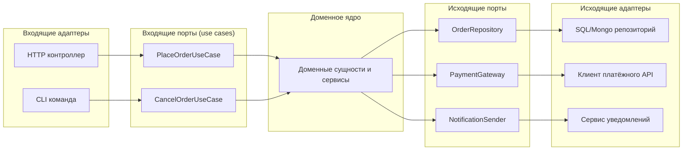

[← Назад к индексу части 6](index.md)

## 6.2. Порты: входящие и исходящие интерфейсы ядра

### Цель раздела

Научить тебя **проектировать порты** — такие интерфейсы, через которые ядро:

- принимает команды и запросы извне;
- вызывает внешние системы;

так, чтобы доменная логика была независима от конкретных технологий и при этом **порты оставались понятными и предметными**.

### В этом разделе главное

- Порты — это **интерфейсы домена**, а не тонкая обёртка над HTTP или БД.
- Есть **входящие порты** (driving) и **исходящие порты** (driven).
- Входящие порты описывают **use cases**: что домен умеет делать по запросу внешнего мира.
- Исходящие порты описывают **запросы домена к инфраструктуре** (хранилище, внешние API, очереди).
- Хороший порт говорит на **языке домена**, а не на языке транспорта (HTTP, SQL).

### Термины

- **Входящий порт** — интерфейс, который реализует доменное ядро и который вызывают внешние адаптеры (HTTP‑контроллеры, CLI, consumers).
- **Исходящий порт** — интерфейс, который определяет домен и который реализуют адаптеры (репозитории, клиенты внешних API, публикация событий).
- **Use case** — сценарий использования системы, часто реализуемый как входящий порт.

### Теория и правила

1. **Входящий порт = сценарий для внешнего мира.**

   Примеры входящих портов:
   - `PlaceOrderUseCase`;
   - `RegisterUserUseCase`;
   - `ConfirmPaymentUseCase`.

   Это:
   - **контракты ядра наружу**;
   - обычно интерфейсы с методами вроде:
     - `place(command: PlaceOrderCommand): OrderId`;
     - `register(command: RegisterUserCommand): UserId`.

2. **Исходящий порт = потребность домена во внешнем мире.**

   Примеры исходящих портов:
   - `OrderRepository` (хранилище заказов);
   - `PaymentGateway` (вызов платёжного сервиса);
   - `NotificationSender` (отправка SMS/email/push).

   Это:
   - **то, чего домен ждёт от окружающего мира**;
   - интерфейсы с методами:
     - `save(order: Order): void`;
     - `charge(payment: PaymentRequest): PaymentResult`;
     - `send(notification: Notification): void`.

3. **Порты формулируются в терминах домена.**

   Хороший порт:
   - не использует `HttpRequest`, `HttpResponse`, `SqlConnection`, `KafkaMessage` и т.п.;
   - оперирует доменными понятиями:
     - `Order`, `User`, `Payment`, `Notification`, `Cart`, `Product`.

   Плохо:

   ```text
   interface CreateOrderPort {
     HttpResponse handle(HttpRequest request);
   }
   ```

   Хорошо:

   ```text
   interface PlaceOrderUseCase {
     OrderId place(PlaceOrderCommand command);
   }
   ```

4. **Порты должны быть достаточно конкретными, но не утягивать инфраструктуру.**

   - Слишком общий порт:
     - `ExternalServicesPort` с десятком методов про всё подряд.
   - Слишком маленькие порты:
     - десятки портов на каждое мелкое действие, тяжело поддерживать.

   Баланс:
   - группировать методы вокруг **доменных обязанностей**;
   - не бояться того, что один порт охватывает несколько операций (CRUD по заказу).

5. **Инверсия управления.**

   - Входящие порты **реализуются доменом**, а адаптеры их вызывают.
   - Исходящие порты **реализуются адаптерами**, а домен их вызывает.

   Таким образом:
   - домен **контролирует контракты** («мне нужны такие операции»);
   - инфраструктура **подстраивается под домен**.

6. **Связь с интерфейсами в коде.**

   - Порты обычно реализуются как **интерфейсы (абстракции)**:
     - в языках с интерфейсами (`Java`, `C#`, `Go`) — отдельные интерфейсы;
     - в динамических языках (`Python`, `JavaScript`) — протоколы/абстрактные базовые классы/duck typing + чёткая документация.

### Пошагово: как спроектировать порты для сервиса

Допустим, у нас есть сервис заказов интернет‑магазина.

1. **Определи ключевые сценарии (use cases).**
   - Создать заказ.
   - Посмотреть заказ.
   - Отменить заказ.
   - Подтвердить оплату.

2. **Для каждого сценария определи входящий порт.**

   - `PlaceOrderUseCase`:
     - вход: `PlaceOrderCommand` (товары, адрес, способ доставки, пользователь);
     - выход: `OrderId` и, возможно, состояние `Order`.
   - `GetOrderUseCase`:
     - вход: `OrderId`;
     - выход: DTO/модель для отображения.

3. **Определи, какие внешние системы нужны домену.**

   - Хранилище заказов → `OrderRepository`.
   - Хранилище товаров → `ProductRepository`.
   - Платёжный шлюз → `PaymentGateway`.
   - Уведомления → `NotificationSender`.

4. **Опиши исходящие порты в терминах домена.**

   - `OrderRepository`:
     - `save(order: Order): void`;
     - `findById(id: OrderId): Order | null`.
   - `PaymentGateway`:
     - `charge(payment: PaymentRequest): PaymentResult`.

5. **Проверь, нет ли в портах технических деталей.**

   - Если встречаются `HttpRequest`, `HttpResponse`, `ResultSet`, `Entity`, `Document` и т.п. — это сигнал, что порт **утянул внутрь инфраструктуру**.

6. **Задокументируй ожидания.**

   - Важно явным образом описать:
     - какие исключения / ошибки допустимы;
     - какие инварианты ожидаются (например, `OrderRepository.save` должен сохранять атомарно).

### Простыми словами

Можно думать так:

- Входящий порт — это как **«дверь в комнату»**, через которую в домен заходят команды:
  - «создай заказ»;
  - «зарегистрируй пользователя».
- Исходящий порт — это **«звонок соседям»**:
  - «обнови запись в БД»;
  - «отправь уведомление»;
  - «обратись к платёжному провайдеру».

Домен не знает:

- будет ли «дверь» деревянной, стеклянной, автоматической (HTTP, CLI, очередь);
- по какой связи он звонит соседям (SQL, Mongo, REST, gRPC, Kafka).

Его интересует только:

- **«что» он может сделать** (входящие порты);
- **«что» ему могут сделать другие** (исходящие порты).

### Картинка в голове



Смотри на порты как на **тонкий, но чёткий слой интерфейсов** между доменом и адаптерами.

### Как запомнить

> **Входящий порт** — «что мир может попросить у домена».  
> **Исходящий порт** — «что домен просит у мира».  
> Оба формулируются **на языке домена**, а не на языке протоколов/БД.

Если в определении порта ты вынужден говорить «HTTP», «SQL», «Kafka» — это повод пересмотреть дизайн.

### Примеры

**Пример 1. Входящий порт для регистрации пользователя.**

```text
// Входящий порт
interface RegisterUserUseCase {
  UserId register(RegisterUserCommand command);
}

// Команда
class RegisterUserCommand {
  email: Email;
  password: PlainPassword;
  name: string;
}
```

**Пример 2. Исходящий порт для хранилища и email.**

```text
interface UserRepository {
  save(user: User): void;
  findByEmail(email: Email): User | null;
}

interface EmailSender {
  sendRegistrationEmail(to: Email, confirmationLink: Url): void;
}
```

Здесь нигде нет:

- `HttpRequest`, `HttpResponse`;
- `SmtpClient`, `SqlConnection`, `Entity`.

Это **чистый доменный язык**.

### Практика / реальные сценарии

Где хорошо видны порты:

- **REST API**:
  - каждый endpoint (`POST /orders`, `GET /orders/{id}`) обычно соответствует **одному входящему порту** (use case);
  - контроллер:
    - парсит HTTP‑данные;
    - вызывает порт;
    - мапит результат в HTTP‑ответ.

- **Очереди и событийные системы**:
  - consumer из очереди — это входящий адаптер;
  - он переводит сообщение в `Command/Event` и вызывает соответствующий порт.

- **Cron / планировщики**:
  - задача по расписанию — тоже входящий адаптер;
  - она «стучится» в порт: «запусти nightly‑агрегацию», «проверь истёкшие подписки».

### Типичные ошибки

- **Порты на уровне транспорта.**
  - `interface HttpOrderPort { HttpResponse handle(HttpRequest request); }`
  - ядерный код начинает оперировать HTTP‑понятиями.

- **Все запросы через один «суперпорт».**
  - `ApplicationService` с сотней методов;
  - тяжело тестировать и эволюционировать.

- **Слишком детальные порты под каждую мелочь.**
  - Гигантское количество интерфейсов, большинство из которых дублируют поведение.

### Что будет, если…

- **Если не выделять порты.**
  - Доменный код будет:
    - напрямую зависеть от ORM / HTTP / Kafka;
    - сложнее тестировать;
    - труднее переносить в другой контекст (CLI, очередь, другой протокол).

- **Если порты формулировать в терминах транспорта.**
  - При смене протокола (HTTP → gRPC, REST → события) придётся:
    - менять и домен, и адаптеры;
    - теряется преимущество гексагональной архитектуры.

### Проверь себя

1. Чем входящий порт отличается от исходящего?  
2. Почему важно, чтобы порты были сформулированы на языке домена, а не транспорта?  
3. Как связаны порты и use cases?

<details><summary>Ответ</summary>

1. Входящий порт описывает **операции, которые домен предоставляет внешнему миру** (его вызывают адаптеры); исходящий порт описывает **операции, которые домен ожидает от внешнего мира** (его реализуют адаптеры, а домен вызывает).  
2. Если порты используют понятия HTTP/SQL/Kafka, домен становится **жёстко привязан к инфраструктуре**; поменять транспорт или хранилище без изменения домена становится невозможно, теряется основная цель гексагональной архитектуры.  
3. Use case — это типичный пример входящего порта: **сценарий использования системы**, оформленный как интерфейс, который реализует доменное ядро и который вызывают адаптеры (контроллеры, consumers, CLI).

</details>

### Запомните

- Порты — это **контракты домена**, описанные на **языке предметной области**.
- Входящие порты представляют **use cases**, исходящие — **потребности домена во внешних сервисах**.
- Качество портов сильно определяет, насколько легко тебе будет **менять инфраструктуру и тестировать систему**.

---
