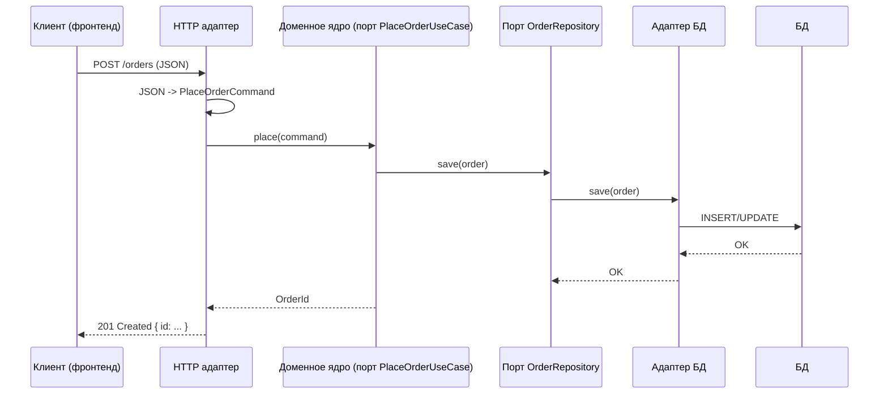

[← Назад к индексу части 6](index.md)

## 6.3. Адаптеры: HTTP, БД, очереди, внешние API

### Цель раздела

Показать, как на практике реализуются **адаптеры**:

- входящие (HTTP, CLI, очереди);
- исходящие (БД, внешние API, шины сообщений),

и как при этом сохранить **чистоту домена**: использовать антикоррупционный слой, не протащить DTO и протоколы внутрь ядра.

### В этом разделе главное

- Адаптеры — это **тонкие слои, которые переводят протокол/формат внешнего мира в порты ядра и обратно**.
- Входящие адаптеры **принимают запросы** (HTTP, CLI, очередь) и вызывают входящие порты.
- Исходящие адаптеры **реализуют исходящие порты** и используют конкретные технологии (SQL, MongoDB, Kafka, REST‑клиенты).
- Антикоррупционный слой помогает **не тянуть внешние модели и грязь внутрь домена**.
- Хороший адаптер:
  - изолирует фреймворк;
  - решает технические задачи (маппинг, ретраи, логирование);
  - **не содержит доменной логики**.

### Термины

- **Входящий адаптер** — код, который получает запрос/сообщение/вызов из внешнего мира и передаёт его во входящий порт.
- **Исходящий адаптер** — код, который реализует исходящий порт, используя драйверы БД, HTTP‑клиенты, библиотеки очередей и др.
- **Антикоррупционный слой (ACL)** — слой преобразования внешних моделей/протоколов в доменные модели и обратно.

### Теория и правила

1. **Роль входящих адаптеров.**

   Входящие адаптеры:
   - привязаны к конкретному фреймворку/технологии:
     - контроллеры Spring/Nest/Django;
     - handlers в Express/FastAPI;
     - consumers Kafka/RabbitMQ;
     - CLI‑команды;
   - отвечают за:
     - парсинг входных данных (JSON, form, query);
     - валидацию на уровне протокола (формат, обязательные поля);
     - маппинг к командным/запросным объектам порта;
     - вызов порта и обработку результатов/исключений;
     - маппинг ответа в формат протокола (HTTP‑код, JSON, headers).

2. **Роль исходящих адаптеров.**

   Исходящие адаптеры:
   - реализуют исходящие порты:
     - `OrderRepository` → `SqlOrderRepository`, `MongoOrderRepository`, `InMemoryOrderRepository`;
     - `PaymentGateway` → `StripePaymentGateway`, `MockPaymentGateway`;
   - инкапсулируют:
     - SQL/NoSQL‑запросы;
     - детали транзакций;
     - ретраи/таймауты;
     - маппинг доменных моделей в DTO внешней системы.

3. **Антикоррупционный слой.**

   Внешние системы часто несут:
   - специфичные форматы и термины;
   - технические детали (ID, статусы, коды ошибок);
   - странные ограничения (legacy‑поля, неполные данные).

   ACL:
   - преобразует эти форматы в **чистые доменные модели**;
   - защищает домен от «заражения» внешними особенностями;
   - может быть частью адаптера или отдельным слоем.

4. **Граница ответственности.**

   - Адаптеры **не должны содержать бизнес‑логики**:
     - никакой сложной валидации правил скидок, тарифов, статусов;
     - только «подготовка к вызову порта» и «разбор его результата».
   - Домен:
     - не должен знать про `HttpContext`, `DbConnection`, `KafkaMessage` и т.п.

5. **Структура кода.**

   Часто используется структура каталогов/модулей вида:

   ```text
   /orders
     /domain
       Order.ts
       OrderService.ts
       OrderRepositoryPort.ts
       PlaceOrderUseCase.ts
     /infrastructure
       /db
         SqlOrderRepository.ts
       /http
         OrderController.ts
       /messaging
         OrderCreatedProducer.ts
   ```

   - `/domain` — ядро и порты;
   - `/infrastructure` — адаптеры под конкретные технологии.

### Пошагово: как спроектировать адаптеры для сервиса заказов

Вернёмся к примеру интернет‑магазина.

1. **Определи входящие каналы.**
   - HTTP API (`/orders`, `/orders/{id}`).
   - Consumer из очереди «PaymentConfirmed».
   - Админский CLI для пересоздания отчётов.

2. **Для каждого канала определи входящие адаптеры.**

   - HTTP:
     - `OrderHttpController`:
       - парсит JSON тела запроса;
       - строит `PlaceOrderCommand`;
       - вызывает `PlaceOrderUseCase`;
       - мапит результат/ошибки в HTTP‑ответы.
   - Queue:
     - `PaymentConfirmedConsumer`:
       - получает сообщение;
       - мапит его к `ConfirmPaymentCommand`;
       - вызывает `ConfirmPaymentUseCase`.

3. **Определи, какие исходящие порты должны быть реализованы.**

   - `OrderRepository` → `SqlOrderRepository` (для PostgreSQL).
   - `PaymentGateway` → `StripePaymentGateway`.
   - `NotificationSender` → `EmailNotificationSender`, `SmsNotificationSender`.

4. **Реализуй исходящие адаптеры.**

   - В `SqlOrderRepository`:
     - маппинг `Order` ↔ `OrderRow` (ORM/SQL);
     - SQL‑запросы и транзакции.
   - В `StripePaymentGateway`:
     - маппинг `PaymentRequest` ↔ Stripe API;
     - обработка ошибок и ретраи.

5. **Добавь антикоррупционный слой, где нужно.**

   - Например, платёжный шлюз возвращает статусы `AUTHORIZED`, `CAPTURED`, `DECLINED`:
     - в ACL мапим это на доменные статусы `Pending`, `Paid`, `Rejected`;
     - в домене не появляются «сырой» enum Stripe.

### Простыми словами

Адаптер — это **переводчик**.

- Входящий адаптер:
  - «переводит» HTTP‑запрос/сообщение из очереди в **команду/запрос домена**;
  - потом «переводит» ответ домена обратно в HTTP/сообщение.

- Исходящий адаптер:
  - «переводит» доменную модель в формат БД или внешнего API;
  - «переводит» ответ БД/API в доменную модель.

Домен:

- говорит: «Создай заказ, спиши оплату, отправь письмо» — через порты;
- не знает:
  - что письмо ушло через SMTP или сторонний сервис;
  - что БД — это PostgreSQL или Mongo;
  - что платёжный провайдер — Stripe или другой.

### Картинка в голове



Важно:

- **все SQL/HTTP детали** живут в адаптерах;
- домен работает с `Order`, `OrderId`, `PlaceOrderCommand`.

### Как запомнить

> **Адаптер** = «тонкий переводчик», который:
> - знает и про порт;
> - и про конкретную технологию;
> - но **не содержит доменной логики**.

> **Антикоррупционный слой** = «фильтр», который не даёт «грязи» внешнего мира попасть в домен.

### Примеры

**Пример 1. Входящий адаптер HTTP (псевдокод).**

```text
class OrderHttpController {
  constructor(private placeOrder: PlaceOrderUseCase) {}

  async post(req, res) {
    const command = new PlaceOrderCommand({
      userId: req.user.id,
      items: req.body.items,
      address: req.body.address,
      deliveryType: req.body.deliveryType,
    })

    try {
      const orderId = await this.placeOrder.place(command)
      res.status(201).json({ id: orderId.value })
    } catch (e) {
      if (e instanceof DomainValidationError) {
        res.status(400).json({ error: e.message })
      } else {
        res.status(500).json({ error: "Internal error" })
      }
    }
  }
}
```

**Пример 2. Исходящий адаптер для БД.**

```text
class SqlOrderRepository implements OrderRepository {
  constructor(private db: SqlClient) {}

  async save(order: Order) {
    const row = mapOrderToRow(order)     // антикоррупционный слой
    await this.db.query("INSERT ...", row)
  }

  async findById(id: OrderId): Promise<Order | null> {
    const row = await this.db.query("SELECT ... WHERE id = ?", [id.value])
    return row ? mapRowToOrder(row) : null
  }
}
```

### Практика / реальные сценарии

- **Смена БД без переписывания домена.**
  - Был `SqlOrderRepository`, стал `MongoOrderRepository`:
    - домен и порты не трогаем;
    - меняем только адаптеры и конфигурацию.

- **Смена протокола фронтенд ↔ бекенд.**
  - Был REST, хотим gRPC:
    - добавляем gRPC‑адаптер, который обращается к тем же входящим портам;
    - логика домена не меняется.

- **Добавление очередей.**
  - Было синхронное подтверждение платежа;
  - стало:
    - домен публикует событие `OrderPlaced` через исходящий порт `DomainEventPublisher`;
    - адаптер публикует в Kafka/RabbitMQ;
    - другой сервис подписывается и обрабатывает.

### Типичные ошибки

- **Смешивание домена и адаптеров.**
  - В адаптеры «утекает»:
    - часть доменной логики;
    - бизнес‑валидация;
    - переходы статусов.
  - В итоге — ядро «худеет», адаптеры «толстеют».

- **Нарушение антикоррупционного слоя.**
  - В домене появляются:
    - `OrderEntity` из ORM;
    - модели внешних API;
    - статусы внешних систем.  
  - Домен становится заложником чужих решений.

- **Гиперболизация адаптеров.**
  - Слишком много слоёв абстракций:
    - `DbOrderRepositoryAdapterImplV2` и подобные;
    - трудно понять, где реальное поведение.

### Что будет, если…

- **Если адаптеры начнут содержать бизнес‑логику.**
  - Логика «расползается»:
    - часть в домене;
    - часть в контроллерах;
    - часть в репозиториях.
  - Тестировать целостность правил становится сложно.

- **Если не будет антикоррупционного слоя.**
  - Внешние модели и хаос «прорастают» в домен:
    - любое изменение внешних контрактов тянет переписывание домена;
    - возрастает хрупкость системы.

### Проверь себя

1. В чём основная роль входящего адаптера?  
2. Что делает исходящий адаптер и почему домен не должен знать о драйверах БД или HTTP‑клиентах?  
3. Зачем нужен антикоррупционный слой при работе с внешними API?

<details><summary>Ответ</summary>

1. Входящий адаптер получает запрос/сообщение от внешнего мира, **мапит его в команду/запрос домена** и вызывает соответствующий входящий порт, а затем мапит результат обратно в формат протокола (HTTP, сообщение и т.п.).  
2. Исходящий адаптер реализует исходящий порт, используя **конкретные технологии** (SQL, HTTP‑клиенты, библиотеки очередей); домен обращается только к порту, не зная о деталях реализации, чтобы **остаться независимым от инфраструктуры**.  
3. Антикоррупционный слой позволяет **преобразовать «чужие» модели и протоколы** во внутренние доменные модели и обратно, не давая внешним особенностям «заразить» домен и сделать его зависимым от конкретного провайдера или протокола.

</details>

### Запомните

- Адаптеры — это **пограничный слой** между доменом и технологиями.
- Входящие адаптеры принимают запросы и вызывают порты; исходящие — реализуют порты, используя инфраструктуру.
- Антикоррупционный слой защищает домен от внешней «грязи», сохраняет **чистоту доменных моделей**.

---
