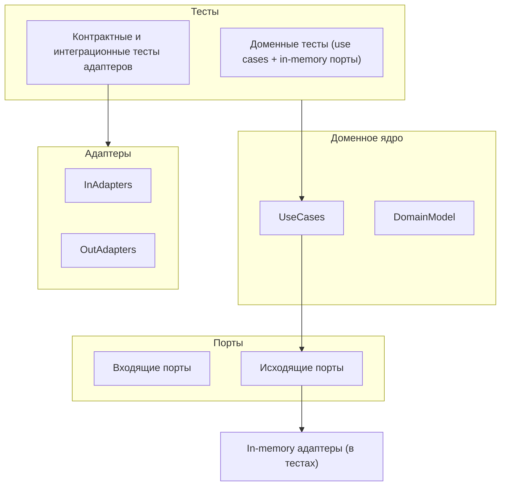

[← Назад к индексу части 6](index.md)

## 6.4. Тестирование, эволюция и связь с DDD и другими стилями

### Цель раздела

Показать, как гексагональная архитектура:

- упрощает **тестирование** домена и адаптеров;
- помогает **эволюционировать** архитектуру (монолит → модульный монолит → сервисы);
- сочетается с **DDD, модульным монолитом и Clean Architecture**;
- где чаще всего ломаются команды, пытаясь внедрить этот стиль.

### В этом разделе главное

- Гексагональная архитектура делает возможными **богатые unit‑ и интеграционные тесты домена** без поднятия инфраструктуры.
- Можно использовать **in‑memory адаптеры** для тестов, реализующие те же порты.
- Этот стиль хорошо сочетается с **DDD** (домен в центре) и может быть внутренней архитектурой модулей/сервисов.
- Эволюция: порты и адаптеры помогают постепенно «отрывать» куски системы от монолита и выносить их в сервисы.
- Типичные проблемы: **избыточная сложность**, «религия портов», отсутствие дисциплины в проведении границ.

### Термины

- **In‑memory адаптер** — тестовая реализация исходящего порта, хранящая данные в памяти (коллекции/словари) вместо реальной БД.
- **Контрактные тесты** — тесты, проверяющие, что реализация адаптера соответствует контракту порта.
- **DDD (Domain‑Driven Design)** — подход, ставящий в центр **доменную модель** и язык предметной области.

### Теория и правила

1. **Тестирование доменного ядра.**

   Благодаря портам и адаптерам:
   - домен не зависит от БД, HTTP, очередей;
   - можно:
     - брать входящий порт (use case);
     - подсовывать ему **in‑memory реализации исходящих портов** (репозитории, внешние сервисы);
     - писать unit‑тесты, запускаемые быстро и предсказуемо.

2. **Тестирование адаптеров.**

   - Исходящие адаптеры тестируются:
     - либо контрактными тестами;
     - либо интеграционными тестами с реальной/тестовой БД или внешним сервисом (часто с test containers).
   - Входящие адаптеры тестируются:
     - веб‑тестами «край‑до‑края» (HTTP → порт → домен);
     - но основная бизнес‑логика всё равно тестируется через доменный порт.

3. **Связь с DDD.**

   - В DDD:
     - домен (агрегаты, value‑объекты, доменные сервисы) — в центре;
     - инфраструктура — на периферии.
   - Гексагональная архитектура:
     - даёт **техническую форму** этой идеи;
     - порты — интерфейсы домена;
     - адаптеры — инфраструктура.

4. **Связь с модульным монолитом и Clean Architecture.**

   - Модульный монолит:
     - даёт **границы между доменами/модулями**;
     - внутри каждого модуля можно использовать Hexagonal Architecture.
   - Clean Architecture / Onion:
     - также ставит домен в центр;
     - гексагональную архитектуру можно считать **одной из практических реализаций** этих идей, особенно на уровне «портов и адаптеров».

5. **Эволюция: от монолита к сервисам.**

   - Если в монолите:
     - домен выделен;
     - есть порты и адаптеры;
   - то миграция к сервисам:
     - часто сводится к **выносу адаптеров «наружу»** и развёртыванию модуля отдельно;
     - порты остаются контрактами;
     - меняется только транспорт между модулями/сервисами.

6. **Где перегибают палку.**

   - Все слои начинают называть «портами» и «адаптерами»:
     - «порт контроллера», «адаптер репозитория» и т.п.;
     - смысл размывается, усложняется общение в команде.
   - Внедряют Hexagon «во что бы то ни стало», даже в простые CRUD‑сервисы, где выигрыша немного.

### Пошагово: как организовать тестирование с портами и адаптерами

1. **Выдели доменные тесты (на уровне входящих портов).**
   - Для каждого ключевого use case:
     - тестируй сценарии и инварианты;
     - используй **in‑memory реализации исходящих портов**:
       - `InMemoryOrderRepository`;
       - `FakePaymentGateway`.

2. **Напиши контрактные тесты для адаптеров.**

   - Для каждого исходящего порта:
     - определи набор тест‑кейсов (контракт);
     - прогоняй их:
       - против in‑memory реализации;
       - против реальной реализации (SQL, REST‑клиент).

3. **Покрой ключевые входящие адаптеры интеграционными тестами.**

   - Для важных HTTP‑endpoint’ов:
     - поднимай минимальное окружение (ин‑memory БД или test containers);
     - проверяй «край‑до‑края»:
       - запрос → адаптер → порт → домен → порты → адаптеры → БД/очередь;
       - ответ и побочные эффекты.

4. **Не забывай про уровень модулей/микросервисов.**

   - При переходе к микросервисам:
     - порты могут стать **границами между сервисами**;
     - контрактные тесты помогают не ломать совместимость.

### Простыми словами

Можно представить тестирование так:

- **Доменные тесты**:
  - как если бы ты тестировал **двигатель автомобиля на стенде**:
    - крутящий момент, обороты, перегрев;
    - неважно, какая шина, какое качество асфальта, какая погода.
  - В роли «асфальта и погоды» — инфраструктура (БД, сеть, браузер).

- **Тесты адаптеров**:
  - проверяют, что:
    - «двигатель правильно подключён к колёсам»;
    - педаль газа даёт нужный эффект;
    - тормозные диски правильно работают.

Гексагональная архитектура делает это проще:

- двигатель (домен) и колёса (инфраструктура) **соединены понятными интерфейсами**;
- можно:
  - тестировать двигатель отдельно;
  - отдельно проверять, что колёса прикручены правильно.

### Картинка в голове



### Как запомнить

> **Тестируй домен через порты, инфраструктуру — через адаптеры.**  
> **Не путай уровни:** бизнес‑правила не должны требовать поднятия БД, а проверка SQL‑запросов не должна зависеть от всего домена.

### Примеры

**Пример 1. Доменный тест с in‑memory репозиторием (псевдокод).**

```text
class InMemoryOrderRepository implements OrderRepository {
  private store = new Map<OrderId, Order>();

  save(order: Order) { this.store.set(order.id, order); }
  findById(id: OrderId) { return this.store.get(id) ?? null; }
}

test("placing order saves it and emits event") {
  const repo = new InMemoryOrderRepository()
  const events = new InMemoryEventPublisher()
  const useCase = new PlaceOrderService(repo, events)

  const cmd = new PlaceOrderCommand(/* ... */)
  const id = useCase.place(cmd)

  assert(repo.findById(id) !== null)
  assert(events.published.includes("OrderPlaced"))
}
```

**Пример 2. Контрактный тест для SQL‑репозитория.**

```text
function repositoryContractTests(makeRepo: () => OrderRepository) {
  test("save and findById roundtrip", async () => {
    const repo = makeRepo()
    const order = anyOrder()
    await repo.save(order)
    const loaded = await repo.findById(order.id)
    assert.deepEqual(loaded, order)
  })
}

// Применяем контракт к разным реализациям
describe("InMemoryOrderRepository", () => {
  repositoryContractTests(() => new InMemoryOrderRepository())
})

describe("SqlOrderRepository", () => {
  repositoryContractTests(() => new SqlOrderRepository(makeTestDbClient()))
})
```

### Практика / реальные сценарии

- **Выделение ядра в legacy‑монолите.**
  - Шаги:
    - найти доменные зоны, переполненные инфраструктурой;
    - выделить порты и адаптеры;
    - написать доменные тесты с in‑memory адаптерами;
    - постепенно «отрывать» домен от фреймворка.

- **Переезд на другой фреймворк/БД.**
  - Если порты/адаптеры уже есть:
    - ядро не трогаем;
    - меняем только адаптеры и инфраструктуру;
    - используем контрактные тесты, чтобы убедиться в корректности.

- **Переход к микросервисам.**
  - Уже выделенные порты:
    - становятся границами между сервисами;
    - адаптеры меняются на сетевые (HTTP/gRPC/события);
    - контрактные тесты помогают сохранить совместимость.

### Типичные ошибки

- **Отсутствие тестов на домен.**
  - Вся тестовая стратегия строится вокруг:
    - end‑to‑end тестов через HTTP и реальную БД;
    - unit‑тестов отдельных классов без связи с use cases.
  - При этом:
    - доменные инварианты проверяются только «в проде»;
    - изменения страшно вносить.

- **Перегрев тестовой инфраструктуры.**
  - Слишком много слоёв:
    - мокают адаптеры, порты, инфраструктуру одновременно;
    - трудно понять, что именно тест проверяет.

- **Расщепление порта по тестам.**
  - В проде — один порт, в тестах — другая его версия;
  - нарушается реальное соответствие контракту.

### Что будет, если…

- **Если не использовать порты/адаптеры для тестов.**
  - Тесты:
    - становятся медленными и хрупкими (всегда поднимаем БД и прочее);
    - плохо масштабируются;
    - часто ломаются от несущественных изменений.

- **Если относиться к Hexagonal Architecture как к «религии».**
  - Команда:
    - усложняет код ради «чистоты»;
    - тратит время на абстракции без реальной проблемы;
    - выгорает от ощущения «никогда не готово».

### Проверь себя

1. Как порты и адаптеры помогают упростить тестирование доменной логики?  
2. В чём связь гексагональной архитектуры и DDD?  
3. Как порты и адаптеры помогают эволюционировать систему от монолита к микросервисам?

<details><summary>Ответ</summary>

1. Доменная логика зависит только от портов, поэтому для тестов можно **подставлять in‑memory реализации исходящих портов** и вызывать входящие порты напрямую, без поднятия БД/HTTP/очередей. Это делает доменные тесты быстрыми и устойчивыми.  
2. DDD ставит в центр **домен и язык предметной области**, а инфраструктуру считает вторичной; гексагональная архитектура даёт **структуру (порты и адаптеры)**, которая технически реализует эту идею: домен в центре, инфраструктура на периферии.  
3. При наличии портов и адаптеров модули монолита уже имеют **явные границы и контракты**; вынесение модуля в отдельный сервис сводится к тому, что «внутренний» вызов порта становится **межсервисным вызовом**, а адаптеры перенастраиваются на сетевое взаимодействие, без изменения доменной логики.

</details>

### Запомните

- Гексагональная архитектура — это не только про структуру, но и про **тестируемость и эволюцию**.
- Хорошо спроектированные порты и адаптеры:
  - позволяют тестировать домен изолированно;
  - упрощают смену инфраструктуры;
  - облегчают путь от монолита к микросервисам.
- Используйте Hexagonal Architecture как **инструмент под конкретные цели**, а не как догму.

---
