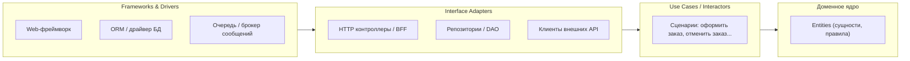

[← Назад к индексу части 7](index.md)

## 7.1. Интуиция Clean / Onion

### Цель раздела

Дать тебе **интуитивную картинку**, зачем нужны Clean Architecture и Onion Architecture,  
показать, какую реальную боль они решают,  
и чем **«домен в центре и зависимости внутрь»** отличается от «просто трёх слоёв» или «гексагональной архитектуры».

### В этом разделе главное

- Clean/Onion — это **не про модные круги на картинке**, а про то, чтобы **доменная логика жила отдельно от фреймворков и инфраструктуры**.
- Ключевая идея: **все зависимости направлены внутрь**, к домену; домен ничего не знает о веб‑фреймворках, БД, очередях.
- Clean/Onion сильно пересекаются с **гексагональной архитектурой**: разница в акцентах и терминологии, а не в сути.
- Эти стили **имеют смысл там, где домен сложный и живёт долго**; для простых CRUD‑сервисов они могут быть избыточны.
- Самая частая ошибка — **копировать диаграммы**, не понимая, **какую боль они лечат** (сильная связка домена с фреймворками).

### Термины

- **Домен** — предметная область, логика бизнеса: правила, инварианты, ограничения.
- **Доменное ядро** — код, в котором живут сущности и бизнес‑правила, максимально независимый от технологий.
- **Инфраструктура** — техническая среда: фреймворки, БД, очереди, внешние API, сеть.
- **Зависимость внутрь** — когда внешний слой знает о внутреннем (импортирует его), но не наоборот.

### Теория и правила

1. **Боль, из которой выросли Clean/Onion.**  
   Исторически многие проекты начинались так:
   - вся логика в контроллерах фреймворка;
   - доменные правила жёстко привязаны к ORM‑моделям;
   - бизнес‑логика «пропитана» деталями HTTP и БД.  
   Последствия:
   - сложно тестировать домен **без поднятия всей инфраструктуры**;
   - миграция с одного фреймворка/ORM на другой превращается в ад;
   - сложно переиспользовать доменную логику в других интерфейсах (CLI, batch, очереди).

2. **Идея «домен в центре».**  
   Clean/Onion предлагают:
   - вынести **доменную модель** (сущности, правила, инварианты) в центр;
   - вокруг разместить слои, которые **обслуживают домен**:
     - сценарии (use cases) — orchestrators;
     - адаптеры — преобразуют данные и протоколы;
     - фреймворки/драйверы — чисто технический слой.

3. **Правило зависимостей внутрь.**  
   Формально:
   - любой код может зависеть только от кода, который находится **ближе к центру**;
   - домен **не зависит ни от чего внешнего**;
   - use cases зависят от домена, но не от веб‑фреймворка;
   - адаптеры зависят от use cases и домена, но не наоборот.

4. **Связь с гексагональной архитектурой.**  
   - В гексагональной архитектуре говорим о **портах и адаптерах** вокруг ядра.
   - В Clean/Onion — о **слоях** вокруг домена (entities → use cases → adapters → frameworks).
   - Суть одна:
     - домен — центр;
     - внешний мир подключается через адаптеры/порты;
     - направления зависимостей контролируются.

5. **Где Clean/Onion особенно полезны.**
   - Сложный домен (финансы, логистика, медицина, биллинг);
   - долгоживущие продукты;
   - несколько интерфейсов доступа (web, mobile, batch, интеграции);
   - команды, которые хотят **тестировать домен изолированно**.

6. **Где Clean/Onion могут быть избыточны.**
   - Небольшие CRUD‑сервисы с простой логикой;
   - прототипы и одноразовые решения;
   - системы, где технология важнее домена (например, чистый прокси к внешнему API).

### Простыми словами

Представь интернет‑магазин.

- **Бизнесу** важны правила:
  - нельзя продавать товар, которого нет на складе;
  - скидка не может быть больше 50%;
  - заказ нельзя отменить после отправки.
- Эти правила **не зависят** от того, пишешь ли ты на Java или Node.js, используешь ли PostgreSQL или MongoDB, отдаёшь ли интерфейс через REST или GraphQL.

Clean/Onion говорят:

- давай напишем эти правила **одним языком в одном месте** (домен, сущности, use cases),
- а всё, что касается «как мы общаемся с внешним миром» (HTTP, БД, очереди), — вынесем в **адаптеры и инфраструктуру вокруг**.

Тогда:

- если завтра ты внедришь ещё один интерфейс (например, CLI для админов или обработку событий из очереди),
- ты будешь **переиспользовать тот же домен и use cases**, а не дублировать логику.

### Картинка в голове

Полезная метафора — **луковица**:

- в центре — **домен** (сущности, правила);
- вокруг — **use cases**, которые знают, как правильно использовать домен для конкретных действий;
- ещё дальше — **адаптеры**, которые переводят внешние запросы в язык use cases;
- снаружи — **фреймворки и драйверы**, которые вообще не должны лезть внутрь с логикой.

Стрелки показывают **направление зависимостей**: всё «снаружи» зависит от того, что «внутри», но не наоборот.

### Как запомнить

Короткая формула:

> **Clean/Onion = домен в центре + зависимости внутрь + инфраструктура снаружи.**

Если в твоём проекте:

- домен зависит от фреймворка;
- сущности завязаны на ORM‑аннотации;
- бизнес‑логика живёт в контроллерах —

это **не Clean/Onion**, даже если диаграммы похожи.

### Примеры

Рассмотрим упрощённый сценарий «оформление заказа».

**Плохой (распространённый) вариант:**

- В контроллере:
  - читаем тело запроса;
  - лезем в ORM‑модели;
  - проверяем бизнес‑правила;
  - пишем в БД;
  - отправляем событие во внешнюю систему.
- Весь код зависит от веб‑фреймворка и ORM.

**Вариант в духе Clean/Onion:**

- Контроллер:
  - парсит HTTP‑запрос;
  - вызывает **use case `PlaceOrder`** с **DTO**.
- Use case:
  - обращается к доменным сущностям (например, `Order`, `Cart`, `Customer`);
  - проверяет бизнес‑правила;
  - через **интерфейсы репозиториев** сохраняет изменения;
  - публикует доменные события (через интерфейс `DomainEventPublisher`).
- Адаптеры:
  - реализуют репозитории через ORM;
  - реализуют publisher через конкретный брокер сообщений.

### Практика / реальные сценарии

- **Переезд с одного фреймворка на другой.**  
  Если домен и use cases не зависят от фреймворка, ты меняешь только слой адаптеров и фреймворков.

- **Добавление нового интерфейса.**  
  Например, у тебя уже есть REST API для веба, и ты добавляешь обработчик событий от партнёра.  
  В Clean/Onion:
  - новый адаптер принимает событие;
  - вызывает уже существующий use case;
  - домен и бизнес‑правила остаются прежними.

- **Модульный монолит.**  
  Внутри монолита:
  - у тебя много модулей (каталог, заказы, платежи);
  - в каждом модуле — свой небольшой Clean/Onion вокруг домена.

### Типичные ошибки

- **Использовать Clean/Onion везде, не задавшись вопросом «зачем».**
- **Сделать много слоёв, но не вынести домен**: все сущности завязаны на ORM, DTO и фреймворки.
- **Перегрузить архитектуру абстракциями** там, где достаточно простой слоистой архитектуры.
- **Игнорировать тестируемость**: теоретически всё разделили, но тесты всё равно поднимают базу и веб‑сервер.

### Что будет, если…

- **Если не отделять домен от фреймворка.**  
  Тогда:
  - любое изменение фреймворка/ORM будет ломать домен;
  - тесты будут медленными и хрупкими;
  - переиспользовать домен в других контекстах будет тяжело.

- **Если сделать домен «чистым», но не продумать адаптеры.**  
  Тогда:
  - появится огромное количество «тонких слоёв», сложно ориентироваться;
  - команда может «сдаться» и начать нарушать правила;
  - архитектура превратится в «бюрократию слоёв».

### Проверь себя

1. В чём ключевая боль, которую решают Clean Architecture и Onion Architecture?

Ответ

Они решают проблему **жёсткой связки доменной логики с фреймворками и инфраструктурой**.  
Идея в том, чтобы домен можно было развивать, тестировать и переиспользовать **независимо от конкретных технологий**, а технологии подключались через адаптеры снаружи.

2. Что означает правило «зависимости направлены внутрь»?

Ответ

Это значит, что **любой внешний слой (контроллеры, адаптеры, фреймворки)** может зависеть от более внутреннего (use cases, домен),  
но внутренний слой **никогда не зависит от внешнего**.  
Домен ничего не знает о веб‑фреймворке, ORM и конкретных драйверах — только о своих интерфейсах и моделях.

3. В каких случаях Clean/Onion, скорее всего, будет избыточной сложностью?

Ответ

В простых CRUD‑сервисах без сложной бизнес‑логики, в прототипах и одноразовых утилитах,  
а также в системах, где основная ценность — в интеграции с конкретным внешним API или платформой,  
а не в богатом домене. Там можно ограничиться простой слоистой архитектурой или даже «тонким» сервисом.

### Запомните

- Clean/Onion — это **про домен в центре и зависимости внутрь**, а не про красивую диаграмму.
- Эти стили особенно полезны **в сложных и долгоживущих доменах**, где важно отделить бизнес‑логику от инфраструктуры.
- Прежде чем «делать Clean Architecture», задавай вопрос: **какую боль я хочу снять** и **как это измерю**.

---
