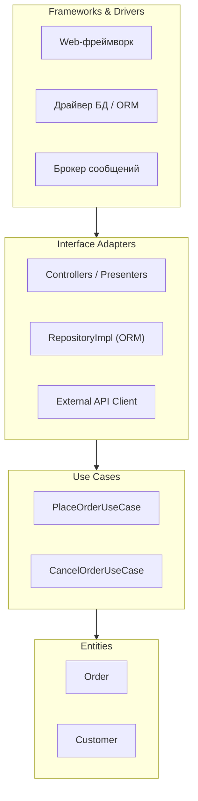

[← Назад к индексу части 7](index.md)

## 7.2. Слои Clean Architecture и Onion

### Цель раздела

Подробно разобрать, **какие слои есть в Clean Architecture и Onion**,  
какая у каждого ответственность,  
как через них **проходит запрос** от внешнего мира внутрь и обратно,  
и как это выглядит на диаграммах.

### В этом разделе главное

- В Clean Architecture обычно выделяют слои: **Entities → Use Cases → Interface Adapters → Frameworks & Drivers**.
- В Onion Architecture слой домена также в центре, но акцент смещён на «луковичные» кольца вокруг (домен → приложение → инфраструктура).
- Запрос всегда проходит **от внешнего мира внутрь**, но **зависимости по коду направлены внутрь**.
- Между слоями часто используются **DTO и интерфейсы**, чтобы не протаскивать внутрь детали протоколов и БД.
- Важно не переусердствовать с количеством слоёв и «тонких абстракций» — слои должны отражать **настоящие границы ответственности**.

### Термины

- **Entities** — доменные сущности, инварианты, бизнес‑правила.
- **Use Cases / Interactors** — сценарии, описывающие, **как система используется** пользователем/другими системами.
- **Interface Adapters** — адаптеры интерфейсов: контроллеры, presenters, gateways, репозитории.
- **Frameworks & Drivers** — веб‑фреймворки, ORM, драйверы БД, брокеры сообщений, UI‑фреймворки.
- **Application Layer (Onion)** — слой прикладных сервисов/сценариев вокруг домена.
- **Infrastructure Layer (Onion)** — слой инфраструктуры и внешних интеграций.

### Теория и правила

1. **Слои Clean Architecture (по Роберту Мартину).**

   ```text
   Frameworks & Drivers
   ↑
   Interface Adapters
   ↑
   Use Cases
   ↑
   Entities
   ```

   - **Entities** — самые стабильные, долгоживущие правила бизнеса.
   - **Use Cases** — логика приложений: координация сущностей под конкретные сценарии.
   - **Interface Adapters** — переводят данные из форм внешнего мира (HTTP‑запросы, БД‑записи) в структуры, удобные для use cases и сущностей.
   - **Frameworks & Drivers** — технологический слой, который должен быть максимально тонким и изолированным.

2. **Слои Onion Architecture (по Джеффри Палермо).**

   ```text
   Инфраструктура (внешние системы, фреймворки)
   ↑
   Приложение (сервисы, use cases)
   ↑
   Домен (сущности, доменные сервисы)
   ```

   - В центре — **домен**.
   - Следующий слой — **приложение**, которое использует домен для реализации сценариев.
   - Самый внешний слой — **инфраструктура** (БД, очереди, UI и т.п.).
   - Правило такое же: зависимости **только внутрь**.

3. **Поток запроса через слои.**

   На примере REST‑запроса «создать заказ»:

   - HTTP‑запрос попадает в **контроллер** (Interface Adapter).
   - Контроллер валидирует вход, создаёт **DTO** и вызывает **use case** (`PlaceOrderUseCase`).
   - Use case:
     - загружает доменные сущности через **репозитории** (интерфейсы);
     - вызывает методы сущностей, применяя бизнес‑правила;
     - сохраняет изменения через те же интерфейсы;
     - публикует доменные события через интерфейс `DomainEventPublisher`.
   - Адаптеры реализуют репозитории и publisher через конкретные технологии:
     - ORM / SQL;
     - брокер сообщений;
     - REST‑клиенты к сторонним сервисам.

4. **Интерфейсы и инверсия зависимостей.**

   - Интерфейсы для репозиториев и шлюзов определяются **во внутренних слоях** (use cases или домен).
   - Внешние слои (адаптеры) реализуют эти интерфейсы.
   - Благодаря этому:
     - домен не знает о конкретной БД;
     - use cases можно тестировать с in‑memory реализациями.

5. **Связь с фронтендом и BFF.**

   - На бекенде:
     - BFF часто живёт в слое **Interface Adapters** (часть, ближе к внешнему миру);
     - BFF адаптирует API бекенда под потребности фронтенда, сохраняя домен и use cases общими.
   - На фронтенде:
     - похожие принципы можно применить к разделению **компонентов, состояния и доступа к данным** (часть 25–26).

6. **Сравнение: слоистая, гексагональная и Clean/Onion.**

   Полезно увидеть, как эти архитектуры соотносятся между собой:

   | Подход | На что смотрим | Правило зависимостей | Визуальный образ |
   |--------|----------------|----------------------|------------------|
   | **Слоистая (N‑tier)** | Горизонтальные слои (UI → бизнес → данные) | Зависимости обычно «вниз по слоям» (UI → бизнес → данные) | «Торт» из слоёв |
   | **Гексагональная** | Ядро + порты и адаптеры | Ядро не зависит от адаптеров; зависимостям разрешено «оборачиваться» через порты | Шестигранник с адаптерами по краям |
   | **Clean/Onion** | Концентрические слои вокруг домена (entities → use cases → adapters → frameworks) | Все зависимости направлены **внутрь**, к домену; внутренние слои не знают о внешних | Луковица/мишень: центр и кольца |

   - Слоистая архитектура даёт **первую дисциплину разбиения по ответственности**, но часто не фиксирует, кто от кого зависит в деталях.
   - Гексагональная подчёркивает **порты и адаптеры** как границы между ядром и внешним миром.
   - Clean/Onion добавляет **явные внутренние слои и строгое правило «все зависимости внутрь»**, что особенно полезно при сложном домене и долгой жизни системы.

### Простыми словами

Подумай о ресторане:

- **Домен** — это рецепты и правила: как готовить блюда, какие продукты совместимы, что можно подавать вместе.
- **Use cases** — это команды на кухню: «приготовить заказ столика №5», «отменить десерт».
- **Адаптеры** — это официанты и касса:
  - они принимают заказы от гостей;
  - переводят пожелания в формат, понятный кухне;
  - доставляют готовое блюдо обратно.
- **Фреймворки и драйверы** — это здание, плита, холодильники, посуда.

Главная идея:

- рецепты (домен) **не должны зависеть** от конкретной плиты или формы тарелки;
- если завтра кухня переедет в другое помещение, рецепты останутся прежними.

### Картинка в голове



Если ты вместо слов поставишь конкретные классы/модули своего проекта — это и будет твоя Clean/Onion‑диаграмма.

### Как запомнить

Простая мантра:

> **Снаружи — детали, внутри — правила.  
> Детали зависят от правил, а не наоборот.**

Если видишь, что бизнес‑правила зависят от HTTP‑объектов, ORM‑аннотаций и конфигураций фреймворка —  
значит, слои перепутаны.

### Примеры

**Условный код на псевдо‑Java/TypeScript‑подобном языке.**

Entities:

```python
class Order:
    def __init__(self, customer_id: str, items: list):
        if not items:
            raise ValueError("Заказ не может быть пустым")
        self.customer_id = customer_id
        self.items = items
        self.status = "NEW"

    def confirm(self):
        if self.status != "NEW":
            raise ValueError("Подтвердить можно только новый заказ")
        self.status = "CONFIRMED"
```

Use Case:

```python
class OrderRepository(Protocol):
    def save(self, order: Order) -> None: ...

class PlaceOrderUseCase:
    def __init__(self, order_repo: OrderRepository):
        self._order_repo = order_repo

    def execute(self, customer_id: str, items: list) -> Order:
        order = Order(customer_id, items)
        order.confirm()
        self._order_repo.save(order)
        return order
```

Адаптер репозитория (ORM):

```python
class SqlAlchemyOrderRepository(OrderRepository):
    def __init__(self, session_factory):
        self._session_factory = session_factory

    def save(self, order: Order) -> None:
        session = self._session_factory()
        # маппинг доменной сущности в ORM‑модель опущен для краткости
        session.add(order_to_model(order))
        session.commit()
```

Контроллер:

```python
def place_order_http_handler(request, use_case: PlaceOrderUseCase):
    body = request.json()
    order = use_case.execute(
        customer_id=body["customerId"],
        items=body["items"],
    )
    return {
        "id": order.id,
        "status": order.status,
    }
```

Обрати внимание:

- `Order` и `PlaceOrderUseCase` **не знают** ни про HTTP, ни про ORM;
- интерфейс `OrderRepository` определён во внутреннем слое;
- адаптер и контроллер зависят от use case и домена, а не наоборот.

### Практика / реальные сценарии

- **Рефакторинг legacy‑проекта.**  
  Ты можешь постепенно:
  - выносить бизнес‑правила из контроллеров/ORM‑моделей в сущности и use cases;
  - вводить интерфейсы для репозиториев и внешних интеграций;
  - переподключать старый код к новым интерфейсам.

- **Модульный монолит.**  
  Для каждого доменного модуля:
  - централизуешь сущности и доменные сервисы;
  - вокруг — свои use cases;
  - ещё дальше — адаптеры и инфраструктура модуля.

- **Микросервис.**  
  Внутри одного сервиса:
  - такой же набор слоёв, но в меньшем масштабе;
  - Clean/Onion помогают **ограничить связность** внутри сервиса и упростить тесты.

### Типичные ошибки

- **Смешивание слоёв**: доменные сущности знают о БД, use cases — о HTTP, адаптеры — о логике домена больше, чем сами сущности.
- **Неоправданное дублирование DTO**: слишком много уровней преобразований, каждый слой копирует поля, но не даёт дополнительной ценности.
- **Слои ради слоёв**: нет сложного домена, но есть «entities, use cases, repositories, gateways» просто потому, что так на картинке.

### Что будет, если…

- **Если пропустить слой use cases.**  
  Тогда:
  - домену придётся «знать» о сценариях использования;
  - контроллеры будут полниться условной логикой;
  - становится сложнее переиспользовать сценарии в разных интерфейсах.

- **Если смешать домен и адаптеры.**  
  Тогда:
  - домен начнёт зависеть от ORM, HTTP и форматов внешних API;
  - любые изменения в технологиях потребуют правок в доменных классах;
  - тесты станут тяжёлыми и медленными.

### Проверь себя

1. Какие четыре слоя обычно выделяют в Clean Architecture?

<details><summary>Ответ</summary>

Entities (доменные сущности), Use Cases (сценарии/интеракторы),  
Interface Adapters (адаптеры интерфейсов: контроллеры, presenters, репозитории, gateways),  
Frameworks & Drivers (веб‑фреймворки, ORM, драйверы БД, брокеры и другие технические детали).

</details>

2. Какова роль интерфейсов (репозиториев, шлюзов) во внутренних слоях?

<details><summary>Ответ</summary>

Интерфейсы позволяют **инвертировать зависимости**:  
внутренний слой определяет, чего он ждёт от внешнего мира (какой контракт),  
а внешний слой реализует этот контракт через конкретные технологии.  
Это позволяет тестировать внутренний код с подменами и менять инфраструктуру без правок домена.

</details>

3. Чем Onion Architecture концептуально отличается от Clean Architecture?

<details><summary>Ответ</summary>

На концептуальном уровне разница минимальна:  
обе архитектуры ставят **домен в центр** и требуют **зависимостей внутрь**.  
Onion делает акцент на «луковичных слоях» (домен → приложение → инфраструктура),  
Clean более подробно расписывает внутренние слои (entities, use cases, adapters, frameworks).  
Чаще всего их можно рассматривать как варианты одной и той же идеи.

</details>

### Запомните

- В Clean/Onion важны не названия слоёв, а **чёткие ответственности и направление зависимостей**.
- DTO, интерфейсы репозиториев и адаптеры существуют не ради красоты, а чтобы **изолировать домен от деталей реализации**.
- Хорошая диаграмма Clean/Onion легко читается: видно, где домен, где сценарии, где технологии.

---
