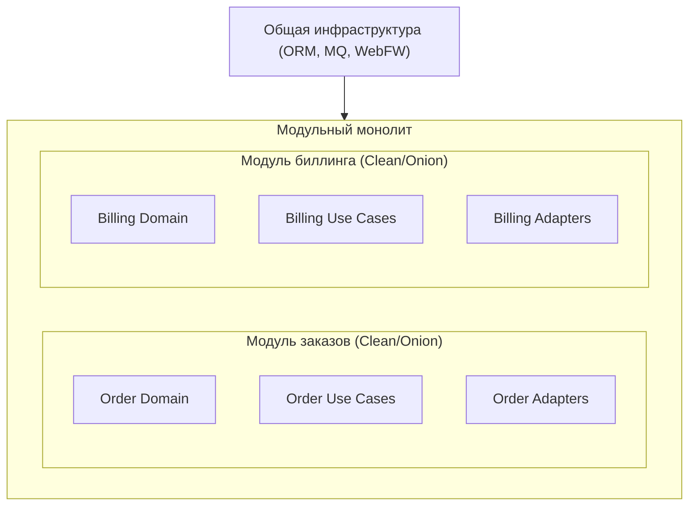

[← Назад к индексу части 7](index.md)

## 7.3. Применение Clean/Onion в монолите и микросервисах

### Цель раздела

Показать, **как практически применять Clean/Onion**:

- в **модульном монолите** (часть 5),
- в **микросервисах** (часть 9),
- как это влияет на **тестируемость, BFF, фронтенд и эволюцию**,
- и какие шаги рефакторинга разумно делать в реальных проектах.

### В этом разделе главное

- Clean/Onion — это не только про микросервисы; **в монолите они особенно полезны**.
- В модульном монолите можно иметь **несколько «луковиц»**, по одной на доменный модуль.
- В микросервисе Clean/Onion помогает **сдерживать внутреннюю сложность** и упрощает тесты.
- Для фронтенда и BFF важно, что **бекенд‑домен стабилен**, а адаптеры могут эволюционировать под нужды клиентов.
- Рефакторинг к Clean/Onion лучше делать **поэтапно**, вокруг конкретных use cases и доменных областей.

### Термины

- **Модульный монолит** — монолитное приложение с явными доменными модулями и ограниченными зависимостями.
- **Микросервис** — независимо развёртываемый сервис с собственными данными.
- **Внутренняя архитектура сервиса** — то, как устроен сам сервис «изнутри» (здесь живёт Clean/Onion).
- **BFF (Backend for Frontend)** — слой адаптации API под конкретные фронтенды.
- **Bounded Context (DDD)** — граница модели домена: внутри неё термины и инварианты согласованы; снаружи — могут отличаться.

### Теория и правила

1. **Clean/Onion внутри модульного монолита.**

   - Каждый доменный модуль (заказы, биллинг, каталог) может иметь:
     - свой домен (entities);
     - свои use cases;
     - свои адаптеры (REST‑контроллеры, репозитории);
   - Общая инфраструктура (ORM, брокер, web‑фреймворк) находится «снаружи» всех модулей, но зависимость всё равно идёт внутрь.

2. **Clean/Onion внутри микросервиса.**

   - Каждый сервис — отдельный bounded context (или под‑область).
   - Внутри него:
     - доменные сущности и use cases;
     - адаптеры входа (REST, gRPC, сообщения);
     - адаптеры выхода (БД, очереди, внешние API).
   - Clean/Onion **не решает вопрос границ сервисов**, но помогает поддерживать порядок внутри.

3. **Связь с фронтендом и BFF.**

   - Когда домен бекенда чистый и отделён от инфраструктуры:
     - BFF может **агрегировать и трансформировать данные**, не ломая бизнес‑правила;
     - разные frontends (web, mobile) могут использовать одни и те же use cases, но с разными адаптерами.

4. **Поэтапный рефакторинг.**

   Типичный маршрут:

   - Выбрать **больной сценарий** (`PlaceOrder`, `ChargePayment`).
   - Вынести его в отдельный use case.
   - Сгруппировать связанную бизнес‑логику в сущности.
   - Определить интерфейсы репозиториев и шлюзов.
   - Переподключить контроллеры и старые сервисы к новому use case.

5. **Связь с DDD (Domain‑Driven Design).**

   - В DDD мы работаем с **агрегатами, доменными сервисами и bounded context‑ами**.
   - Clean/Onion:
     - помогают разместить агрегаты и доменные сервисы **в центре (entities/доменный слой)**;
     - дают **явный слой сценариев** (use cases/application services), который использует доменную модель;
     - позволяют отделить **контракт bounded context‑а** (интерфейсы, события) от конкретных технологий.
   - Хорошая практика:
     - сначала очертить bounded context и ключевые агрегаты;
     - затем вокруг них построить clean/onion‑слои;
     - и только после этого думать о разнесении по сервисам (если нужно).

### Простыми словами

Подумай о модульном монолите как о **большом торговом центре**:

- каждый модуль — это магазин (каталог, заказы, платежи);
- в каждом магазине:
  - собственные правила (домен),
  - свои сценарии (use cases),
  - своя касса и продавцы (адаптеры).

Clean/Onion помогает:

- чтобы **в каждом магазине порядок был наведён один раз**;
- а инфраструктура (здание, электричество, охрана) обслуживала **все магазины снаружи**.

В микросервисах — то же самое, только каждый магазин находится **в отдельном здании**.

### Картинка в голове

Стрелка показывает, что инфраструктура **подключена снаружи**, а модули внутри сохраняют домен‑центричную структуру.

### Как запомнить

Фраза:

> **Clean/Onion — это внутреннее устройство сервиса/модуля.  
> Монолит или микросервисы — это то, как эти модули/сервисы разнесены снаружи.**

Одно не заменяет другое:  
можно иметь монолит с чистой внутренней архитектурой,  
и можно иметь зоопарк микросервисов с хаосом внутри каждого.

### Примеры

**Сценарий: монолит с толстым слоем сервисов и контроллеров.**

- Что есть:
  - «service layer» с длинными методами;
  - контроллеры дергают сервисы напрямую;
  - ORM‑модели насыщены логикой.
- Шаги рефакторинга:
  - выбрать одну важную фичу;
  - выделить её доменную сущность и use case;
  - ввести интерфейсы репозиториев;
  - вынести логику из ORM‑моделей в сущности.

**Сценарий: микросервис с логикой в контроллерах.**

- Что есть:
  - REST‑контроллеры с кучей if/else;
  - сервисы — thin wrapper над репозиториями;
  - тесты — только интеграционные через HTTP.
- Шаги:
  - выделить use cases;
  - перенести бизнес‑правила в сущности/доменные сервисы;
  - для каждого контроллера определить, какой use case он вызывает;
  - добавить unit‑тесты для домена и use cases.

### Практика / реальные сценарии

- **Добавление нового интеграционного канала.**  
  Например, к существующему REST‑API добавляется обработка сообщений из очереди.
  - Без Clean/Onion:
    - бизнес‑логика сидит в контроллерах — приходится дублировать её в consumer‑ах очереди.
  - С Clean/Onion:
    - новый consumer просто вызывает те же use cases, что и контроллеры.

- **Тестирование домена без поднятия окружения.**
  - Чистые сущности и use cases легко тестируются в памяти.
  - Интеграционные тесты остаются для adapter‑слоя и инфраструктуры.

### Типичные ошибки

- **Пытаться «переписать весь проект на Clean Architecture» за один раз.**
- **Не согласовать подход внутри команды**: один модуль следует Clean/Onion, другие — нет.
- **Игнорировать ограничения**: иногда проще оставить часть простых CRUD‑объектов без глубокого доменного слоя.

### Что будет, если…

- **Если внедрить Clean/Onion только в одном модуле.**  
  - Это нормально: архитектура может эволюционировать постепенно.
  - Важно хорошо описать, **как этот модуль устроен**, и использовать его как пример для других.

- **Если навязать Clean/Onion всем модулям насильно.**  
  - Команда может начать «саботировать» архитектуру;
  - появится много boilerplate‑кода;
  - архитектура станет «бумажной» и перестанет отражать реальность.

### Проверь себя

1. Почему Clean/Onion особенно полезны внутри модульного монолита?

Ответ

Потому что в монолите много логики и мало технических границ деплоя.  
Clean/Onion помогают **создать чёткие внутренние границы** вокруг доменных модулей,  
отделить домен от инфраструктуры и подготовить почву для эволюции (к модульному монолиту, сервисам и т.д.).

2. Как Clean/Onion помогают BFF и фронтенду?

Ответ

Когда бекенд‑домен и use cases отделены от внешнего слоя,  
BFF может строить поверх них свои адаптеры и агрегации,  
не ломая бизнес‑правила и не дублируя логику.  
Фронтенд получает **стабильные сценарии и модели**, а формат и состав данных можно адаптировать в adapter‑слое.

3. Почему рефакторинг к Clean/Onion лучше делать поэтапно, вокруг конкретных use cases?

Ответ

Потому что это снижает риск:  
ты работаешь с одной фичей за раз,  
можешь измерить улучшения (тестируемость, читабельность),  
и не ломать весь проект сразу.  
Это соответствует идее **эволюционной архитектуры**, а не «большого взрыва».

### Запомните

- Clean/Onion — **локальная внутренняя архитектура** модуля/сервиса, хорошо сочетающаяся и с монолитами, и с микросервисами.
- Рефакторинг к этим стилям эффективно делать **по use cases**, а не по слоям «сверху вниз».
- Главное — не воспроизводить диаграммы, а **снять реальные боли**: тестируемость, независимость домена, переиспользование сценариев.

---
