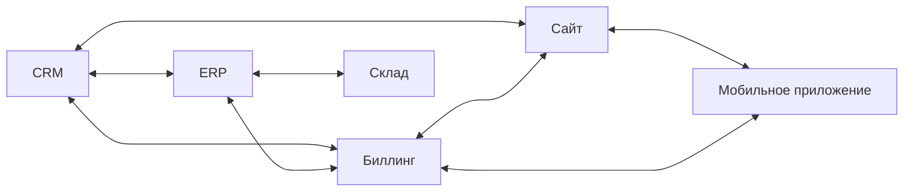
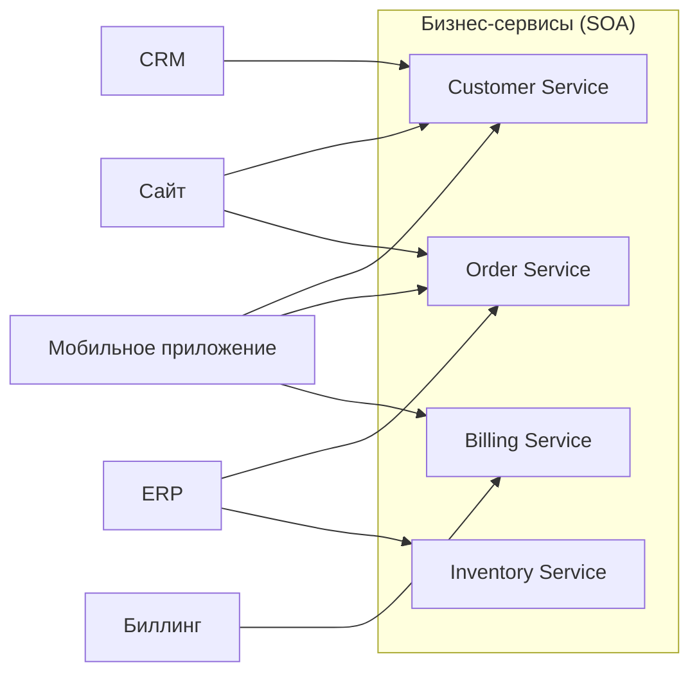

[← Назад к индексу части 8](index.md)

## 8.1. Интуиция SOA: от монолита к набору бизнес‑сервисов

### Цель раздела

Дать тебе **интуитивное понимание**, зачем вообще родилась SOA: какую боль монолитов и точка‑точка интеграций она пыталась решить, что в ней хотели сделать лучше, и почему слово «сервис» в SOA — это не просто «любой HTTP‑endpoint», а **бизнес‑значимая единица**.

### В этом разделе главное

- SOA исторически появилась как **ответ на хаос интеграций** между десятками систем внутри крупных компаний.
- В центре идеи — **бизнес‑сервисы с контрактами**, которые можно переиспользовать в разных бизнес‑процессах.
- «Много REST‑сервисов» само по себе **ещё не SOA**: важны контракты, coarse‑grained операции и управляемый слой интеграции.
- SOA — это шаг от «просто монолита» к **архитектуре на уровне предприятия** (enterprise architecture).
- Многие идеи SOA (контракты, каталоги сервисов, переиспользование, события) живут и сегодня — в микросервисах, BFF, интеграционных платформах.

### Термины

- **Enterprise application landscape** — пейзаж приложений в крупной организации: CRM, ERP, биллинг, склад, сайт, мобильное приложение и т.д.
- **Point‑to‑point интеграция** — когда каждая пара систем связывается напрямую, без общего слоя (множество отдельных коннекторов).
- **Бизнес‑сервис** — сервис, отражающий **цельную бизнес‑функцию** (например, «Сервис заказов», «Сервис клиентов», «Сервис биллинга»).
- **Reuse (переиспользование)** — возможность использовать один и тот же сервис в разных процессах и приложениях.

### Теория и правила

1. **Исходная боль: зоопарк систем и точка‑точка интеграции.**  
   В крупной компании обычно есть:
   - CRM (клиенты),
   - ERP (склад, закупки),
   - биллинг,
   - сайт,
   - мобильное приложение,
   - система лояльности,
   - куча legacy‑штук.

   Без общей архитектуры:
   - каждый проект делает **свою интеграцию** с нужными системами;
   - появляются десятки и сотни **точка‑точка соединений**;
   - любое изменение в одной системе требует **править множество интеграций**.

2. **Идея сервисов: выделить общие бизнес‑функции.**  
   SOA предлагает:
   - выделить **бизнес‑сервисы**, например:
     - `CustomerService`,
     - `OrderService`,
     - `BillingService`,
     - `InventoryService`;
   - описать **контракты** этих сервисов;
   - заставить все приложения и процессы **использовать эти сервисы**, а не ходить напрямую в чужие БД.

3. **Coarse‑grained против fine‑grained.**  
   Классический SOA‑сервис:
   - не «ещё один CRUD»;
   - а **крупная операция**, вроде:
     - `CreateOrderWithItemsAndPayment`,
     - `RegisterCustomerWithContacts`,
     - `IssueInvoiceAndSchedulePayment`.

   Идея: **минимум чатов** между системами — одна крупная операция вместо десятка мелких вызовов.

4. **Контракты и каталоги.**  
   Для серьёзного SOA:
   - каждый сервис имеет **формально описанный контракт** (WSDL, схемы, документация);
   - есть **реестр/каталог сервисов**, где можно найти:
     - что сервис делает,
     - где он живёт,
     - какие версии поддерживает,
     - кто его владелец.

5. **Отличие от «написали много REST‑сервисов».**  
   Много REST‑endpoint’ов само по себе:
   - не гарантирует наличия **бизнес‑сервисов**;
   - может означать просто «монолит, разрезанный по таблицам»;
   - часто нет общего каталога, владельцев, версионирования на уровне контрактов.

### Простыми словами

Представь большую компанию как **город**:

- у тебя есть:
  - банковская система,
  - склад,
  - логистика,
  - сайт,
  - мобильные приложения,
  - внешние партнёры.

Без SOA:

- каждый новый проект (новый сайт, мобилка, интеграция с партнёром) **прокладывает свою трубу**:
  - напрямую в БД,
  - напрямую в API CRM,
  - напрямую в FTP партнёра и т.п.
- через пару лет карта труб выглядит как **мешок спагетти**.

SOA говорит:

- давайте вместо десятков случайных труб:
  - построим **несколько больших магистралей** — бизнес‑сервисов;
  - опишем, **что именно каждый сервис делает**;
  - заставим другие системы **подключаться к ним**, а не куда попало.

### Картинка в голове

Сначала — хаос точка‑точка:

Каждая линия — отдельная интеграция: свой протокол, свой формат, свои костыли.

Теперь — та же картина с SOA‑сервисами:

Здесь:

- каждый клиент (сайт, мобилка, сторонняя система) **общается с сервисами**, а не напрямую с чужими БД;
- сервисы становятся **центральными точками правды** по своим доменам.

### Как запомнить

Формула:

> **SOA = бизнес‑сервисы + контракты + управляемая интеграция.**  
> Это не «просто много API», а **осознанная модель бизнес‑функций**.

Если видишь:

- десятки случайных REST‑endpoint’ов без единого каталога,
- сервисы на уровне таблиц (`CustomerTableService`, `InvoiceRowService`),

— это **ещё не SOA**, как её задумывали.

### Пошагово: как решить, что делать в ESB, а что — в сервисах

1. **Опиши сценарий интеграции.**  
   - Какие системы участвуют?  
   - Какие данные и операции нужны?  
   - Есть ли шаги, завязанные на конкретный домен (кредиты, заказы, тарифы)?
2. **Отдели доменную логику от «клея».**  
   - Всё, что про бизнес‑правила и инварианты, — кандидат **внутрь сервисов**.  
   - Всё, что про форматы, протоколы, маршруты, ретраи, логирование, — кандидат **в ESB/интеграционный слой**.
3. **Реши, нужен ли централизованный workflow.**  
   - Если процесс должен **меняться часто** и жёстко привязан к бизнесу — лучше держать его в коде доменных сервисов (или специализированном workflow‑engine рядом).  
   - Если это **технический процесс интеграции** (конвертация, фэн‑аут по нескольким сервисам) — он может жить в ESB.
4. **Сформулируй контракты сервисов.**  
   - Определи, какие операции экспортирует каждый сервис;  
   - избегай операций «пополам» между ESB и сервисом, где часть бизнес‑правил в одном месте, часть — в другом.
5. **Выбери инструменты под задачу.**  
   - Нужны ли тяжёлые ESB‑платформы (Mule, IBM Integration Bus) или достаточно:  
     - брокера (Kafka/RabbitMQ),  
     - лёгких integration‑flows,  
     - API Gateway + BFF?
6. **Проверь решение на антипаттерны.**  
   - Не превращается ли ESB в «бог‑сервис»?  
   - Есть ли у сервисов своя доменная логика, а не только SQL‑обёртки?  
   - Понимает ли команда, где теперь менять бизнес‑правила?

#### Проверь себя по шагам ESB vs сервисы

1. Почему важно сначала явно выписать сценарий интеграции (участников, данные, операции), а уже потом решать, что вынести в ESB?  
2. Приведи пример части процесса, которая должна остаться в сервисах, а не в ESB, и объясни почему.  
3. Какие признаки подскажут тебе, что выбранный дизайн начал превращаться в ESB‑монолит?

Ответ

1. Без явного сценария легко «залить всё в шину»: ESB начнёт делать и технический клей, и доменную работу. Когда понятны участники и шаги процесса, проще отделить **форматы/маршруты** (ESB) от **правил и инвариантов** (сервисы).  
2. Например, правила одобрения кредита или проверки возможности отмены заказа: они зависят от доменной модели, статусов, политики бизнеса и должны жить **внутри доменных сервисов**, чтобы их можно было тестировать и развивать независимо от интеграционного слоя. В ESB этим правилам будет тесно и их сложно будет сопровождать.  
3. Сигналы: в ESB появляется много `if/else`, сложных workflow, бизнес‑валидаций; сервисы вокруг становятся «тонкими»; любое изменение процесса требует правок в шине; тесты для ESB тяжёлые и хрупкие; команда начинает бояться изменять сценарии, потому что «там всё завязано».  

### Примеры

**Пример 1. Без SOA: мобильное приложение напрямую в БД.**

- Мобильное приложение хочет показывать заказы клиента:
  - читает напрямую из БД;
  - тащит специфичные поля;
  - реализует бизнес‑правила у себя.
- Завтра меняется схема БД:
  - нужно править и сайт, и мобилку, и партнёров.

**Пример 2. С SOA: `OrderService` как единая точка.**

- Появляется `OrderService`:
  - `GetOrdersForCustomer(customerId)`;
  - `CreateOrderWithItems(request)`;
  - `CancelOrder(orderId, reason)`.
- Сайт и мобилка:
  - обращаются к этому сервису;
  - получают **стабильный контракт**;
  - бизнес‑правила живут в одном месте.

### Практика / реальные сценарии

Где исторически и сейчас SOA особенно актуальна:

- **Крупные корпорации**:
  - десятки/сотни систем;
  - сильная регуляторика;
  - долгий жизненный цикл.
- **Интеграция с legacy**:
  - старые mainframe‑системы;
  - проприетарные протоколы;
  - нужны слоя адаптации и переиспользуемые бизнес‑функции.
- **Платформы, предоставляющие сервисы другим системам**:
  - «биллинг как сервис»,
  - «идентификация как сервис».

### Типичные ошибки

- **Путать SOA с «любым набором REST‑сервисов».**  
  В итоге:
  - куча мелких CRUD‑endpoint’ов;
  - никаких контрактов на уровне бизнес‑функций;
  - переиспользования нет, интеграция хаотична.

- **Думать, что SOA автоматически решит все проблемы монолита.**  
  Если просто «разрезать монолит по таблицам на сервисы», получим **распределённый монолит**, а не здоровую SOA.

### Что будет, если…

- **Если не выделять бизнес‑сервисы и контракты.**  
  - Система останется «монолитом по смыслу», даже если формально разнесена на несколько приложений.
  - Интеграция будет хрупкой и дорогой.

- **Если воспринимать SOA как устаревшую «моду нулевых» и игнорировать идеи.**  
  - Легко повторить те же ошибки:
    - точка‑точка интеграция,
    - отсутствие контрактов,
    - отсутствие сервиса как переиспользуемой бизнес‑единицы.

### Проверь себя

1. Какую основную боль крупных компаний пыталась решить SOA?  
2. Чем бизнес‑сервис в SOA отличается от «ещё одного CRUD‑сервиса»?  
3. Почему «много REST‑endpoint’ов» не равно SOA?

Ответ

1. Боль хаотичных интеграций между множеством систем: десятки точка‑точка связей, дублирование логики и данных, высокая стоимость изменений. SOA пыталась ввести **единый слой бизнес‑сервисов с контрактами** и управляемую интеграцию.  
2. Бизнес‑сервис предоставляет **крупные, предметно осмысленные операции** (например, «создать заказ с оплатой»), обладает чётким контрактом и владеет частью доменной логики. CRUD‑сервис часто просто оборачивает таблицу без понимания бизнес‑контекста.  
3. SOA — это не просто факт наличия множества API, а наличие **явных бизнес‑сервисов, контрактов, каталога и управляемой интеграционной архитектуры**. REST‑endpoint’ы могут быть хаотично разбросаны и не образовывать осмысленных сервисов.  

### Запомните

- SOA — это **про бизнес‑сервисы и контракты**, а не только про протоколы.
- Истоки SOA — в попытке **навести порядок в интеграциях** между множеством систем.
- Многие идеи SOA живут и сегодня: в микросервисах, BFF, API‑платформах — и их важно понимать, чтобы не повторять старых ошибок.

---
