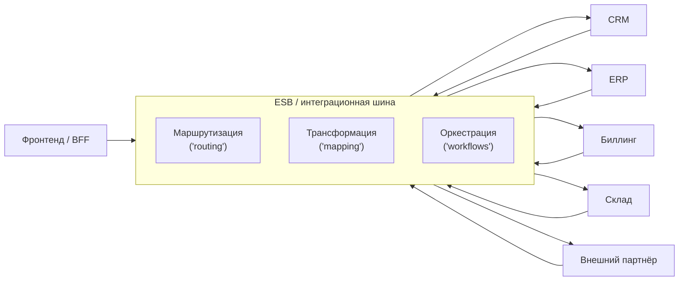

[← Назад к индексу части 8](index.md)

## 8.2. ESB и интеграционная шина

### Цель раздела

Разобраться, **что такое ESB (Enterprise Service Bus)** и интеграционная шина: как она маршрутизирует и трансформирует сообщения между сервисами, зачем ей понадобились оркестрация, трансформации форматов и адаптеры к legacy, и какие риски возникают, когда ESB превращается в «бог‑сервис».

### В этом разделе главное

- ESB — это **центральный слой интеграции** в SOA: он соединяет сервисы и системы, занимаясь маршрутизацией, трансформацией и оркестрацией.
- Шина особенно полезна, когда нужно **интегрировать множество разнородных систем** (форматы, протоколы, версии).
- ESB может взять на себя **технические и частично бизнес‑процессы**, но при перегибе становится **новым монолитом**.
- В современном мире часть задач ESB выполняют:
  - **легковесные message broker’ы**,
  - **API Gateway + BFF**,
  - **integration platforms (iPaaS)**.
- Важно понимать баланс: **что стоит делать в шине, а что — в сервисах**.

### Термины

- **ESB (Enterprise Service Bus)** — программный/инфраструктурный компонент, через который проходят сообщения между сервисами и системами.
- **Маршрутизация** — выбор, куда отправить сообщение (какому сервису) по правилам.
- **Трансформация** — преобразование форматов сообщений (XML↔JSON, DTO↔legacy‑формат).
- **Оркестрация процессов** — управление последовательностью вызовов сервисов (workflow).
- **Адаптер/connector** — модуль шины, который знает, как общаться с конкретной системой (SAP, mainframe, FTP, SOAP и т.д.).

### Теория и правила

1. **Роль ESB в классической SOA.**  
   Вместо того чтобы каждый сервис напрямую знал обо всех остальных:
   - все общаются через **шину**;
   - шина:
     - принимает сообщения от провайдера/клиента;
     - решает, кому их отправить (маршрутизация);
     - при необходимости трансформирует формат;
     - может инициировать **цепочку вызовов** (оркестрация).

2. **Маршрутизация.**  
   Примеры правил:
   - по типу сообщения:
     - `OrderCreated` → `BillingService`, `NotificationService`;
   - по атрибутам:
     - заказы с `region = EU` → один endpoint,
     - с `region = US` → другой;
   - по версии контракта:
     - v1 → старый сервис,
     - v2 → новый.

3. **Трансформация.**  
   ESB умеет:
   - брать сообщение в одном формате (например, `XML`),
   - приводить его к формату сервиса (`JSON`, внутренняя DTO);
   - отбрасывать/добавлять поля;
   - заниматься маппингом кодов статусов и ошибок.

4. **Оркестрация vs хореография.**  
   - **Оркестрация**:
     - ESB управляет процессом:
       - сначала вызови `CustomerService`,
       - потом `OrderService`,
       - потом `BillingService`;
     - шина держит «сценарий» процесса.
   - **Хореография**:
     - сервисы реагируют на события друг друга;
     - шина — «глупая труба», только доставка.

5. **ESB в современном ландшафте.**  
   Сейчас роль ESB частично выполняют:
   - **message broker’ы** (Kafka, RabbitMQ): доставка сообщений;
   - **API Gateway**: фасад HTTP‑API;
   - **BFF**: адаптация API под фронтенд;
   - **iPaaS‑платформы** (Mule, Boomi, Talend): облачные/онпрем интеграционные решения.

### Простыми словами

Подумай о ESB как о **центральном автовокзале**:

- раньше каждый автобус ездил:
  - напрямую к каждому другому городу;
  - со своим расписанием и дорогами.
- с вокзалом:
  - автобусы приезжают на одну площадку;
  - пересадки и маршруты организуются централизованно;
  - есть единые правила расписаний, билетов и т.д.

ESB — такой же **центр маршрутизации и пересадок** для сообщений между системами:

- он знает:
  - кто куда может доехать,
  - как преобразовать «билет» (сообщение) из одного формата в другой,
  - как организовать сложные поездки (процессы).

### Картинка в голове

Все говорят через шину; она решает, **куда** и **в каком формате** переслать.

### Как запомнить

Коротко:

> **ESB = шина, которая знает про всех и всё.**  
> Она может быть очень полезной, но при перегибе становится **новым центром вселенной** (монолитом).

Хорошо:

- когда шина:
  - решает **технические интеграционные задачи** (форматы, протоколы, маршруты);
  - не содержит ключевой бизнес‑логики.

Плохо:

- когда в ESB начинают переносить:
  - **бизнес‑правила**,
  - долгие процессы,
  - принятие решений по домену.

### Примеры

**Пример 1. Трансформация формата между CRM и биллингом.**

- CRM шлёт `CustomerCreated` в формате A (XML);
- ESB:
  - принимает сообщение;
  - преобразует его в формат B (JSON) для биллинга;
  - вызывает `BillingService` с нужной DTO.

**Пример 2. Оркестрация процесса регистрации клиента.**

- Шаги:
  - проверить данные в CRM;
  - создать запись в биллинге;
  - открыть лицевой счёт в банковской системе.
- ESB:
  - запускает workflow;
  - вызывает нужные сервисы по очереди;
  - учитывает ошибки/компенсации.

### Практика / реальные сценарии

Где ESB особенно полезен:

- **Интеграция enterprise‑систем**:
  - SAP, Oracle, mainframe, CRM, биллинг и т.д.;
  - у каждой — свои форматы и протоколы.
- **Плавная миграция legacy**:
  - шина «экранирует» старую систему;
  - новые сервисы говорят с ESB по новому контракту;
  - ESB адаптирует под legacy‑формат.

Где ESB может быть избыточен:

- небольшие системы;
- архитектуры, где основное — HTTP/gRPC между сервисами без тяжёлого legacy;
- когда **легковесные message broker’ы и API Gateway + BFF** закрывают потребности.

### Типичные ошибки

- **ESB‑монолит.**  
  В ESB:
  - помещают бизнес‑процессы и правила;
  - реализуют большую часть логики;
  - сервисы превращаются в «глупые обёртки над БД».  
  В результате:
  - вся сложность живёт в шине;
  - изменения дороги и рискованны.

- **«Всё через ESB, иначе нельзя».**  
  Даже простые случаи:
  - REST‑запрос → простой сервис → ответ
  — прогоняются через сложную шину, увеличивая задержки и стоимость разработки.

### Что будет, если…

- **Если сделать ESB центром всей бизнес‑логики.**  
  - Ты получишь **новый монолит**:
    - с трудными тестами;
    - долгими миграциями;
    - высокой связностью.

- **Если вообще игнорировать интеграционный слой при большом числе систем.**  
  - Вернёшься к **хаосу точка‑точка**;
  - каждый новый проект будет городить свои коннекторы.

### Проверь себя

1. В чём основная роль ESB в SOA?  
2. Чем отличается оркестрация процессов в ESB от хореографии через события?  
3. Почему ESB часто критикуют как источник «нового монолита»?

Ответ

1. Быть **центральным слоем интеграции**: маршрутизировать, трансформировать и, при необходимости, оркестрировать сообщения между сервисами и системами; экранировать различия форматов и протоколов.  
2. При оркестрации **центральный компонент (ESB)** управляет последовательностью вызовов сервисов (workflow), а при хореографии сервисы **реагируют на события друг друга**, а шина — лишь транспорт/топик без центрального «мозга».  
3. Потому что при перегибе в ESB собирают всё больше логики и процессов, в итоге он становится **единой точкой сложности и отказа**, изменение которой больно для всей системы. Это напоминает монолит, только распределённый и сложнее.  

### Запомните

- ESB — мощный инструмент интеграции, но он не обязан быть **местом, где живёт домен**.
- Для современных архитектур часто достаточно:
  - **легковесных брокеров**, 
  - **API Gateway/BFF**,
  - **чётко спроектированных сервисов**,
  — а тяжёлый ESB нужен только там, где реально много разнородного legacy.

---
