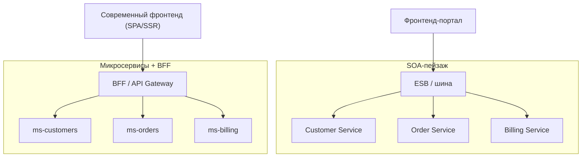
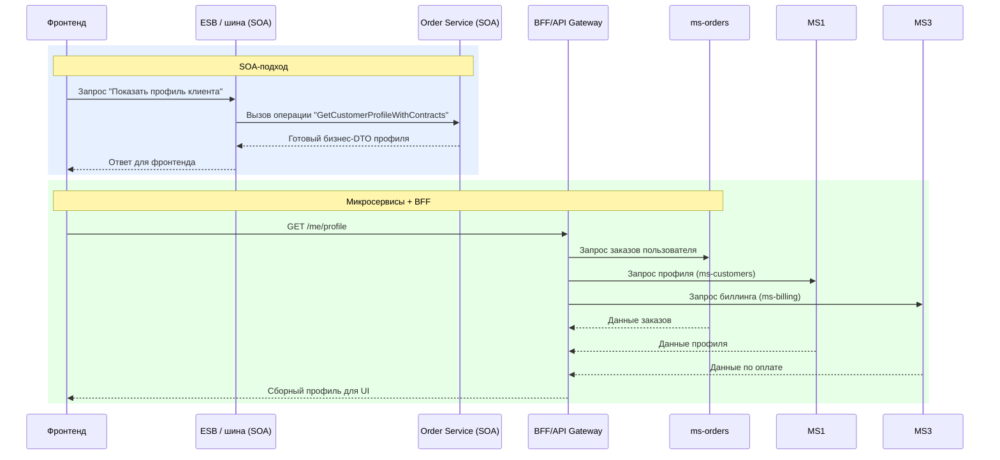

[← Назад к индексу части 8](index.md)

## 8.3. SOA vs микросервисы и влияние на фронтенд/BFF

### Цель раздела

Показать, **чем SOA отличается от микросервисной архитектуры** и как идеи SOA (бизнес‑сервисы, контракты, шины) влияют на дизайн **микросервисов, API Gateway, BFF и фронтенда** в современных системах.

### В этом разделе главное

- Микросервисы **унаследовали часть идей SOA**, но сделали другие архитектурные выборы:
  - «глупая труба, умные концы» вместо тяжёлого ESB;
  - мелкозернистые сервисы под команды/домены;
  - database per service.
- SOA фокусировалась на **enterprise‑уровне** и reuse бизнес‑сервисов; микросервисы — на **автономии команд и независимых деплоях**.
- Фронтенд и BFF чувствуют разницу:
  - в SOA часто есть **единый фасад/портал** или ESB;
  - в микросервисах нужен **API Gateway + BFF**, чтобы спрятать зоопарк сервисов.
- Важно уметь **говорить на языке обеих архитектур**: понимать, что SOA ≠ микросервисы, но они совместимы и дополняют друг друга.

### Термины

- **Microservices** — архитектурный стиль, где система состоит из набора небольших, автономно разворачиваемых сервисов с собственными данными.
- **Smart endpoints, dumb pipes** — принцип микросервисов: логика внутри сервисов, транспорт (HTTP, брокер) — максимально прост.
- **Database per service** — каждый сервис владеет своей БД; другие обращаются через API/события.
- **API Gateway / BFF** — фасад/прослойка над множеством сервисов, адаптирующая API под клиентов.

### Теория и правила

1. **Общее между SOA и микросервисами.**
   - И там, и там:
     - система состоит из **сервисов**;
     - есть **контракты и интерфейсы**;
     - важны **границы ответственности** и **переиспользование**.

2. **Ключевые отличия.**

   | Аспект | Классическая SOA | Микросервисы |
   |--------|------------------|--------------|
   | Фокус | Enterprise‑уровень, интеграция множества систем | Автономия команд, независимые деплои, эволюция продукта |
   | Размер сервиса | Крупные бизнес‑сервисы (coarse‑grained) | Мелкие сервисы вокруг bounded context/поддомена |
   | Интеграция | Часто через ESB, тяжёлая шина | Простые протоколы (HTTP/gRPC, брокеры), «глупая труба» |
   | Данные | Часто общие/разделяемые БД/схемы | database per service, владение данными |
   | Команды | Часто функциональные силосы (CRM, ERP) | Кросс‑функциональные команды по продукту/домену |

3. **От ESB к message broker’ам и API Gateway.**
   - В микросервисном мире:
     - тяжёлый ESB часто заменяют:
       - на **REST/gRPC + message broker**;
       - на **API Gateway + BFF**;
       - на **легковесные integration‑flows**;
     - логика мигрирует **внутрь сервисов**, а не в шину.

4. **Влияние на фронтенд и BFF.**
   - В SOA:
     - фронтенд/портал может говорить:
       - либо с **несколькими крупными бизнес‑сервисами**,
       - либо с ESB, который агрегирует данные;
     - структура API ближе к **бизнес‑операциям**.
   - В микросервисах:
     - фронтенду часто «торчат» десятки мелких сервисов;
     - появляется **BFF**, который:
       - агрегирует данные;
       - скрывает детали сервисов;
       - делает API удобным для UI.

5. **Эволюция: от SOA‑ландшафта к микросервисам.**
   - Многие компании:
     - начинали с SOA и ESB;
     - затем:
       - выделяли мелкие сервисы;
       - упрощали шину;
       - добавляли API Gateway и BFF;
     - сохраняя часть идей:
       - **контракты**, 
       - **каталоги сервисов**, 
       - **события**.

### Пошагово: как эволюировать от SOA/ESB к микросервисам + BFF

1. **Сделай карту текущего ландшафта.**  
   - Какие бизнес‑сервисы и системы есть?  
   - Какие процессы реализованы в ESB, какие — в коде сервисов?
2. **Найди узкие места.**  
   - Где изменения особенно болезненны (долгие релизы, много согласований)?  
   - Какие части ESB чаще всего меняются и падают?
3. **Выдели доменные ядра.**  
   - Для ключевых областей (заказы, биллинг, клиенты) сформулируй **bounded context’ы** и доменные модели.  
   - Спроектируй для них внутреннюю архитектуру по Hexagonal/Clean (части 6–7).
4. **Переноси логику из ESB внутрь сервисов по кусочкам.**  
   - Выбирай один процесс;  
   - переносите проверки и ветвления в код сервисов;  
   - оставляйте ESB/брокеру только доставку и простую маршрутизацию.
5. **Введи API Gateway/BFF для клиентов.**  
   - Спрячь от фронтенда детали миграции;  
   - предоставь **стабильное, бизнес‑ориентированное API**, даже пока внутри идёт перестройка.
6. **Постепенно упрощай ESB.**  
   - Убирай оттуда бизнес‑ветвления;  
   - превращай сложные workflow в явные use cases внутри сервисов;  
   - оставляй только действительно интеграционные задачи.

#### Проверь себя по эволюции от SOA к микросервисам

1. Почему важно начать эволюцию от SOA/ESB к микросервисам с карты текущего ландшафта, а не сразу с «выноса» кода из ESB?  
2. Какие преимущества даёт введение API Gateway/BFF на раннем этапе миграции?  
3. Как понять, какие части логики из ESB переносить в сервисы в первую очередь?

Ответ

1. Без карты легко ломать случайные куски и получать хаос: не видно, какие процессы критичны, где реальные зависимости и как изменения затронут фронт и внешние системы. Карта позволяет определить **горячие точки**, узкие места и спланировать миграцию по шагам, минимизируя риски.  
2. Gateway/BFF даёт **стабильный фасад для клиентов**: фронтенду и внешним системам не нужно знать, где сейчас живёт логика (в ESB или в сервисах). Это позволяет менять внутреннюю структуру и постепенно выносить код из ESB, не ломая потребителей API.  
3. В первую очередь имеет смысл переносить:  
   - процессы, которые чаще всего меняются и вызывают боль при изменениях;  
   - логически цельные участки домена (например, оформление заказа целиком), где можно выделить bounded context и use cases;  
   - зоны, где тесты особенно хрупкие или отсутствуют, а бизнес‑риски высоки. Там выигрыш от переноса в хорошо спроектированные сервисы будет максимальным.  

### Простыми словами

Можно думать так:

- **SOA** — это:
  - про **«горизонт» всей компании**;
  - про то, чтобы отделы и системы **говорили друг с другом через общие сервисы**;
  - часто — через **тяжёлый интеграционный слой (ESB)**.

- **Микросервисы** — это:
  - про **внутреннюю структуру продукта**;
  - про команды, которые сами владеют «кусками» системы;
  - про то, чтобы сервисы были **небольшими, независимыми и быстро разворачиваемыми**.

Фронтенд:

- в обоих случаях видит **набор API**;
- но с точки зрения UX и разработки сильно зависит от того:
  - получает ли он **крупные, бизнес‑ориентированные операции** (SOA‑стиль),
  - или **низкоуровневые операции** (много микросервисов → нужен BFF).

### Картинка в голове

В обоих случаях фронтенд не обязан знать все внутренние детали: в SOA их скрывает ESB/портал, в микросервисах — BFF/API Gateway.

Дополнительно полезно сравнить **жизненный цикл одного запроса** в стиле SOA и в микросервисной архитектуре:

Здесь видно, что:

- в SOA **бизнес‑сервис** уже возвращает агрегированный ответ;
- в микросервисах эту роль обычно берёт на себя **BFF**, собирая данные из нескольких мелких сервисов.

### Как запомнить

Фраза:

> **SOA думает о предприятии и reuse бизнес‑сервисов.  
> Микросервисы думают о командах и независимых сервисах.**

И ещё:

> **SOA часто = тяжёлая шина + крупные сервисы.  
> Микросервисы = лёгкая труба + умные сервисы.**

### Примеры

**Пример 1. Фронтенд в классической SOA.**

- Портал сотрудников:
  - вызывает `CustomerService` для поиска клиента;
  - `OrderService` для списка заказов;
  - `BillingService` для платежей;
  - иногда — через ESB.
- API ближе к бизнес‑операциям:
  - `GetCustomerProfileWithContracts`,
  - `CreateOrderWithDeliveryAndPayment`.

**Пример 2. Фронтенд в мире микросервисов.**

- Современное web‑приложение (SPA/SSR):
  - должно собрать данные из `ms-customers`, `ms-orders`, `ms-billing`;
  - часто не хочет знать детали каждого сервиса.
- Появляется BFF:
  - `GET /me/profile` — агрегирует данные из нескольких микросервисов;
  - фронтенду не важно, как именно они внутри устроены.

### Практика / реальные сценарии

- **Компания с исторической SOA, переходящая к микросервисам.**
  - Есть ESB, крупные бизнес‑сервисы.
  - Задача:
    - не сжечь всё,
    - а постепенно:
      - выносить части логики из ESB в сервисы;
      - использовать брокеры и API Gateway;
      - вводить BFF для фронтенда.

- **Продуктовая команда без наследия ESB.**
  - Сразу строит микросервисы вокруг bounded context’ов;
  - использует:
    - REST/gRPC,
    - брокер сообщений;
    - BFF для фронтенда.
  - При этом:
    - многие идеи SOA (контракты, события, каталоги сервисов) по‑прежнему полезны.

### Типичные ошибки

- **Говорить «у нас микросервисы», а по факту иметь SOA с ESB‑монолитом.**
- **Считать SOA «устаревшей», а потом изобрести свой ESB поверх message broker’а и gateway.**
- **Не думать о фронтенде и BFF:** торчать наружу десятками мелких HTTP‑endpoint’ов без единого, удобного для клиента фасада.

### Что будет, если…

- **Если слепо заменить ESB микросервисами.**  
  - Можно потерять:
    - централизованные трансформации,
    - каталоги сервисов,
    - управление процессами;
  - и получить **хаос взаимодействий**.

- **Если остаться на тяжёлом ESB и не думать про автономию сервисов.**  
  - Любое изменение превращается в согласование через центральную команду ESB;
  - скорость изменений падает;
  - фронтенд и BFF страдают от медленных и нестабильных интеграций.

### Проверь себя

1. В чём ключевые отличия SOA и микросервисной архитектуры?  
2. Как идеи SOA проявляются в мире микросервисов и BFF?  
3. Почему фронтенду и BFF важно, **как именно** устроен бэкенд (SOA vs микросервисы)?

Ответ

1. SOA исторически фокусируется на интеграции enterprise‑систем через ESB и крупные бизнес‑сервисы; микросервисы — на небольших автономных сервисах с собственными данными, «умных концах» и «глупой трубе» (HTTP/broker). Отличаются и фокус (предприятие vs команда), и инструменты (ESB vs gateway/broker).  
2. Через:
   - **контракты сервисов и версионирование**;
   - **каталоги/registry** микросервисов;
   - **событийные интеграции** и бизнес‑события.  
   Современные архитектуры часто комбинируют: микросервисы внутри, лёгкие шины/брокеры, API Gateway/BFF с идеями SOA.  
3. Потому что от этого зависят:
   - форма и стабильность API;
   - наличие или отсутствие единого фасада (ESB/API Gateway/BFF);
   - сложность агрегации данных и согласованности.  
   Фронтенду проще жить, когда есть **чёткие, бизнес‑ориентированные контракты** и слой BFF, а не зоопарк случайных endpoint’ов.  

### Запомните

- SOA и микросервисы — **родственные, но не одинаковые** стили.
- Фронтенд, BFF и API‑дизайн напрямую чувствуют выбор: тяжёлый ESB vs лёгкие шины + BFF.
- Важно не спорить «SOA vs микросервисы», а **осознанно брать полезные идеи** каждого подхода под свой контекст.

---
