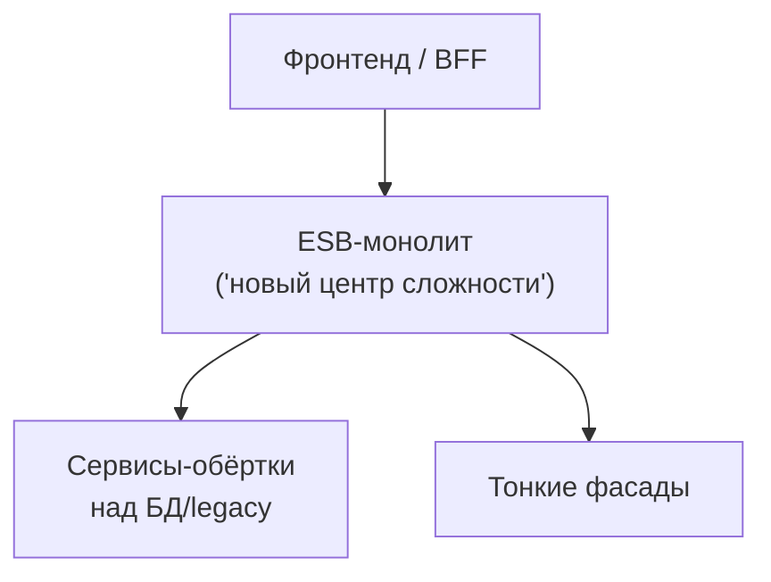

[← Назад к индексу части 8](index.md)

## 8.4. Типичные ошибки SOA и что взять сегодня

### Цель раздела

Разобрать **частые ошибки и антипаттерны SOA** (особенно вокруг ESB и «сервисов ради сервисов»), показать их последствия, и сформулировать **практический чек‑лист**, который поможет решить, **что стоит взять из SOA в современных системах**, а чего — избегать.

### В этом разделе главное

- Исторически многие внедрения SOA **провалились**, потому что шина становилась новым монолитом.
- Частая ошибка — **«SOA по названию»**: чисто техническое дробление на сервисы без реальных бизнес‑границ.
- Полезные идеи SOA:
  - осмысленные бизнес‑сервисы;
  - контракты и каталоги;
  - события как способ интеграции.
- Нужен **чек‑лист**:
  - когда и где оправдан ESB;
  - где достаточно микросервисов + брокера + API Gateway/BFF;
  - какие сигналы говорят, что шина/интеграционный слой «перегрелся».

### Термины

- **ESB‑монолит** — ситуация, когда почти вся бизнес‑логика и интеграции живут в ESB, а сервисы вокруг — тонкие обёртки.
- **Сервисы ради сервисов** — когда систему дробят на множество «сервисов», не думая о границах домена и реальной пользе.
- **Архитектурный долг SOA** — накопленные в шине и контрактах решения, которые сдерживают эволюцию.

### Теория и правила

1. **Антипаттерн: «ESB как бог‑сервис».**
   - Признаки:
     - в ESB реализованы сложные бизнес‑процессы;
     - вся оркестрация и логика «если… то… иначе…» живёт в шине;
     - изменение любого процесса = изменение ESB.
   - Последствия:
     - трудно тестировать;
     - опасно менять;
     - привязка к конкретному вендору/платформе.

2. **Антипаттерн: «Сервисы по таблицам БД».**
   - Берут монолит;
   - на каждую таблицу делают сервис (`CustomerService`, `OrderRowService`, `InvoiceLineService`);
   - связи и инварианты между таблицами ломаются.

3. **Антипаттерн: «SOA‑термины без практики».**
   - Есть красивые слова:
     - «сервис», «контракт», «ESB»;
   - на деле:
     - никакого каталога сервисов;
     - непонятные границы;
     - отсутствие мониторинга и версионирования контрактов.

4. **Что полезно взять из SOA сегодня.**
   - **Осмысленные бизнес‑сервисы**:
     - вместо случайных endpoint’ов и «табличных» сервисов;
   - **контракты и каталоги**:
     - чётко описанные интерфейсы, владельцы, версии;
   - **события и асинхронные интеграции**:
     - «сервис рассказывает о своих событиях», а не даёт всем лезть в свою БД;
   - **интеграционные платформы/flows**:
     - когда действительно нужно связать много legacy и внешних систем.

5. **Когда оправдан тяжёлый ESB, а когда — нет.**
   - Оправдан:
     - большое enterprise с множеством legacy‑систем;
     - сильные требования к аудиту/трассировке;
     - интеграции с проприетарными протоколами.
   - Не оправдан:
     - небольшие и средние продукты;
     - greenfield‑разработка;
     - современный стек (REST/gRPC, брокеры, BFF).

### Простыми словами

SOA в истории — как **очень сложная автомагистраль**:

- в те времена это был **единственный способ** связать десятки разнородных «городов» (систем):
  - асфальт, туннели, развязки, таможни.
- сегодня появились:
  - скоростные поезда (микросервисы + брокер),
  - каршеринг и BFF (индивидуальные маршруты для фронтенда),
  - дроны (serverless, edge).

Идеи о **маршрутизации, правилах движения и знаках** (контракты, события, каталоги) по‑прежнему полезны,  
но строить новый город **строго по лекалам старой автомагистрали** не всегда разумно.

### Картинка в голове

В здоровой архитектуре стрелки логики и ответственности должны быть **распределены по сервисам**, а не стекаться в один центр.

### Как запомнить

Формула:

> **Берём из SOA:** бизнес‑сервисы, контракты, события, каталоги.  
> **Оставляем в прошлом:** гигантский ESB‑монолит, «всё через одну шину», сервисы по таблицам.

### Примеры

**Пример 1. Плохое внедрение SOA в банке.**

- ESB:
  - содержит все бизнес‑процессы кредитования;
  - управляет всеми вызовами систем;
  - интегрирует фронтенд, CRM, биллинг, скоринг.
- Сервисы:
  - почти ничего не решают;
  - являются тонкими обёртками.
- Итог:
  - любое изменение процесса → изменения в ESB → месяцы согласований.

**Пример 2. Воспринимаем SOA идеи в современной системе.**

- Вместо ESB:
  - REST/gRPC между микросервисами;
  - Kafka/RabbitMQ для событий.
- Вместо централизованной логики:
  - доменная логика в самих сервисах (Hexagonal/Clean из частей 6–7).
- Из SOA:
  - чётко описанные **контракты и события**;
  - **каталог сервисов** с владельцами и версиями;
  - BFF как фасад для фронтенда.

### Инструменты на практике: ESB, брокеры, gateway

Чтобы связать теорию с реальными стек‑решениями, полезно видеть типичные категории инструментов:

| Класс инструмента | Примеры | Где уместен | Риски/ограничения |
|-------------------|---------|------------|--------------------|
| **Классические ESB / SOA‑платформы** | IBM Integration Bus, Mule ESB / MuleSoft, Oracle Service Bus, WSO2 ESB | Крупные enterprise‑ландшафты, много legacy и проприетарных протоколов, сильная регуляторика, долгоживущие процессы | Высокая стоимость владения, риск ESB‑монолита, зависимость от вендора, сложное тестирование |
| **iPaaS / интеграционные облачные платформы** | Azure Logic Apps, AWS Step Functions + EventBridge, Boomi, Talend Cloud, n8n/Node‑RED | Когда нужно быстро связывать SaaS‑сервисы (CRM, платежи, таск‑трекеры) и строить визуальные workflow | Собственные лимиты по производительности и гибкости, возможный vendor lock‑in, нужно контролировать границу доменной логики |
| **Message broker’ы / шины событий** | Kafka, RabbitMQ, NATS, ActiveMQ, Pulsar | Микросервисы, event‑driven архитектуры, асинхронные интеграции и «глупые трубы» | Нужна дисциплина в дизайне событий и тем; брокер не заменяет бизнес‑сервисы и контракты |
| **API Gateway** | Kong, NGINX, Envoy, AWS API Gateway, Apigee, Traefik | Единая точка входа для REST/gRPC API, кросс‑сервисная аутентификация, rate limiting, метрики | Не должен становиться вторым ESB с бизнес‑логикой; важна чёткая граница ответственности |
| **BFF (как кодовый слой)** | Express/Nest/FastAPI/ASP.NET BFF‑слой, GraphQL‑сервер поверх микросервисов | Адаптация API под конкретные фронтенды (web, mobile), агрегация данных, кэширование ответов, согласование версий | Опасность «раздутого» BFF с бизнес‑правилами; нужно держать доменную логику внутри сервисов |

Полезно заранее решить:

- **какой класс инструментов** реально нужен под твою задачу;
- где пройдёт граница между:
  - интеграционными задачами (форматы, протоколы, маршруты),
  - доменной логикой (правила, статусы, инварианты),
  - и API для фронтенда (BFF).

#### Проверь себя по инструментам

1. В каких ситуациях классическая ESB‑платформа действительно оправдана, а когда её лучше заменить связкой брокер + API Gateway/BFF?  
2. Чем отличается роль iPaaS‑платформ от роли message broker’а в интеграции систем?  
3. Какие риски есть у BFF‑слоя, если не провести чёткую границу между доменной логикой и адаптацией API?

Ответ

1. ESB уместен в большом enterprise с множеством legacy‑систем и проприетарных протоколов, сильными требованиями к аудиту и сложными кросс‑системными процессами. В зелёных продуктах на современном стеке, где интеграции в основном REST/gRPC и события, достаточно **микросервисов + брокера + gateway/BFF** — тяжёлый ESB добавит лишь сложность и стоимость.  
2. iPaaS даёт **визуальные workflow и коннекторы** к SaaS/enterprise‑системам, беря на себя оркестрацию и преобразование; message broker — это, по сути, **транспорт/шина сообщений** (топики, очереди), не зная о сценариях и домене. iPaaS может использовать брокер внутри, но их ответственность разная: iPaaS — за процессы, брокер — за доставку.  
3. Если в BFF «утекают» бизнес‑правила, он превращается в ещё один слой доменной логики: правила начинают дублироваться между сервисами и BFF, тесты усложняются, фронтенд теряет стабильность API при изменении логики. Правильнее держать BFF как **адаптер под клиентов** (агрегация, формат, кэш), а доменные решения — внутри сервисов.  

### Практика / реальные сценарии

**Чек‑лист: что взять из SOA в новом проекте**

Ответь на вопросы:

- Есть ли у нас **сложный enterprise‑ландшафт** (много систем, legacy, проприетарные протоколы)?
- Нужно ли интегрироваться с:
  - SAP,
  - mainframe,
  - сторонними SOAP/FTP/последовательными интерфейсами?
- Важны ли:
  - жёсткий аудит интеграций,
  - сложные бизнес‑процессы «поперёк» систем?

Если да:
- подумай о:
  - **интеграционной платформе/iPaaS**, 
  - ограниченном и чётко очерченном **ESB**;
  - но **держи доменную логику в сервисах**.

Если нет:
- чаще всего достаточно:
  - **микросервисов с чистой внутренней архитектурой** (части 6–7),
  - **message broker’а** для событий,
  - **API Gateway/BFF** для фронтенда.

---

### Сквозные современные кейсы миграции: ESB → микросервисы/брокер → BFF

Ниже — два типовых “живых” кейса, где идеи SOA проявляются сегодня. Их цель — показать **путь**, а не “идеальную картинку”.

#### Кейс A: «ESB‑монолит душит изменения» → “thin integration + события + доменные сервисы”

**Симптомы**

- любая бизнес‑правка требует изменений в ESB‑процессе;
- тесты на шине тяжёлые и хрупкие, релизы редкие;
- сервисы вокруг стали “тонкими”, а логика живёт в шине.

**Цель миграции**

- вернуть доменные правила в доменные сервисы;
- оставить интеграционному слою только то, что он умеет лучше всего: протоколы, маршрутизацию, ретраи, коннекторы.

**Пошаговый путь (Strangler)**

1) Выписать 3–5 главных “процессов через ESB” (order-to-cash, onboarding, billing).  
2) Для одного процесса выделить **доменные операции** и “технический клей”.  
3) Вынести доменные операции в сервис(ы) с контрактом (REST/gRPC), оставив в ESB:
   - трансформации,
   - маршрутизацию,
   - ретраи/очереди,
   - коннекторы к legacy.
4) Ввести события (broker): сервис публикует “факт”, а потребители подписываются.  
5) Сокращать ESB‑workflow по мере переноса логики, пока ESB не станет “тонким интеграционным слоем”.

**Критический guardrail**

- бизнес‑инварианты и проверки (можно/нельзя) живут в сервисах, иначе ESB‑монолит вернётся.

#### Кейс B: «Фронтенд‑богатый продукт, много источников данных» → BFF поверх “SOA‑ландшафта”

**Симптомы**

- UI делает 10–20 запросов на экран;
- контракты разные, ошибки разные, auth‑политики разные;
- сложно обеспечить наблюдаемость “по экрану/операции”.

**Решение**

- вводим BFF как фасад под конкретный клиент (web/mobile):
  - агрегация данных,
  - единые ошибки,
  - единый `trace_id`,
  - кэш/деградация.

**Граница, чтобы не получить новый монолит**

- BFF не владеет доменной логикой; он адаптирует и агрегирует.
- доменные решения/инварианты остаются в сервисах.

---

### Артефакт, без которого SOA/микросервисы “по факту не работают”: service catalog + ownership + контракты

Если у вас “много сервисов”, но нет каталога — это почти всегда означает:

- новые люди не знают, куда идти;
- интеграции растут хаотично;
- контракты и владение “в голове старожилов”.

Минимальный каталожный формат (можно вести в Markdown/таблице/портале — важна не форма, а дисциплина):

| Сервис | Владелец (команда) | Назначение (1 строка) | Контракты (REST/GraphQL/proto/events) | Данные (владелец) | Зависимости (кто зовёт / кого зовём) | SLO/критичность | Runbook/On-call |
| --- | --- | --- | --- | --- | --- | --- | --- |
| `orders` | Team A | Заказы и статусы | OpenAPI `v1` + events `OrderCreated` | `orders_db` | `BFF-web` → `orders`; `orders` → `payments` | p99 < 800ms | ссылка/контакт |

Как пользоваться каталогом “по‑взрослому”:

1) Любая новая интеграция начинается с вопроса: **“какой сервис владеет фактом?”**  
2) Любое изменение контракта фиксируется как версия + срок поддержки (deprecation).  
3) По каталогу видно, где риск “shared‑слоя” (слишком много зависимостей на один сервис).  
4) Для ESB/iPaaS каталог нужен **не меньше**: иначе шина превращается в “магическое место, где что‑то происходит”.

### Типичные ошибки

- **Копировать ESB‑подход в маленький продукт.**
- **Не описывать контракты и не вести каталог сервисов**, даже если называешь архитектуру SOA/микросервисной.
- **Не учитывать влияние на фронтенд/BFF**: сложные интеграционные решения на бэкенде, но фронту торчит неудобный, фрагментированный API.

### Пошагово: как применять чек‑лист SOA на практике

1. **Опиши контекст проекта.**  
   - Масштаб (малый продукт / enterprise);  
   - наличие/отсутствие legacy‑систем;  
   - требования по интеграции (сколько внешних систем, какие протоколы).
2. **Ответь честно на ключевые вопросы (из чек‑листа выше).**  
   - Есть ли сложный enterprise‑ландшафт?  
   - Нужен ли строгий аудит интеграций и визуальные workflow?  
   - Насколько часто будут меняться бизнес‑процессы?
3. **Реши, нужен ли тяжёлый ESB/iPaaS.**  
   - Если «да» — явно зафиксируй:  
     - какие задачи он решает (форматы, маршруты, интеграция с legacy);  
     - чего **он точно не должен делать** (хранить доменную логику).  
   - Если «нет» — сразу спланируй архитектуру вокруг:  
     - микросервисов/модулей,  
     - брокера сообщений,  
     - API Gateway/BFF.
4. **Спроектируй бизнес‑сервисы и события.**  
   - Отдельно от вопроса ESB нарисуй:  
     - какие у тебя будут бизнес‑сервисы;  
     - какие события они публикуют;  
     - какие контракты и версии нужны.
5. **Устрой ревью с командой.**  
   - Проверь, все ли понимают:  
     - где живёт доменная логика;  
     - как будут выглядеть API и события;  
     - какую роль играет (или не играет) ESB/интеграционная платформа.
6. **Возвращайся к чек‑листу регулярно.**  
   - Раз в несколько месяцев сверяй реальность с изначальным планом;  
   - если ESB/интеграционный слой начинает «раздуваться» — планируй целенаправленный рефакторинг.

#### Проверь себя по работе с чек‑листом

1. Зачем явно фиксировать, какие задачи должен решать ESB/iPaaS, а какие — нет, если ты всё же решил его использовать?  
2. Какие вопросы из чек‑листа помогают понять, что для твоего проекта достаточно микросервисов + брокера + API Gateway/BFF без тяжёлого ESB?  
3. Почему важно периодически пересматривать архитектурные решения по интеграционному слою, а не считать их «раз и навсегда принятыми»?

Ответ

1. Без явной фиксации границ ESB легко «затягивает» в себя всё больше логики и превращается в монолит. Чёткое описание «он делает только форматы/маршруты/техпроцессы, но **не** доменную бизнес‑логику» помогает держать архитектуру в узде и не размывать ответственность.  
2. Вопросы про масштаб (малый продукт vs enterprise), наличие/отсутствие legacy, количество и тип внешних систем, требования по аудиту и сложным бизнес‑процессам. Если домен относительно автономный, интеграций немного и они в современных протоколах (REST/gRPC), а требования к визуальным workflow невелики — чаще всего достаточно микросервисов, брокера и Gateway/BFF.  
3. Контекст меняется: появляются новые системы, бизнес‑процессы усложняются или, наоборот, упрощаются, команда растёт. Решения, оптимальные год назад, могут стать источником долга сегодня. Регулярный пересмотр по чек‑листу позволяет вовремя увидеть «разрастание» ESB/интеграционного слоя и спланировать эволюцию, а не ждать, пока всё станет слишком хрупким и дорогим.  

### Что будет, если…

- **Если взять ESB, не понимая, зачем.**  
  - Получишь сложный, дорогой в сопровождении слой;
  - не обязательно более надёжный или понятный.

- **Если игнорировать идеи SOA в большом enterprise.**  
  - Риск повторить хаос интеграций:
    - точка‑точка связи,
    - дублирование логики,
    - отсутствие общих контрактов.

### Проверь себя

1. Какие три основных антипаттерна связаны с плохим применением SOA/ESB?  
2. Что конкретно стоит взять из SOA в современный микросервисный/фронтенд‑богатый мир?  
3. Как по чек‑листу понять, нужен ли тебе тяжёлый ESB или достаточно брокера + API Gateway/BFF?

Ответ

1. Примеры:  
   - ESB‑монолит (вся логика в шине);  
   - сервисы «по таблицам», без настоящих бизнес‑границ;  
   - SOA‑термины без практики (нет контрактов, каталога, мониторинга).  
2. Стоит взять:  
   - идею **осмысленных бизнес‑сервисов** и контрактов;  
   - **каталоги/registry** сервисов с владельцами и версиями;  
   - **события и асинхронные интеграции** как основной механизм взаимодействия;  
   - аккуратное использование интеграционных платформ, когда действительно нужно.  
3. Если у тебя много legacy и сложный enterprise‑ландшафт, высокие требования по аудиту и интеграциям, ESB/iPaaS может быть оправдан. Если же ты строишь относительно самостоятельный продукт на современном стеке, чаще всего достаточно **микросервисов, брокера и gateway/BFF**, а тяжёлый ESB принесёт больше сложности, чем пользы.  

### Запомните

- Ошибки SOA — это **не повод выбросить идеи**, а повод применять их **осознанно и дозировано**.
- В современном мире стоит:
  - перенести доменную логику **в сервисы**;
  - использовать **лёгкие шины** и **BFF**;
  - сохранять из SOA **контракты, каталоги и событийность**.

---
