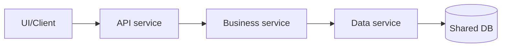

[← Назад к индексу части 9](index.md)

## 9.2. Границы: по домену, по команде, по данным

### Цель раздела

Научить тебя проводить границы сервисов так, чтобы они **помогали**, а не мешали: минимизировали связность, делали изменения локальными и не превращали систему в «клубок зависимостей».

### В этом разделе главное

- Границы сервисов — главный фактор успеха микросервисов; «технологии» вторичны.
- Есть три полезные линзы разрезания: **домен**, **команда**, **данные**.
- «Правильная граница» часто — это компромисс между линзами.
- Самые опасные разрезы: **по слоям**, **по таблицам**, **по UI‑страницам** без доменного смысла.
- Владение данными (ownership) — фундамент независимости.

### Термины

- **Conway’s law (закон Конвея)** — структура системы повторяет структуру коммуникаций команды/организации.
- **Ownership (владение)** — кто отвечает за изменение данных/контракта; кто принимает решения.
- **High cohesion / low coupling** — внутри много связанного, снаружи мало зависимостей.
- **Anti‑corruption layer (ACL)** — слой защиты домена от чужих моделей/понятий.

### Теория и правила

#### 0) Закон Конвея на практике: почему границы “не живут” без ownership

Интуиция закона Конвея простая:

> Если команда может договориться только через “общий чат и созвоны”, система будет спроектирована так же: много неформальных связей, мало контрактов.

В микросервисах это проявляется особенно ярко, потому что границы “дорогие” (сеть, контракты, независимый деплой).

**Как выглядит плохой сигнал (и почему он важен)**

- один сервис «формально чей-то», но его постоянно меняют 3–4 команды;
- перед релизом обязательно нужен «общий созвон всех»;
- границы домена “на бумаге” есть, но в реальности решения принимаются коллективно и медленно.

Результат почти всегда один: вы получаете либо **distributed monolith**, либо «микросервисы с общей моделью и общими релизами».

**Как использовать закон Конвея как инструмент (а не как мем)**

Мини‑чек‑лист перед тем, как закреплять границу сервиса:

1. Кто **владелец** сервиса (одна команда/группа)? Кто принимает решения об изменении контракта?
2. Какая у сервиса **очередь изменений** и кто её приоритизирует?
3. Какой “контрактный” путь взаимодействия: API, события, документация, тесты контрактов?
4. Что будет, если внешний потребитель попросит “срочно добавить поле” — есть ли deprecation‑процесс?

Если на эти вопросы нет ответов, микросервисная граница будет слабой — не из-за технологий, а из-за отсутствия ownership‑модели.

##### Проверь себя (9.2 — закон Конвея и ownership)

1. Почему закон Конвея особенно «болезненно правдив» в микросервисах по сравнению с монолитом?
2. Приведи 2 признака, что “ownership границы” отсутствует, даже если в документации сервис “приписан” команде.
3. Какой один практический шаг ты сделаешь первым, если увидел(а) обязательный «общий релизный созвон всех» перед каждым деплоем?

<details><summary>Ответ</summary>

1. Потому что микросервисы требуют **контрактного общения и независимых решений**. Если команды общаются в основном неформально и постоянно синхронизируются, архитектура повторит это: появятся общие релизы, общая модель, длинные цепочки — то есть distributed monolith.
2. Например: (а) изменения в сервис регулярно делают 3–4 команды без чёткой очереди/приоритизации, (б) любые изменения контракта требуют согласования «со всеми» без deprecation‑процесса, (в) никто не может назвать владельца и SLA/политику изменений.
3. Сформировать и зафиксировать **ownership**: кто владелец сервиса/контракта и какой процесс изменений (compatibility + deprecation). Часто это даёт больше эффекта, чем «поставить ещё один инструмент».

</details>

#### 1) Линза «домен»: режем по смыслу (bounded context)

Самая «естественная» граница — доменная:  
если внутри группы объектов/правил один язык и одна логика — это кандидат на сервис.

Пример (интернет‑магазин):

- **Каталог**: товары, категории, цены, описания.
- **Заказы**: корзина, оформление, статусы, доставка.
- **Платежи**: платёжные провайдеры, статусы транзакций.

Важно: «домен» — не обязательно «таблица». Домен — это **правила**.

##### Проверь себя (9.2 — линза “домен”)

1. Почему разрез «по таблицам» часто даёт CRUD‑сервисы, но не даёт доменных границ?
2. Придумай пример доменного правила (инварианта), которое “склеивает” данные так, что их плохо разносить по двум сервисам.

<details><summary>Ответ</summary>

1. Потому что таблицы — это форма хранения, а домен — это **правила и смысл операций**. Если резать по таблицам, один бизнес‑кейс (“оформить заказ”) будет пересекать много таблиц → много сервисов → много сетевых вызовов и связности.
2. Например: «заказ можно перевести в статус Paid только если сумма оплаты равна сумме заказа и резервирование возможно» — это правило связывает статусы, оплату и резервы; если разнести неаккуратно, правило расползётся по сетевой цепочке и станет хрупким.

</details>

#### 2) Линза «команда»: режем так, чтобы команда могла быть автономной

Даже если домен «красивый», но одну область постоянно меняют три команды — автономности не будет.

Эвристика:

- один сервис — одна «ownership‑команда»;
- изменения сервиса не требуют ежедневной синхронизации с другими командами.

Это напрямую связано с законом Конвея: если команда общается через формальные контракты — архитектура тоже будет контрактной.

##### Проверь себя (9.2 — линза “команда”)

1. Почему “один сервис — одна команда” не всегда достижимо буквально, но всё равно полезно как ориентир?
2. Какие 2 вида конфликтов чаще всего появляются, если сервисом «владеют все»?
3. Как закон Конвея можно использовать как аргумент на архитектурном ревью, а не как шутку?

<details><summary>Ответ</summary>

1. Потому что бывают shared‑платформенные сервисы и переходные состояния. Но ориентир полезен: он заставляет задавать вопросы про ownership, очередь изменений и контрактный процесс.
2. Конфликты приоритетов (“чья фича важнее”), конфликты изменений (“сломали потребителя”), и в итоге — связанные релизы и страх изменений.
3. Через вопросы: «какая структура команд/коммуникаций у нас есть?» и «какую архитектуру она неизбежно породит?». Затем либо меняем архитектуру под организацию, либо меняем организацию под целевую архитектуру.

</details>

#### 3) Линза «данные»: режем по владению источником истины

Самая жёсткая граница — данные. Если два сервиса пишут в одну таблицу — это почти гарантированно:

- общий релизный поезд;
- конфликт схемы;
- трудно понять ответственность;
- невозможно локально обеспечить инварианты.

Поэтому **database per service** — это не «мода», а попытка сделать ownership реальным.

##### Проверь себя (9.2 — линза “данные”)

1. Почему владение данными является более жёсткой границей, чем “владение кодом”?
2. В каких случаях shared DB может быть допустима, и какое условие делает её “временной”, а не “навсегда”?

<details><summary>Ответ</summary>

1. Потому что данные — источник истины и общий контракт. Если сервисы зависят от чужих таблиц, они зависят от чужой эволюции схемы и инвариантов → независимость исчезает.
2. При миграции/strangler‑подходе. Условие “временности” — наличие плана разъезда ownership: запрет новых прямых доступов к чужим таблицам + перевод потребителей на API/события + этапы отделения схемы/БД.

</details>

#### 4) Почему нельзя «резать по слоям»

Разрез «отдельный сервис контроллеров» или «отдельный сервис репозиториев» создаёт ситуацию:

- бизнес‑операция расползается по 5 сервисам;
- каждый запрос превращается в цепочку сетевых вызовов;
- тестирование и отладка усложняются.

Это типичный путь к distributed monolith.

##### Проверь себя (9.2 — анти‑разрез “по слоям”)

1. Почему разрез по слоям делает каждый запрос “дороже” и “хрупче”?
2. Назови 2 признака, что вы случайно строите distributed monolith через “слоистые микросервисы”.

<details><summary>Ответ</summary>

1. Потому что бизнес‑операция превращается в цепочку сетевых вызовов: добавляется латентность, таймауты, частичные отказы и необходимость сложной диагностики.
2. Длинные синхронные цепочки на каждый запрос и невозможность выкатить один сервис без остальных (связанные релизы), плюс часто — общая БД.

</details>

#### 5) Anti‑corruption layer (ACL): как связывать сервисы, не смешивая домены

ACL (anti‑corruption layer) — это не «ещё один слой ради слоёв». Это **защитный адаптер**, который:

- не даёт чужой модели данных «протечь» внутрь твоего домена;
- позволяет тебе менять внутреннюю модель независимо;
- делает интеграцию явной и тестируемой.

Самая частая ситуация, где ACL нужен:

- сервис **Orders** говорит в сервис **Payments**;
- Payments оперирует терминами «authorization/capture/refund», а Orders — «оплачен/не оплачен», «истёк таймаут оплаты», «частичная оплата».

Если Orders начнёт «думать терминами Payments», домены смешаются, и любое изменение Payments станет болью для Orders.

**Как выглядит ACL “вживую”**

```text
Orders domain model
  PaymentStatus = { Pending, Paid, Failed, Refunding }

Payments API / Events
  providerStatus = { authorized, captured, voided, chargeback, ... }

ACL (mapper + policy)
  authorized  -> Pending (или Paid, в зависимости от политики)
  captured    -> Paid
  voided      -> Failed
  chargeback  -> Refunding (и отдельный инцидент-процесс)
```

Важная мысль: ACL — это место, где вы **фиксируете политику перевода смысла**, а не только «переименовываете поля».

Мини‑диаграмма:

```mermaid
graph LR
  O[Orders (домен)] --> ACL[ACL / adapter\n(mapping + policy)]
  ACL --> P[Payments (внешний сервис)]
```

**Типичный анти‑пример (без ACL)**:

- Orders хранит у себя `providerStatus = "captured"` и начинает ветвить логику по нему.

Последствие: вы фактически встроили внешний домен внутрь своего и потеряли независимость эволюции.

##### Проверь себя (9.2 — ACL)

1. Почему ACL — это не просто “маппер DTO”, а место для политики перевода смысла?
2. Какие 2 проблемы появятся, если Orders начнёт хранить `providerStatus` и ветвить бизнес‑логику по нему?
3. Придумай пример, где ACL поможет пережить изменение внешнего сервиса без “массового рефакторинга” домена.

<details><summary>Ответ</summary>

1. Потому что домены часто не совпадают по семантике: одно значение внешней системы может соответствовать разным внутренним статусам в зависимости от бизнес‑политики. ACL фиксирует именно **семантическое соглашение**.
2. (а) Жёсткая зависимость от чужих терминов и изменений, (б) расползание внешних состояний по внутреннему домену, (в) сложность тестирования и эволюции.
3. Например, платежный провайдер добавил новые статусы/переименовал старые. При наличии ACL меняется перевод в одном месте, а доменная модель Orders остаётся стабильной.

</details>

### Пошагово: как искать границы (практический алгоритм)

1. **Выпиши ключевые бизнес‑кейсы** (use cases): «оформить заказ», «вернуть деньги», «обновить цену».
2. Для каждого кейса отметь:
   - какие данные читаются/пишутся;
   - какие правила/инварианты должны держаться.
3. Найди группы правил, которые «ходят вместе» (cohesion).
4. Проверь, можно ли назначить **владельца** (команду) на каждую группу.
5. Проверь «данные»: может ли группа владеть своими таблицами/коллекциями.
6. Проверь «сценарии пересечений»: где нужны интеграции, и можно ли их сделать контрактно.
7. Сделай «черновой разрез», затем прогони через чек‑лист ошибок (ниже).

### Простыми словами

Границы — это как «где поставить стены» в доме.

- Если стены ставить «по материалу» (кирпич отдельно, бетон отдельно) — жить невозможно.
- Если ставить по смыслам («кухня», «спальня», «санузел») — удобно.

В микросервисах «кухня» — это набор правил и данных, которые должны жить вместе.

### Картинка в голове

Представь карту метро:

- внутри линии станции связаны часто (внутренние вызовы/данные);
- пересадки — редкие и формализованные (контракты между сервисами).

Хорошая граница — это когда пересадок мало и они понятны.

### Как запомнить

Три линзы:

> **Домен (смысл) → Команда (владение) → Данные (источник истины)**.

Если один из трёх пунктов «не сходится» — риск плохой границы растёт.

### Примеры

#### Диаграмма: хороший разрез домена (упрощённо)

```mermaid
graph TB
  Client[Клиент (web/mobile)] --> GW[API Gateway]

  GW --> Catalog[Catalog service]
  GW --> Orders[Orders service]
  GW --> Payments[Payments service]

  Catalog --> CDB[(Catalog DB)]
  Orders --> ODB[(Orders DB)]
  Payments --> PDB[(Payments DB)]

  Orders -->|событие OrderCreated| Bus[(Event bus)]
  Payments -->|событие PaymentSucceeded| Bus
  Catalog -->|событие PriceChanged| Bus
```

Здесь видно:

- владение данными разделено;
- есть фасад для клиентов;
- интеграции могут быть событиями, а не цепочками синхронных вызовов.

##### Проверь себя (9.2 — диаграмма хорошего разреза)

1. Какой элемент на диаграмме помогает клиенту не зависеть от внутреннего количества сервисов, и какую цену это может иметь?
2. Почему события между сервисами могут уменьшать связанность по сравнению с синхронными вызовами?
3. Какие два условия должны быть выполнены, чтобы “событийная интеграция” не превратилась в хаос?

<details><summary>Ответ</summary>

1. Фасад (**API Gateway** / иногда BFF) скрывает внутреннюю структуру. Цена: он становится важной точкой эксплуатации (лимиты, мониторинг, корректная роль, чтобы не превратиться в «периметральный монолит»).
2. Событие не требует немедленного ответа и не строит жёсткую цепочку ожиданий; сервис‑публикатор не “зависит” от доступности каждого потребителя прямо сейчас.
3. (а) Контракт событий и правила совместимости (не ломать формат/семантику), (б) идемпотентная обработка и понятные механики ретраев/DLQ/наблюдаемость, чтобы справляться с дублями и сбоями.

</details>

#### Контраст: разрез «по слоям» (как выглядит боль)



На бумаге это похоже на слои, но в распределённой системе это:

- каждый запрос = 3 сетевых прыжка;
- любая ошибка внизу валит всё;
- границы домена отсутствуют.

##### Проверь себя (9.2 — контраст “по слоям”)

1. Почему такая схема почти гарантированно ухудшает latency и надёжность?
2. Какой “первый симптом” в проде чаще всего покажет, что вы построили такую цепочку?

<details><summary>Ответ</summary>

1. Потому что одна бизнес‑операция превращается в несколько сетевых hop’ов, а сеть даёт вариативность задержек и частичные отказы; цепочка делает отказ одного звена отказом всей операции.
2. Рост таймаутов и ретраев, лавинообразные деградации при пиковой нагрузке, а также сложность диагностики (“где именно сломалось”) из-за многошаговой цепочки.

</details>

### Практика / реальные сценарии

- **Сценарий: «каталог и цены меняются часто, заказы — осторожно»**  
  Разумно выделить сервисы так, чтобы команды могли менять каталог без риска сломать оформление заказа. Контракты: события изменения цены, API получения актуальной цены при оформлении.

- **Сценарий: «в платежах нужен другой уровень безопасности и комплаенса»**  
  Платежи часто изолируют не только доменно, но и инфраструктурно: отдельные сети, отдельные ключи, отдельные политики доступа.

### Типичные ошибки

1. **Резать по таблицам.** Получается много CRUD‑сервисов, а бизнес‑операции расползаются.
2. **Смешивать ownership.** «Этим сервисом владеют все» = сервисом не владеет никто.
3. **Переносить старую монолитную модель 1:1.** В микросервисах часто нужно переосмыслить контракты.

### Что будет, если…

- **…два сервиса пишут одни и те же данные?**  
  Начнутся гонки, конфликт схемы, невозможность локально гарантировать инварианты, релизы станут связанными.
- **…границы слишком мелкие?**  
  Растёт количество интеграций и «прыжков по сети», производительность и надёжность падают, когнитивная нагрузка растёт.

### Проверь себя

1. Почему разрез «по домену» обычно лучше разреза «по слоям»?
2. Как владение данными влияет на независимость деплоя?
3. Что ты сделаешь, если доменные границы и командные границы конфликтуют?

<details><summary>Ответ</summary>

1. Потому что бизнес‑операции живут в домене: если домен цельный внутри сервиса, меньше межсервисных вызовов и меньше связности. Разрез по слоям распиливает одну операцию на цепочку сетевых вызовов.
2. Если сервис владеет данными, он может менять схему и правила локально (с контролируемой миграцией) и не ломать другие сервисы прямыми зависимостями на таблицы.
3. Ищу компромисс: иногда объединяю сервисы, иногда пересматриваю организацию команд, иногда ввожу чёткие контракты и ACL, иногда делаю «переходный период» с временной общей БД, но с планом разъезда.

</details>

### Запомните

Границы микросервисов — это прежде всего **границы ответственности и владения данными**, а не «как разложить код по репозиториям».

---
