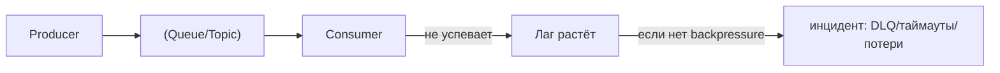
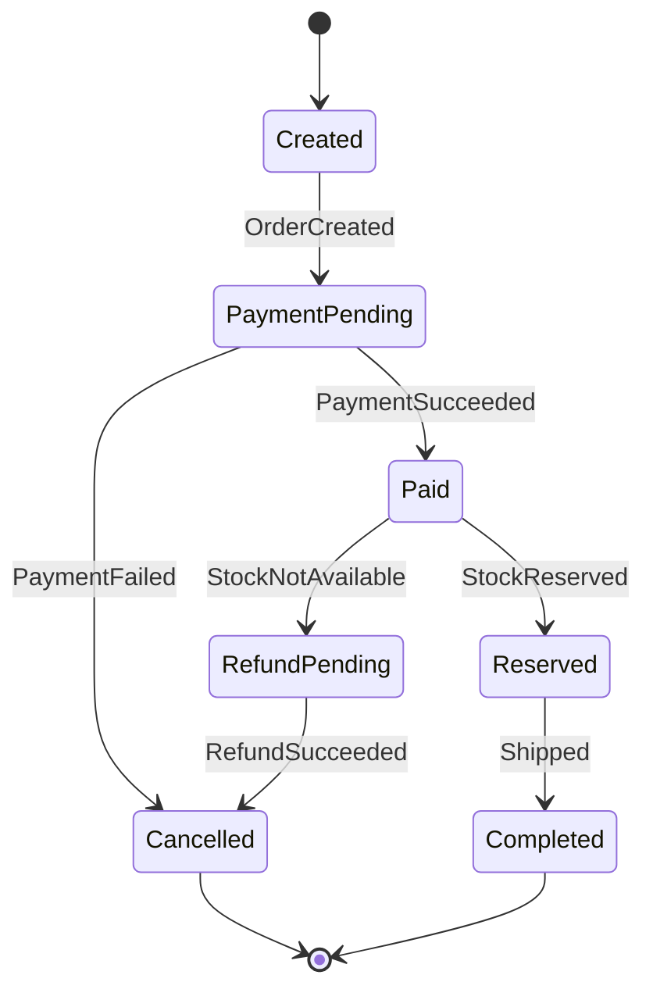
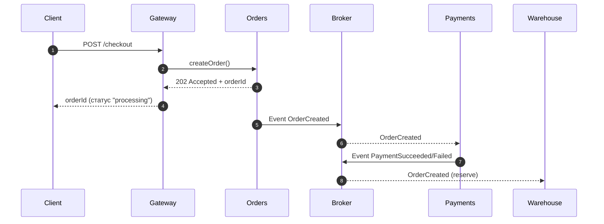

[← Назад к индексу части 9](index.md)

## 9.3. Коммуникация: синхронная и асинхронная

### Цель раздела

Дать тебе практический способ выбирать тип взаимодействия между сервисами и строить его так, чтобы система была устойчивой: без каскадных отказов и бесконечных таймаутов.

### В этом разделе главное

- Синхронные вызовы просты для понимания, но опасны каскадами отказов.
- Асинхронные связи повышают устойчивость и развязывают сервисы, но требуют модели консистентности (eventual consistency).
- Большинство проблем микросервисов — это не «неправильный протокол», а отсутствие правил: таймауты, ретраи, идемпотентность.
- Для user‑flow часто нужен гибрид: быстрый синхронный ответ + асинхронная обработка «дальше».

> Примечание про термин **saga (сага)** из оглавления: это популярное название для подхода «длинный бизнес‑процесс как цепочка шагов со статусами и компенсацией». В этой части мы даём **интуицию** и простые диаграммы (статусы/компенсация). Глубже паттерны оркестрации/хореографии и устойчивости обычно раскрывают вместе с EDA и reliability‑темами (в следующих частях плана).

### Термины

- **Timeout** — ограничение времени ожидания ответа.
- **Retry** — повтор запроса при ошибке (опасно без идемпотентности и jitter).
- **Idempotency (идемпотентность)** — повтор запроса не меняет итог больше одного раза.
- **Eventual consistency** — «согласованность со временем»: данные становятся согласованными не мгновенно.
- **Backpressure** — механизм «притормаживания», когда потребитель не успевает.

### Теория и правила

#### 0) Backpressure: что это и почему без него “очередь лечит пики” только в теории

Backpressure — это способность системы **сказать “я не успеваю”** и сделать так, чтобы нагрузка не превращалась в лавину ошибок.

В микросервисах backpressure возникает в двух мирах:

- **sync**: сервис B медленный → сервис A продолжает слать запросы → пул потоков/соединений заканчивается → падают оба;
- **async**: consumer не успевает читать топик → лаг растёт → ретраи/перезапуски усугубляют ситуацию → появляется “кладбище сообщений”.

**Картинка в голове**



**Практические техники backpressure (простыми словами)**

- **Ограничение параллелизма**: consumer обрабатывает не “сколько придёт”, а “сколько способен”.
- **Rate limiting**: продюсер/периметр (gateway) режет скорость при перегрузе.
- **Отказ с деградацией**: лучше быстро вернуть “try later”/202 и обработать асинхронно, чем держать соединения до таймаута.
- **Быстрое фейление зависимостей**: таймауты + circuit breaker (идея из 19 части, но смысл нужен уже тут).
- **Пауза чтения / управление offset’ами** (в брокерах): читать следующую порцию только когда готов.

Важно: backpressure — это не одна настройка. Это набор ограничителей, которые не дают “всем” одновременно делать “всё”.

##### Проверь себя (9.3 — backpressure)

1. Почему “очередь сама по себе” не гарантирует устойчивость при пиковых нагрузках?
2. В чём разница между backpressure в sync‑цепочке и backpressure в async‑топике?
3. Какие 2 практические меры ты бы внедрил(а) первыми, если видишь рост lag у consumer’ов?

<details><summary>Ответ</summary>

1. Потому что очередь может лишь буферизовать, но если consumer бесконечно падает/ретраит или не ограничивает параллелизм, лаг растёт до инцидента (DLQ, истечение retention, перегруз инфраструктуры).
2. В sync backpressure — это ограничение “сколько запросов одновременно” и быстрые отказы/деградация, чтобы не съесть ресурсы. В async — это управление скоростью чтения/обработки, лимиты ретраев, DLQ и процессы разбирательства.
3. Ограничить параллелизм обработки и включить/настроить DLQ с лимитом ретраев; дополнительно — расследовать “poison message” и горячие ключи партиционирования.

</details>

#### 1) Синхронная коммуникация: когда она хороша

Синхронный вызов (HTTP/gRPC) удобен, когда:

- пользователю нужно **сразу** получить результат (например, показать цену);
- операция короткая и надёжная;
- ошибка должна быть видна сразу (например, «неверный пароль»).

Но синхронность создаёт цепочки:

```text
Client -> Gateway -> Orders -> Payments -> Fraud -> ...
```

Если любой сервис в цепочке «подвис» — подвисает весь запрос.

##### Проверь себя (9.3 — синхронная коммуникация)

1. Почему “синхронная цепочка” ухудшается не линейно, а часто “скачком” при добавлении ещё одного сервиса?
2. Назови 2 ситуации, когда синхронный вызов оправдан и лучше асинхронности.

<details><summary>Ответ</summary>

1. Потому что растёт не только сумма латентностей, но и вероятность частичного отказа: каждое звено добавляет шанс таймаута/ошибки, а ретраи могут усилить нагрузку и запустить каскад.
2. (а) Когда пользователю нужен немедленный результат (логин, проверка прав, валидация), (б) когда операция короткая, критична для UX и у неё понятные таймауты/ошибки.

</details>

#### 2) Асинхронная коммуникация: зачем она нужна

Асинхронность полезна, когда:

- операция может выполняться позже (отправка email, расчёт рекомендаций);
- нагрузка пиковая и нужно буферизовать;
- важно снизить связность: сервис публикует событие, потребители сами решают, что с ним делать.

Цена: нужно мыслить состояниями и переходами, а не «одним запросом».

##### Проверь себя (9.3 — асинхронная коммуникация)

1. Почему асинхронность часто улучшает устойчивость, но усложняет “картину правды” для пользователя?
2. Приведи пример операции, которую почти всегда лучше делать async, и объясни почему.
3. Какой 1 артефакт (данные/состояние) ты добавишь, чтобы async‑процесс был наблюдаемым и понятным?

<details><summary>Ответ</summary>

1. Потому что сервисы перестают ждать друг друга синхронно, но результат становится “не мгновенным”: нужно показывать статусы, принимать eventual consistency и объяснять пользователю переходные состояния.
2. Отправка уведомлений, построение рекомендаций, обработка вебхуков, пересчёт отчётов — там не нужен мгновенный результат, важнее надёжная доставка и буферизация пиков.
3. Явный **статус процесса** (например, `paymentStatus/orderStatus`) + корреляция (`orderId/traceId`) и/или запись “команды/события” в журнал, чтобы можно было ответить на вопрос “на каком шаге застряли”.

</details>

#### 3) Практические правила устойчивости для синхронных вызовов

Если у тебя есть синхронные цепочки, **обязательны**:

- таймауты (никогда не ждать «вечно»);
- ретраи с осторожностью (и с jitter);
- ограничение параллелизма;
- circuit breaker (идея подробно в части 19, но интуиция нужна уже здесь);
- идемпотентность для операций «создания».

##### Проверь себя (9.3 — устойчивость синхронных вызовов)

1. Почему таймаут обязателен, даже если “обычно всё быстро”?
2. Почему ретраи опасны без идемпотентности? Приведи практический пример.
3. Как ограничение параллелизма помогает при деградации зависимости?

<details><summary>Ответ</summary>

1. Потому что “обычно” не означает “всегда”: при деградации зависимость может подвиснуть и съесть пул потоков/соединений. Таймаут ограничивает ущерб и даёт системе шанс деградировать контролируемо.
2. Потому что повтор может выполнить действие дважды (двойная оплата/двойной заказ). Пример: `POST /payments` без `Idempotency-Key` → при таймауте клиент повторяет → списание происходит дважды.
3. Оно не даёт одной зависимостей “съесть” все ресурсы сервиса. Даже если Payments деградирует, Orders продолжит обслуживать часть запросов (bulkhead‑эффект).

</details>

#### 4) Практические правила для асинхронности

- явно различай **команду** (command: «сделай») и **событие** (event: «случилось»);
- продумывай повторную обработку (at-least-once доставку) → идемпотентность consumers;
- продумывай порядок/ключ партиционирования, если он важен.

Добавим «приземлённые» детали, которые обычно всплывают в проде.

**Порядок событий (ordering)**

Если события должны обрабатываться по порядку для одного объекта (например, `OrderPaid` не должен прийти “раньше” `OrderCreated`), обычно выбирают ключ партиционирования вроде `orderId`. Тогда брокер гарантирует порядок **внутри одного ключа**, но не между разными заказами.

**Poison message и DLQ (dead-letter queue)**

Иногда consumer “падает” на конкретном сообщении всегда (битые данные, баг). Если его бесконечно ретраить, очередь забивается.

Поэтому в зрелой схеме есть:

- лимит ретраев;
- перенос в **DLQ** (dead-letter queue/topic);
- процесс разбирательства: исправить consumer или данные, и переиграть сообщение.

Упрощённая схема:

```text
Topic -> Consumer
  success -> commit offset
  fail (retries N) -> DLQ -> manual/automated replay
```

Это напрямую связано с “стоимостью” микросервисов: без DLQ и процессов разбирательства асинхронность превращается в «тихое кладбище сообщений».

##### Проверь себя (9.3 — ordering и DLQ)

1. Почему «порядок событий» чаще всего гарантируется “внутри ключа”, а не глобально?
2. Что такое poison message и почему без DLQ оно способно “убить” обработку топика?
3. Опиши простой жизненный цикл сообщения, которое попало в DLQ: что должно случиться, чтобы оно вернулось в нормальную обработку?

<details><summary>Ответ</summary>

1. Потому что глобальный порядок для всех сообщений требует дорогой синхронизации и убивает масштабирование. Поэтому брокеры обычно дают порядок внутри партиции/ключа (например, `orderId`).
2. Poison message — сообщение, на котором consumer падает всегда (данные/баг). Без DLQ consumer будет бесконечно ретраить одно и то же, увеличивая лаг и блокируя прогресс.
3. Сообщение: topic → consumer → ретраи N → DLQ. Далее: разбор причины (починка consumer или данных) → replay (вручную/автоматически) → повторная обработка → фиксация результата и закрытие инцидента.

</details>

#### 5) Идемпотентность: как не получить «двойную оплату» от ретраев

В микросервисах ретраи неизбежны (сеть нестабильна). Поэтому для операций, которые **создают/изменяют** что‑то важное (создать заказ, списать деньги, зарезервировать товар), нужно заранее ответить на вопрос:

> «Если один и тот же запрос придёт 2 раза — что будет?»

Есть несколько типовых техник.

**Техника A: Idempotency‑Key (ключ идемпотентности)**

- клиент (или gateway) генерирует уникальный ключ;
- сервис хранит результат по ключу некоторое время;
- повтор запроса с тем же ключом возвращает **тот же результат**, не выполняя действие повторно.

Пример заголовка:

```http
POST /payments
Idempotency-Key: 7b2b4f1c-1a9e-4f49-a6f0-2e7b8a2d7c10
Content-Type: application/json

{ "orderId": "o_123", "amount": 19990, "currency": "RUB" }
```

**Техника B: естественный идемпотентный идентификатор**

Если бизнес позволяет, делай «создание» через заранее известный идентификатор:

- `PUT /orders/{orderId}` вместо «создай и верни id»,
- тогда повтор запроса с тем же `orderId` не создаст дубль.

**Техника C: дедупликация на стороне consumer (в async)**

Если событие может прийти дважды, consumer хранит «последнее обработанное»:

- ключ — `eventId` или `(aggregateId, eventVersion)`;
- повтор просто игнорируется.

Это не «оптимизация», а базовое требование, потому что at‑least‑once доставка — самый распространённый режим.

##### Проверь себя (9.3 — идемпотентность)

1. В чём разница между “идемпотентностью запроса” и “дедупликацией событий”?
2. Почему `Idempotency-Key` обычно нужно хранить с результатом, а не просто “проверять уникальность”?
3. Приведи пример операции, которая кажется “безопасной”, но без идемпотентности ломает деньги/товары.

<details><summary>Ответ</summary>

1. Идемпотентность запроса — повтор одного и того же API‑вызова не меняет итог больше одного раза. Дедупликация событий — consumer распознаёт повтор доставки и не применяет эффект повторно.
2. Потому что повторы могут приходить после частичного выполнения. Хранение результата позволяет вернуть **тот же ответ**, не делая операцию заново и не создавая расхождений.
3. Оплата/резервирование: повтор “создать платёж” или “зарезервировать товар” может дать двойное списание или двойной резерв.

</details>

#### 6) Таймаут‑бюджет и «как не умереть от каскадов»

Синхронные цепочки становятся опасными, когда таймауты не согласованы.

Принцип:

- **внешний таймаут** (у клиента) должен быть больше суммы внутренних;
- каждый сервис обязан оставлять **запас** на обработку ответа и деградацию;
- таймауты должны быть **короче**, чем время, после которого нагрузка становится лавиной.

Упрощённая схема:

```text
Client timeout = 2.0s
  Gateway timeout = 1.8s
    Orders timeout = 1.5s
      Payments timeout = 1.0s
```

Если у Payments таймаут 2 секунды, а у Orders 1.5 — Orders будет рвать соединение раньше, а Payments продолжит работать «впустую», нагружая систему.

Дополняй таймауты защитами:

- **ограничение параллелизма** (bulkhead: «отсек» ресурсов под конкретную зависимость);
- **circuit breaker** (когда зависимость явно деградирует, лучше быстро фейлить/деградировать);
- **fallback** (если это допустимо бизнесом: «показать кэш» вместо «упасть»).

##### Проверь себя (9.3 — таймаут‑бюджет)

1. Почему несогласованные таймауты могут создавать лишнюю нагрузку даже когда “всё уже отменили” на верхнем уровне?
2. Что произойдёт, если внутренний сервис продолжит выполнять работу после того, как клиент уже получил таймаут?
3. Придумай пример fallback’а, который допустим бизнесом, и пример fallback’а, который опасен.

<details><summary>Ответ</summary>

1. Верхний уровень может оборвать ожидание, но нижний сервис продолжит работу (и держать ресурсы), создавая “пустую нагрузку”. Это ухудшает ситуацию при деградациях.
2. Он потратит CPU/DB/очереди зря, может породить побочные эффекты (записи/события), а клиент всё равно повторит запрос — риск дублей возрастёт.
3. Допустим: показать кэшированные рекомендации или “примерные” данные. Опасен: показать “оплата прошла” без подтверждения или принять заказ как завершённый без факта резерва/оплаты.

</details>

#### 7) «А как быть с транзакциями между сервисами?» (интуитивно)

В монолите «оформить заказ + списать деньги + уменьшить остатки» можно сделать одной транзакцией БД.

В микросервисах так почти никогда не получается без тяжёлых распределённых транзакций (которые обычно избегают), поэтому типичный путь:

- принять, что часть процессов будет **согласована со временем**;
- моделировать процесс как **набор шагов со статусами** и (в некоторых случаях) **компенсацией**.

Интуитивная картинка процесса (не как «один запрос», а как «жизненный цикл»):



Это ровно то место, где «асинхронность без модели статусов» превращается в кашу: если статусов нет, ты не можешь объяснить ни пользователю, ни себе, что происходит.

### Пошагово: как выбрать sync vs async для конкретного кейса

1. Нужен ли **мгновенный ответ** пользователю?
2. Допустима ли **задержка** (секунды/минуты)?
3. Что важнее: строгая консистентность сейчас или устойчивость/масштабируемость?
4. Какой тип ошибки приемлем: «не смогли сейчас» (sync) vs «приняли, обработаем позже» (async)?
5. Сколько сервисов будет в цепочке? Если >2–3 синхронных шагов — осторожно.

### Простыми словами

Синхронно — это «позвонил другу и ждёшь, пока он ответит».  
Асинхронно — «оставил сообщение в почтовом ящике; друг прочитает, когда сможет».

Синхронно удобно, когда друг должен ответить сразу.  
Асинхронно удобно, когда главное — чтобы сообщение не потерялось и не сорвалось из-за того, что друг в метро.

### Картинка в голове

Синхронность — это цепочка домино: падает одно — падает всё.  
Асинхронность — это набор независимых задач в очереди: одна задача упала — остальные живут.

### Как запомнить

> **Синхронно — для UX «сейчас», асинхронно — для устойчивости «в целом».**  
> Если сомневаешься — делай гибрид: **sync‑подтверждение + async‑обработка**.

### Примеры

#### Пример 1: оформление заказа (гибридный подход)

Проблема: «оформить заказ» включает множество шагов, некоторые могут быть медленными.

Идея:

- синхронно принять заказ и вернуть пользователю номер;
- асинхронно обработать оплату, резервирование, уведомления.



#### Пример 2: синхронная цепочка как источник каскада

```mermaid
sequenceDiagram
  autonumber
  participant C as Client
  participant G as Gateway
  participant A as Service A
  participant B as Service B
  participant D as DB

  C->>G: request
  G->>A: call A
  A->>B: call B
  B->>D: query
  D-->>B: slow response...
  Note over C,G,A,B: таймауты -> ретраи -> перегруз
```

Если таймауты/ретраи настроены плохо, система может сама себя «убить» трафиком повторов.

#### Пример 3: как выглядит «безопасный» синхронный вызов (таймаут + идемпотентность)

Мини‑чек‑лист для вызова «создать платёж»:

- короткий таймаут;
- ретраи только на сетевые ошибки (и ограниченно);
- `Idempotency-Key` обязателен;
- ошибки классифицированы (4xx vs 5xx vs timeout).

В виде «картинки в голове»:

```text
Orders -> Payments
  - timeout 1.0s
  - retries: 2 (only on timeout/503) with jitter
  - Idempotency-Key required
  - on failure: show "processing" and continue async
```

### Практика / реальные сценарии

- **Асинхронность для пиков**: распродажа → очередь сглаживает нагрузку.
- **Синхронность для авторизации**: логин должен ответить сейчас.
- **Комбинация**: «показать статус заказа» — синхронное чтение; «обработать оплату» — асинхронно.

### Типичные ошибки

1. **Нет таймаутов** на синхронных вызовах → потоки зависают, пул соединений кончается.
2. **Ретраи без идемпотентности** → двойные списания, двойные заказы.
3. **Асинхронность без модели статусов** → пользователю непонятно «что происходит», команда не может отладить.

### Что будет, если…

- **…всё сделать синхронно?**  
  Система будет проста на бумаге, но fragile в проде: каскады, таймауты, «всё упало из-за одного сервиса».
- **…всё сделать асинхронно?**  
  UX может стать хуже: пользователю нужно ждать статусов, сложнее объяснить поведение, возрастает сложность в моделировании.

### Проверь себя

1. Почему асинхронность часто помогает бороться с distributed monolith?
2. Какие 3 вещи ты обязан(а) продумать, если добавляешь ретраи?
3. Почему «модель статусов» — это архитектурная необходимость, а не «UI‑деталь»?

<details><summary>Ответ</summary>

1. Она разрывает жёсткие синхронные цепочки: сервис публикует событие и не ждёт немедленного ответа от всех потребителей, что уменьшает связанность и каскады отказов.
2. Таймауты/лимиты, идемпотентность (или ключ идемпотентности), стратегия backoff/jitter и предел количества повторов.
3. Потому что без статусов у процесса нет «состояния в системе»: ты не можешь корректно обрабатывать повторы/сбои, не можешь объяснить пользователю «что сейчас», и не можешь диагностировать, на каком шаге всё застряло. В распределённой системе статус — это часть контракта процесса.

</details>

### Запомните

Выбор sync vs async — это выбор между «немедленной согласованностью и простотой» и «устойчивостью и развязкой». В микросервисах всегда держи в голове цену сетевой цепочки.

---
