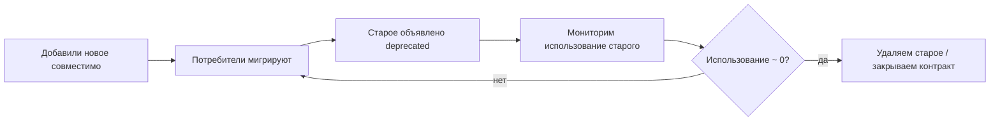

[← Назад к индексу части 9](index.md)

## 9.4. Контракты и версионирование

### Цель раздела

Показать, как проектировать и менять интерфейсы сервисов так, чтобы система могла эволюционировать без постоянных «поломок потребителей»: через совместимость, deprecation и тестирование контрактов.

### В этом разделе главное

- В микросервисах контракт — это «закон»: изменение без правил ломает соседей.
- Лучше всего работает стратегия: **сначала добавляем совместимо, потом плавно убираем**.
- Версионирование — это не «папка v2», а управление жизненным циклом совместимости.
- Contract testing (consumer‑driven) помогает ловить несовместимость до продакшна.

### Термины

- **Backward compatibility** — обратная совместимость: старый клиент продолжает работать.
- **Breaking change** — несовместимое изменение.
- **Deprecation** — объявление устаревания: «будет удалено позже».
- **Consumer‑Driven Contracts (CDC)** — контракты задаются потребителями; провайдер проверяет, что их не ломает.
- **Pact** — один из инструментов CDC‑тестирования.

### Теория и правила

#### 1) Что именно является контрактом

Контракт — это не только JSON‑схема. Обычно включает:

- формат и типы данных;
- обязательность/опциональность полей;
- коды ошибок и их смысл;
- идемпотентность, семантика повторов;
- ограничения (rate limits, размеры);
- SLO/SLA ожидания (время ответа, доступность).

##### Проверь себя (9.4 — что является контрактом)

1. Почему «контракт = JSON‑схема» — слишком узкое и опасное понимание в микросервисах?
2. Приведи пример изменения, которое **не меняет формат**, но ломает контракт “по смыслу”.
3. Какие 2 пункта контракта ты бы явно зафиксировал(а) для критичной операции “списать деньги” кроме схемы?

<details><summary>Ответ</summary>

1. Потому что потребители зависят не только от структуры полей, но и от **семантики, ошибок, идемпотентности, ограничений и ожиданий по времени ответа**. Если это не зафиксировано, независимые деплои начинают ломать друг друга “тихо”.
2. Например, поменять смысл поля `status` (раньше `processing` означал “приняли”, теперь означает “платёж подтверждён”) или поменять смысл кода ошибки (раньше 409 = “уже существует”, теперь 409 = “временно недоступно”).
3. Идемпотентность (как повторять безопасно), и классификацию ошибок/ретраев (что retryable), плюс SLO (таймаут/ожидаемая латентность) и ограничения (лимиты/размеры).

</details>

#### 2) Правило «расширяем, а не ломаем»

Безопасная эволюция обычно выглядит так:

1) Добавить новое поле как **опциональное**.  
2) Потребители начинают его использовать.  
3) После переходного периода можно сделать старое поведение устаревшим и удалить.

В REST часто опасно:

- переименовывать поля;
- менять тип поля (string → number);
- менять смысл кода ошибки.

В protobuf/gRPC есть свои правила совместимости (не переиспользовать номера полей, не менять типы и т.д.).

Практическая памятка «что считается безопасным/опасным»:

| Изменение | REST/JSON (обычно) | Protobuf/gRPC (обычно) | Почему |
|---|---|---|---|
| Добавить новое поле (опционально) | ✅ безопасно | ✅ безопасно | старые клиенты игнорируют/не знают поле |
| Удалить поле | ❌ ломает | ⚠️ ломает (нужно reserve, не переиспользовать) | старые клиенты ждут поле/семантику |
| Переименовать поле | ❌ ломает | ⚠️ зависит (имя не важно, важен номер; но семантика меняется) | клиенты привязаны к имени/семантике |
| Изменить тип поля | ❌ ломает | ❌ ломает | парсинг и логика ломаются |
| Изменить смысл значения/ошибки | ❌ ломает «по смыслу» | ❌ ломает «по смыслу» | формально формат тот же, но ожидания другие |

Смысл таблицы: ломает не только «формат», но и **семантика**. Это ключевая ловушка микросервисов: «мы же JSON не поменяли» не значит «мы не сломали потребителя».

##### Проверь себя (9.4 — расширяем, а не ломаем)

1. Почему добавление опционального поля обычно безопасно, а переименование поля — почти всегда нет?
2. Что означает «breaking change по смыслу»? Приведи пример.
3. В чём отличие совместимости REST/JSON и Protobuf/gRPC в плане “переименования” поля?

<details><summary>Ответ</summary>

1. Опциональное поле старый клиент игнорирует. Переименование — это удаление старого и добавление нового одновременно: старый клиент не найдёт привычное поле.
2. Формат остался, но ожидания изменились. Например, поле `total` теперь включает доставку, хотя раньше было “без доставки”; клиенты продолжают парсить, но бизнес‑логика ломается.
3. В Protobuf имя менее важно, чем **номер поля**, но семантика всё равно важна: “переименование” как косметика может быть ок, но “смена смысла” — ломает. В JSON имя — часть формата, поэтому переименование почти всегда breaking.

</details>

#### 3) Где хранить версии

Это не «единственно правильный» ответ. Практически встречаются:

- **URI versioning**: `/v1/...`, `/v2/...` (видимо, но иногда приводит к «вечной поддержке v1»);
- **header-based**: `Accept: application/vnd...` (сложнее, но гибче);
- **no explicit version + compatibility**: стараемся не ломать, а при сильных изменениях делаем новый endpoint/ресурс.

Главное: версия — это **про жизненный цикл**, а не про красивый URL.

##### Проверь себя (9.4 — где хранить версии)

1. Какой главный риск стратегии `/v1`, `/v2` в реальной компании?
2. Чем “no explicit version + compatibility” отличается от “мы просто не думаем о версиях”?
3. Приведи пример, когда новый endpoint лучше, чем новая версия всего API.

<details><summary>Ответ</summary>

1. Риск “вечного зоопарка версий”: v1 не отключают, потому что кто‑то всё ещё использует, и вы навсегда поддерживаете несколько контрактов.
2. Это осознанная стратегия: вы **системно держите обратную совместимость** и управляете deprecation, а не “ломаете молча”.
3. Когда меняется только часть функциональности: добавить `/orders/{id}/timeline` вместо переворачивания всего `/orders` в v2.

</details>

#### 3.1) Жизненный цикл совместимости (как выглядит процесс)

Чтобы версия/изменение не превращались в хаос, полезно держать «встроенный» процесс deprecation:



Важная мысль: «deprecated» без мониторинга — это просто слово в документации.

##### Проверь себя (9.4 — deprecation lifecycle)

1. Почему без мониторинга deprecation почти бесполезен?
2. Что именно ты бы мониторил(а), чтобы принять решение “можно удалять старое”?
3. Какая самая частая ошибка команд в процессе deprecation?

<details><summary>Ответ</summary>

1. Потому что вы не знаете, использует ли кто‑то старое поведение. Удаление превращается в “лотерею поломок”.
2. Долю/количество запросов к старому endpoint/полям, список потребителей (если известно), окна времени, в которые старое всё ещё используется, и ошибки при миграции.
3. Объявить “deprecated” и забыть: не дать сроков, не собрать метрики использования, не сделать коммуникацию и план отключения.

</details>

#### 4) Consumer‑Driven Contracts: зачем они нужны

Проблема: провайдер думает, что изменение «безопасно», а потребитель оказывается завязан на нюанс.

CDC‑подход:

- потребитель формализует ожидания (контракт);
- провайдер проверяет в CI, что новый релиз контракты не ломает.

Это снижает «сюрпризы» при независимых деплоях.

##### Проверь себя (9.4 — CDC/Pact)

1. Почему “у нас есть OpenAPI” не заменяет CDC?
2. Как CDC помогает независимому деплою провайдера?
3. В чём опасность CDC, если им пользоваться без дисциплины (намёк: «контрактов слишком много»)?

<details><summary>Ответ</summary>

1. OpenAPI описывает провайдера “как он думает”, а CDC фиксирует **реальные ожидания потребителей** (включая нюансы). Они дополняют, а не заменяют друг друга.
2. Провайдер в CI проверяет, что новый релиз не ломает ожидания потребителей, и может выкатываться без синхронной координации.
3. Можно получить “болото контрактов”, если не управлять их жизненным циклом: устаревшие контракты, отсутствует deprecation, каждый потребитель фиксирует случайные детали. Нужна дисциплина: что считаем контрактом, как чистим, кто владелец.

</details>

#### 5) Контракты для событий (async): что именно версионировать

Частая ошибка — считать, что «контракты нужны только для REST/gRPC».  
Но в асинхронном взаимодействии **событие — это тоже контракт**, и ломать его так же опасно.

Полезная рамка:

- **Команда (command)** адресована конкретному получателю: «сделай X» (контракт ближе к API).
- **Событие (event)** публикуется для многих: «случилось Y» (контракт ближе к “public API” для всей компании).

Отсюда практическое следствие: события нужно проектировать особенно аккуратно, потому что у них часто много потребителей (иногда «скрытых»).

**Практические правила совместимости событий**

1. Добавлять новые поля — обычно безопасно (consumer должен игнорировать неизвестное).
2. Удалять/переименовывать/менять тип — почти всегда ломает.
3. Менять семантику события («раньше означало A, теперь B») — ломает даже без изменений формата.
4. Всегда иметь **идентификатор события** (`eventId`) и/или монотонную версию в потоке (`aggregateVersion`) для дедупликации.
5. Думать о событии как о факте прошлого: оно должно быть устойчивым и «не передумывать».

**Мини‑пример: “событие как контракт”**

```json
{
  "eventId": "e_789",
  "type": "OrderCreated",
  "occurredAt": "2026-03-16T12:00:00Z",
  "data": {
    "orderId": "o_123",
    "customerId": "c_5",
    "totalMinor": 19990,
    "currency": "RUB"
  }
}
```

Если позже заменить `totalMinor` на строку `total`, потребители, которые строят проекции/начисления, могут сломаться. Это такой же breaking change, как в REST.

В проде часто используют реестр схем (schema registry) и правила совместимости, но даже без инструментов важно держать принцип: **event schema — контракт**.

##### Проверь себя (9.4 — контракты событий)

1. Почему событие часто требует более строгой совместимости, чем внутренний REST‑endpoint?
2. Какое минимальное поле/идентификатор помогает consumer’ам делать дедупликацию и почему это важно?
3. Приведи пример “ломающей” смены семантики события без смены формата.

<details><summary>Ответ</summary>

1. Потому что у события часто много потребителей, и оно живёт долго: на нём строят проекции, отчёты, интеграции. Ломающее изменение бьёт сразу по многим.
2. `eventId` и/или `(aggregateId, aggregateVersion)` — чтобы распознавать повторы доставки (at‑least‑once) и не применять эффект дважды.
3. Например, `OrderCreated` раньше публиковался после валидации и резервирования, а теперь — “раньше”, до проверки. Формат тот же, но потребители (склад/биллинг) начинают работать с “невалидными” заказами.

</details>

### Пошагово: безопасное изменение API

1. Определи, **что ломается**: формат, смысл, ошибки, последовательность.
2. Если можно — сделай изменение **совместимым** (добавление полей, новые endpoints).
3. Добавь **депрекейшн** старого поведения: документация + заголовки/метрики использования.
4. Дай потребителям время перейти.
5. Удали старое только после подтверждения (или когда это бизнес‑решение).
6. Поддержи процесс **контрактными тестами**.

##### Проверь себя (9.4 — пошагово менять API)

1. Почему “добавить новое поле” — это только начало, а не завершение совместимого изменения?
2. Какой шаг в алгоритме чаще всего пропускают, из‑за чего старое никогда не выключается?
3. Что ты сделаешь, если изменение объективно breaking, но “переписать всех потребителей” невозможно быстро?

<details><summary>Ответ</summary>

1. Потому что нужно управлять миграцией потребителей: документация, сроки, мониторинг использования старого, deprecation и только потом удаление.
2. Мониторинг использования и процесс отключения: без него deprecation не приводит к реальному удалению.
3. Сделать переходный период: новый endpoint/поле + старое ещё работает, инструментировать использование, дать сроки, возможно — адаптер/ACL на стороне потребителя или BFF, чтобы миграция была постепенной.

</details>

### Простыми словами

Контракт — это как «розетка в стене».  
Если ты поменяешь форму розетки, все вилки у соседей перестанут работать.  
Поэтому розетки меняют так: сначала ставят переходник, потом постепенно меняют вилки, и только потом убирают старое.

### Картинка в голове

Контракт — это мост между островами.  
Если ты чинишь мост, не предупредив, люди падают в воду.  
Версионирование — это организация ремонта с временным мостом и планом закрытия старого.

### Как запомнить

> **Сначала добавь, потом переведи, потом убери.**  
> Иначе независимый деплой превращается в синхронный.

### Примеры

#### Пример 1: совместимое расширение REST‑ответа

Было:

```json
{ "orderId": "o_123", "status": "processing" }
```

Стало (совместимо: добавили опциональное поле):

```json
{ "orderId": "o_123", "status": "processing", "estimatedReadyAt": "2026-03-16T12:00:00Z" }
```

Старые клиенты игнорируют новое поле.

##### Проверь себя (9.4 — пример: добавление поля)

1. Почему добавление нового поля безопаснее, чем изменение типа существующего?
2. Что нужно сделать, чтобы новое поле не стало “мёртвым грузом” навсегда?

<details><summary>Ответ</summary>

1. Старые клиенты могут игнорировать неизвестное поле, а изменение типа ломает парсинг и логику.
2. Дать план миграции: обновить потребителей, мониторить использование, затем (если есть старый аналог) объявить deprecation и убрать устаревшее.

</details>

#### Пример 2: опасное изменение (ломающее)

Было:

```json
{ "total": "199.90" }
```

Стало:

```json
{ "total": 199.9 }
```

Если клиенты парсили строку, они сломаются. Это breaking change.

##### Проверь себя (9.4 — пример: смена типа)

1. Почему смена `"199.90"` → `199.9` опасна не только для парсинга, но и для денег?
2. Как безопасно эволюционировать такие поля (минимум 1 стратегия)?

<details><summary>Ответ</summary>

1. Деньги требуют точности: float может дать округления. Плюс ломается тип в клиентах. Это одновременно breaking по формату и риск по бизнес‑точности.
2. Добавить новое поле, например `totalMinor` (в копейках), оставить старое, дать переходный период, затем депрекейтить. Либо ввести объект `{amountMinor, currency}`.

</details>

#### Пример 3: пример контракта ожиданий (идея CDC)

Потребитель «Orders» ожидает, что «Payments» возвращает:

- `paymentId` непустой
- `status` ∈ {`succeeded`, `failed`, `pending`}
- при сетевой ошибке возможны ретраи → операция идемпотентна по `Idempotency-Key`

И в CI провайдера эти ожидания проверяются автоматически.

##### Проверь себя (9.4 — пример: ожидания потребителя)

1. Почему ожидание `status ∈ {succeeded, failed, pending}` — это именно контракт, а не “внутренняя деталь”?
2. Что произойдёт, если провайдер добавит статус `reversed`, а потребитель не готов?

<details><summary>Ответ</summary>

1. Потому что потребитель строит свою логику и состояния на этом множестве значений. Изменение множества — изменение поведения системы.
2. Потребитель может упасть на “неизвестном статусе” или неверно классифицировать его, что приведёт к неправильным статусам заказа/денег. Нужна стратегия: unknown‑safe обработка + совместимое расширение.

</details>

#### Пример 4: «контракт ошибок» (часть интерфейса, которую часто забывают)

Команды часто ломают потребителей не полями, а ошибками. Полезно иметь минимальное соглашение:

- какие классы ошибок бывают (валидация, бизнес‑ошибка, зависимость недоступна);
- как они кодируются (HTTP‑коды, error code, message);
- что безопасно ретраить.

Пример (одна из рабочих схем):

```json
{
  "error": {
    "code": "PAYMENT_PROVIDER_TIMEOUT",
    "message": "Внешний платёжный провайдер не ответил вовремя",
    "retryable": true,
    "traceId": "0af7651916cd43dd8448eb211c80319c"
  }
}
```

Даже если формат ответа не стандартизирован на 100%, поле `retryable` и `traceId` часто резко повышают качество эксплуатации.

##### Проверь себя (9.4 — пример: контракт ошибок)

1. Почему ошибки — это часть контракта так же, как и “успешный ответ”?
2. Чем опасно “всё 500 и один message” для микросервисов?
3. Зачем `traceId` нужен потребителю, а не только провайдеру?

<details><summary>Ответ</summary>

1. Потребитель должен понимать, что делать: ретраить, показать пользователю, отменить процесс, записать инцидент. Без договорённости поведение становится случайным.
2. Нельзя отличить валидацию от деградации зависимости, нельзя корректно ретраить, растут каскады и дубли, ухудшается UX.
3. Он позволяет связать запрос/ошибку с трассировкой и логами провайдера, ускоряя диагностику и снижая “время до понимания”.

</details>

### Практика / реальные сценарии

- независимые релизы разных команд → без контрактов релизы превращаются в «общий поезд»;
- внешний API (партнёры) → deprecation должен быть жёстко управляем: сроки, коммуникация, мониторинг использования.

##### Проверь себя (9.4 — практика)

1. Почему независимые релизы без контрактов обычно приводят к “общему поезду релизов”?
2. Какие 2 элемента процесса deprecation особенно важны, если потребители — внешние партнёры?

<details><summary>Ответ</summary>

1. Потому что любое изменение провайдера может неожиданно сломать потребителя; чтобы избежать инцидентов, команды начинают синхронизировать релизы и “ждать друг друга”.
2. Чёткие сроки и коммуникация (календарь отключения), плюс мониторинг использования старого интерфейса и совместимые переходные механизмы.

</details>

### Типичные ошибки

1. **Версия как оправдание ломать бездумно.** «Ну это v2, пусть перепишут» → вечная поддержка нескольких версий.
2. **Отсутствие deprecation‑процесса.** Старые клиенты живут годами.
3. **Контракт только в голове.** Документация не синхронизирована с реальностью, CI не проверяет.
4. **Ломаем event‑контракты “тихо”.** Добавили событие, потом изменили формат/смысл — и внезапно упали проекции/потребители.

##### Проверь себя (9.4 — типичные ошибки)

1. Почему “версия как оправдание” почти всегда заканчивается поддержкой множества версий навсегда?
2. Чем опасен “контракт только в голове” в команде, которая хочет независимых деплоев?

<details><summary>Ответ</summary>

1. Потому что v1 остаётся у части клиентов, а v2 развивается; без жёсткого deprecation‑процесса выключить v1 сложно и больно, поэтому она остаётся на годы.
2. Потребители и провайдеры начинают жить в разных реальностях: изменения становятся непредсказуемыми, растут инциденты, и независимый деплой превращается в синхронный из страха поломок.

</details>

### Что будет, если…

- **…ломать контракты часто?**  
  Независимый деплой исчезнет: все начнут синхронизировать релизы и бояться изменений.
- **…не версионировать вообще?**  
  Можно, если вы строго держите обратную совместимость. Но если вы «ломаете молча», будет ещё хуже.

##### Проверь себя (9.4 — что будет, если…)

1. Почему частые поломки контрактов убивают мотивацию к рефакторингу и эволюции?
2. В каких случаях “не версионировать” может быть рабочей стратегией, и какое условие делает её безопасной?

<details><summary>Ответ</summary>

1. Потому что любой риск изменения становится слишком дорогим: команды начинают избегать изменений, накапливается архитектурный долг, а любые улучшения требуют “большого общего релиза”.
2. Когда вы дисциплинированно поддерживаете backward compatibility и управляете deprecation. Без этого “не версионировать” превращается в “ломать молча”.

</details>

### Проверь себя

1. Почему «/v2» не решает проблему эволюции само по себе?
2. В чём смысл CDC‑подхода для микросервисов?
3. Почему события (event) обычно требуют более строгой дисциплины совместимости, чем «внутренний HTTP‑метод»?

<details><summary>Ответ</summary>

1. Потому что версия — это только способ разделить интерфейсы, но не заменяет процесс: совместимость, deprecation, сроки, мониторинг использования. Без процесса вы получите зоопарк версий.
2. Он переносит проверку совместимости в CI: провайдер заранее видит, что его изменения ломают конкретных потребителей, и может исправить до релиза.
3. Потому что событие часто имеет **много потребителей** (включая неизвестных заранее) и живёт дольше: на него строят проекции, отчётность, интеграции. Сломанное событие ломает сразу многих и тяжело “откатывается назад”.

</details>

### Запомните

Контракты и их эволюция — это основа независимости микросервисов. Без дисциплины совместимости микросервисы превращаются в сеть взаимных блокировок.

---
