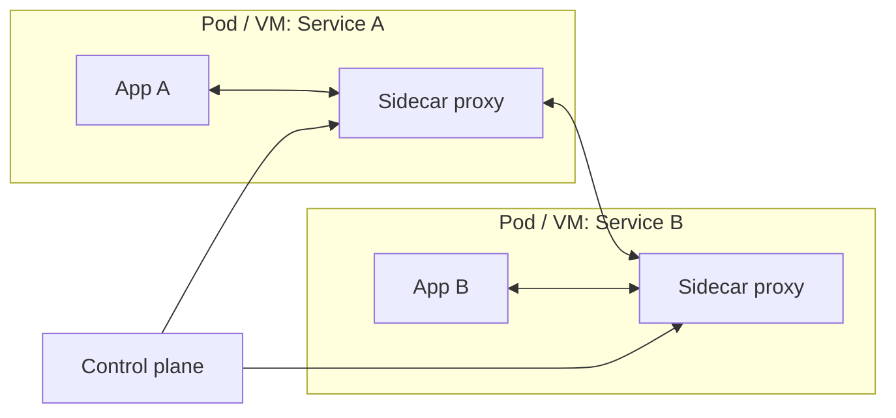
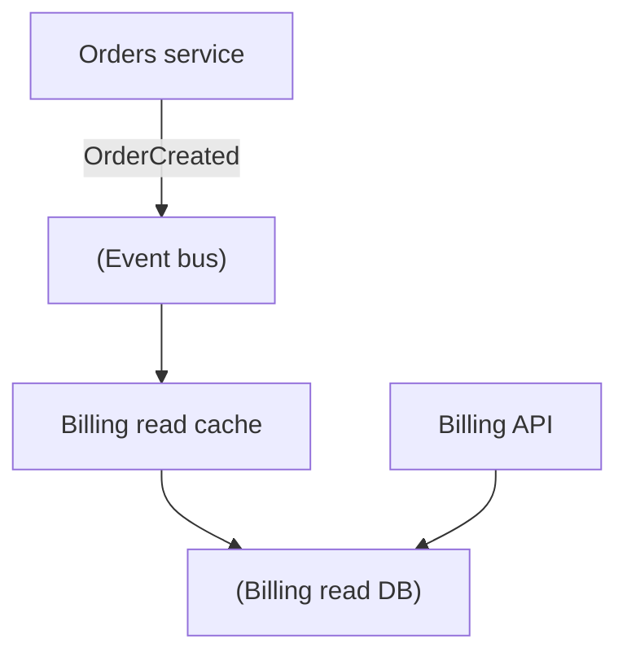
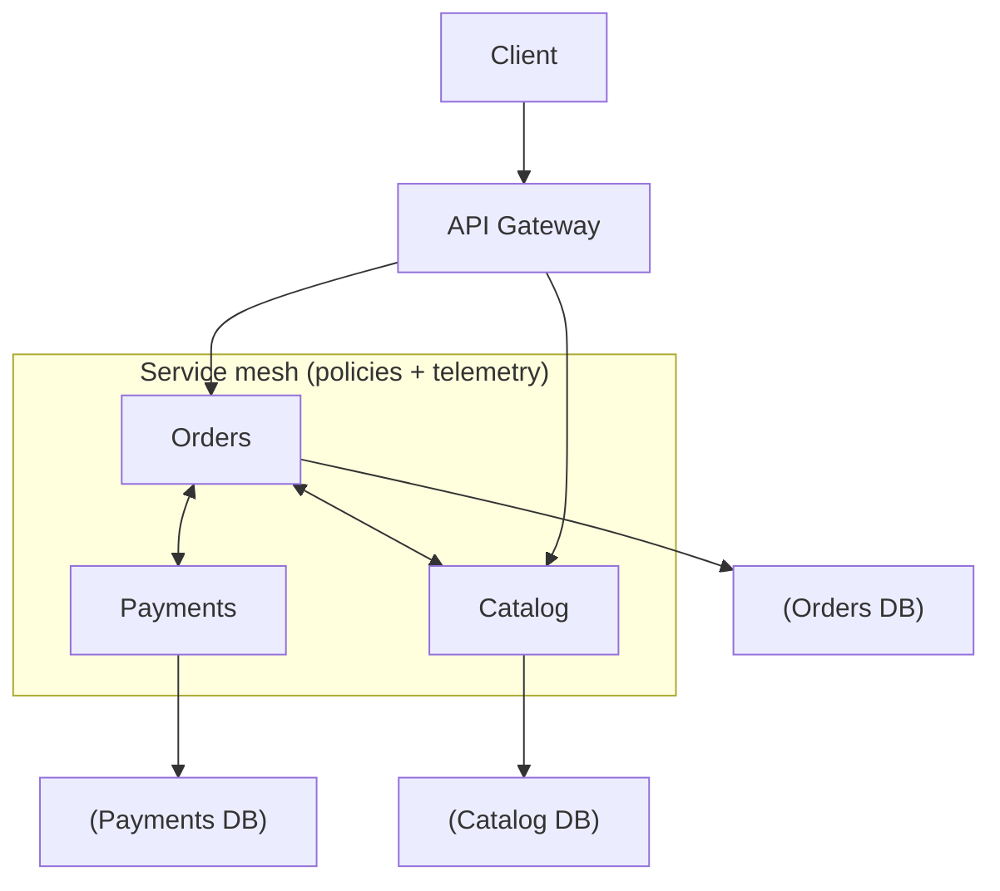

[← Назад к индексу части 9](index.md)

## 9.5. Platform‑паттерны и distributed monolith: как не сломать систему

### Цель раздела

Собрать картину «как это живёт в проде»: где нужны API Gateway и service mesh, почему ownership данных критичен, как выглядит distributed monolith, и как проверять, что микросервисы реально приносят пользу.

### В этом разделе главное

- **API Gateway** решает задачи на границе клиент→система, а не внутри системы.
- **Service mesh** решает сетевые проблемы *между* сервисами (mTLS, retries, телеметрия), но не исправляет плохие границы.
- **Database per service** — фундамент независимости, но переход к нему может быть постепенным.
- Distributed monolith — это когда вы заплатили цену распределённости, но не получили независимости.
- Нужен чек‑лист применимости и «антипаттерн‑детектор».

### Термины

- **North–South traffic** — трафик клиент↔система (вход/выход).
- **East–West traffic** — трафик сервис↔сервис внутри.
- **mTLS** — mutual TLS: взаимная аутентификация сервисов на уровне транспорта.
- **Shared database** — общая БД для нескольких сервисов (часто переходное состояние).
- **Strangler pattern (удушающий плющ)** — постепенная миграция: новый кусок оборачивает/заменяет старый.

### Теория и правила

#### 1) API Gateway: зачем он нужен

Gateway обычно берёт на себя:

- единую точку входа, маршрутизацию;
- аутентификацию/авторизацию на периметре;
- rate limiting, WAF‑функции;
- иногда агрегацию (но тут осторожно: агрегация часто уместнее в BFF — часть 30).

Важно: Gateway — **не** место для бизнес‑логики. Иначе вы просто создадите «периметральный монолит».

Практические «здоровые» задачи gateway (обычно ок):

- **TLS termination** (закончить TLS на периметре);
- **authN/authZ на периметре** (проверка токена/сессии и базовые политики);
- **routing** по URL/хосту, канареечные выкладки на уровне маршрутов (осторожно);
- **rate limiting / throttling**;
- **request/response shaping** (не бизнес‑логика, а, например, нормализация заголовков, размер тела, компрессия);
- **корреляция**: проставить/протащить `traceId`/`requestId`.

Опасные зоны gateway (часто ведут к боли):

- агрегация «всего и сразу» под каждый экран фронтенда (чаще это роль BFF);
- бизнес‑правила («если VIP, то скидка 10%»);
- оркестрация сложных процессов (это либо уровень домена/саги, либо отдельный orchestrator).

##### Проверь себя (9.5 — API Gateway)

1. Почему gateway нельзя превращать в место бизнес‑логики, даже если “так быстрее”?
2. Приведи пример задачи, которая уместна в gateway, и пример задачи, которую лучше держать в BFF/сервисе.
3. Как `traceId/requestId` на периметре помогает бороться с distributed monolith‑симптомами?

<details><summary>Ответ</summary>

1. Потому что gateway становится “периметральным монолитом”: все изменения стекаются в одну точку, релизы связываются, растёт риск и замедление. Он должен оставаться инфраструктурным периметром.
2. Уместно: auth, rate limiting, routing, WAF. Лучше не в gateway: “если VIP — скидка”, “собери 7 сервисов под экран”, “управляй процессом оплаты” — это бизнес‑оркестрация.
3. Он позволяет связывать цепочки вызовов end‑to‑end и быстрее находить, где именно возникли таймауты/ошибки; без корреляции диагностика распределённых цепочек превращается в “угадайку”.

</details>

#### 2) Service mesh: зачем он нужен

Mesh помогает, когда у вас много сервисов и нужно стандартизировать:

- шифрование и идентификация (mTLS);
- политики ретраев/таймаутов;
- сервис‑дискавери, маршрутизация;
- сбор метрик/трейсов.

Но mesh не решает:

- плохие доменные границы;
- отсутствие контрактов;
- общую БД.

Как устроен mesh «в двух словах» (чтобы было меньше магии):

- **data plane** — прокси рядом с каждым сервисом (sidecar), через который проходит трафик;
- **control plane** — «мозг», который раздаёт прокси правила (маршрутизация, mTLS, лимиты).

Упрощённая диаграмма:



Смысл: сервисам не нужно «вшивать» в код mTLS/ретраи/телеметрию — это делает прокси по правилам control plane. Но границы, контракты и данные остаются вашей архитектурной ответственностью.

##### Проверь себя (9.5 — Service mesh)

1. Почему mesh не может “исправить” плохие доменные границы?
2. В чём разница control plane и data plane простыми словами?
3. Приведи пример, когда внедрение mesh преждевременно и добавит больше боли, чем пользы.

<details><summary>Ответ</summary>

1. Потому что mesh управляет транспортом (шифрование, маршрутизация, политики), но не меняет смысл API/событий, ownership данных и связанность бизнес‑операций.
2. Data plane — прокси, через которые идёт трафик. Control plane — система, которая раздаёт этим прокси правила и конфигурацию.
3. Когда сервисов мало и нет зрелой наблюдаемости/процессов: mesh добавит слой “магии”, усложнит отладку и эксплуатацию, а выигрыш будет минимален.

</details>

#### 3) Database per service и консистентность

Если у каждого сервиса своя БД, неизбежно появляется вопрос:

> «Как собрать данные из разных БД в одну картину?»

Ответ обычно один из:

- запрашивать синхронно у источников (простое, но может быть медленно/хрупко);
- строить проекции/кеши через события (сложнее, но устойчивее);
- делать BFF/aggregator, который управляет этим (с осторожностью).

Тут важно не пытаться сделать «распределённые JOIN’ы».

Практические способы «собрать картину» без распределённых JOIN’ов (в рамках микросервисов, без углубления в CQRS/ES):

- **API composition**: один сервис/слой (часто BFF) собирает данные, вызывая источники; плюс — просто; минус — latency и отказоустойчивость.
- **Event-based replication**: сервис публикует событие «изменилось», другой строит локальный read‑кеш/проекцию; плюс — устойчиво и быстро на чтение; минус — нужно принять eventual consistency и обработку дублей/порядка.
- **Отдельный «read model» для отчётности**: данные стекаются (через ETL/стриминг) в аналитическое хранилище. Важно: это не «боевой join», это отдельная задача.

Мини‑диаграмма для event‑based replication:



Billing не ходит в Orders DB, но может держать у себя «нужные кусочки» для быстрых ответов.

##### Проверь себя (9.5 — database per service и “собрать картину”)

1. Почему “распределённые JOIN’ы” почти всегда плохая идея в микросервисах?
2. Чем API composition отличается от event-based replication по trade-offs (latency/устойчивость/сложность)?
3. Какие 2 риска появляются при event-based replication, если не думать про дедупликацию и порядок?

<details><summary>Ответ</summary>

1. Они требуют тесной связности между схемами/данными разных сервисов, делают систему хрупкой и медленной, и возвращают вас к shared DB‑связанности, только через сеть.
2. API composition проще логически, но хуже по latency и каскадам отказов. Event-based replication сложнее (eventual consistency, проекции), но устойчивее и быстрее на чтение.
3. Дубли эффектов (двойное начисление/двойная запись) и некорректные состояния из-за out-of-order обработки.

</details>

#### 3.1) Shared database как переходное состояние (и как из него выходить)

Иногда при миграции из монолита или при «первом разрезе» появляется временный вариант:

- сервисов стало несколько,
- но база пока общая (shared DB).

Это опасно, если становится постоянным. Полезно думать о shared DB как о **переходной стадии со сроком жизни**.

Пошаговый «здоровый» выход (один из практичных сценариев):

1. **Явно назначить владельцев таблиц/схем**: кто имеет право менять схему, кто отвечает за данные.
2. **Запретить прямые чтения/записи чужих таблиц** новому коду (даже если технически можно).
3. Вынести доступ к данным владельца за **контракт** (API/события) и начать переводить потребителей.
4. Перенести данные владельца в отдельную схему/БД и оставить временную синхронизацию, если нужно.
5. Удалить временные «мосты» после миграции.

Ключевой принцип: даже если БД общая физически, **ownership должен стать отдельным логически** как можно раньше.

##### Проверь себя (9.5 — shared DB как переход)

1. Почему shared DB особенно опасна в микросервисах, даже если “мы договорились аккуратно”?
2. Какой шаг из плана выхода самый важный и почему (выбери один и обоснуй)?
3. Как понять, что shared DB перестала быть “временной” и стала “навсегда”?

<details><summary>Ответ</summary>

1. Потому что она создаёт скрытую связанность: схема/транзакции/данные становятся общим контрактом, и независимые изменения невозможны без координации.
2. Обычно ключевой шаг — запрет новых прямых доступов к чужим таблицам и перенос взаимодействий на API/события: без этого вы продолжите наращивать связанность.
3. Когда нет сроков/плана разъезда, новые фичи продолжают читать/писать чужие таблицы, а релизы и изменения схемы всё ещё требуют общей координации.

</details>

#### 4) Distributed monolith: признаки (как диагностировать)

Система похожа на distributed monolith, если:

1. **Общая БД** или прямые запросы к чужим таблицам.
2. **Длинные синхронные цепочки** на каждую операцию.
3. **Связанные релизы**: «если выкатываем Orders, обязательно выкатываем Catalog».
4. **Общая модель в коде** (shared domain library) без строгого версионирования.
5. **Нет наблюдаемости**: инциденты лечатся «по ощущениям».

Ещё два «скрытых» признака, которые часто всплывают позже:

6. **Синхронные контракты везде**, даже там, где можно событиями (каждый экран/операция = цепочка вызовов).
7. **Когнитивная нагрузка растёт быстрее пользы**: чтобы изменить одну фичу, нужно понимать 7 сервисов и 3 очереди — при этом автономности команд нет.

##### Проверь себя (9.5 — distributed monolith)

1. Почему “общая БД” — почти гарантированный маркер distributed monolith?
2. Что хуже: длинные синхронные цепочки или общая модель в коде? Почему ответ зависит от контекста?
3. Придумай 2 действия, которые уменьшают риск distributed monolith без “переписывания всего”.

<details><summary>Ответ</summary>

1. Потому что ownership данных исчезает: все зависят от одной схемы и изменений в ней → релизы и изменения становятся связанными.
2. Оба опасны по‑своему: цепочки дают каскады отказов и latency, общая модель связывает изменения семантики и релизы. Что хуже — зависит от того, где больнее: эксплуатация или эволюция домена.
3. Ввести запрет прямых доступов к чужим таблицам (через контракт), сократить синхронные цепочки переводом части интеграций в события/асинхронность, добавить контрактное тестирование и deprecation‑процесс.

</details>

### Пошагово: чек‑лист применимости микросервисов (перед тем как начинать)

Спроси себя (и команду) честно:

1. **Какая конкретная боль сейчас?** (релизы, скорость, масштабирование, изоляция)
2. Можно ли решить боль **внутри монолита** (модули, границы, CI) дешевле?
3. Есть ли зрелость эксплуатации: CI/CD, мониторинг, on-call?
4. Есть ли готовность к дисциплине контрактов и версионирования?
5. Есть ли организационная причина: несколько автономных команд?

Если ответы слабые — микросервисы почти наверняка дадут больше боли, чем пользы.

##### Проверь себя (9.5 — применимость)

1. Почему “много команд” само по себе не всегда означает “нужны микросервисы”?
2. Назови 2 ситуации, когда лучше сначала сделать модульный монолит.
3. Какие 2 пункта чек‑листа ты бы проверил(а) на практике через факты/метрики, а не “ощущения”?

<details><summary>Ответ</summary>

1. Если нет ownership/контрактов/эксплуатационной зрелости, микросервисы дадут больше координации и инцидентов. Иногда проблема решается границами в монолите и процессами.
2. Когда домен ещё “плавает” и архитектура не устоялась; когда эксплуатационная зрелость низкая и нет боли от релизов/масштабирования.
3. Зрелость наблюдаемости (есть ли корелляция/метрики/трейсы) и фактическая боль релизов (частота конфликтов, время выхода фич), а также наличие связанных релизов сейчас.

</details>

#### 5.1) «Минимальный продовый набор» для микросервисов (без которого будет больно)

Это не отдельная тема плана, но практический минимум, без которого микросервисы быстро превращаются в хаос:

- **единый подход к логированию** + корреляция запросов (`traceId`/`requestId`);
- **метрики** хотя бы по ошибкам/латентности ключевых вызовов;
- **таймауты и лимиты** на сетевые вызовы по умолчанию;
- базовая **автоматизация деплоя** (иначе независимый деплой невозможен);
- договорённость о **версионировании** и deprecation.

Идея простая: микросервисы увеличивают количество «мест, где может сломаться», значит диагностика и дисциплина должны быть лучше, чем в монолите.

##### Проверь себя (9.5 — минимальный продовый набор)

1. Почему без корреляции (`traceId`) микросервисы “темнее”, чем монолит?
2. Какие 2 практики из списка ты бы внедрил(а) первыми для команды без большого DevOps‑опыта и почему?

<details><summary>Ответ</summary>

1. Потому что ошибка “расползается” по нескольким сервисам, и без общего идентификатора вы не можете собрать цепочку событий в одно расследование.
2. Таймауты/лимиты по умолчанию и единое логирование/корреляция: они сразу снижают каскады и ускоряют диагностику. Затем — базовый CI/CD для повторяемых деплоев.

</details>

### Простыми словами

Gateway — это «вахтёр» на входе в здание.  
Mesh — это «правила коридоров и дверей внутри здания».  
Если комнаты (границы сервисов) спроектированы плохо, ни вахтёр, ни правила коридоров не спасут.

### Картинка в голове

```text
Client
  |
  v   (north-south)
Gateway
  |
  v
Service A <--> Service B <--> Service C   (east-west)
   \            |             /
   (own DB)   (own DB)     (own DB)
```

### Как запомнить

- **Gateway = периметр** (client→backend).
- **Mesh = внутренности** (service→service).
- **Data ownership = независимость**.

### Примеры

#### Пример: схема «клиент → gateway → сервисы» с mesh‑политиками (упрощённо)



##### Проверь себя (9.5 — пример: gateway + mesh)

1. Где проходит граница north–south и east–west на этой схеме?
2. Почему policies mesh могут быть полезны, но опасны при неправильных ретраях?

<details><summary>Ответ</summary>

1. North–south: Client → Gateway. East–west: Orders ↔ Payments ↔ Catalog внутри mesh.
2. Полезны стандартизацией таймаутов/ретраев/mTLS, но если ретраи настроены агрессивно, они усиливают перегруз и запускают лавинообразные деградации.

</details>

#### Пример: «периметральный монолит» как антипаттерн

Если в Gateway начинает жить агрегация всех бизнес‑кейсов и логика:

- он становится bottleneck’ом;
- его нельзя менять быстро;
- он повторяет проблему монолита, но ещё и на периметре.

Это частая ошибка, особенно без BFF‑слоя.

##### Проверь себя (9.5 — периметральный монолит)

1. Чем “периметральный монолит” отличается от полезного gateway?
2. Какой симптом в разработке/релизах первым выдаст, что gateway превратился в монолит?

<details><summary>Ответ</summary>

1. В периметральном монолите живёт бизнес‑логика и оркестрация, изменения стекаются туда. Полезный gateway — инфраструктурный периметр без бизнес‑правил.
2. Почти любая продуктовая фича требует правки gateway, и релизы начинают блокировать друг друга: “нельзя выкатить без изменения gateway”.

</details>

### Практика / реальные сценарии

- **Сценарий: рост числа сервисов → одинаковые таймауты/ретраи**  
  Mesh позволяет стандартизировать сетевое поведение, но нужно иметь правила, иначе ретраи могут усилить перегруз.

- **Сценарий: временно общая БД при миграции**  
  Иногда допустимо, но только как переходное состояние: фиксируйте план разъезда владения данными (иначе так и останетесь в shared DB навсегда).

##### Проверь себя (9.5 — практика)

1. Почему “одинаковые ретраи у всех” могут неожиданно ухудшить систему при деградации?
2. Какое одно правило поможет удержать shared DB в статусе “переходной”, а не “постоянной”?

<details><summary>Ответ</summary>

1. Потому что ретраи усиливают нагрузку на деградирующую зависимость. Если все сервисы ретраят одинаково и синхронно, можно получить лавину повторов и самоуничтожение системы.
2. Запрет новых прямых доступов к чужим таблицам и перевод интеграций на API/события с чётким ownership.

</details>

### Типичные ошибки

1. **Внедрять mesh «потому что все внедряют».** Это сильный инструмент, но он добавляет слой сложности.
2. **Считать, что gateway/mesh заменяют контракты.** Они не решают совместимость и смысл.
3. **Делать distributed monolith и называть это микросервисами.** Самообман опасен: цена уже есть, пользы нет.

##### Проверь себя (9.5 — типичные ошибки)

1. Почему mesh/gateway не могут “заменить” дисциплину контрактов?
2. Как распознать, что вы платите цену микросервисов, но не получаете независимости (назови 2 признака)?

<details><summary>Ответ</summary>

1. Потому что они управляют транспортом и периметром, но не определяют смысл API/событий, совместимость и ownership данных.
2. Связанные релизы и общая БД/чужие таблицы; длинные синхронные цепочки; общая модель без версионирования.

</details>

### Что будет, если…

- **…ввести gateway, но не решить границы и данные?**  
  Клиентам станет проще, но внутри будет хаос; проблемы просто «переедут» за gateway.
- **…ввести mesh без наблюдаемости и культуры SLO?**  
  Можно получить «магический слой», который никто не понимает; инциденты станут ещё сложнее.

##### Проверь себя (9.5 — что будет, если…)

1. Почему “магический слой” (mesh без культуры) делает инциденты сложнее, а не проще?
2. Какой минимальный элемент наблюдаемости должен быть, чтобы mesh приносил пользу?

<details><summary>Ответ</summary>

1. Потому что появляется дополнительный уровень маршрутизации/ретраев/политик, который влияет на поведение, но не прозрачен команде. Без метрик/трейсов сложно понять, “что реально произошло”.
2. Корреляция запросов (traceId) + метрики латентности/ошибок на межсервисных вызовах, чтобы видеть эффект политик mesh.

</details>

### Проверь себя

1. Назови минимум 4 признака distributed monolith.
2. Почему gateway не должен содержать бизнес‑логику?
3. Что даст service mesh, а что он не даст никогда?
4. Почему «shared database при миграции» допустим только как переходная стадия?

<details><summary>Ответ</summary>

1. Общая БД/чужие таблицы, длинные синхронные цепочки, связанные релизы, общая модель в коде без версионирования, отсутствие наблюдаемости.  
2. Потому что он станет центральным bottleneck’ом и «периметральным монолитом»: любая правка бизнеса будет требовать правок gateway, релизы снова станут связанными.  
3. Даст стандартизацию сетевых политик и телеметрии, mTLS, маршрутизацию и контроль трафика. Не даст правильных доменных границ, владения данными и здоровых контрактов.
4. Потому что shared DB сохраняет скрытую связанность (схема, транзакции, модель данных). Если не поставить срок и план разъезда ownership, вы закрепите distributed monolith и потеряете независимую эволюцию.

</details>

### Запомните

Микросервисы в проде держатся на трёх столпах: **границы**, **контракты**, **эксплуатационная дисциплина**. Gateway и mesh — инструменты, а не цель. Distributed monolith — главный враг, потому что он объединяет худшее из двух миров.

### Чек‑лист готовности к микросервисам (с привязкой к частям 31–32)

Если вы хотите “перейти к микросервисам”, проверьте не лозунги, а готовность по осям. Это не “всё или ничего”: чек‑лист помогает понять, **что укрепить первым**.

| Ось | Минимум «можно пробовать» | Где в плане разбирать глубже |
| --- | --- | --- |
| **Границы и ownership** | домены выделены, есть ответственность команд/владельцев, нет прямых доступов к чужим данным | части 5, 33 |
| **Контракты и совместимость** | схема/контракт фиксируются, есть deprecation‑правила, есть проверки совместимости (CDC) | части 15–17, 30 |
| **Наблюдаемость** | можно ответить “что сломалось за 5 минут”: трейсы/метрики/логи, понятный `trace_id` | часть 31 |
| **Устойчивость на границах** | таймауты, retry‑политики, ограничение каскадов (circuit breaker), идемпотентность | части 19, 31 |
| **Деплой и откат** | есть CI/CD, canary/blue‑green хотя бы для 1–2 сервисов, понятный rollback | часть 20 |
| **Документация решений и миграции** | решения фиксируются (ADR), есть план “as‑is → to‑be” без big‑bang | часть 32 |
| **Операционная дисциплина** | есть on-call/ответственность, процесс инцидентов, известные SLO для критических потоков | части 31–32 |

Быстрая практика: выбери 2 оси, которые слабее всего у вас сейчас, и сделай их целью на ближайшие 2–4 недели. Это часто ускоряет развитие больше, чем “нарезать ещё 5 сервисов”.

---
