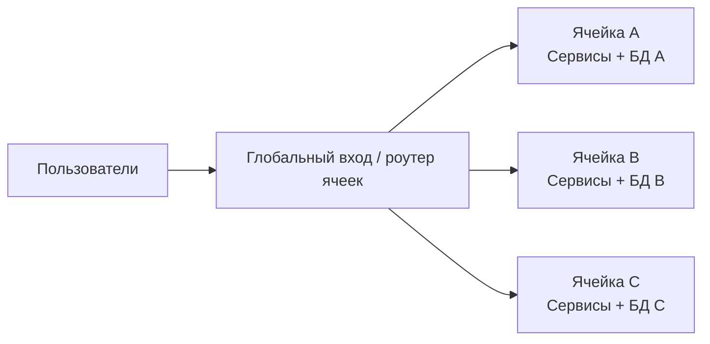

[← Назад к индексу части 10](index.md)

## 10.1. Интуиция cell‑based архитектуры и отличие от микросервисов

### Цель раздела

Сформировать у тебя **интуитивную картину**, что такое cell‑based архитектура: как она выглядит на схеме, какие проблемы решает, чем отличается от «обычных» микросервисов и кластеров.

### В этом разделе главное

- Cell‑based архитектура — это **про разрез системы на независимые «ячейки»**, а не про размер сервисов.
- Ячейка — это **полноценная мини‑копия системы** для части трафика/пользователей.
- Основная мотивация — **ограничить радиус поражения (blast radius)** и упростить масштабирование.
- Микросервисы и кластеры **не исчезают**: ячейка обычно строится **поверх микросервисной архитектуры** и инфраструктуры оркестрации.

#### Проверь себя: главное (10.1)

1. Почему утверждение «у нас много сервисов — значит у нас cell‑based архитектура» неверно?

   <details><summary>Ответ</summary>
   Потому что cell‑based — это не про количество сервисов, а про **единицу изоляции**: ячейка содержит **полный стек** (сервисы + данные + инфраструктура) для части пользователей/трафика.  
   Можно иметь много сервисов и при этом один общий контур (общая инфраструктура и общий blast radius) — это не cell‑based.
   </details>

2. В чём «основная мотивация» (blast radius) отличается от мотивации микросервисов «независимый деплой»?

   <details><summary>Ответ</summary>
   Независимый деплой — мотивация про **скорость изменений и границы функциональности** (микросервисы).  
   Blast radius — мотивация про **масштаб последствий инцидента**: сколько пользователей потеряют сервис при сбое одного контура.  
   Ячейки вводят, когда независимый деплой уже есть (или почти есть), но инциденты всё равно «слишком большие».
   </details>

3. Назови один пример, когда микросервисы уместны, но cell‑based подход — пока нет.

   <details><summary>Ответ</summary>
   Например, несколько команд развивают продукт с разными доменами, им нужен независимый релиз, но система ещё помещается в один регион/кластер, а инциденты имеют ограниченный масштаб.  
   Тут микросервисы могут дать выигрыш, а cell‑based добавит ненужную операционную сложность.
   </details>

### Термины

- **Ячейка (cell)** — независимый набор сервисов, данных и инфраструктуры для части трафика.
- **Blast radius** — радиус поражения при сбое.
- **Кластер** — группа машин/нод, на которых крутятся сервисы (например, кластер Kubernetes).
- **Cell‑based архитектура** — способ организовать систему как набор ячеек.
- **Data residency** — требование хранить данные в определённом регионе (регуляторика).

### Теория и правила

#### Размер ячейки и критерии разбиения

Важный вопрос: **на сколько пользователей/тенантов/регионов рассчитана одна ячейка?**

Слишком **крупные** ячейки:
- не достигают цели ограничения blast radius;
- БД и сервисы остаются перегруженными.

Слишком **мелкие** ячейки:
- растут операционные издержки (много копий стека, много деплоев, много мониторинга);
- сложнее управлять версиями и обновлениями;
- стоимость инфраструктуры резко растёт.

Эвристики для размера ячейки:
- **По тенантам:** один крупный enterprise‑клиент = одна ячейка; мелкие клиенты делят общую ячейку.
- **По регионам:** один регион (EU, US, APAC) — часто одна или несколько ячеек внутри региона.
- **По трафику:** 5–15% пользовательской базы на ячейку — типичный диапазон, чтобы баланс «изоляция vs операционные расходы» сохранялся.

##### Проверь себя: размер ячейки

1. Почему «слишком крупная ячейка» и «слишком мелкая ячейка» — это **разные** виды проблем? В чём их отличие?

   <details><summary>Ответ</summary>
   Слишком крупная ячейка — это проблема **изоляции и предсказуемости**: blast radius остаётся большим, перегруженные БД/сервисы остаются перегруженными.  
   Слишком мелкая ячейка — это проблема **операционных издержек**: много копий стека, сложное управление версиями, дорогой мониторинг и деплой, рост стоимости инфраструктуры.  
   Одно лечится «делить сильнее», другое — «укрупнять/сокращать количество ячеек и автоматизировать управление».
   </details>

2. Приведи пример, когда критерий «по трафику» плох, а критерий «по регионам» — хороший.

   <details><summary>Ответ</summary>
   Когда есть требования data residency (например, EU‑данные не могут покидать EU) или сильная зависимость от латентности по регионам.  
   Разделение по трафику (hash userId) может «перемешать» EU/US пользователей и усложнить соблюдение регуляторики, а региональные ячейки естественно держат данные и обработку внутри региона.
   </details>

3. Дай практическое правило: какой один вопрос ты задашь бизнесу, чтобы выбрать между «ячейки по тенантам» и «ячейки по регионам»?

   <details><summary>Ответ</summary>
   «Что для нас важнее: **жёсткая изоляция клиентов (тенантов)** или **локализация по географии/регуляторике и латентности**?»  
   Если важнее изоляция крупных клиентов и “noisy tenant” — чаще tenant‑based. Если важнее география и data residency — чаще region‑based.
   </details>

#### Cell‑based vs шардирование БД

Полезно отличать:

| Аспект | Шардирование БД | Cell‑based архитектура |
|--------|-----------------|-------------------------|
| **Что режется** | Только данные (таблицы, партиции) | Весь стек: сервисы + БД + кэши + очереди |
| **Изоляция сбоев** | Падение шарда влияет на часть данных; сервисы могут быть общими | Падение ячейки изолировано: свои сервисы и данные |
| **Масштабирование** | Добавляем шарды; общая прикладная логика | Добавляем ячейки; каждая — мини‑прод |
| **Регуляторика (data residency)** | Можно хранить данные региона в своём шарде, но прикладной слой часто общий | Полная локализация: и данные, и код в регионе |

Cell‑based — это **следующий уровень** после шардирования: когда даже разделённые по шардам данные не спасают от «одного большого blast radius», потому что сервисы, очереди и инфраструктура всё ещё общие.

##### Проверь себя: сравнение с шардированием

1. В каком сценарии **шардирование БД** может быть достаточным, а вводить ячейки преждевременно?

   <details><summary>Ответ</summary>
   Когда проблема — в масштабе данных и нагрузке на БД (чтение/запись), но прикладной слой и инфраструктура остаются управляемыми, а blast radius инцидентов приемлем.  
   Тогда шардирование (плюс кэширование/репликация) может решить задачу без дублирования целого стека.
   </details>

2. Назови одну причину, почему «у нас шарды по регионам» всё ещё может давать большой blast radius.

   <details><summary>Ответ</summary>
   Если прикладной слой и инфраструктура остаются общими (один кластер, одна очередь, общий Auth/Billing), то инцидент на этом общем слое затронет всех — независимо от того, как разрезаны данные.
   </details>

3. Что именно в cell‑based подходе делает его сильным инструментом для data residency?

   <details><summary>Ответ</summary>
   Полная локализация контура: не только данные, но и **обработка запросов** и инфраструктура находятся в регионе. Это проще доказать и поддерживать, чем модель «данные в регионе, но сервисы общие».
   </details>

Интуитивно:

- При обычной микросервисной архитектуре у нас есть:
  - множество сервисов;
  - один или несколько кластеров;
  - данные могут быть разделены (database per service, шарды), но **часто логически система воспринимается как одна**.
- При cell‑based подходе мы **делим не только данные, но и весь стек**:
  - каждый «кусок» пользователей обслуживается **своей копией сервисов и БД**;
  - сбой в одной копии **не обязан «ронять» остальных**.

Можно сформулировать несколько правил:

1. **Единица изоляции — ячейка.**  
   Решение «что может сломаться независимо» принимается на уровне ячеек, а не только отдельных сервисов.

2. **Единица масштабирования — ячейка.**  
   Мы можем добавлять новые ячейки (например, ещё один регион или ещё один «шард» трафика), не меняя архитектуру внутри ячейки.

3. **Ячейка — не обязательно физический кластер.**  
   Можно иметь несколько ячеек в одном физическом кластере (логическая изоляция), но по мере роста целесообразно **разводить их и физически**.

4. **Data residency (локализация данных).**  
   Требования регуляторики (GDPR и др.) часто диктуют: данные граждан EU должны храниться и обрабатываться **только в EU**. Region‑based ячейки — естественный способ соблюдать data residency: ячейка EU физически в EU, данные не покидают регион.

##### Проверь себя: правила cell‑based (10.1)

1. Придумай два примера «что может сломаться независимо» на уровне **сервиса** и на уровне **ячейки**. Почему эти уровни не надо путать?

   <details><summary>Ответ</summary>
   На уровне сервиса: упал сервис `Recommendations` — ломается рекомендация, но каталог/заказы могут жить.  
   На уровне ячейки: упала ячейка EU — пользователи EU частично/полностью теряют сервис, но US/APAC продолжают работать.  
   Не надо путать, потому что сервисная устойчивость не гарантирует маленький blast radius: если сервисы распределены, но общая инфраструктура/данные/регион — инцидент может быть «всё равно большой».
   </details>

2. Почему «ячейка не обязательно физический кластер» — полезное уточнение? Какой риск появляется, если считать, что ячейка всегда = отдельный кластер?

   <details><summary>Ответ</summary>
   Полезно, потому что на ранних стадиях можно делать **логическую изоляцию** (в одном кластере) и не платить сразу максимальную цену инфраструктуры.  
   Риск «ячейка всегда отдельный кластер» — преждевременное усложнение: слишком много кластеров, огромная операционная нагрузка ещё до того, как появились реальные требования.
   </details>

3. Что именно меняется в архитектурном решении, когда появляется требование **data residency**?

   <details><summary>Ответ</summary>
   Появляется жёсткая привязка: не только данные, но и обработка запросов и инфраструктура должны быть в регионе.  
   Это подталкивает к region‑based ячейкам и к детерминированной маршрутизации по региону пользователя/тенанта, а также к отказу от глобальных «общих» хранилищ для персональных данных.
   </details>

### Простыми словами

Представь себе огромный развлекательный парк. Там есть:

- один главный вход;
- десятки аттракционов и сервисов;
- тысячи посетителей.

Можно сделать парк **одной большой зоной**: если электричество вырубилось — **падает всё**.  
Можно разбить парк на **несколько независимых зон**:

- у каждой есть **свой набор аттракционов, кафе, персонала**;
- если в одной зоне проблемы, **остальные продолжают работать**;
- посетителей распределяют по зонам так, чтобы **ни одна не была перегружена**.

Cell‑based архитектура — это такой «парк из зон» в мире бэкенда.

### Картинка в голове

Пусть у нас есть приложение, где все пользователи живут в одной общей системе:


В cell‑based подходе мы **делим систему на несколько ячеек**, каждая из которых может обслуживать часть пользователей:



Каждая ячейка выглядит **почти как отдельный прод**.

Визуальное сравнение: **шардирование vs cell‑based**

```
Шардирование БД (только данные разнесены):
┌─────────────────────────────────────────────────────────────┐
│  Общие сервисы (один кластер)                                 │
│  ┌─────────┐ ┌─────────┐ ┌─────────┐                         │
│  │  Auth   │ │ Orders  │ │Payment  │  ───►  Шард 1  Шард 2   │
│  └─────────┘ └─────────┘ └─────────┘       (EU)     (US)     │
│  При падении кластера — падает ВСЁ                            │
└─────────────────────────────────────────────────────────────┘

Cell-based (полный стек на ячейку):
┌───────────────────┐  ┌───────────────────┐  ┌───────────────────┐
│ Ячейка EU         │  │ Ячейка US         │  │ Ячейка APAC       │
│ Сервисы + БД +    │  │ Сервисы + БД +    │  │ Сервисы + БД +    │
│ кэши + очереди    │  │ кэши + очереди    │  │ кэши + очереди    │
│ Падение EU ≠ US   │  │ Падение US ≠ EU   │  │ Падение APAC ≠ *  │
└───────────────────┘  └───────────────────┘  └───────────────────┘
```

##### Проверь себя: «картинка в голове» и сравнение

1. В ASCII‑схеме почему при шардировании написано «при падении кластера — падает ВСЁ», даже если шарды разные?

   <details><summary>Ответ</summary>
   Потому что в схеме **общий кластер сервисов** — единая точка отказа. Шарды разделяют данные, но не обязательно разделяют инфраструктуру и вычисления.  
   Если общий кластер/общий gateway/общая очередь упали, шарды сами по себе не спасают.
   </details>

2. Какой минимальный вопрос ты задашь, чтобы понять, «живём мы в мире шардирования или в мире ячеек»?

   <details><summary>Ответ</summary>
   «Если падает один контур (регион/кластер), остальные продолжают обслуживать **своих** пользователей?»  
   Если да и контур включает сервисы+данные — это ближе к ячейкам. Если данные разделены, но инфраструктура общая и падение “роняет всех” — это ближе к шардированию/общему контуру.
   </details>

3. Почему в cell‑based схеме важно, чтобы «падение EU ≠ US» было истинным не только для БД, но и для gateway/очередей/кэша?

   <details><summary>Ответ</summary>
   Потому что иначе общий компонент станет скрытой «точкой отказа» и увеличит blast radius.  
   Ячейка как мини‑прод должна быть самодостаточной: если общий gateway/очередь общие, то сбой в них затронет все ячейки.
   </details>

### Как запомнить

- **Микросервисы** отвечают на вопрос: «**как разделить систему по функциональности**?».
- **Cell‑based архитектура** отвечает на вопрос: «**как разделить систему по трафику и отказоустойчивости**?».

Можно запомнить формулу:

> **Функциональный разрез → микросервисы, эксплуатационный разрез → ячейки.**

##### Проверь себя: формула

1. Приведи пример «функционального разреза» и пример «эксплуатационного разреза» для интернет‑магазина.

   <details><summary>Ответ</summary>
   Функциональный: отдельные домены/сервисы «Каталог», «Заказы», «Платежи».  
   Эксплуатационный: отдельные ячейки «EU» и «US» (или ячейки по тенантам) — каждая содержит нужные сервисы и свои данные.
   </details>

2. Что произойдёт, если перепутать разрезы и сделать «ячейки по функциональности» (например, “ячейка заказов”, “ячейка платежей”)?

   <details><summary>Ответ</summary>
   Это будет похоже на разрез **по слоям/частям домена**, а не на изоляцию по пользователям/трафику.  
   Запрос пользователя начнёт “путешествовать” между «ячейками», появятся кросс‑контурные зависимости, а цель ограничить blast radius не будет достигнута.
   </details>

3. Когда формула подсказывает, что «пора думать о ячейках», даже если микросервисы уже внедрены?

   <details><summary>Ответ</summary>
   Когда эксплуатационные боли доминируют: инциденты слишком масштабные, требования региональной изоляции/регуляторики, необходимость изоляции «шумных» тенантов, предсказуемое масштабирование через добавление контуров.
   </details>

### Примеры

1. **Большая соцсеть**  
   - В начале — один огромный монолит, одна БД.  
   - Потом — микросервисы, всё равно одна логическая система.  
   - На масштабах сотен миллионов пользователей даже микросервисы в одном кластере и одной/нескольких БД начинают страдать: проблемы репликации, большие blast radius инцидентов.  
   - Решение: **разделить пользователей на «острова» (cells)**, где каждый остров обслуживает ограниченное количество пользователей.

2. **SaaS для крупных enterprise‑клиентов**  
   - Каждому крупному клиенту нужен **свой изолированный контур** (данные, конфигурации, интеграции).  
   - Вместо одной мульти‑тенантной БД можно сделать **ячейки по тенантам**: каждая ячейка — свой набор сервисов и БД для клиента.

##### Проверь себя: примеры

1. В примере «большая соцсеть» какие два признака подсказывают, что проблемы уже не только «про код», а про **масштаб контуров**?

   <details><summary>Ответ</summary>
   (1) Массовые инциденты с большим blast radius (“падает много пользователей одновременно”).  
   (2) Огромные БД/репликации и инфраструктурные ограничения, которые сложно лечить только рефакторингом сервисов.
   </details>

2. В примере SaaS по тенантам: почему «ячейка на тенанта» может быть лучше, чем «одна общая мульти‑тенантная система»?

   <details><summary>Ответ</summary>
   Потому что изоляция снижает влияние noisy tenant: нагрузка, инциденты, интеграции и деплои для крупного клиента не ломают остальных.  
   Кроме того, проще соблюдать требования по безопасности/комплаенсу и делать индивидуальные изменения под крупного клиента, не затрагивая всех.
   </details>

3. Как бы ты проверил(а), что «ячейка на тенанта» действительно снижает blast radius, а не создаёт новый общий bottleneck?

   <details><summary>Ответ</summary>
   Я проверил(а) бы наличие shared‑компонентов: общий Auth/Billing/очередь/мониторинг.  
   Если ключевые компоненты shared и без резервирования, то сбой в них всё равно “роняет всех”, и blast radius остаётся большим.
   </details>

### Практика / реальные сценарии

- Cell‑based архитектура практически всегда появляется **не на старте**, а как ответ на:
  - постоянные инциденты, которые «роняют пол‑мира»;
  - сложности с масштабированием «одной большой системы»;
  - требования регуляторики по регионам/тенантам.
- Ты можешь **услышать** о cell‑based архитектуре в контексте:
  - крупных клауд‑платформ;
  - соцсетей и мессенджеров;
  - банковских платформ и платёжных систем.

##### Проверь себя: практические триггеры (10.1)

1. Почему «постоянные инциденты, которые роняют пол‑мира» — это сигнал именно про **единицу изоляции**, а не только про «надо переписать сервис»?

   <details><summary>Ответ</summary>
   Потому что проблема в масштабе последствий: один сбой затрагивает слишком много пользователей.  
   Даже идеально написанный сервис может быть частью общего контура (общая инфраструктура/общие зависимости), и тогда сбой/перегрузка всё равно имеет большой blast radius. Ячейки меняют именно **границы контура**.
   </details>

2. Почему требования регуляторики (data residency) часто ведут именно к **region‑based ячейкам**, а не к «просто шифруем данные»?

   <details><summary>Ответ</summary>
   Регуляторика часто требует не только шифрования, но и **физической локализации хранения и обработки** (где находятся сервера/облако, где выполняется обработка персональных данных).  
   Region‑based ячейка помогает выполнить это требование архитектурно: данные и обработка остаются в регионе.
   </details>

3. На каком масштабе обычно впервые появляется разговор о cell‑based подходе: «у нас 2 сервиса» или «у нас десятки сервисов/команд»? Почему?

   <details><summary>Ответ</summary>
   Чаще — когда уже есть **десятки сервисов/команд**, и эксплуатационная сложность и blast radius становятся критичными.  
   На маленьком масштабе цена управления ячейками почти всегда выше пользы.
   </details>

### Типичные ошибки

- Путать **ячейку** с **микросервисом** («каждый микросервис — это ячейка» — нет).
- Пытаться **начать архитектуру сразу с ячеек**, не имея даже устойчивых микросервисов.
- Считать, что cell‑based подход **автоматически решает все проблемы** производительности и отказоустойчивости.

##### Проверь себя: типичные ошибки (10.1)

1. Какой простой критерий поможет отличить «ячейку» от «сервиса» в споре на дизайн‑ревью?

   <details><summary>Ответ</summary>
   Ячейка должна быть **самодостаточным контуром** для части пользователей/трафика: сервисы + данные + инфраструктура.  
   Если речь идёт про один сервис без собственной изоляции данных/инфраструктуры — это не ячейка.
   </details>

2. Почему опасно считать, что cell‑based автоматически решит производительность?

   <details><summary>Ответ</summary>
   Потому что cell‑based решает в первую очередь **изоляцию и масштабирование через контуры**, но не отменяет проблем: плохих запросов, отсутствия кэша, узких мест в конкретных сервисах, неправильных индексов, перегрузки внешних зависимостей.  
   Без базовой инженерной гигиены вы получите «много медленных контуров» вместо одного.
   </details>

3. Какую «домашнюю работу» стоит сделать до разговоров о ячейках, если у вас хаос микросервисов?

   <details><summary>Ответ</summary>
   Навести порядок в границах и владении данными: убрать shared‑таблицы, стабилизировать контракты, сократить каскадные синхронные цепочки, наладить наблюдаемость и CI/CD.  
   Иначе ячейки просто размножат хаос.
   </details>

### Что будет, если…

- Если внедрить cell‑based архитектуру **слишком рано**, то:
  - усложнится инфраструктура;
  - вырастет стоимость поддержки;
  - команда будет тратить силы на управление ячейками вместо продуктовой ценности.

- Если **не рассматривать cell‑based подход**, когда система давно выросла за пределы одного кластера/региона, то:
  - каждое падение затрагивает слишком много пользователей;
  - миграции и эксперименты становятся **слишком рискованными**.

##### Проверь себя: последствия (10.1)

1. Почему «слишком рано внедрили ячейки» часто превращается в падение скорости разработки?

   <details><summary>Ответ</summary>
   Потому что появляется много дополнительной работы: поддержка нескольких контуров, маршрутизация, деплой по ячейкам, мониторинг, инциденты.  
   Если бизнес‑боли масштаба ещё нет, эта работа не окупается и съедает время команды.
   </details>

2. Почему «слишком поздно задумались о ячейках» делает миграции опасными?

   <details><summary>Ответ</summary>
   Потому что система уже большая, тесно связанная, и любые изменения затрагивают много пользователей.  
   Без изолированных контуров сложно сделать безопасный эксперимент/пилот, а цена ошибки высока — вы можете «уронить всех».
   </details>

3. Назови один компромиссный шаг «между» микросервисами и ячейками, если ячейки ещё рано.

   <details><summary>Ответ</summary>
   Например, шардирование/репликация данных + усиление устойчивости (timeouts, circuit breaker, rate limiting) + улучшение наблюдаемости, а также организация «пилотного контура» для нового региона без полного размножения всего стека.
   </details>

### Проверь себя

1. Чем отличается **cell‑based архитектура** от просто **нескольких кластеров с одинаковым набором сервисов**?

   <details><summary>Ответ</summary>
   Несколько кластеров сами по себе ещё не дают **логической организации по ячейкам**:  
   - может не быть явного правила **какие пользователи в какой кластер попадают**;  
   - данные могут быть общими;  
   - нет чёткой **единицы изоляции и масштабирования**.  
   Cell‑based архитектура подразумевает, что каждая ячейка — **осознанная граница**: свои данные, свои сервисы, свой blast radius.
   </details>

2. Почему ячейку удобно описывать как **«мини‑прод»**?

   <details><summary>Ответ</summary>
   Потому что в ячейке есть всё, что нужно для обслуживания части пользователей:  
   - бизнес‑сервисы;  
   - базы данных;  
   - кэши, очереди, мониторинг.  
   То есть это **самодостаточная копия системы** для определённой доли трафика — ровно как отдельный прод, но в рамках общего продукта.
   </details>

3. В чём основная **мотивация** перехода к cell‑based архитектуре?

   <details><summary>Ответ</summary>
   Ограничить **радиус поражения** (blast radius) инцидентов и получить **управляемое масштабирование**:  
   - если одна ячейка перегружена или сломалась, остальные продолжают работать;  
   - можно добавлять новые ячейки или перераспределять пользователей между ними.  
   Это важно на масштабах, когда «упал один кластер — упал весь мир» становится неприемлемым.
   </details>

4. Почему **слишком мелкие ячейки** — это проблема?

   <details><summary>Ответ</summary>
   Потому что растут **операционные издержки**: каждая ячейка — это полноценный стек (сервисы, БД, кэши, мониторинг).  
   Десятки ячеек означают десятки деплоев, десятки кластеров, сложное управление версиями и миграциями.  
   Цена инфраструктуры и поддержки перевешивает выгоду от изоляции.
   </details>

### Запомните

- Cell‑based архитектура — это **про организацию системы как набора мини‑продов (ячеек)**.
- Микросервисы **внутри ячеек** — это один слой, ячейки — **следующий уровень** организации.
- Главный эффект — **ограничение blast radius** и новая единица масштабирования.

---
