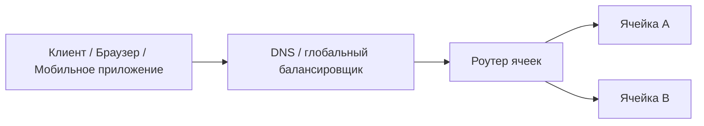
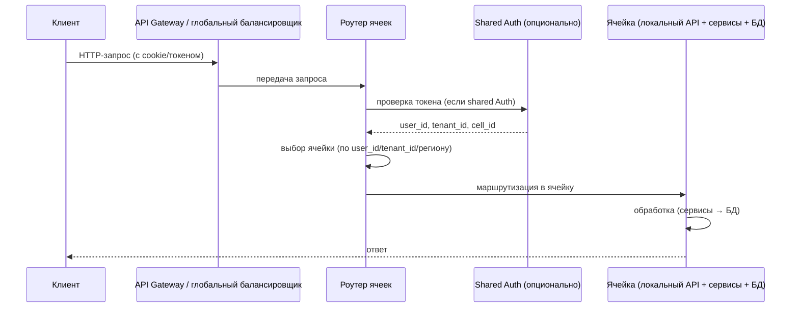

[← Назад к индексу части 10](index.md)

## 10.2. Как устроена ячейка изнутри и как выбирается ячейка для пользователя

### Цель раздела

Разобраться, **из чего состоит ячейка** (на уровне сервисов, данных и инфраструктуры), какие есть варианты **разреза пользователей/трафика на ячейки** и как устроен **глобальный роутер**, который направляет запросы в нужную ячейку.

### В этом разделе главное

- Ячейка включает в себя **функциональные сервисы, данные, кэши, очереди, мониторинг** — полноценный стек.
- Есть разные варианты разреза:
  - по **тенантам** (tenant‑based),
  - по **регионам** (region‑based),
  - по **долям трафика** (traffic slices).
- **Глобальный роутер** решает, куда отправить запрос; **стабильность маршрутизации** при миграции пользователей критична.
- Важно продумать, какие сервисы и данные **дублируются в каждой ячейке**, а какие остаются **общими (shared)** — Auth и Billing часто shared, требуют резервирования.
- **Кросс-ячейковые запросы** — по возможности избегать; если нужны — через события, не синхронно.

#### Проверь себя: главное (10.2)

1. Почему в определении ячейки важно перечислять не только сервисы, но и кэши/очереди/мониторинг?

   <details><summary>Ответ</summary>
   Потому что «самодостаточность» ячейки — это свойство всего эксплуатационного контура.  
   Если сервисы локальные, а очередь/кэш/наблюдаемость общие — вы получите общий узкий участок и общий blast radius. Ячейка должна включать критичные инфраструктурные компоненты, иначе изоляция будет иллюзией.
   </details>

2. Когда естественнее выбрать разрез tenant‑based, а когда region‑based? Назови по одному практическому критерию.

   <details><summary>Ответ</summary>
   Tenant‑based: когда есть крупные клиенты с требованиями изоляции или noisy tenant (нагрузка/инциденты) — нужно ограничить влияние одного клиента.  
   Region‑based: когда есть требования data residency или критична латентность по географии — нужно держать обработку и данные в регионе.
   </details>

3. Почему кросс-ячейковые синхронные запросы ухудшают главную цель cell‑based архитектуры?

   <details><summary>Ответ</summary>
   Они создают зависимости между ячейками: ячейка A начинает ждать ячейку B, и сбой/латентность в B влияет на A.  
   В итоге blast radius растёт, а изоляция контуров размывается.
   </details>

### Термины

- **Tenant‑based cell** — ячейка на один или группу клиентов.
- **Region‑based cell** — ячейка на регион.
- **Traffic slice** — ячейка на шард трафика.
- **Shared services** — общие для всех ячеек сервисы.
- **Роутер ячеек** — компонент, распределяющий запросы по ячейкам.

#### Проверь себя: термины (10.2)

1. В каком смысле traffic slice — это «разрез по пользователям», даже если регион один?

   <details><summary>Ответ</summary>
   Потому что критерий — доля трафика/пользовательской базы (например, `hash(userId) % N`).  
   Пользователь детерминированно «закрепляется» за слайсом, и его запросы идут в соответствующий контур, хотя география может быть одна.
   </details>

2. Почему слово «роутер» здесь — архитектурно важнее, чем кажется (это не просто ещё один балансировщик)?

   <details><summary>Ответ</summary>
   Потому что он реализует бизнес‑инвариант: **какой пользователь/тенант в какой ячейке живёт**.  
   Балансировщик обычно распределяет трафик «по здоровым инстансам», а роутер ячеек — **по принадлежности** (user/tenant/region), сохраняя стабильность маршрутизации.
   </details>

3. Чем tenant‑based и region‑based различаются по рискам миграции пользователей?

   <details><summary>Ответ</summary>
   В tenant‑based миграции обычно реже, но тяжелее (перенос целого клиента/его данных и интеграций).  
   В region‑based миграции могут быть связаны с переездом/сменой региона или с перераспределением по регионам, плюс есть юридические ограничения на перенос данных.
   </details>

### Теория и правила

Упрощённо ячейка выглядит так:

```mermaid
graph TB
    subgraph Cell["Ячейка"]
        API[API Gateway (локальный)]
        subgraph SVC["Микросервисы"]
            Auth[Auth Service]
            Core[Core Domain Service]
            Billing[Billing Service]
        end
        DB[(База данных)]
        Cache[(Кэш)]
        MQ[(Очередь сообщений)]
        Mon[Мониторинг + Логи]
        API --> SVC
        SVC --> DB
        SVC --> Cache
        SVC --> MQ
    end
```

Поверх ячеек стоит **глобальный вход**:



Жизненный цикл запроса (как трафик попадает в ячейку):



#### Проверь себя: схемы (10.2)

1. На первой диаграмме ячейки (внутри `subgraph Cell`) что является «внутренними зависимостями» ячейки, а что — «границей»?

   <details><summary>Ответ</summary>
   Внутренние зависимости: микросервисы, БД, кэш, очередь, мониторинг — всё это часть ячейки.  
   Граница — входной API (локальный gateway/edge) и контракт взаимодействия снаружи; то, через что в ячейку попадает запрос, и где можно измерять SLO ячейки.
   </details>

2. На диаграмме глобального входа чем «DNS/глобальный балансировщик» отличается от «роутера ячеек» по смыслу?

   <details><summary>Ответ</summary>
   DNS/глобальный балансировщик обеспечивает «доставку» запроса в нужную точку входа (география/доступность).  
   Роутер ячеек реализует **детерминированный выбор ячейки** по принадлежности пользователя/тенанта/региона (инвариант “кто где живёт”).
   </details>

3. В sequenceDiagram почему shared Auth отмечен как «опционально» и что меняется в системе, если он shared?

   <details><summary>Ответ</summary>
   Потому что Auth можно реализовать и локально в ячейках, и как общий сервис.  
   Если Auth shared, он становится частью shared‑слоя: нужно резервирование и защита, иначе его сбой увеличит blast radius (может затронуть все ячейки).
   </details>

**Правила проектирования:**

1. **Инвариант локальности**: всё, что нужно для обслуживания запроса пользователя, **по возможности находится в одной ячейке**.
2. **Привязка пользователя**: пользователь должен **детерминированно попадать в одну и ту же ячейку**, пока его туда явно не мигрируют.
3. **Минимизация shared‑слоя**: чем меньше сервисов и БД остаётся «общими для всех ячеек», тем лучше **изоляция и масштабируемость**.

#### Проверь себя: правила проектирования (10.2)

1. Приведи пример нарушения «инварианта локальности» и его последствия для латентности и устойчивости.

   <details><summary>Ответ</summary>
   Пример: запрос пользователя в ячейке EU каждый раз синхронно вызывает сервис из ячейки US (или общий сервис без резервирования).  
   Последствия: растёт латентность (межрегиональные вызовы), увеличивается риск частичных отказов и каскадных сбоев, фактический blast radius становится больше.
   </details>

2. Почему «привязка пользователя» важна даже если данные реплицируются между ячейками?

   <details><summary>Ответ</summary>
   Репликация не отменяет кэши, сессии, фоновые процессы и локальные проекции.  
   Если пользователь “скачет” между ячейками, появляются гонки, рассинхроны, сложность отладки и непредсказуемый UX (то есть архитектурная нестабильность).
   </details>

3. Назови один «разумный» shared‑компонент и одно правило, которое делает его менее опасным.

   <details><summary>Ответ</summary>
   Разумный shared‑компонент: централизованный биллинг или общая аналитическая витрина.  
   Правило снижения риска: обеспечить резервирование и деградацию (graceful degradation), минимизировать синхронные зависимости от shared‑компонента в пользовательском запросе.
   </details>

### Пошагово: как выделяют ячейки

1. **Определяют критерий разреза**:
   - крупные enterprise‑клиенты → tenant‑based;
   - географические регионы → region‑based;
   - просто очень много пользователей → traffic slices (по userId, hash и т.п.).
2. **Определяют состав ячейки**:
   - какие сервисы и БД должны быть **локальными**;
   - какие сервисы/данные пока остаются **общими** (например, центральный billing).
3. **Проектируют глобальный роутер**:
   - как запрос узнаёт «свою» ячейку (по токену, cookie, домену, параметрам);
   - как обрабатываются «пограничные» случаи (новый пользователь, неизвестная ячейка).
4. **Настраивают мониторинг и управление**:
   - как видим состояние каждой ячейки;
   - как добавляем новую ячейку;
   - как выводим ячейку из эксплуатации.

#### Проверь себя: пошаговый план (10.2)

1. Почему нельзя «сначала построить роутер», а уже потом думать про критерий разреза и состав ячейки?

   <details><summary>Ответ</summary>
   Потому что роутер зависит от ответа на вопросы: **по чему маршрутизируем** (tenant/region/userId) и **что именно находится внутри ячейки**.  
   Если критерий и состав не определены, роутер превратится в набор случайных правил и будет ломать инвариант локальности.
   </details>

2. На каком шаге обычно впервые всплывают требования к данным (репликация, перенос, согласованность) и почему?

   <details><summary>Ответ</summary>
   На шаге 2 (состав ячейки) и особенно на шаге 3 (маршрутизация): как только мы “закрепляем” пользователя за ячейкой, нужно решить, **где живут его данные** и как они переезжают при миграции.  
   Это напрямую связано с частью 18.
   </details>

3. Почему «мониторинг и управление ячейками» — не косметика, а обязательная часть архитектуры?

   <details><summary>Ответ</summary>
   Потому что ячейки — это эксплуатационная единица: их нужно создавать, обновлять, выводить из эксплуатации, и быстро понимать их состояние.  
   Без автоматизации и наблюдаемости вы получите “зоопарк контуров”, который невозможно поддерживать.
   </details>

#### Стабильность маршрутизации при миграции пользователей

Критичный инвариант: **пользователь должен детерминированно попадать в одну и ту же ячейку** до явной миграции. Иначе:
- данные «размазываются» по ячейкам;
- сессии и кэш становятся несогласованными;
- появляются «призрачные» баги: «вчера работало, сегодня — нет».

При **миграции пользователя** из ячейки A в ячейку B:
- нужно **перенести все его данные** (или обеспечить доступ к ним);
- **обновить маршрутизационные правила** (например, в роутере: `userId X → cell B`);
- обеспечить **период двойной записи** или репликации, если миграция постепенная;
- **убедиться**, что старые запросы (с задержкой) не попадают в старую ячейку после переключения.

Типичная схема: **immutable cell_id в токене/профиле пользователя** — роутер читает `cell_id` и направляет запрос. При миграции `cell_id` обновляется централизованно (например, в профиле пользователя или в справочнике роутера).

##### Проверь себя: миграция и стабильность маршрутизации

1. Почему недостаточно просто «переключить роутер на новую ячейку», не трогая данные пользователя?

   <details><summary>Ответ</summary>
   Потому что после переключения новая ячейка должна иметь доступ к **актуальным данным пользователя** (профиль, заказы, сессии, кэш‑ключи, фоновые задачи).  
   Если данные не перенесены/не реплицированы, пользователь попадёт в «пустую» или несогласованную среду: баги, потеря состояния, ошибки бизнес‑инвариантов.
   </details>

2. Что означает «старые запросы (с задержкой) не попадают в старую ячейку»? Приведи один механизм, как этого добиться.

   <details><summary>Ответ</summary>
   Это означает, что после миграции не должно быть ситуации, когда часть запросов пользователя обработана в старом контуре (A), а часть — в новом (B).  
   Механизм: хранить `cell_id` в токене/профиле и обновлять его централизованно; использовать короткоживущие токены и принудительный refresh; на стороне роутера — жёстко маршрутизировать по актуальному `cell_id`.
   </details>

3. Зачем может понадобиться «период двойной записи» и какой риск у него есть?

   <details><summary>Ответ</summary>
   Двойная запись нужна, когда миграция постепенная: часть системы ещё читает из старого контура, часть — из нового.  
   Риск — расхождение данных и гонки: если нет идемпотентности и чётких правил первичности, можно получить конфликтующие версии состояния.
   </details>

#### Граничные случаи: общие компоненты (аутентификация, биллинг)

Не всё можно «размазать» по ячейкам. Некоторые сервисы по природе **глобальные**:

**Аутентификация (Auth):**
- Вариант A: **репликация** — в каждой ячейке свой инстанс Auth, синхронизация токенов/сессий между ячейками (сложно).
- Вариант B: **центральный Auth** — один shared Auth для всех ячеек. Роутер сначала идёт в Auth (получить/проверить токен), затем по `user_id`/`tenant_id` направляет в ячейку. **Риск:** падение Auth роняет все ячейки. Митигация: резервирование, реплики Auth.
- Вариант C: **Auth в каждой ячейке** — токены привязаны к ячейке; при смене ячейки — перелогин или refresh токена с новым `cell_id`.

**Биллинг (Billing):**
- Часто остаётся **shared**: нужна глобальная картина выручки, подписок, лимитов.
- Вариант: **локальный биллинг в ячейке** для операций (списание, лимиты), **агрегация в центр** для отчётности (асинхронно, по событиям).

**Правило:** минимизировать shared‑слой; если компонент shared — обеспечить его отказоустойчивость и резервирование, чтобы он не стал единой точкой отказа.

##### Проверь себя: shared Auth/Billing

1. В чём главный риск варианта «центральный Auth» и какое одно архитектурное требование ты добавишь, чтобы этот риск снизить?

   <details><summary>Ответ</summary>
   Риск: Auth становится **единой точкой отказа** для всех ячеек (увеличивает blast radius).  
   Требование: резервирование/репликация и деградация (например, токены с возможностью локальной проверки подписи, лимиты, изоляция нагрузок).
   </details>

2. Почему биллинг часто остаётся shared, но «локальный биллинг + агрегация в центр» выглядит здраво?

   <details><summary>Ответ</summary>
   Биллинг требует глобальной картины (подписки, выручка, лимиты), поэтому полностью локализовать его сложно.  
   При этом критичные пользовательские операции (проверка лимита, списание) лучше делать локально в ячейке, а глобальные отчёты — собирать асинхронно, чтобы не создавать синхронную зависимость ячейки от центра.
   </details>

3. Какой признак подскажет, что shared‑слой стал слишком большим и вы теряете смысл ячеек?

   <details><summary>Ответ</summary>
   Если большинство пользовательских запросов синхронно обращаются к shared‑сервисам (Auth, Billing, общий профиль, общий кэш), и сбой в shared‑слое «роняет» все ячейки.  
   Тогда фактический blast radius снова становится глобальным.
   </details>

#### Кросс-ячейковые запросы: когда допустимы и как ограничивать

Иногда нужна операция, затрагивающая **несколько ячеек** (например, «перевести деньги от пользователя в ячейке A пользователю в ячейке B»). Такие запросы:
- **сложны** (распределённые транзакции, eventual consistency);
- **дороги** (сетевые вызовы между ячейками, латентность);
- **создают скрытые зависимости** (ячейка A может ждать ответа от ячейки B).

Рекомендации:
- **по возможности избегать** кросс-ячейковых синхронных вызовов;
- если необходимо — делать через **события/очереди** (асинхронно);
- ограничивать частоту и критичность таких операций;
- документировать их явно и мониторить.

##### Проверь себя: кросс‑ячейковые операции

1. Почему кросс‑ячейковая операция «перевод денег между пользователями из разных ячеек» почти всегда требует eventual consistency?

   <details><summary>Ответ</summary>
   Потому что это распределённая операция между независимыми контурами: синхронная транзакция между ними либо невозможна, либо слишком дорога и хрупка.  
   Поэтому используют события/сага‑подход: шаги выполняются отдельно, а согласование достигается асинхронно.
   </details>

2. Какой простой «архитектурный запрет» помогает не расползтись кросс‑ячейковым синхронным вызовам?

   <details><summary>Ответ</summary>
   Запрет: «пользовательский запрос не должен синхронно вызывать другую ячейку».  
   Если нужна связь — только через события/очереди/фоновые задачи, а UI получает статус «в обработке» и финальный результат позже.
   </details>

3. Что именно нужно мониторить для кросс‑ячейковых операций, кроме “ошибка/не ошибка”?

   <details><summary>Ответ</summary>
   Очереди и лаг обработки, количество повторов, процент компенсирующих операций, время “до финального состояния”, корреляцию по id операции (tracing), а также влияние на shared‑сервисы (если есть).
   </details>

### Простыми словами

Можно думать о ячейке как о **филиале компании в конкретном городе**:

- У него есть:
  - свой офис (инфраструктура),
  - свои сотрудники (сервисы),
  - свой склад (данные),
  - свои локальные клиенты.
- Есть **центральный офис**, который:
  - говорит клиентам, в какой филиал им лучше обратиться;
  - иногда сам хранит часть данных (общая аналитика, бренд и т.п.).

#### Проверь себя: «простыми словами» (10.2)

1. В метафоре «филиал/центральный офис» что соответствует ячейке, а что — shared‑слою?

   <details><summary>Ответ</summary>
   Филиал — это ячейка: локальные сервисы и данные для своей группы пользователей.  
   Центральный офис — это shared‑слой: общие компоненты (например, общий биллинг/аналитика), которые обслуживают все филиалы/ячейки.
   </details>

2. Почему «центральный офис» в метафоре опасен, если через него проходит каждый запрос пользователя?

   <details><summary>Ответ</summary>
   Потому что он становится единой точкой отказа и увеличивает blast radius: падение центра остановит работу всех филиалов/ячеек.  
   В cell‑based подходе shared‑слой стараются минимизировать и делать устойчивым.
   </details>

3. Приведи один пример, когда «центральный офис» допустим, и один — когда его надо избегать.

   <details><summary>Ответ</summary>
   Допустим: централизованная аналитика, которая не участвует синхронно в пользовательском запросе.  
   Избегать: общий сервис, без которого нельзя обработать пользовательский запрос (например, shared Auth без резервирования).
   </details>

### Картинка в голове

Вообрази **карту мира с несколькими дата‑центрами**, каждый из которых — ячейка:

```
[Пользователь EU] ──► [Глобальный вход] ──► [Ячейка EU]
[Пользователь US] ──► [Глобальный вход] ──► [Ячейка US]
[Пользователь APAC] ──► [Глобальный вход] ──► [Ячейка APAC]
```

Внутри каждой ячейки:

```
[API] → [Микросервисы] → [Локальные БД/кэши/очереди]
```

#### Проверь себя: «картинка в голове» (10.2)

1. Почему полезно визуализировать ячейки как «дата‑центры на карте», даже если физически они могут быть в одном кластере?

   <details><summary>Ответ</summary>
   Потому что это помогает удержать смысл: ячейка — это **контур изоляции**.  
   Даже если физически ресурсы могут быть общими на старте, архитектурная цель — чтобы сбой и данные были локальны.
   </details>

2. Что будет плохим признаком, если в «внутри каждой ячейки» у вас отсутствует очередь/кэш/наблюдаемость, а они общие?

   <details><summary>Ответ</summary>
   Это сигнал, что shared‑слой слишком велик: общий компонент может стать узким местом/точкой отказа, и изоляция ячеек будет неполной.
   </details>

3. Какой компонент из схемы чаще всего забывают локализовать, и чем это грозит?

   <details><summary>Ответ</summary>
   Часто забывают про очереди/шины или про Auth.  
   Грозит тем, что сбой/перегрузка общего компонента затронет все ячейки (blast radius снова станет глобальным).
   </details>

### Как запомнить

- **Ячейка = всё, что нужно пользователю, локально.**
- **Роутер = тот, кто решает, в какую ячейку направить пользователя.**

#### Проверь себя: «как запомнить» (10.2)

1. Что именно означает «локально» в фразе «ячейка = всё, что нужно пользователю, локально»?

   <details><summary>Ответ</summary>
   Что запрос пользователя должен обслуживаться сервисами и данными своей ячейки без обязательных синхронных обращений к другим ячейкам или критичным shared‑сервисам.
   </details>

2. Почему роутер — это “логическое правило”, а не просто распределение нагрузки?

   <details><summary>Ответ</summary>
   Потому что он реализует закрепление пользователя/тенанта за ячейкой и обеспечивает стабильность маршрутизации, а не просто “выбирает свободный сервер”.
   </details>

3. Какой один атрибут обычно нужен в системе, чтобы роутер мог работать детерминированно?

   <details><summary>Ответ</summary>
   Идентификатор принадлежности: `cell_id` (или производный ключ — `tenant_id`, регион, хэш `user_id`), который можно хранить в профиле/токене/cookie и использовать для маршрутизации.
   </details>

### Примеры

1. **Tenant‑based cell**  
   - Крупный SaaS с несколькими очень большими клиентами.  
   - Для каждого enterprise‑клиента создаётся **своя ячейка**: свои БД, свои сервисы, иногда даже отдельный кластер.  
   - Меньшие клиенты могут делить одну общую ячейку.

2. **Region‑based cell**  
   - Продукт работает в EU и US, данные EU нельзя выносить за пределы региона (GDPR).  
   - Делают ячейку EU (в EU‑регионе облака) и ячейку US.  
   - Пользователи EU всегда попадают в ячейку EU, пользователи US — в ячейку US.

3. **Traffic slice**  
   - Условно 10 ячеек, каждая обслуживает **10% пользователей** (по хэшу userId).  
   - Это позволяет ограничить размер каждой БД и независимую эволюцию ячеек.

#### Проверь себя: примеры (10.2)

1. Почему для enterprise‑клиентов часто логичнее tenant‑based ячейки, чем traffic slices?

   <details><summary>Ответ</summary>
   Потому что ключевая цель — изоляция клиента (данные, интеграции, “шум”), а не просто равномерное распределение нагрузки.  
   Traffic slices режут “процент пользователей”, но не обязательно дают строгую изоляцию по клиентам.
   </details>

2. В region‑based примере где обычно хранится «привязка пользователя к региону» и почему это важно?

   <details><summary>Ответ</summary>
   В профиле пользователя, токене или cookie (а также в справочнике роутера).  
   Это важно для стабильной маршрутизации: пользователь должен попадать в один и тот же региональный контур, иначе возникнут рассинхроны данных и нарушение data residency.
   </details>

3. В traffic slice примере почему важно, чтобы ключ разбиения был стабильным?

   <details><summary>Ответ</summary>
   Потому что иначе пользователь будет “прыгать” между слайсами, что ломает локальность данных, кэш, фоновые процессы и делает систему трудно диагностируемой.
   </details>

### Практика / реальные сценарии

- Часто начинают с **одной ячейки** (по сути, текущий прод).  
- Потом добавляют **ещё одну**:
  - для пилота новой архитектуры;
  - для нового региона;
  - для крупного клиента.
- Со временем количество ячеек может расти, но **управление ими становится отдельной задачей** (частично тема части 19 и 20).

#### Проверь себя: практика (10.2)

1. Почему «управление ячейками становится отдельной задачей» — это предсказуемо?

   <details><summary>Ответ</summary>
   Потому что ячейки — единицы деплоя, мониторинга и инцидент‑менеджмента. С ростом числа ячеек операции (обновления, конфигурации, алерты) требуют стандартизации и автоматизации.
   </details>

2. Какой один “красный флаг” укажет, что у вас ячейки есть, но вы ими не управляете как системой?

   <details><summary>Ответ</summary>
   Если версии/конфигурации по ячейкам расходятся без контроля, нет единого обзора состояния ячеек и нет процесса добавления/вывода ячейки — это зоопарк, а не управляемая архитектура.
   </details>

3. Как бы ты связал(а) 10.2 с частью 19 (устойчивость) одним предложением?

   <details><summary>Ответ</summary>
   Ячейки уменьшают blast radius, но устойчивость всё равно требует механизмов деградации, таймаутов, ограничений нагрузки и мониторинга — и это становится ещё важнее при множестве контуров.
   </details>

### Типичные ошибки

- Выделять ячейки по **слишком мелкому признаку** (например, по типу фичи, а не по трафику/пользователям).
- Оставлять **слишком много shared‑сервисов**, из‑за чего ячейки становятся «псевдо‑независимыми».
- Не продумать **механику смены ячейки** для пользователя (миграции).

#### Проверь себя: ошибки (10.2)

1. Почему «слишком много shared‑сервисов» фактически отменяет смысл cell‑based архитектуры?

   <details><summary>Ответ</summary>
   Потому что shared‑сервис становится общей точкой отказа/узким местом: сбой влияет на все ячейки, blast radius снова глобальный.
   </details>

2. Почему «механика смены ячейки» — это отдельная инженерная задача, а не “поменяли запись в конфиге”?

   <details><summary>Ответ</summary>
   Потому что нужно переносить/реплицировать данные, обновлять привязку, учитывать задержанные запросы, кэши и фоновые процессы, иметь план отката и проверку консистентности.
   </details>

3. Приведи пример “слишком мелкого признака” для выделения ячейки.

   <details><summary>Ответ</summary>
   Например, «ячейка для одной фичи/страницы UI», когда пользователи должны постоянно ходить между ячейками для обычного сценария. Это создаёт кросс‑ячейковые зависимости и ломает инвариант локальности.
   </details>

### Что будет, если…

- Если не детерминировать выбор ячейки для пользователя:
  - он может «скакать» между ячейками;
  - появятся **рассинхроны данных, проблемы с сессиями и странные баги**.

- Если не ограничить shared‑слой:
  - один shared‑сервис может **ронять все ячейки сразу**;
  - мы теряем главный плюс cell‑based подхода — изоляцию.

#### Проверь себя: последствия (10.2)

1. Почему “пользователь скачет между ячейками” приводит к «призрачным багам»?

   <details><summary>Ответ</summary>
   Потому что часть состояния (кэш, сессия, проекции) может быть в ячейке A, а запрос обработан в B.  
   Ошибка проявляется не всегда, зависит от маршрутизации и времени, поэтому выглядит «случайной».
   </details>

2. Какое простое правило уменьшает риск “скачков”?

   <details><summary>Ответ</summary>
   Детерминированная маршрутизация по `cell_id` (или стабильному ключу), хранение привязки в профиле/токене/cookie и централизованное изменение только через миграционный процесс.
   </details>

3. Почему shared‑сервис без резервирования — опаснее именно в cell‑based мире?

   <details><summary>Ответ</summary>
   Потому что он разрушает идею независимых контуров: одна точка отказа становится общей для всех ячеек, и архитектурная инвестиция в изоляцию не окупается.
   </details>

### Проверь себя

1. Какие три основных варианта разреза на ячейки мы рассматривали и в чём их различия?

   <details><summary>Ответ</summary>
   - **Tenant‑based** — по крупным клиентам/тенантам; хорошо для enterprise‑SaaS и требований изоляции данных клиента.  
   - **Region‑based** — по географическим регионам; учитывает регуляторику и латентность.  
   - **Traffic slice** — по долям трафика (hash от userId и т.п.); удобен, когда важно просто «размазать» нагрузку.
   </details>

2. Почему важно, чтобы пользователь **детерминированно попадал в одну и ту же ячейку**?

   <details><summary>Ответ</summary>
   Потому что его **данные, кэш, фоновые задачи** связаны с конкретной ячейкой.  
   Если пользователь попадает то в одну, то в другую ячейку, то мы получаем:  
   - неполные или противоречивые данные;  
   - странное поведение UI;  
   - сложности с отладкой и диагностикой инцидентов.
   </details>

3. Какие риски несут **shared‑сервисы** в cell‑based архитектуре?

   <details><summary>Ответ</summary>
   - Они могут стать **единым узким местом** и «точкой отказа» для всех ячеек.  
   - Их масштабирование и миграции сложнее, чем локальные изменения в одной ячейке.  
   - Они уменьшают выигрыш от cell‑based архитектуры, так как **часть системы остаётся общей**.
   </details>

4. Почему **кросс-ячейковые синхронные вызовы** нежелательны и как их ограничить?

   <details><summary>Ответ</summary>
   Потому что они создают **скрытые зависимости** между ячейками: сбой или латентность в одной ячейке влияет на другую.  
   Ограничения: по возможности избегать; если необходимо — делать через **события/очереди** (асинхронно); документировать и мониторить.
   </details>

### Запомните

- Ячейка — это **не только сервисы, но и данные, кэши, очереди и мониторинг**.
- Выбор критерия разреза (tenant/region/traffic) определяет **типичные сценарии и ограничения**.
- Глобальный роутер и минимизация shared‑слоя — ключ к **реальной независимости ячеек**.

---
