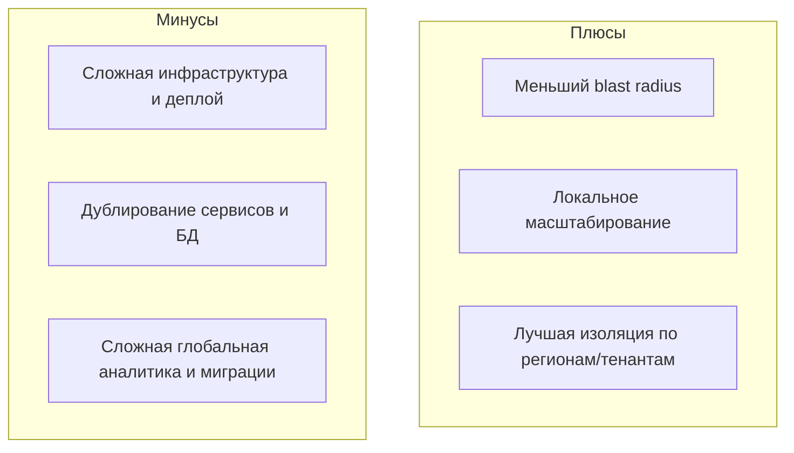
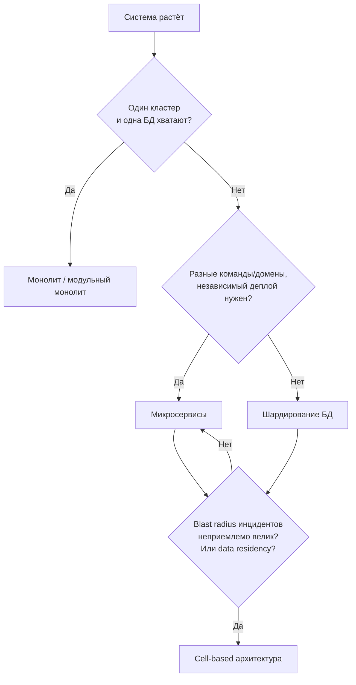

[← Назад к индексу части 10](index.md)

## 10.4. Ограничения, типичные ошибки и связь с другими частями

### Цель раздела

Честно рассмотреть **ограничения и риски** cell‑based архитектуры, типичные ошибки внедрения и увидеть, **как этот подход связан** с другими темами плана: микросервисы, данные, масштабирование, фронтенд, BFF.

### В этом разделе главное

- Cell‑based архитектура **сложна и дорога** — она не «по умолчанию».
- Основные риски:
  - усложнение инфраструктуры и процессов деплоя;
  - дублирование сервисов и данных;
  - сложность аналитики и кросс‑ячейковых операций.
- Связь с другими частями:
  - строится **поверх микросервисов** (часть 9);
  - требует **продвинутых решений по данным** (часть 18);
  - является **инструментом масштабирования и устойчивости** (часть 19);
  - влияет на то, как фронтенд и BFF работают с бэкендом (части 21–24, 30).

#### Проверь себя: главное (10.4)

1. Почему «cell‑based архитектура сложна и дорога» — это не «мнение», а следствие структуры решения?

   

Ответ

   Потому что решение вводит несколько прод‑подобных контуров (ячейки), которые нужно создавать, обновлять, мониторить и поддерживать.  
   Это автоматически увеличивает объём инфраструктуры, процессов деплоя, диагностики и управления версиями.
   

2. Какой риск из списка (деплой/дублирование/аналитика) обычно проявляется первым и почему?

   

Ответ

   Часто первым проявляется риск **операционной сложности деплоя и мониторинга**, потому что количество контуров растёт сразу.  
   Дублирование и аналитика тоже важны, но их «боль» может нарастать по мере роста числа ячеек и потребностей бизнеса.
   

3. Почему связь с частями 18–19 — не «дополнительные темы», а ядро успеха cell‑based?

   

Ответ

   Потому что ячейки почти всегда упираются в:  
   - **данные** (где источник истины, как мигрировать/реплицировать/агрегировать);  
   - **устойчивость и масштабирование** (как ограничить blast radius, как деградировать, как управлять нагрузкой).  
   Без этого ячейки не дадут ожидаемого эффекта.
   

### Термины

- **Trade‑off** — компромисс между плюсами и минусами решения.
- **Глобальная аналитика** — отчёты и агрегаты по всем пользователям/ячейкам.
- **Кросс‑ячейковая операция** — бизнес‑процесс, затрагивающий несколько ячеек.

#### Проверь себя: термины (10.4)

1. Дай пример trade‑off, характерный именно для cell‑based: что выигрываем и что теряем?

   

Ответ

   Выигрываем: меньший blast radius и локальную устойчивость.  
   Теряем: простоту эксплуатации и стоимость — больше контуров, сложнее деплой/мониторинг/аналитика.
   

2. Почему «глобальная аналитика» в cell‑based мире часто становится отдельным продуктом/подсистемой?

   

Ответ

   Потому что данные распределены по ячейкам. Чтобы получить единую картину, нужно собирать и агрегировать данные (ETL/события/витрины), учитывать лаг и качество данных — это полноценная инженерная система.
   

3. Придумай кросс‑ячейковую операцию в интернет‑магазине. Почему её сложно делать синхронно?

   

Ответ

   Например, «перенос аккаунта пользователя из региона EU в US» или «перевод баланса между пользователями разных ячеек».  
   Сложно синхронно, потому что это операция между независимыми контурами: появляются распределённые транзакции, высокая латентность и риск частичных отказов → лучше асинхронно.
   

### Теория и правила

Основные ограничения cell‑based архитектуры:

1. **Сложность инфраструктуры и операций**
   - Нужно управлять **несколькими прод‑подобными контурами**.  
   - Требуется зрелый CI/CD, инфраструктура как код, автоматизация.

2. **Дублирование компонентов**
   - Многие сервисы и БД **копируются в каждую ячейку**.  
   - Стоимость инфраструктуры растёт.

3. **Сложности глобальных функций**
   - Глобальные отчёты и аналитика должны агрегировать данные **из всех ячеек**.  
   - Кросс‑ячейковые операции требуют сложного дизайна (асинхронность, eventual consistency).

4. **Управление версиями и стратегии деплоя**
   - Разные ячейки могут быть на **разных версиях сервисов**.  
   - Нужно уметь жить с «зоопарком» версий и планировать обновления.
   - **Стратегии деплоя:** rolling (поэтапный деплой) по ячейкам (обновляем по одной), canary (канареечный релиз) в пилотной ячейке, feature flags (флаги функциональности) для постепенного раската. Решардинг и перенос пользователей между ячейками — отдельная операция (миграция данных, обновление маршрутизации, откат при проблемах).

#### Проверь себя: ограничения (10.4)

1. Почему «много прод‑подобных контуров» требует автоматизации, даже если команда сильная?

   

Ответ

   Потому что ручное управление не масштабируется: слишком много повторяющихся операций (деплой, конфигурация, мониторинг, инциденты).  
   Без автоматизации человеческие ошибки и задержки становятся главным источником проблем.
   

2. В чём конкретно выражается «дублирование компонентов» как минус? Назови 2 примера, не связанные с “деньгами”.

   

Ответ

   - Нужно синхронно поддерживать одинаковые конфигурации/политики безопасности в нескольких ячейках.  
   - Увеличивается сложность расследований: в какой ячейке проблема и почему, если версии/конфиги отличаются.
   

3. Почему «управление версиями по ячейкам» одновременно плюс и минус?

   

Ответ

   Плюс: можно обновлять поэтапно, снижая риск, и держать пилотную ячейку на новой версии.  
   Минус: появляется “зоопарк” версий, усложняется совместимость контрактов и поддержка разных состояний системы.
   

### Простыми словами

Cell‑based архитектура — это как **сеть мини‑филиалов компании по всему миру**:

- Плюсы:
  - сбой в одном филиале **не убивает весь бизнес**;
  - можно открывать новые филиалы, закрывать старые, перераспределять нагрузку.
- Минусы:
  - приходится содержать много офисов, сотрудников, складов;
  - глобальная отчётность и процессы становятся **сложнее**.

### Картинка в голове

Ключевая мысль: **мы осознанно платим этими минусами за плюсы на нужном масштабе**.

Сводная схема: **когда какой подход**

#### Проверь себя: схема выбора подхода (10.4)

1. Почему на схеме после вопроса «нужен независимый деплой» возможны два ответа (микросервисы vs шардирование), а не всегда микросервисы?

   

Ответ

   Потому что иногда основная проблема — масштаб данных/нагрузка на БД, а не организация команд и релизов.  
   Если независимый деплой не требуется, но БД не справляется, шардирование может быть более уместным и более дешёвым решением.
   

2. Какой “скрытый вопрос” стоит задать, если по схеме вы пришли к ячейкам, но сомневаетесь?

   

Ответ

   «Достаточно ли у нас зрелости эксплуатации (CI/CD, IaC, наблюдаемость) и готовности платить операционной сложностью?»  
   Если нет — возможно, сначала нужно дозреть (части 19–20) или решить проблему промежуточными мерами.
   

3. Придумай пример, когда система ответит “Да” на Q3 (blast radius неприемлем), но ячейки всё равно внедрять рано. Почему?

   

Ответ

   Если blast radius большой из‑за общих зависимостей/плохих границ (например, общий Auth/общая БД/каскадные синхронные вызовы) и отсутствия устойчивости, то сначала нужно исправить архитектурные долги: границы, таймауты, деградацию, наблюдаемость.  
   Иначе ячейки размножат проблему.
   

### Как запомнить

> **Cell‑based = «защита от больших взрывов» ценой дорогой и сложной инфраструктуры.**

### Примеры связи с другими частями

- **С микросервисами (часть 9)**  
  - Микросервисы определяют **границы функциональности**.  
  - Cell‑based добавляет **границы по трафику/пользователям**.  
  - Часто внутри каждой ячейки живёт примерно тот же набор микросервисов.

- **С данными и консистентностью (часть 18)**  
  - Каждая ячейка может иметь **свои БД**, реплики, кэши.  
  - Глобальная консистентность достигается через **репликацию, события, ETL**, а не через одну большую БД.

- **С масштабированием и устойчивостью (часть 19)**  
  - Cell‑based — это способ **ограничить радиус отказа**.  
  - Механизмы типа circuit breaker, retry всё ещё нужны, но теперь **и на уровне ячеек** тоже.

- **С фронтендом и BFF (части 21–24, 30)**  
  - Фронтенд может взаимодействовать:
    - через **глобальный BFF**, который сам знает про ячейки;
    - или через **DNS/домены регионов/тенантов** (разные URL для разных ячеек).

#### Проверь себя: связи с другими частями (10.4)

1. Почему нельзя «обсудить ячейки», не понимая границ сервисов из части 9?

   

Ответ

   Потому что ячейки обычно содержат набор микросервисов. Если границы сервисов плохие (общая БД, распределённый монолит), ячейки не дадут независимости и только усложнят эксплуатацию.
   

2. Почему глобальная аналитика относится к части 18 (данные), даже если “это про архитектуру системы”?

   

Ответ

   Потому что аналитика — это работа с распределёнными данными: сбор, агрегация, лаг, качество данных, витрины. В cell‑based мире это почти всегда отдельный data‑pipeline.
   

3. Когда BFF становится особенно полезным в cell‑based архитектуре?

   

Ответ

   Когда фронтенду нужно прозрачно работать с ячейками: BFF может инкапсулировать маршрутизацию/агрегацию, не заставляя клиентский код знать про десятки контуров и различия API.
   

### Практика / реальные сценарии

- На собеседованиях или в архитектурных обсуждениях cell‑based архитектура может всплывать как:
  - «разделение на ячейки/шарды»;
  - «изолированные стеки по регионам/клиентам»;
  - «ограничение blast radius инцидентов».
- Важно уметь **объяснить не только плюсы, но и цену решения**.

#### Проверь себя: применение (10.4)

1. Почему на собеседовании важно уметь назвать «цену решения», а не только “плюсы”?

   

Ответ

   Потому что архитектура — это выбор trade‑offs. Если человек говорит только “плюсы”, он выглядит как тот, кто применяет паттерны по моде.  
   Умение назвать цену показывает зрелость: вы понимаете последствия и риски.
   

2. Приведи пример, как бы ты объяснил(а) цену ячеек бизнесу в одном абзаце.

   

Ответ

   «Мы уменьшим масштаб инцидентов и локализуем сбои по регионам/клиентам, но нам придётся содержать несколько прод‑контуров: это дороже по инфраструктуре и потребует автоматизации деплоя и мониторинга. Без этого стоимость поддержки вырастет и может замедлить выпуск фич».
   

3. Какой вопрос ты задашь, чтобы понять: бизнес готов платить эту цену или нет?

   

Ответ

   «Какой максимум недоступности/масштаб инцидента для нас приемлем и сколько мы готовы инвестировать в снижение blast radius (инфраструктура, SRE/DevOps, автоматизация)?»
   

### Типичные ошибки

- Воспринимать cell‑based архитектуру как **универсальный стандарт**, который надо применить «чтобы быть как большие компании».
- Пытаться **перенести существующий хаос микросервисов** в несколько ячеек без наведения порядка.
- Не иметь **центра компетенции по эксплуатации**, который сможет управлять этим уровнем сложности.

#### Проверь себя: ошибки (10.4)

1. Чем отличается «универсальный стандарт» от «инструмента под контекст» в архитектуре?

   

Ответ

   Универсальный стандарт применяют “везде одинаково”, не проверяя, есть ли проблемы, которые он решает.  
   Инструмент под контекст применяют, когда есть конкретные боли (blast radius, регуляторика, масштаб) и когда команда готова заплатить цену.
   

2. Почему нельзя «перенести хаос микросервисов» в ячейки и надеяться, что станет лучше?

   

Ответ

   Потому что ячейки умножают количество контуров. Если внутри каждого контура проблемы (общая модель, плохие контракты, отсутствие наблюдаемости), то проблем станет больше, а диагностировать будет сложнее.
   

3. Что может означать «центр компетенции по эксплуатации» в практических терминах? Назови 2 функции.

   

Ответ

   Например: (1) платформа/команда, которая обеспечивает стандарты CI/CD, IaC, мониторинга и алертинга по ячейкам; (2) SRE‑практики: incident response, SLO, review изменений, инструменты трассировки.
   

### Что будет, если…

- Если применить cell‑based архитектуру без достаточной зрелости команды:
  - количество инцидентов может **увеличиться**, а не уменьшиться;
  - диагностика станет сложнее (нужно учитывать и сервисы, и ячейки).

- Если игнорировать вопрос глобальной аналитики и кросс‑ячейковых операций:
  - бизнес может **не получать полную картину** (например, по выручке или активности);
  - принятие решений будет опираться на неполные данные.

#### Проверь себя: последствия (10.4)

1. Почему «диагностика станет сложнее» — почти неизбежное следствие cell‑based архитектуры?

   

Ответ

   Потому что появляется дополнительное измерение: не только “какой сервис”, но и “какая ячейка”.  
   Инцидент может проявляться в одной ячейке из‑за версии/конфигурации/нагрузки, поэтому без хорошей наблюдаемости и корреляции событий отладка усложняется.
   

2. Почему «нет глобальной аналитики» может привести к неверным управленческим решениям, даже если продукт технически работает?

   

Ответ

   Потому что бизнес принимает решения по данным (выручка, retention, активность). Если данные неполные/с лагом/не агрегированы, можно неправильно оценить ситуацию и принять неверные решения (например, про маркетинг или тарифы).
   

3. Назови один способ уменьшить риск «неполной картины», не превращая аналитику в синхронную зависимость пользовательских запросов.

   

Ответ

   Строить отдельный асинхронный pipeline: события из ячеек → централизованная витрина/хранилище аналитики → отчёты.  
   Пользовательский запрос не зависит синхронно от аналитики, но бизнес получает агрегированную картину с контролируемым лагом.
   

### Проверь себя

1. Назови три основных **минуса** cell‑based архитектуры.

   

Ответ

   Например:  
   - усложнение инфраструктуры и деплоя (несколько прод‑подобных контуров);  
   - дублирование сервисов и БД (рост стоимости);  
   - сложность глобальной аналитики и кросс‑ячейковых операций (нужно собирать данные из всех ячеек).
   

2. Как cell‑based архитектура связана с **ограничением blast radius**?

   

Ответ

   Каждая ячейка — это **ограниченная область поражения**:  
   - сбой в одной ячейке не должен ронять других;  
   - мы можем изолировать эксперименты/новые версии в отдельных ячейках;  
   - масштаб инцидента **контролируется архитектурным разрезом**, а не удачей.
   

3. Почему важно, чтобы в компании, внедряющей cell‑based архитектуру, была **сильная эксплуатационная культура**?

   

Ответ

   Потому что cell‑based добавляет много задач на уровне эксплуатации:  
   - управление несколькими кластерами/ячейками;  
   - версии, миграции, мониторинг на уровне ячеек;  
   - расследование инцидентов с учётом ячеек.  
   Без зрелых практик (CI/CD, IaC, мониторинг, SRE) архитектура легко превратится в хаос.
   

### Запомните

- Cell‑based архитектура — **инструмент для очень больших масштабов и строгих требований по отказоустойчивости и регуляторике**.
- Цена инструмента — **сложность и стоимость инфраструктуры**, которые нужно осознанно принимать.
- Она строится **поверх микросервисов и решений по данным/масштабированию**, а не вместо них.

---
