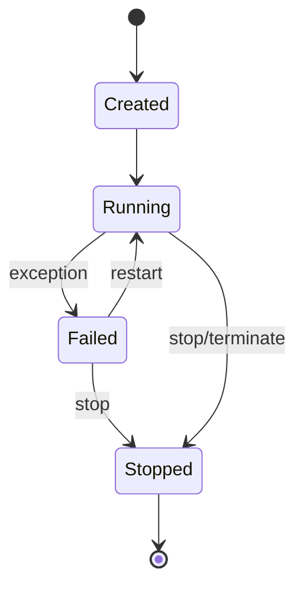
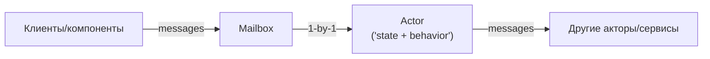

[← Назад к индексу части 11](index.md)

## 11.1. Actor model: суть и базовые свойства

### Цель раздела

Сформировать «скелет» акторной модели: **актор как единица состояния и обработки**, **mailbox** как очередь сообщений, **последовательность обработки** как основной механизм борьбы с гонками, и **адресация** как способ общаться, не разделяя память.

### В этом разделе главное

- Актор — это не «поток» и не «класс». Это **капсула состояния + обработчик сообщений**.
- Внутри актора сообщения обрабатываются **по одному** → состояние изменяется последовательно → **гонки исчезают** (внутри актора).
- Акторы не делят память: они общаются через **сообщения** (передают данные, а не ссылки на общий объект).
- Снаружи ты не «читаешь поле актора», а **посылаешь сообщение** и получаешь ответ (синхронно/асинхронно — зависит от реализации).
- Акторная модель лучше всего работает, когда ты умеешь **локализовать состояние**: «одно состояние — один владелец».

### Термины

| Термин | Определение |
|---|---|
| **Actor** | Объект, который **получает сообщения**, **обрабатывает их по одному**, может **менять своё состояние** и **посылать сообщения другим** |
| **Mailbox** | Очередь входящих сообщений |
| **Message** | Неподелённые данные, которые актор получает для обработки |
| **Actor reference / address** | Ссылка/адрес, по которому можно отправлять сообщения актору |

### Теория и правила

#### 0) Какие бывают сообщения: команда, событие, запрос (и почему это важно)

В акторных системах слово «message» слишком общее, и из‑за этого часто возникает путаница. Практически полезно различать хотя бы три «семантики» сообщений:

- **Команда (command)** — *намерение*: «сделай действие».  
  Пример: `Pay(orderId)` или `ReserveStock(orderId)`.  
  Команда почти всегда имеет ожидаемый результат (успех/ошибка) и часто требует идемпотентности.

- **Событие (event)** — *факт*: «это уже произошло».  
  Пример: `PaymentReceived(orderId)` или `OrderShipped(orderId)`.  
  События удобно делать неизменяемыми и пригодными для повторного воспроизведения (replay).

- **Запрос/ответ (request/response)** — «дай данные».  
  Пример: `GetValue` / `Value(value)`.  
  В акторной модели это часто оформляется как отправка сообщения с `replyTo` или как future/promise в конкретной реализации.

Почему это важно:

- команды чаще ломаются от дубликатов (двойное списание),
- события чаще ломаются от несовместимости схемы при эволюции,
- запросы чаще ломаются от таймаутов/нагрузки и требуют явного SLA/timeout.

##### Проверь себя (мини): типы сообщений

1. В твоём проекте назови по одному примеру **команды**, **события** и **запроса**. Почему ты отнёс(ла) их именно к этим типам?  
   <details><summary>Ответ</summary>
   Команда — это намерение «сделай» (например, `Pay(orderId)`), событие — факт «уже произошло» (например, `PaymentReceived(orderId)`), запрос — «дай данные» (например, `GetOrderStatus(orderId)` с ответом `OrderStatus(...)`). Критерий — семантика: намерение vs факт vs чтение.
   </details>

2. Почему перепутать команду и событие — это не “косметика”, а источник багов? Приведи один реальный риск.  
   <details><summary>Ответ</summary>
   Потому что команда предполагает ответственность за выполнение и ошибки/ретраи, а событие — уведомление о том, что факт уже случился. Если команду выдавать за событие, потребители могут считать, что действие уже выполнено (например, деньги списаны), хотя это было лишь намерение — отсюда рассинхронизация и двойные операции.
   </details>

3. Где именно таймауты опаснее всего: в командах, событиях или запросах — и почему?  
   <details><summary>Ответ</summary>
   Чаще всего — в запросах (request/response), потому что клиент ждёт ответ “здесь и сейчас” и таймаут напрямую виден пользователю. В командах таймаут тоже важен (может породить повтор и дубликат), но обычно дизайн допускает асинхронность/повторы. События часто обрабатываются асинхронно, там важнее идемпотентность и совместимость схемы.
   </details>

#### 1) Базовая «формула» актора

У актора есть три ключевых свойства:

1. **Состояние** (state) — живёт *внутри* актора.
2. **Почтовый ящик** (mailbox) — очередь входящих сообщений.
3. **Обработчик** (behavior) — код, который берёт сообщение из mailbox и меняет состояние.

Ключевая гарантия: **в каждый момент времени обработчик выполняется для одного сообщения**.  
Это можно представить как «однопоточный доступ к состоянию актора».

##### Проверь себя (мини): формула актора

1. Назови три элемента “формулы актора” и объясни роль каждого одним предложением.  
   <details><summary>Ответ</summary>
   Состояние — хранит контекст/данные актора; mailbox — очередь входящих сообщений; behavior/обработчик — код, который берёт сообщение из mailbox и изменяет состояние/отправляет новые сообщения.
   </details>

2. Почему гарантия “один обработчик в момент времени” относится к **актору**, а не обязательно к **потоку**?  
   <details><summary>Ответ</summary>
   Потому что актор — логическая единица, которую может исполнять пул потоков: сегодня сообщение актора обработал поток A, завтра поток B, но одновременно — не два. Гарантия сериализации относится к состоянию актора, а не к выделенному потоку.
   </details>

3. Что произойдёт с системой, если “обработчик” внутри актора начнёт параллелить изменения одного и того же state?  
   <details><summary>Ответ</summary>
   Ты вернёшь гонки на уровень актора: хотя mailbox последовательный, параллельные изменения внутри обработчика снова создадут недетерминированность, потерю обновлений и сложно воспроизводимые баги.
   </details>

#### 2) Почему это убирает гонки

Гонка возникает, когда два потока одновременно читают/пишут одно и то же состояние:

- оба читают старое значение;
- оба вычисляют новое;
- оба записывают, и один результат «затирает» другой.

В акторной модели:

- состояния нельзя трогать напрямую;
- изменения приходят в виде сообщений;
- обработка идёт последовательно.

Поэтому внутри актора «два потока одновременно» просто **не бывает**.

##### Проверь себя (мини): гонки и сериализация

1. Объясни на своём примере, какой именно класс гонок “убирает” актор, а какой — не обязательно.  
   <details><summary>Ответ</summary>
   Убирает гонки на внутреннем состоянии актора: два сообщения не меняют его state одновременно. Но не убирает гонки между несколькими акторами/сервисами, которые конкурируют за внешний ресурс (БД, внешний API) — там нужны транзакции, идемпотентность, версионирование, координация.
   </details>

2. Почему “актор решает гонки” не означает “акторы решают консистентность данных в распределённой системе”?  
   <details><summary>Ответ</summary>
   Потому что актор сериализует только своё локальное состояние. Как только появляются внешние эффекты и несколько компонентов (другие акторы, БД, сервисы), вступают в силу сетевые сбои, ретраи, дубликаты, транзакции и eventual consistency — акторная модель не отменяет эти законы.
   </details>

#### 2.1) Важная оговорка: акторы не «отменяют» параллельность — они меняют её форму

Иногда акторную модель ошибочно воспринимают как «всё стало однопоточным, значит медленно». Это не так.

- **Однопоточность относится к одному конкретному состоянию** (внутри одного актора).
- **Параллельность достигается количеством акторов** (много независимых акторов обрабатываются параллельно планировщиком/пулом потоков).

Если у тебя 100_000 заказов, то «актор на заказ» даёт естественную параллельность: разные заказы — разные акторы — разные потоки выполнения.

##### Проверь себя (мини): параллельность “через количество акторов”

1. Почему “актор на заказ” масштабируется лучше, чем “один актор на весь сервис”, если заказов много?  
   <details><summary>Ответ</summary>
   Потому что параллельность достигается множеством независимых акторов: разные заказы обрабатываются одновременно. Один глобальный актор превращает всё в одну очередь и создаёт узкое место.
   </details>

2. Назови пример “горячего ключа” для actor-per-entity и что с ним делать.  
   <details><summary>Ответ</summary>
   Например, один “VIP-аккаунт” генерирует 50% операций, поэтому его актор перегружен. Варианты: изменить модель (разбить состояние на несколько акторов), сделать отдельную стратегию шардирования/агрегации, лимитировать вход, вынести часть операций в асинхронный конвейер.
   </details>

#### 3) Адресация: «сообщение вместо вызова функции»

В привычном коде мы часто делаем так:

- имеем ссылку на объект;
- вызываем метод;
- метод меняет общий объект.

В акторной модели ты:

- имеешь **reference** на актора (адрес);
- отправляешь **message**;
- актор сам решает, что делать (и когда).

Это разрывает связанность по памяти и по времени: отправка сообщения не означает немедленную обработку.

##### Проверь себя (мини): адресация и разрыв связности

1. Что именно “разрывается” при переходе от вызова метода к отправке сообщения? Назови два разрыва.  
   <details><summary>Ответ</summary>
   Разрыв по памяти: нет прямого доступа к внутреннему state и общих ссылок. Разрыв по времени: отправка сообщения не гарантирует немедленную обработку и ответ “прямо сейчас”.
   </details>

2. Почему адрес актора (reference) полезнее, чем “ссылка на объект”, в распределённом сценарии?  
   <details><summary>Ответ</summary>
   Потому что reference абстрагирует местоположение: актор может переехать на другой узел/процесс, а отправитель продолжит посылать сообщения по логическому адресу; runtime решает маршрутизацию.
   </details>

#### 3.1) Два принципа мышления, без которых акторы «не взлетают»

1) **Tell, don’t ask** («сообщай, а не спрашивай»).  
В акторной модели ты стараешься не вытаскивать состояние и «думать снаружи», а посылаешь команду: «сделай действие» — и получаешь результат/событие.

2) **Не блокируй обработчик**.  
Если внутри `on Message` ты делаешь блокирующий I/O (долгий запрос в сеть/БД) и ждёшь — ты превращаешь актора в «зависший кассовый аппарат»: mailbox растёт, latency растёт.  
Правильная стратегия обычно такая: вынести I/O в адаптер/отдельный актор/асинхронную операцию и вернуться к обработке следующего сообщения.

##### Проверь себя (мини): tell-don’t-ask и неблокирующий обработчик

1. Чем “tell, don’t ask” отличается от “просто отправить команду”? Что меняется в стиле проектирования?  
   <details><summary>Ответ</summary>
   Это дисциплина: не выносить принятие решения наружу через чтение внутреннего состояния, а формулировать намерение как команду и держать инварианты/решения рядом со state (внутри актора). Это снижает связанность и количество “распределённых if-ов” по системе.
   </details>

2. Почему блокирующий I/O внутри обработчика — почти всегда анти‑паттерн?  
   <details><summary>Ответ</summary>
   Потому что актор перестаёт обрабатывать очередь: mailbox растёт, latency растёт, система деградирует. Кроме того, ретраи/таймауты усиливают нагрузку и могут привести к лавинообразному коллапсу.
   </details>

#### 3.2) Жизненный цикл актора (создание → работа → остановка/перезапуск)

Про «жизненный цикл» часто забывают, а именно он объясняет половину прод‑сюрпризов: куда делось состояние, почему сообщения попали в dead letters, почему после рестарта пошли дубликаты.

Типовой цикл:

1. **Spawn / create**: актор создаётся супервизором или runtime’ом (иногда лениво — по первому сообщению).
2. **Running**: актор принимает сообщения в mailbox и обрабатывает их.
3. **Failure**: ошибка в обработчике приводит к падению (или сигналу супервизору).
4. **Supervision decision**: родитель решает `restart` / `stop` / `escalate`.
5. **Restart**: актор пересоздаётся (in-memory состояние пропадает, если не персистентное).
6. **Stop/terminated**: актор завершён; сообщения, которые пришли «в никуда», могут уйти в dead letters.

В виде простой диаграммы состояний:



Где чаще всего ошибаются:

- считают, что `restart` «просто продолжит» → на деле он часто означает **сброс памяти**;
- не думают, что сообщения могут прийти в актор, который уже остановлен (или ещё не создан) → нужен дизайн доставки/буферизации/маршрутизации.

##### Проверь себя (мини): жизненный цикл актора

1. На каком шаге жизненного цикла чаще всего “теряется” in-memory состояние и почему?  
   <details><summary>Ответ</summary>
   При `restart`: актор пересоздаётся, его память сбрасывается. Это нормально для модели супервизии, поэтому важное состояние должно быть восстановимым (персистентность/истина в БД/события).
   </details>

2. Приведи две причины, по которым сообщения могут оказаться в dead letters.  
   <details><summary>Ответ</summary>
   Например: (1) актор уже остановлен или адрес недействителен; (2) политика доставки/переполнение/маршрутизатор не смог доставить; (3) узел/шард недоступен в кластере. Это сигналы проблем жизненного цикла/маршрутизации/нагрузки.
   </details>
### Пошагово: как «перевести» shared state в актор

Возьмём классический источник гонок: общий счётчик `views`.

1. Выдели **владельца состояния**: «кто отвечает за `views`?»
2. Сделай его актором: `CounterActor`.
3. Определи сообщения:
   - `Increment(by=1)`
   - `GetValue(replyTo)`
4. Запрети прямую запись `views` извне.
5. Все изменения идут только через `Increment`.

### Простыми словами

Представь, что у тебя есть «кассир» (актор), у которого:

- есть касса (состояние);
- есть очередь покупателей (mailbox);
- кассир обслуживает **по одному**.

Покупатели не залезают руками в кассу, не спорят, кто сейчас положит деньги. Они просто встают в очередь, и кассир делает операции последовательно. Поэтому касса не «ломается» от одновременных действий.

### Картинка в голове

Актор — это «остров состояния», вокруг которого море сообщений:

```text
  messages ---> [ mailbox ] ---> (process one) ---> [ actor state ]
                     |                                |
                     +---- backpressure / overflow ----+
```

И более «архитектурно»:



### Как запомнить

Формула:

> **Один актор = один владелец состояния.**  
> **Общение = сообщения.**  
> **Обработка = последовательно.**

### Примеры

#### Пример 1. Счётчик как актор (псевдокод)

```pseudo
message Increment(by)
message GetValue(replyTo)

actor CounterActor:
  state value = 0

  on Increment(by):
    value = value + by

  on GetValue(replyTo):
    send replyTo Value(value)
```

Что важно:

- `value` нигде больше не доступен.
- даже если 10_000 клиентов одновременно отправят `Increment`, актор обработает их по очереди.

#### Пример 2. «Актор на сущность»: один актор на `Order`

Идея: у каждого заказа есть жизненный цикл, и изменения должны идти последовательно:

- `CreateOrder`
- `ReserveStock`
- `ConfirmPayment`
- `Ship`

Актор `OrderActor(orderId)` принимает команды, валидирует переходы и меняет состояние заказа.

### Практика / реальные сценарии

- **Чаты/игры/телеком**: много параллельных сообщений, много сущностей, важна изоляция состояния.
- **Управление состоянием агрегатов**: «один актор на одну сущность» стабилизирует конкуренцию.
- **Внутри микросервиса**: акторы часто используются как «движок» обработки, а внешний контракт сервиса — обычный HTTP/gRPC.

### Типичные ошибки

- «Давайте сделаем акторы, чтобы всё стало быстрее».  
  Акторы часто дают **предсказуемость** и **устойчивость**, а не «магический рост скорости».
- «Сделаем один актор на всё» → огромный mailbox, узкое место, потеря параллелизма.

### Что будет, если…

- …ты сделаешь актора слишком крупным:
  - он станет бутылочным горлышком;
  - время ожидания в mailbox вырастет;
  - задержка станет непредсказуемой.

### Проверь себя

1. Почему у актора внутри нет гонок, даже если сообщений очень много?  
   <details><summary>Ответ</summary>
   Потому что обработчик актора выполняется для одного сообщения за раз. Состояние актора не изменяется параллельно разными потоками, а внешние компоненты не имеют доступа к внутреннему состоянию напрямую.
   </details>

2. Что плохого в том, чтобы «дать доступ к состоянию актора через getter»?  
   <details><summary>Ответ</summary>
   Это возвращает shared state: внешний код начинает зависеть от внутреннего состояния и может использовать его несогласованно, появляются гонки (если чтение/запись не согласованы), а также ломается инкапсуляция. Правильнее — запрашивать состояние сообщением и получать ответ в рамках модели сообщений.
   </details>

3. Что происходит с in-memory состоянием актора при `restart` и почему это важно учитывать в дизайне?  
   <details><summary>Ответ</summary>
   Обычно `restart` означает пересоздание актора, то есть его in-memory состояние сбрасывается. Если это состояние было бизнес‑критичным (баланс, статус заказа), без персистентности оно потеряется или станет неконсистентным. Поэтому нужно либо хранить истину в устойчивом хранилище, либо делать актор персистентным (события/снапшоты/БД), либо проектировать систему так, чтобы потеря памяти была допустима.
   </details>

### Запомните

- Акторы — это про **локализацию состояния** и **управляемую конкурентность**.
- Главный трюк — **последовательная обработка сообщений** вместо блокировок вокруг shared state.

---
