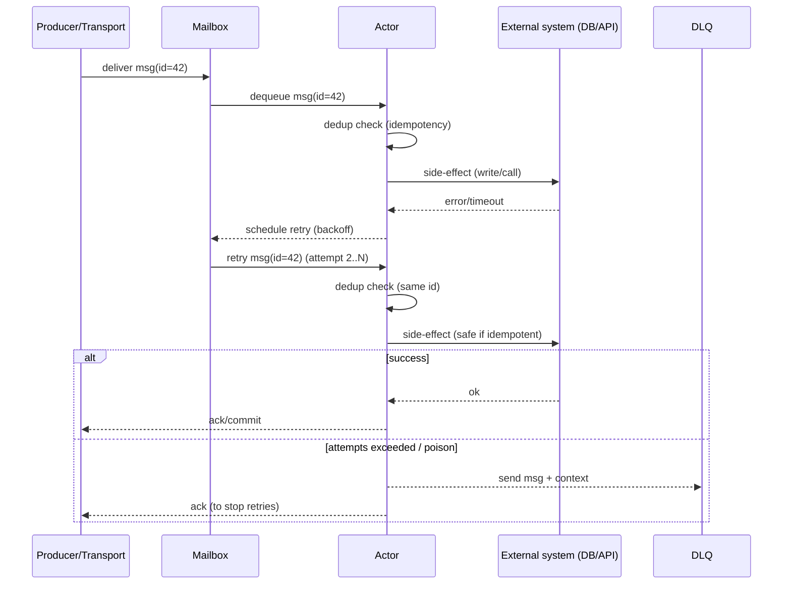

[← Назад к индексу части 11](index.md)

## 11.2. Сообщения: доставка, гарантии, backpressure

### Цель раздела

Понять «продакшн-реальность» акторов: сообщения могут теряться или дублироваться, обработка может отставать, mailbox может расти. Научиться мыслить гарантиями доставки и строить систему так, чтобы она оставалась корректной (идемпотентность) и устойчивой (backpressure).

### В этом разделе главное

- Гарантии доставки — это **контракт среды**, а не «добрая воля».
- At-least-once означает: **дубликаты неизбежны** → обработчики должны быть идемпотентными.
- Mailbox — это очередь → если вход быстрее обработки, ты получишь **рост задержек** и риск OOM.
- Нужен механизм управления нагрузкой: **backpressure / лимиты / отбрасывание / приоритизация**.
- Ретраи без ограничений — путь к «самоубийству системы» (retry storm).

### Термины

| Термин | Определение |
|---|---|
| **At-most-once** | Сообщение доставят 0 или 1 раз (возможна потеря, но нет дубликатов) |
| **At-least-once** | Сообщение доставят 1+ раз (дубликаты возможны) |
| **Exactly-once** | «Ровно один раз» на практике дорого и редко достижимо end-to-end; чаще достигают «effectively-once» через идемпотентность |
| **Idempotency (идемпотентность)** | Повторная обработка того же сообщения не меняет результат (или меняет предсказуемо один раз) |
| **Backpressure** | Управление потоком, чтобы система не захлебнулась |

### Теория и правила

#### 1) Доставка сообщений — это не «вызов функции»

Когда ты отправляешь сообщение, важно помнить:

- оно может быть поставлено в очередь;
- оно может быть обработано позже;
- оно может быть обработано несколько раз (в зависимости от гарантий);
- оно может не дойти (в зависимости от гарантий).

##### Проверь себя (мини): доставка vs вызов функции

1. Почему “отправить сообщение” нельзя считать эквивалентом “вызвать метод”, даже если система локальная?  
   <details><summary>Ответ</summary>
   Потому что сообщение попадает в очередь и обрабатывается позже; возможны задержки и перегрузка. Даже локально возможны переполнения mailbox, остановка актора и политики доставки. В распределённости добавляются ретраи, дубликаты и потери.
   </details>

2. Какие два решения ты должен(на) принять в дизайне, если сообщение может быть обработано позже?  
   <details><summary>Ответ</summary>
   (1) Как клиент/отправитель узнаёт результат: sync reply, событие “готово”, polling и т.п. (2) Как система защищается от перегрузки: лимиты, backpressure, приоритеты, bounded mailbox.
   </details>

#### 1.1) Ordering (порядок) и «что можно считать упорядоченным»

Порядок сообщений — одна из самых частых скрытых ловушек.

- Внутри одного mailbox актор действительно берёт сообщения «из очереди», то есть **имеет порядок обработки**.
- Но в распределённой системе порядок доставки зависит от транспорта:
  - сеть может переупорядочить,
  - брокер обычно гарантирует порядок только **в пределах очереди/партиции/ключа**,
  - сообщения от разных отправителей могут «перемешиваться».

Практическое правило:

> Если корректность зависит от строгого порядка, зафиксируй это в дизайне: ключ маршрутизации/партиционирования + последовательный номер (sequence) + проверки на «пропуск/повтор».

##### Проверь себя (мини): порядок сообщений

1. В чём разница между “порядком в mailbox актора” и “порядком доставки в распределённой системе”?  
   <details><summary>Ответ</summary>
   Mailbox задаёт порядок обработки внутри одного актора. Но доставка по сети/брокеру может переупорядочиваться и смешиваться от разных отправителей; порядок часто гарантируется только в пределах партиции/ключа. Поэтому “локальный порядок” нельзя автоматически считать “глобальным”.
   </details>

2. Если порядок критичен для `orderId`, какие два механизма ты добавишь, чтобы не зависеть от случайностей транспорта?  
   <details><summary>Ответ</summary>
   (1) Маршрутизация/партиционирование по `orderId`, чтобы поток для сущности был последовательным. (2) `sequenceNumber`/версия для детекта out-of-order/повторов и корректной обработки.
   </details>

#### 2) At-most-once vs at-least-once: главный trade-off

- **At-most-once**
  - **плюсы**: проще логика, нет дубликатов, ниже накладные расходы
  - **минусы**: возможна потеря → подходит, когда потеря допустима (метрики, телеметрия, «best-effort»)

- **At-least-once**
  - **плюсы**: «не потеряем» (но строго говоря это тоже про вероятности и границы системы)
  - **минусы**: дубликаты → нужна идемпотентность и дедупликация

##### Проверь себя (мини): выбор гарантий доставки

1. Приведи пример сценария, где at-most-once допустим, и где он недопустим. Почему?  
   <details><summary>Ответ</summary>
   Допустим: телеметрия/метрики (потеря нескольких сообщений не ломает бизнес). Недопустим: платеж/списание/создание заказа (потеря сообщения означает потерю бизнес‑операции или “зависший” процесс).
   </details>

2. Если ты выбираешь at-least-once, какие два обязательных свойства должны появиться у обработчика?  
   <details><summary>Ответ</summary>
   Идемпотентность (дубликаты не должны создавать повторный эффект) и контролируемые ретраи (лимиты, backoff, DLQ для “ядовитых” сообщений).
   </details>

#### 3) Идемпотентность: как думать и как делать

Типовой подход: у сообщения есть `messageId` (или `(entityId, sequenceNumber)`), а обработчик хранит «последний обработанный id» или журнал обработанных ids.

Смысл прост:

- если сообщение уже обработано → повтор игнорируется;
- если нет → применяем эффект и фиксируем, что обработали.

##### Проверь себя (мини): идемпотентность и атомарность

1. Что должно быть идемпотентным в первую очередь: “сообщение” или “эффект”?  
   <details><summary>Ответ</summary>
   Эффект/операция: повторное применение одного и того же сообщения не должно давать новый бизнес‑результат. Сообщение лишь носит идентификатор для дедупликации.
   </details>

2. Почему схема “сначала применили side-effect, потом записали processedId” может сломаться при сбое?  
   <details><summary>Ответ</summary>
   Если процесс упадёт между side-effect и записью processedId, при повторной доставке сообщение будет выглядеть “необработанным” и эффект применится второй раз. Нужна атомарность (транзакция/уникальные ключи/идемпотентный внешний API) или другая стратегия согласования.
   </details>

#### 3.1) «Идемпотентность» на практике: три рабочих приёма

1) **Idempotency-Key на уровне команды**  
У команды есть ключ, и ты гарантируешь «один эффект на один ключ». Подходит для платежей, создания ресурсов, любых «не хочу два раза».

2) **Sequence number на сущность**  
Сообщения несут `(entityId, seq)`, а актор хранит `lastSeq`. Если `seq <= lastSeq` → дубликат/старое → игнор.

3) **Дедупликация по messageId с TTL**  
Хранишь `processedIds` только ограниченное время (TTL), иначе память/хранилище «распухнет». TTL выбираешь по максимальному времени возможных ретраев/повторов.

##### Проверь себя (мини): приёмы идемпотентности

1. Когда лучше Idempotency-Key, а когда sequence number?  
   <details><summary>Ответ</summary>
   Idempotency-Key — когда важно “не выполнить дважды” без строгого порядка (платежи, создание ресурсов). Sequence number — когда есть поток изменений сущности и важен порядок/версионирование (статусы заказа, счетчики с упорядоченными изменениями).
   </details>

2. Как выбрать TTL для дедупликации processedIds?  
   <details><summary>Ответ</summary>
   По максимальному окну, в котором возможны повторы: длительности ретраев, SLA брокера/consumer group, времени жизни команды в бизнес‑процессе. TTL должен покрывать “самый поздний реалистичный повтор”, иначе дубликат проскочит.
   </details>

#### 4) Mailbox и backpressure: «очередь — это не бесплатная память»

Если входящий поток сообщений быстрее обработки:

- mailbox растёт;
- задержки растут (даже если система не падает);
- в конце концов память/лимиты заканчиваются.

Поэтому нужен явный дизайн:

- размер mailbox (bounded/unbounded);
- политика переполнения:
  - drop (отбрасывать),
  - stash (откладывать),
  - reject (отказывать),
  - spill-to-disk (редко и осторожно);
- приоритеты сообщений (если поддерживаются);
- метрики: длина mailbox, latency обработки, dead letters.

##### Проверь себя (мини): mailbox и backpressure

1. Почему “unbounded mailbox” часто превращается в проблему, даже если поначалу “всё работает”?  
   <details><summary>Ответ</summary>
   Потому что очередь растёт незаметно до тех пор, пока не начнутся большие задержки или не закончится память. Это деградация по latency и риск OOM — обычно проявляется в пик нагрузки, то есть в самый плохой момент.
   </details>

2. Назови два “здоровых” сигнала (метрики), по которым ты поймёшь, что актор начал захлёбываться.  
   <details><summary>Ответ</summary>
   Рост длины mailbox/lag и рост времени ожидания/обработки (latency). Дополнительно — рост числа ретраев/таймаутов, увеличение dead letters/DLQ.
   </details>

#### 4.1) Poison messages, DLQ и dead letters — «куда деваются неисправимые сообщения»

Реальная система сталкивается с сообщениями, которые **всегда** будут падать:

- формат невалиден;
- инвариант нарушен;
- зависимость отказала надолго, а ретраи исчерпаны.

Если такие сообщения держать в основном потоке:

- актор может попасть в бесконечный crash loop;
- очередь вырастет и «задавит» полезные сообщения;
- деградация станет массовой.

Поэтому используют:

- **DLQ (dead-letter queue)**: «склад» проблемных сообщений;
- **алерты**: чтобы DLQ было видно;
- **механизм безопасного разбора** (ручной/полуавтоматический): исправили причину → сделали controlled replay.

Важно не путать два похожих термина:

- **Dead letters** — «сообщения, которые не удалось доставить/обработать в обычном маршруте» (например, актор остановлен, адрес недействителен, переполнение, политика доставки). Это часто *внутренний механизм* runtime’а/платформы.
- **DLQ** — *явно выделенное место хранения* проблемных сообщений (часто в брокере/БД), куда мы отправляем «ядовитые» сообщения сознательно, чтобы их разбирать, алертить и при необходимости переигрывать.

Практическая мысль:

> Dead letters — это сигнал «что-то не так с маршрутизацией/жизненным циклом/нагрузкой».  
> DLQ — это инструмент управляемого разбирательства и восстановления.

##### Проверь себя (мини): dead letters vs DLQ

1. Дай короткое определение dead letters и DLQ и объясни, почему это разные вещи.  
   <details><summary>Ответ</summary>
   Dead letters — сообщения, которые не смогли попасть к адресату/в обычный поток обработки (часто механизм runtime). DLQ — выделенное хранилище проблемных сообщений для расследования и controlled replay. Dead letters — симптом; DLQ — инструмент.
   </details>

2. Какие два класса проблем ты будешь искать, если увидишь рост dead letters?  
   <details><summary>Ответ</summary>
   (1) Проблемы жизненного цикла/адресации: актор остановлен, неправильная маршрутизация, cluster/sharding issues. (2) Проблемы нагрузки: переполнение, drop policy, timeouts/перегрузка обработчиков.
   </details>

Практическое правило:

> Неисправимое сообщение должно быстро уходить из основного конвейера. Пусть лучше будет DLQ и алерт, чем тихий коллапс.

#### 4.2) Жизненный цикл сообщения (at-least-once) с ретраями и DLQ

Эта схема помогает «увидеть» типичный продакшн‑поток: сообщение пришло, обработка упала, пошли ретраи, в конце — DLQ.



Ключевой смысл:

- at-least-once почти неизбежно приводит к повторам;
- без идемпотентности повтор = риск «двойного эффекта»;
- DLQ — это не «мусорка», а инструмент контроля и расследования.

##### Проверь себя (мини): путь сообщения до DLQ

1. На каком шаге в sequenceDiagram чаще всего появляется “дубликат” и почему это нормально?  
   <details><summary>Ответ</summary>
   На этапе retry: транспорт/consumer повторно доставляет то же сообщение, потому что не получил подтверждение или увидел сбой. Это нормальная цена at-least-once.
   </details>

2. Что именно нужно положить в DLQ, чтобы потом можно было безопасно разбирать и переигрывать? Назови минимум 3 поля.  
   <details><summary>Ответ</summary>
   Payload сообщения, messageId/correlationId, причина ошибки (код/стек), количество попыток/таймстемпы, контекст маршрутизации (topic/partition/key). Минимум: payload + messageId + причина.
   </details>

### Пошагово: как проектировать обработку с at-least-once

1. Прими как факт: **дубликаты будут**.
2. Добавь идентификатор сообщения.
3. Спроектируй обработчик идемпотентно:
   - «проверить → применить → записать факт обработки» (атомарно, если важно).
4. Введи ограниченные ретраи:
   - max attempts,
   - backoff,
   - dead-letter queue (DLQ) для «ядовитых» сообщений.
5. Добавь наблюдаемость:
   - метрики количества ретраев,
   - lag/очередь,
   - процент сообщений в DLQ.

### Простыми словами

Представь курьера:

- **at-most-once**: курьер может потерять письмо. Зато он никогда не принесёт его дважды.
- **at-least-once**: курьер будет пытаться доставить письмо снова и снова. Но иногда он может принести два одинаковых письма (например, не увидел, что уже доставил).

Если твой «офис» (обработчик) не умеет распознавать дубликаты, он может выполнить одну операцию дважды: списать деньги два раза, отправить SMS два раза и т.д.

### Картинка в голове

```mermaid
graph TB
  Producer -->|"msg("id=42")"| Mailbox
  Mailbox --> Actor
  Actor -->|"ack?"| Producer
  Actor -->|"side effect"| External["Внешний эффект\n("БД/платёж/письмо")"]

  subgraph Risk["Риски"]
    R1["Дубликаты"]
    R2["Потеря"]
    R3["Рост очереди"]
  end
```

### Как запомнить

- **At-least-once ⇒ всегда думай про дубликаты.**
- **Очередь растёт ⇒ растёт задержка.**
- **Ретраи без лимита ⇒ «шторм» и коллапс.**

### Примеры

#### Пример 1. Дедупликация по `messageId` (псевдокод)

```pseudo
message ChargeCustomer(messageId, orderId, amount)

actor BillingActor:
  state processed = Set()

  on ChargeCustomer(mid, orderId, amount):
    if processed.contains(mid):
      return  // already done
    charge(orderId, amount)      // external side-effect
    processed.add(mid)
```

В реальности `processed` нельзя держать бесконечным и только в памяти (см. 11.5):  
нужна стратегия хранения/TTL/персистентности.

#### Пример 2. Backpressure через ограничение mailbox (идея)

- mailbox bounded на 10_000 сообщений
- при переполнении:
  - `Reject` для низкоприоритетных
  - `DropOldest` для телеметрии
  - `Stash` для редких управляющих сообщений

### Практика / реальные сценарии

- **Платежи и списания**: почти всегда нужно at-least-once + идемпотентность (иначе «двойные списания»).
- **Счётчики и метрики**: часто достаточно at-most-once (потеря пары инкрементов не критична).
- **Событийная обработка**: брокеры часто дают at-least-once → проектируй потребителей идемпотентно.

### Типичные ошибки

- Называть систему «exactly-once», не построив идемпотентность и дедупликацию.
- Считать, что «ретраи решат всё», и запускать бесконечные ретраи без DLQ.
- Делать unbounded mailbox «потому что так проще» → затем ловить OOM.

### Что будет, если…

- …не сделать идемпотентность при at-least-once:
  - появятся двойные операции: списания, письма, смены статусов;
  - баги будут редкими и «неуловимыми», потому что зависят от сетевых повторов.

- …не контролировать mailbox:
  - система может «не падать», но деградировать до минут/часов задержки;
  - пользователи будут видеть «тормоза», а ты — «всё зелёное», пока не посмотришь метрики очередей.

### Проверь себя

1. Почему at-least-once почти всегда требует идемпотентности?  
   <details><summary>Ответ</summary>
   Потому что при at-least-once доставка может повториться (потеряли ack, произошёл retry, пересоздали consumer и т.д.). Это приводит к дубликатам сообщений. Без идемпотентности один и тот же эффект может примениться дважды.
   </details>

2. Назови 2 стратегии, что делать при переполнении mailbox, и что делать с «ядовитым» сообщением, которое падает всегда.  
   <details><summary>Ответ</summary>
   При переполнении: (1) bounded mailbox + reject/drop низкоприоритетных сообщений, (2) backpressure — замедлять продюсеров или ограничивать вход, (3) шардировать по ключу и распараллелить акторов. Для «ядовитого» сообщения: ограничить число ретраев и отправить в DLQ/dead letters с контекстом, чтобы не блокировать основной поток и иметь возможность расследовать и сделать controlled replay.
   </details>

3. Почему нельзя «надеяться на порядок» сообщений в распределённой системе и что нужно сделать, если порядок критичен?  
   <details><summary>Ответ</summary>
   Потому что транспорт/сеть/несколько отправителей могут переупорядочить сообщения; брокер обычно гарантирует порядок только в пределах очереди/партиции/ключа. Если порядок критичен, его нужно зафиксировать в дизайне: маршрутизировать по ключу сущности, добавлять sequence number/версии, проверять «пропуск/повтор» и иметь обработку out-of-order (игнор/буфер/запрос недостающего) в зависимости от требований.
   </details>

### Запомните

- Доставка сообщений — это **вероятностная и контрактная** штука: думай гарантиями.
- «Не терять» почти всегда означает «дублировать» → идемпотентность обязательна.
- Очередь — это задержка в будущем: измеряй и ограничивай её.

---
