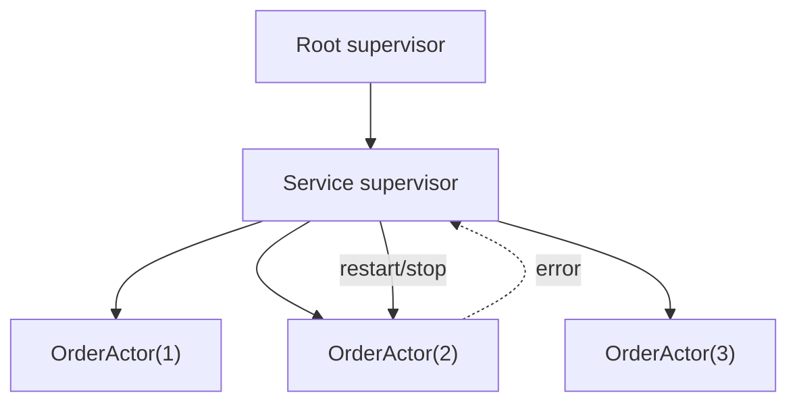

[← Назад к индексу части 11](index.md)

## 11.3. Супервизия и иерархия акторов

### Цель раздела

Понять, как акторные системы относятся к сбоям: не «спрячем ошибку», а **структурируем её**. Освоить супервизию (restart/stop/escalate), понять смысл дерева акторов и почему оно помогает ограничить «радиус поражения».

### В этом разделе главное

- Супервизия — это подход: **ошибка — нормальна**, важно, кто и как её обрабатывает.
- Иерархия акторов позволяет:
  - локализовать сбой,
  - перезапустить часть системы,
  - не «ронять всё».
- Стратегии:
  - **restart**: пересоздать актор (обычно теряется in-memory состояние, если нет персистентности),
  - **stop**: выключить,
  - **escalate**: передать проблему выше.
- Важно понимать, что restart — это не «исцеление», а **сброс состояния** → значит персистентность и идемпотентность снова выходят на сцену.

### Термины

| Термин | Определение |
|---|---|
| **Supervisor** | Родительский актор, управляющий детьми |
| **Supervision strategy** | Политика действий при ошибках: restart/stop/escalate |
| **Failure isolation** | Изоляция сбоя: «сломалось тут — не должно уронить всё» |

### Теория и правила

#### 1) Философия «let it crash»

В некоторых системах ошибка рассматривается как:

- либо «надо не допустить любой ценой» (куча try/catch),
- либо «нормальная вещь» (сбой — неизбежен), и задача — **восстановиться**.

Actor model традиционно ближе ко второму:

- актор может упасть;
- супервизор решает, что делать;
- система возвращается в рабочее состояние.

Это похоже на то, как процессы в ОС могут быть перезапущены менеджером процессов.

##### Проверь себя (мини): let it crash

1. Почему “let it crash” не означает “нам всё равно на ошибки”?  
   

Ответ

   Потому что идея не “игнорировать”, а сделать ошибки управляемыми: падение должно приводить к предсказуемому восстановлению (restart/stop), метрикам/алертам и сохранению корректности (персистентность, идемпотентность), а не к тихой порче состояния.
   

2. В каком случае “ловить всё и продолжать” хуже, чем упасть? Приведи один пример.  
   

Ответ

   Когда ошибка может оставить актора в неконсистентном состоянии (например, частично обновили state), и он продолжит принимать команды, порча станет системной. Лучше упасть и перезапуститься в известное состояние.
   

#### 2) Зачем нужна иерархия

Если все акторы «равны», то при ошибке:

- непонятно, кто принимает решение;
- восстановление превращается в хаос.

Дерево задаёт ответственность:

- каждый актор отвечает за своих детей;
- верхние уровни отвечают за «более широкие» компоненты.

##### Проверь себя (мини): иерархия акторов

1. Что именно “даёт” дерево акторов по сравнению с плоским набором? Назови два эффекта.  
   

Ответ

   (1) Явную ответственность: кто принимает решение при сбое. (2) Локализацию blast radius: можно перезапускать/останавливать часть системы, не трогая всё.
   

2. Почему супервизор — это архитектурная роль, а не “деталь реализации”?  
   

Ответ

   Потому что он задаёт стратегию устойчивости: как система восстанавливается, какие сбои считаются локальными, какие — системными, и как это влияет на консистентность и доступность.
   

#### 3) Типовые стратегии и их смысл

- **Restart**
  - хорош, когда ошибка временная или состояние можно восстановить;
  - опасен, если актор держал критическое состояние только в памяти.

- **Stop**
  - хорош, когда актор некорректен и лучше отключить его, чем продолжать;
  - часто используется, если входные данные «ядовитые» и не должны крутиться бесконечно.

- **Escalate**
  - хорош, когда проблема системная (например, зависимость упала), и решение надо принимать выше.

##### Проверь себя (мини): restart/stop/escalate

1. Что “плохого” в restart без персистентности, если актор хранит бизнес‑критичное состояние?  
   

Ответ

   Restart сбрасывает память актора. Без восстановления состояния это может потерять деньги/статусы/инварианты. Поэтому либо истина в устойчивом хранилище, либо persistent actor, либо дизайн, где потеря памяти допустима.
   

2. Приведи пример, когда escalate логичнее restart.  
   

Ответ

   Когда проблема системная: например, упала общая зависимость (БД/внешний сервис), и перезапуск отдельного актора не помогает; нужно менять режим работы, включать деградацию, алертить и управлять восстановлением на уровне компонента выше.
   

#### 3.1) Две практические стратегии супервизии: one-for-one и one-for-all

- **one-for-one**: упал один ребёнок → перезапускаем/останавливаем только его.  
  Подходит, когда дети независимы (например, `OrderActor(123)` не связан с `OrderActor(456)`).

- **one-for-all**: упал один ребёнок → перезапускаем группу детей.  
  Подходит, когда дети разделяют общий ресурс/состояние и «поломка» одного означает, что вся группа может быть некорректной.

Важно: one-for-all легко превращается в «массовые перезапуски» при локальной проблеме. Используй осторожно.

##### Проверь себя (мини): one-for-one vs one-for-all

1. Почему one-for-one обычно лучше для actor-per-entity?  
   

Ответ

   Потому что акторы сущностей независимы: сбой одного заказа не должен перезапускать другие заказы. One-for-one сохраняет локализацию и уменьшает каскадные перезапуски.
   

2. Назови пример ситуации, где one-for-all оправдан.  
   

Ответ

   Если группа акторов зависит от общего ресурса/кэша/модели и некорректность одного означает, что вся группа в сомнительном состоянии (например, общий stateful-пул, который нужно пересоздать целиком).
   

#### 3.2) Crash loop и ограничения на рестарты (restart limits)

Если ошибка повторяется быстро, супервизор может:

- ограничивать число рестартов за интервал (например, «не больше N за минуту»);
- использовать **backoff** (задержка между рестартами растёт);
- переводить актора в stop и сигнализировать наружу (алерт/DLQ).

Идея простая: восстановление не должно превращаться в саморазрушение.

##### Проверь себя (мини): restart limits и backoff

1. Почему crash loop опасен не только “логами”, но и для стабильности всей системы?  
   

Ответ

   Потому что бесконечные рестарты создают нагрузку (инициализация, ретраи, пересоздание ресурсов), мешают обработке полезных сообщений и могут вызвать каскадные эффекты (retry storm, рост очередей, давление на зависимости).
   

2. Какие два механизма обычно используют, чтобы “разорвать” crash loop?  
   

Ответ

   Ограничение числа рестартов за интервал и backoff (увеличивающаяся задержка перед рестартом). Дополнительно — перевод в stop и отправка в DLQ/алерт.
   

### Пошагово: как думать о сбоях в акторной системе

1. Спроси: **что является состоянием актора?** (память? БД? события?)
2. Спроси: **что теряется при restart?**
3. Определи: **какие ошибки временные**, а какие — логические (bug/invalid data).
4. Настрой стратегию:
   - временные → retry/backoff/restart
   - логические → stop + DLQ/алерт
5. Добавь метрики:
   - частота рестартов,
   - причины падений,
   - время восстановления.

### Простыми словами

Представь ресторан:

- повар (актор) может ошибиться и «сжечь блюдо» (ошибка).
- шеф (супервизор) решает:
  - заменить повара (restart),
  - закрыть станцию (stop),
  - позвать владельца (escalate).

Главное: ресторан не должен закрываться из-за одной ошибки на одной станции.

### Картинка в голове

### Как запомнить

> Супервизия — это «ошибка случится; важно, кто за неё отвечает и как мы восстанавливаемся».

### Примеры

#### Пример 1. «Временная ошибка» vs «логическая ошибка»

- временная: таймаут при обращении к внешнему сервису
  - стратегия: retry с backoff, возможно restart актора-адаптера
- логическая: сообщение нарушает инварианты (например, «оплата подтверждена до создания заказа»)
  - стратегия: stop/игнор + DLQ + алерт, но не бесконечный restart

### Практика / реальные сценарии

- В распределённых системах ошибки неизбежны: сеть, зависимость, таймауты.  
  Супервизия делает реакцию на ошибки **структурированной**, а не случайной.

### Типичные ошибки

- «Мы ловим все исключения внутри актора и логируем» → ошибка не видна супервизору, актор остаётся в поломанном состоянии.
- «Restart лечит всё» → restart может превратиться в бесконечную петлю (crash loop).
- Отсутствие мониторинга рестартов → система деградирует «тихо».

### Что будет, если…

- …restart сбрасывает важное состояние, а персистентности нет:
  - можно потерять заказы/сессии/счётчики в памяти;
  - данные «разъедутся» между компонентами.

### Проверь себя

1. В чём смысл дерева акторов, а не «плоского списка»?  
   

Ответ

   Дерево задаёт ответственность и область влияния: каждый супервизор отвечает за своих детей и решает, как восстанавливаться при сбоях. Это позволяет локализовать ошибки и делать восстановление предсказуемым.
   

2. Почему «ловить все исключения и продолжать» может быть хуже, чем упасть и перезапуститься?  
   

Ответ

   Потому что актор может остаться в неконсистентном состоянии и продолжать принимать сообщения, создавая скрытую порчу данных. Падение и перезапуск под супервизией возвращает систему в известное состояние (если правильно устроена персистентность/инициализация).
   

3. Назови пример, когда лучше stop, а не restart.  
   

Ответ

   Когда ошибка вызвана не временным сбоем, а логически неверными данными/сообщением (ядовитое сообщение). Restart приведёт к повтору той же ошибки бесконечно. Лучше остановить/заизолировать и отправить сообщение в DLQ для разбора.
   

### Запомните

- Супервизия — не «магия», а дисциплина: реши, что делать при ошибках, и измеряй рестарты.
- Restart почти всегда означает «потерю памяти» → думай о восстановлении состояния.

---
