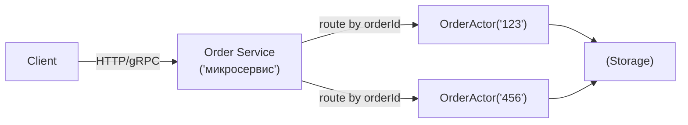

[← Назад к индексу части 11](index.md)

## 11.4. Как моделировать домен: актор на сущность и гранулярность

### Цель раздела

Научиться выбирать **гранулярность** акторов: где «один актор на сущность/агрегат» даёт максимальную пользу, а где акторы превращаются в лишнюю сложность. Понять, как акторы встраиваются в микросервисную архитектуру: чаще всего акторы — это **внутренний механизм** сервиса, а не «архитектура системы вместо микросервисов».

### В этом разделе главное

- Сильный паттерн: **actor-per-entity** (актор на сущность/агрегат).
- Гранулярность важнее технологии:
  - слишком крупно → узкое место,
  - слишком мелко → накладные расходы и хаос.
- Частый гибрид:
  - **микросервис** как граница домена/команды,
  - **акторы внутри** как механизм конкурентности и состояния.
- Акторы не отменяют требования к данным:
  - где хранится истина,
  - как восстанавливаемся,
  - какая консистентность нужна.

### Термины

| Термин | Определение |
|---|---|
| **Actor-per-entity** | Один актор отвечает за одну сущность (например, `OrderActor(orderId)`) |
| **Гранулярность** | «Размер» единицы: сколько ответственности и состояния в одном акторе |
| **Гибрид** | Сочетание акторов (внутри сервиса) с классическими API (снаружи) |

### Теория и правила

#### 1) Когда «актор на сущность» работает особенно хорошо

Сценарии:

- много параллельных команд к одной сущности;
- есть чёткий жизненный цикл;
- важны инварианты («нельзя оплатить дважды», «нельзя отгрузить до оплаты»).

Актор становится «единственным писателем» для сущности → инварианты проще.

#### 2) Где проходит граница: актор vs сервис

Важно не перепутать уровни:

- **Микросервис** — про границы системы: API, владение данными, команда, независимый деплой.
- **Акторы** — про внутреннюю организацию вычислений и состояния.

Типовой рисунок:



Снаружи клиенту всё равно, акторы внутри или нет.

#### 2.1) Отличия от «классических» микросервисов по HTTP (коротко и честно)

Акторы часто сравнивают с микросервисами, потому что и там, и там «много маленьких штук». Но уровень абстракции разный.

| Ось сравнения | Микросервис | Актор |
|---|---|---|
| **Гранулярность** | Обычно крупнее: доменный компонент/сервис | Обычно мельче: сущность/агрегат/сессия |
| **Контракт** | API (HTTP/gRPC), SLO, versioning | Сообщения (внутри runtime/кластера), часто без внешнего API |
| **Деплой** | Независимый деплой — ключевая цель | Не обязателен; акторы часто внутри одного деплоя |
| **Данные** | Владение БД/схемой (идеально) | Владелец in-memory состояния; персистентность — отдельный дизайн |
| **Основная проблема** | Границы системы/команд/данных | Конкурентность и локализация состояния |

Ментальный якорь:

> Микросервис — граница ответственности на уровне системы.  
> Актор — граница ответственности на уровне состояния и конкурентности.

#### 3) Как выбирать гранулярность (практическая линейка)

Спроси себя:

1. **Какой объект является «единицей конкуренции»?**  
   Если конкуренция идёт «по заказам» → возможно `OrderActor(orderId)`.

2. **Можно ли состояние разложить на независимые куски?**  
   Если да, разбивай на несколько акторов, а не делай один глобальный.

3. **Есть ли «горячие ключи»?**  
   Если 1% сущностей получает 90% сообщений, нужен план: шардирование, распределение, специальные акторы.

4. **Что является источником истины?**  
   Если актор держит важное состояние только в памяти, подумай о персистентности (11.5).

### Пошагово: актор на заказ (скелет)

1. Определи команды:
   - `CreateOrder`, `AddItem`, `Pay`, `Cancel`, `Ship`
2. Определи события/состояния:
   - `Created`, `Paid`, `Cancelled`, `Shipped`
3. Сформулируй инварианты:
   - `Ship` нельзя до `Pay`
   - `Pay` нельзя после `Cancel`
4. Реализуй обработку сообщений последовательно внутри `OrderActor`.
5. Сохраняй состояние (см. 11.5) и публикуй интеграционные события (с аккуратностью к доставке, см. 11.2).

### Простыми словами

Если микросервис — это «отдел компании», то акторы внутри — это «сотрудники, каждый ведёт свой кейс».  
Один сотрудник ведёт один кейс, и никто другой в этот кейс одновременно не лезет — значит меньше путаницы и конфликтов.

### Картинка в голове

«Набор маленьких менеджеров» вместо одного большого:

```text
OrderService
  ├─ OrderActor(1)  handles messages for order #1
  ├─ OrderActor(2)  handles messages for order #2
  └─ OrderActor(3)  handles messages for order #3
```

### Как запомнить

- **Актор на сущность** — когда важны инварианты и есть конкуренция за её состояние.
- **Сервис** — когда важны границы системы и владение данными.
- Часто правильный ответ: **акторы внутри сервиса**.

### Примеры

#### Пример 1. Почему «актор на всё приложение» плох

Если сделать один `AppActor`, который принимает все сообщения:

- он станет узким местом;
- очередь будет расти;
- задержка будет высокой;
- параллелизм исчезнет.

#### Пример 2. Почему «актор на каждый клик UI» тоже плох

Если акторы слишком мелкие:

- растут накладные расходы (создание, маршрутизация, супервизия);
- труднее отлаживать;
- границы предметной области теряются.

### Практика / реальные сценарии

- **Игровая сессия**: один актор на комнату/матч — естественная единица состояния.
- **Телеком**: один актор на абонента/звонок.
- **Финтех**: один актор на счёт/кошелёк (аккуратно с персистентностью и аудитом).

### Типичные ошибки

- Делать акторы «золотым молотком» для CRUD.
- Не отделять доменную логику от инфраструктуры: актор превращается в «бог-объект».
- Не продумать «горячие ключи» → один актор перегружен.

### Что будет, если…

- …неправильно выбрать единицу конкуренции:
  - либо получишь гонки (слишком крупная shared зона),
  - либо потеряешь производительность (слишком крупный актор-узкое место),
  - либо получишь хаос (слишком мелко).

### Проверь себя

1. Почему часто лучше «акторы внутри микросервиса», а не «вся система как акторы»?  
   <details><summary>Ответ</summary>
   Потому что микросервисы решают задачи границ (команда, деплой, владение данными, внешний контракт), а акторы — задачи конкурентности и локализации состояния внутри компонента. Делать всё системой акторов часто означает усложнять границы, инфраструктуру и операционную модель без необходимости.
   </details>

2. В каком сценарии «актор на сущность» особенно естественен? Назови один.  
   <details><summary>Ответ</summary>
   Например: управление жизненным циклом заказа (`OrderActor(orderId)`) или игровой матч (`MatchActor(matchId)`), где к одной сущности приходит много параллельных команд и важно последовательно соблюдать инварианты.
   </details>

3. Что будет признаком слишком крупного актора?  
   <details><summary>Ответ</summary>
   Рост mailbox, рост latency обработки сообщений, систематическое отставание, а также высокая «сцепленность» ответственности: актор занимается слишком многим и становится бутылочным горлышком.
   </details>

### Запомните

- Выбор гранулярности — главный практический навык в акторной модели.
- Наиболее частый здоровый паттерн: **actor-per-entity внутри сервиса**.

---
