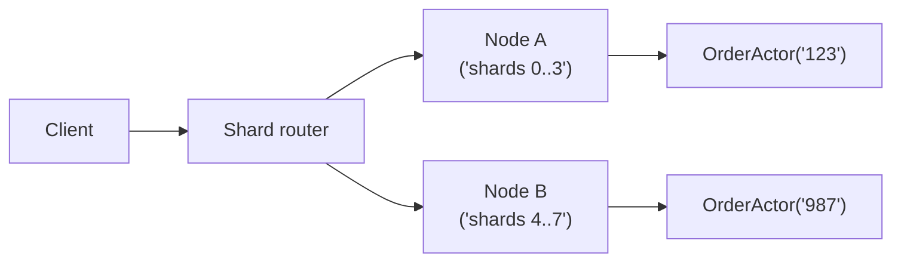

[← Назад к индексу части 11](index.md)

## 11.5. Персистентность и кластеризация

### Цель раздела

Понять, как акторы живут в мире, где процессы падают, узлы перезагружаются, сеть рвётся, а система должна продолжать работать. Разобрать идею **персистентных акторов**, снапшотов и распределённых акторов (кластер/шардинг) — на уровне модели и типовых компромиссов.

### В этом разделе главное

- In-memory состояние актора исчезает при restart → если это состояние важно, оно должно быть **восстановимо**.
- Персистентность часто строится на:
  - событиях (event sourcing как идея),
  - периодических снапшотах,
  - либо хранении «истины» в БД и загрузке при старте.
- Распределённые акторы добавляют цену:
  - сеть, партиционирование, задержки,
  - согласованность при переезде актора между узлами,
  - необходимость стабильной адресации/шардинга.

### Термины

| Термин | Определение |
|---|---|
| **Persistent actor** | Актор, который может восстановить состояние после падения |
| **Snapshot** | Сохранение «снимка» состояния, чтобы не проигрывать всю историю |
| **Event sourcing (идея)** | Источник истины — поток событий; состояние получается применением событий |
| **Cluster** | Несколько узлов, на которых живут акторы |
| **Sharding** | Распределение акторов по узлам (часто по ключу сущности) |
| **Partition (сетевое разделение)** | Сеть «разрезалась»: узлы не видят друг друга |

### Теория и правила

#### 1) «Restart = амнезия», если нет персистентности

Очень важное правило:

> Если актор хранит важное состояние только в памяти, то любая ошибка или рестарт может привести к потере этого состояния.

Поэтому либо:

- состояние **не критично** (кэш, метрики),
- либо оно должно быть **восстановимо**.

#### 2) Три базовых подхода к восстановлению состояния

1) **State in DB**  
Актор при старте читает состояние из БД, при изменении — пишет.

- **плюсы**: просто, понятно, привычно
- **минусы**: БД становится точкой конкуренции/узким местом; нужна аккуратность с транзакциями

2) **Event log + replay** (event sourcing как идея)  
Актор пишет события «что произошло» и восстанавливается, проигрывая события.

- **плюсы**: аудит, история, воспроизводимость
- **минусы**: сложнее, нужен дизайн событий, версионирование, снапшоты

3) **Snapshot + events**  
Комбинация: иногда пишем снапшот состояния, а между снапшотами — события.

- **плюсы**: быстрее восстановление
- **минусы**: усложнение хранения и политики снапшотов

#### 3) Кластерные акторы: почему «распределённость» — это новая цена

В одном процессе всё просто: адрес актора — это ссылка, mailbox локальный.

В кластере нужно решить:

- где живёт актор `OrderActor(123)` сейчас;
- что делать, если узел упал;
- как не получить «двух акторов на одну сущность» при партиционировании.

Типичная схема — шардинг:

- есть функция `shard(entityId) -> shardId`;
- shardId назначается узлу;
- сообщения по entityId маршрутизируются на нужный узел.



#### 4) Партиционирование сети: «кто прав?»

Если сеть разделилась, возможно появление ситуаций:

- часть кластера считает, что актор живёт у неё;
- другая часть тоже так считает.

Это приводит к риску «двойного владельца состояния». Поэтому реальные платформы вводят механизмы:

- кворум/лидерство,
- fencing tokens,
- ограничения на активность при split-brain.

Здесь важно не уходить в глубокую теорию распределённых алгоритмов, но помнить:

> Распределённые акторы — это всегда компромисс между доступностью и консистентностью.

#### 4.1) Split brain: почему это не теория, а реальная боль

Split brain — когда кластер разделился на две части, и **обе считают себя «правильными»**.  
Для акторов это опасно особенно сильно: может появиться **два активных владельца одного и того же состояния**.

Практический вывод:

- для критичных сценариев нужны механизмы «один активный владелец»:
  - кворум/лидерство,
  - fencing tokens,
  - запрет работы при потере кворума.

Если система финансовая/учётная, «двойной владелец» почти всегда хуже, чем временная недоступность части функционала.

#### 4.2) «Виртуальные акторы» vs «явные акторы»: важное отличие Orleans

В Orleans часто говорят «virtual actors» (grains). Интуитивно:

- ты обращаешься к `Grain(entityId)` как к «логическому актору»;
- runtime сам решает, где он живёт и когда активируется/выгружается;
- обработка обычно сериализована по grain’у.

Плюс: меньше ручного управления жизненным циклом.  
Минус: важно понимать нюансы:

- у grain’ов есть активация/деактивация, и «всегда живой актор» — не обязательно;
- есть тема **reentrancy**: если включить неосторожно, можно снова получить конкурентные эффекты на уровне логики;
- вопросы хранения состояния и гарантий доставки при интеграциях всё равно остаются (их нельзя «скрыть моделью»).

### Пошагово: как решать «нужно ли актору быть персистентным»

1. Определи: состояние критично для бизнеса или это кэш/вспомогательное?
2. Если критично — выбери стратегию:
   - хранить state в БД
   - или хранить события + снапшоты
3. Определи требования к восстановлению:
   - сколько времени можно «восстанавливаться» после сбоя?
4. Если актор распределённый — продумай:
   - ключ шардинга,
   - «горячие ключи»,
   - поведение при падении узла.

### Простыми словами

Актор без персистентности — это как записная книжка, которую держат в руках:

- если человек уронил книжку в воду — всё пропало.

Персистентный актор — это как:

- «я записываю важное в журнал, и если книжка пропадёт, я восстановлюсь по журналу».

### Картинка в голове

```text
Без персистентности:
  [actor state in RAM] --crash--> [lost]

С персистентностью:
  [events/snapshot] -> replay -> [actor state restored]
```

### Как запомнить

- **Restart = потеря RAM.**
- Если RAM важна → делай состояние восстановимым.
- Кластер добавляет сеть → сеть добавляет «неприятную физику».

### Примеры

#### Пример 1. Когда можно без персистентности

- агрегатор метрик за последнюю минуту;
- временный rate limiter (если есть общий внешний лимитер);
- кэш горячих данных.

Потеря состояния не разрушает бизнес-данные.

#### Пример 2. Когда персистентность обязательна

- баланс кошелька;
- состояние заказа;
- гарантия «один раз» для операции списания.

### Практика / реальные сценарии

- В системах с высокой конкуренцией акторы часто используются как «серийный исполнитель» операций по сущности.  
  Если бизнес-истина при этом хранится в БД — ты строишь вокруг неё дисциплину последовательной обработки.

### Типичные ошибки

- Полагаться на in-memory состояние как на источник истины без восстановления.
- Делать persistent actors, но не продумывать:
  - версионирование событий,
  - политику снапшотов,
  - стратегию восстановления после падений.
- Использовать кластер «потому что модно», не имея операционной зрелости.

### Что будет, если…

- …актор держит деньги в RAM и падает:
  - ты теряешь состояние и получаешь финансовые ошибки;
  - восстановление становится ручным расследованием.

### Проверь себя

1. Почему restart без персистентности опасен для бизнес-критичного состояния?  
   <details><summary>Ответ</summary>
   Потому что restart сбрасывает in-memory состояние. Если оно было источником истины (баланс, статус заказа), то данные теряются или становятся неконсистентными. Поэтому критичное состояние должно храниться или восстанавливаться из устойчивого хранилища.
   </details>

2. Назови два подхода к восстановлению состояния персистентного актора.  
   <details><summary>Ответ</summary>
   (1) Хранить текущее состояние в БД и загружать при старте. (2) Хранить поток событий (event log) и восстанавливать состояние проигрыванием событий, иногда ускоряя снапшотами.
   </details>

3. В чём основная новая сложность при переходе к кластерным (распределённым) акторам?  
   <details><summary>Ответ</summary>
   Появляется сеть: сообщения могут задерживаться/теряться, узлы могут быть недоступны, возможны партиционирования, нужно решать, где «живёт» актор и как избежать двух активных владельцев состояния. Это требует шардинга, лидерства/кворума и операционной дисциплины.
   </details>

### Запомните

- Персистентность — это ответ на «процессы падают».
- Кластеризация — это ответ на «нужно масштабироваться», но она добавляет цену распределённости.

---
