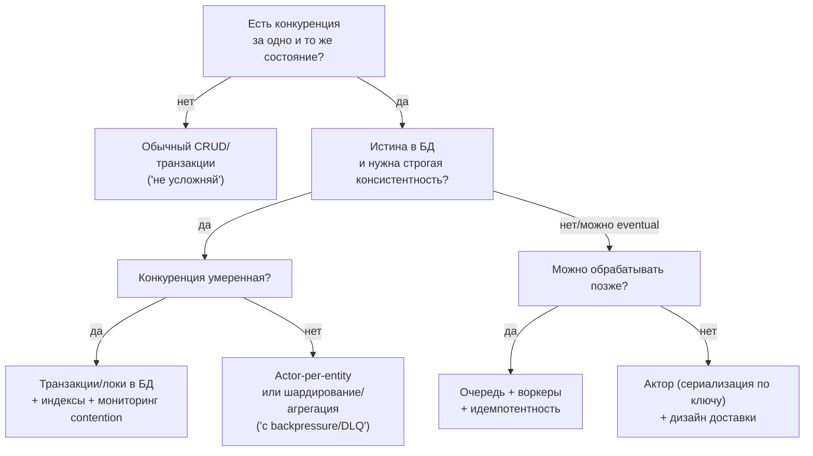
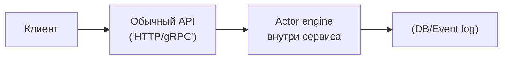

[← Назад к индексу части 11](index.md)

## 11.6. Инструменты и внедрение: Akka, Orleans, Erlang, Cloudstate

### Цель раздела

Дать ориентиры по экосистемам и «правильному старту»: что обычно предлагают Akka/Orleans/Erlang/Cloudstate‑подходы, какие ошибки делают при выборе и внедрении акторной модели, и как внедрять акторы поэтапно (часто — внутри одного сервиса).

### В этом разделе главное

- **Akka (JVM)**: зрелая акторная экосистема, кластер, стримы; высокая мощность и цена освоения.
- **Orleans (.NET)**: «виртуальные акторы» (grains), удобство для распределённых сценариев; много встроенной инфраструктуры.
- **Erlang/Elixir**: акторная модель в ДНК языка (процессы, mailbox, супервизоры); сильна в отказоустойчивости.
- **Cloudstate**: акторная семантика как платформенный слой («stateful functions»); удобно, если хочешь получить акторность как сервис, но цена — ограничения платформы и возможный vendor lock‑in.
- Выбор должен опираться на:
  - компетенции команды,
  - требования к распределённости,
  - интеграцию со стеком,
  - операционную зрелость.

### Термины

| Термин | Определение |
|---|---|
| **Akka** | JVM‑платформа с акторной моделью и кластером |
| **Orleans grains** | «Виртуальные акторы» в Orleans |
| **BEAM** | Виртуальная машина Erlang/Elixir с мощной супервизией процессов |
| **Cloudstate** | Платформа для stateful‑компонентов с акторной семантикой |

### Теория и правила

#### 1) Как не перепутать инструмент и модель

Actor model — это модель. Инструменты — реализации.

Типовые ошибки:

- выбирать «самый модный фреймворк», не понимая, какую проблему решаем;
- переносить акторный стиль на команду без опыта → получать хаос и недоверие.

#### 2) Практичный способ внедрения: «акторы внутри сервиса»

Хорошая стратегия:

- не перестраивать всю систему;
- выбрать один сервис/подсистему с явной болью конкурентности;
- внедрить акторы локально:
  - actor-per-entity,
  - метрики очередей,
  - персистентность по необходимости.

Снаружи сервис остаётся обычным API.

#### 2.1) Быстрое сравнение экосистем (в практических осях)

| Ось | Akka (JVM) | Orleans (.NET) | Erlang/Elixir | Cloudstate |
|---|---|---|---|---|
| **Тип акторов** | явные акторы; разные API (в т.ч. typed) | виртуальные акторы (grains) | процессы (очень лёгкие) + OTP | «акторы как платформа» |
| **Кластер/шардинг** | зрелый кластер, sharding | встроенная виртуализация/распределение | распределение возможно, но нужен OTP‑подход | обычно часть платформы |
| **Супервизия** | есть, но стиль зависит от API | есть механизмы устойчивости, модель иная | супервизия — фундамент OTP | «платформенная» устойчивость |
| **Порог входа** | выше среднего | средний (если .NET стек) | высокий, если язык новый | зависит от платформы |
| **Риск «переусложнить»** | высокий, если стартовать «всё сразу» | умеренный при локальном внедрении | умеренный (но нужен стиль OTP) | высокий vendor lock‑in |

Это не рейтинг, а подсказка: где будет основная цена (обучение, операционка, платформа, ограничения).

#### 3) Чек‑лист выбора акторов

Акторная модель чаще уместна, если:

- есть высокая конкуренция за состояние (много параллельных команд к одной сущности);
- важны инварианты и последовательность изменений;
- требуется реактивная обработка потоков сообщений;
- команда готова к дисциплине доставки/идемпотентности/наблюдаемости.

Чаще не уместна, если:

- у вас простой CRUD без конкуренции и сложной логики;
- команда не готова к новой модели мышления и инструментам;
- нет ресурсов на операционную поддержку (особенно для кластера).

#### 3.1) Матрица выбора: акторы vs альтернативы (mutex/БД/очереди)

Ниже — практичная «шпаргалка выбора», когда у тебя боль конкурентности и нужно выбрать механизм.

| Подход | Когда хорошо подходит | Когда плохо подходит | Главные риски |
|---|---|---|---|
| **Locks/mutex в памяти** | один процесс, простая критическая секция, низкая конкуренция | несколько инстансов сервиса, нужно масштабироваться горизонтально | забытые локи, дедлоки, сложно отлаживать в проде |
| **Транзакции/локи в БД** | источник истины в БД, важна строгая консистентность, умеренная конкуренция | очень высокая конкуренция на одну строку/ключ, нужна низкая латентность на пиках | contention/локи, деградация БД, дорогое масштабирование |
| **Очередь + воркеры** | сгладить пики, обработка «позже», много независимых задач | требуется последовательность по ключу и строгие инварианты без доп. механизма | «очередь не хранит истину», нужны идемпотентность и план владения состоянием |
| **Актор (actor-per-entity)** | высокая конкуренция *по ключу*, сильные инварианты, нужна сериализация изменений | простой CRUD, нет конкуренции, нет ресурсов на дисциплину доставки/наблюдаемость | рост mailbox, необходимость backpressure/DLQ, персистентность при падениях |

Короткое правило выбора:

- если «истина в БД» и конкуренция умеренная → чаще достаточно транзакций;
- если конкуренция высокая и нужна сериализация по ключу → акторная модель часто выигрывает по предсказуемости;
- если задача «в фоне» и можно позже → очередь+воркеры;
- если система горизонтально масштабируется, а ты пытаешься решить это mutex’ом в памяти → почти всегда ошибка.

#### 3.2) Диаграмма выбора: быстрый путь к решению

### Пошагово: безопасный старт

1. Сформулируй «боль», которую решаем (гонки? contention? последовательность?).
2. Сделай минимальный прототип:
   - один тип актора,
   - 2–3 сообщения,
   - метрики mailbox/latency.
3. Определи гарантии доставки и требования к идемпотентности.
4. Добавь наблюдаемость:
   - метрики, логи, корреляцию.
5. Только потом думай о кластеризации.

### Простыми словами

Не надо «переезжать в акторный мир» сразу.  
Чаще всего акторы — это мощный внутренний механизм для конкретной боли, а не «религия».

### Картинка в голове

### Как запомнить

- Акторы — сильный инструмент, когда есть **конкуренция и состояние**.
- Если нет конкуренции — акторы чаще добавляют сложность без пользы.

### Примеры

#### Пример: «Когда не надо акторов»

Админка с CRUD по справочнику:

- нагрузка низкая,
- конкуренция минимальная,
- проще поддерживать обычные транзакции в БД.

Акторы добавят:

- новые концепции,
- новые точки отказа,
- новую операционную нагрузку.

### Практика / реальные сценарии

- **Akka/Orleans** часто появляются в системах:
  - где много concurrent сущностей,
  - где важно «сериализовать» изменения по ключу,
  - где нужно масштабировать обработку по шард‑ключу.

### Типичные ошибки

- Внедрять акторы без метрик mailbox и latency.
- Игнорировать поведение при сбоях: «падает — рестартится» без понимания, что теряем.
- Делать «жирные акторы» с кучей обязанностей.

### Что будет, если…

- …вы выберете акторную платформу без экспертизы:
  - вы получите скрытые баги (дубликаты, потеря сообщений, backpressure),
  - а команда будет избегать системы, потому что «слишком сложно».

### Проверь себя

1. Назови одну причину, когда акторная модель уместна, и одну — когда нет.  
   

Ответ

   Уместна: высокая конкуренция за состояние сущности и необходимость последовательных изменений (например, заказы/балансы/сессии). Не уместна: простой CRUD без конкуренции и без сложных инвариантов, где транзакции БД решают задачу дешевле.
   

2. Почему «акторы внутри сервиса» часто безопаснее, чем «вся система как акторы»?  
   

Ответ

   Потому что границы системы остаются прежними (контракты, деплой, владение данными), а акторная модель применяется локально к конкретной боли конкурентности. Это снижает архитектурный риск и позволяет внедрять поэтапно.
   

3. Какие две метрики ты бы добавил первым делом в акторную подсистему?  
   

Ответ

   Длина/глубина mailbox (queue length) и latency обработки сообщений (время ожидания + время обработки). Также полезны частота рестартов и количество сообщений в DLQ/dead letters.
   

### Запомните

- Выбор инструмента вторичен по сравнению с пониманием модели и проблем, которые вы решаете.
- Начинай локально, измеряй, и только потом масштабируй.

---

## Сквозной план внедрения акторов в существующую систему (пилот “под прод”, а не теория)

Этот блок — про то, чего обычно не хватает: **как внедрить акторов так, чтобы это было управляемым экспериментом**, с метриками, планом деградации и откатом. Подходит для сценария “у нас гонки/контеншн по ключу (orderId/accountId/sessionId)”.

### 1) Выбери пилот по “естественному ключу конкурентности”

Хороший пилот:

- есть понятный ключ сериализации: `orderId`, `accountId`, `matchId`;
- можно ограничить влияние (один домен/одна операция);
- можно измерить эффект (ошибки гонок, contention, p95/p99).

Плохой пилот:

- “акторизуем всё”;
- нет метрик, что именно болит (в итоге нечем доказать пользу).

### 2) Зафиксируй контракт сообщений (и идиемпотентность) как артефакт

Минимум:

- список команд (input) и событий/ответов (output);
- **idempotency key** для команд, которые могут повторяться;
- политика ретраев/дедупликации (см. часть 12 и 19).

Правило: если вы не можете объяснить, что будет при “одно и то же сообщение пришло 2 раза”, вы ещё не готовы к прод‑пилоту.

### 3) Наблюдаемость: 4 метрики, без которых пилот нельзя включать

1) **Mailbox depth / backlog** (сколько сообщений ждёт).  
2) **Queueing latency** (время ожидания в mailbox).  
3) **Processing latency** (время обработки сообщения).  
4) **Dead letters / DLQ rate** (сколько сообщений ушло “в мёртвые”).

Плюс обязательный атрибут в логах/трейсах: `actor_id` (и `shard_id`, если есть).

### 4) Backpressure и “горячие ключи” (самая частая причина провала)

Если 1% ключей создаёт 90% сообщений, актор превращается в bottleneck.

План действий:

- лимиты на вход (rate limit per key/tenant);
- деградация “best effort” там, где допустимо;
- отдельный путь для hot key (шардирование на под‑акторов/агрегация).

### 5) Персистентность: выбери один из 3 честных вариантов (и запиши почему)

- **A. Истина в БД**: актор грузит состояние из БД и пишет транзакционно (проще, но зависит от БД).  
- **B. Event‑sourced actor**: состояние = события + снапшоты (сильнее модель, но цена выше; см. часть 14).  
- **C. “Можно потерять”**: состояние не критично и допускается восстановление “с нуля” (редко, но бывает).

Если вариант не выбран явно, в инциденте вы узнаете, что команда выбрала “случайно”.

### 6) Откат и критерии провала (пилот должен уметь проигрывать)

**Откат (минимум):**

- feature flag: маршрутизация запроса “через актор” или “старый путь”;
- возможность временно отключить actor‑путь и вернуться к транзакциям/очереди.

**Критерии провала (пример):**

- mailbox растёт и не стабилизируется при нормальной нагрузке;
- p99 latency ухудшился (очереди внутри);
- растёт DLQ/dead letters;
- выявились hot keys без приемлемого плана.

### 7) Выход из пилота: что считать “успехом”

- уменьшилась доля ошибок гонок/дубликатов/контеншна;
- метрики mailbox/latency стабильны и предсказуемы;
- есть runbook: “что делать, если backlog растёт” и “как отключить actor‑путь”.

#### Проверь себя: пилот акторов

1. Какие 4 метрики ты обязан(а) иметь, прежде чем включать акторный путь на трафик?  
2. Назови один “горячий ключ” в своём домене и один способ, как ты не дашь ему убить систему.  
3. Как выглядит откат: что конкретно переключаем?

Ответ

1. Mailbox depth/backlog, queueing latency, processing latency, DLQ/dead letters rate (плюс корреляция `actor_id`).  
2. Например, “один популярный товар / один большой тенант / один кошелёк”. Способы: rate limit per key/tenant, деградация, отдельный путь/шардирование на под‑акторов, пред‑агрегация.  
3. Переключаем маршрутизацию “через актор” на “старый путь” (feature flag) и/или выключаем приём сообщений в actor‑подсистему, сохраняя корректность через транзакции/очередь.

---
