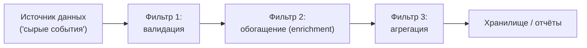

[← Назад к индексу части 12](index.md)

## 12.3. Pipe‑and‑Filter и пайплайны

### Цель раздела

Показать, как с помощью стиля **Pipe‑and‑Filter** строить **понятные конвейеры обработки данных**: цепочки фильтров, каждый из которых выполняет один шаг, и как это соотносится с событийными потоками и очередями.

### В этом разделе главное

- Pipe‑and‑Filter — это **конвейер из шагов (фильтров)**, каждый делает одну трансформацию/проверку.
- Этот стиль особенно полезен для **ETL, потоковой обработки, обогащения данных**.
- Pipe‑and‑Filter можно реализовать как **потоки сообщений** (через топики/очереди), так и внутри одного процесса.
- Важно не превращать конвейер в «чёрный ящик» без наблюдаемости и чётких контрактов между фильтрами.

### Термины

- **Filter (фильтр)** — шаг обработки: принимает входной поток, выдаёт выходной поток.
- **Pipe (труба)** — канал передачи данных между фильтрами.
- **ETL** — Extract, Transform, Load; типичный сценарий Pipe‑and‑Filter.

### Теория и правила

1. **Каждый фильтр отвечает за одну стадию.**
   - Валидация;
   - обогащение (enrichment);
   - агрегация;
   - форматирование/преобразование.

2. **Слабая связанность между фильтрами.**
   - Фильтр знает только формат входа и выхода;
   - не знает, какие именно фильтры были до/после (если возможно).

3. **Pipe‑and‑Filter поверх EDA.**
   - Каждый шаг может быть отдельным сервисом/воркером;
   - между ними — топик/очередь как pipe.

4. **Отличия от «чистой» EDA и ограничения.**
   - В классической EDA мы часто говорим о **разветвлённой сети реагирующих сервисов** (один факт → много реакций).
   - В Pipe‑and‑Filter основной фокус — **линейный (или почти линейный) конвейер обработки**.
   - Pipe‑and‑Filter:
     - хорошо работает для однонаправленных потоков (ETL, логи, аналитика);
     - **хуже подходит** для сценариев с двусторонними запросами/ответами и сложной маршрутизацией по типу сообщения;
     - не заменяет полноценную событийную шину, а **строится поверх неё** там, где это уместно.

### Простыми словами

Представь автомобильный конвейер:

- один пост ставит двигатель,
- другой — двери,
- третий — красит.

Каждый шаг прост и повторяем. Если один из них тормозит — видно, где «бутылочное горлышко». То же самое мы хотим от конвейера обработки событий или данных.

### Картинка в голове

Каждый фильтр может быть:

- отдельным микросервисом, читающим из одного топика и пишущим в другой;
- или просто функцией в одном процессе.

### Как запомнить

Формула:

> **Pipe‑and‑Filter = «конвейер шагов обработки»**, поверх событий или потоков данных.

### Примеры

1. **Пайплайн логов:**
   - `raw-logs` → фильтр парсинга → `parsed-logs` → фильтр обогащения (user, geo) → `enriched-logs` → фильтр агрегации → `metrics`.

2. **ETL для отчётов по заказам:**
   - события `OrderPlaced` → фильтр нормализации → агрегатор по дате → загрузка в витрину отчётов.

### Практика / реальные сценарии

- Обработка транзакций: фильтр валидации vs фильтр антифрода vs фильтр записи в DWH.
- **Real‑time дашборды:** события с фронта → фильтр по типу действия → агрегация по метрикам → обновление дашборда.

### Типичные ошибки

- Смешивать в одном фильтре **несколько обязанностей** (валидация + агрегация + запись в DWH).
- Не логировать и не мониторить каждый шаг пайплайна — сложно понять, где потерялись события или почему данные не доходят до конца.
- Жёстко связывать фильтры друг с другом (жёсткие ссылки) вместо слабой связанности через чёткие контракты.

### Что будет, если…

1. Если ты «сплющишь» все шаги в один огромный сервис вместо конвейера фильтров?  
2. Если каждый фильтр будет использовать **разные схемы** и форматы сообщений без явной документации и версионирования?

Коротко:

- в первом случае теряется преимущество локализации проблем и независимости масштабирования шагов; менять конвейер сложно и рискованно;
- во втором — любые изменения одного фильтра могут незаметно ломать другие, и отладка превращается в боль.

### Проверь себя

1. Придумай простой конвейер обработки событий `UserActivity` для аналитики: какие 3–4 фильтра тебе понадобятся?  
2. Как ты будешь масштабировать такой конвейер, если объём событий вырастет в 10 раз?  
3. Где в твоём опыте уже есть «скрытый Pipe‑and‑Filter», хотя архитектурно это не было оформлено явно?

Ответ

1. Например: (1) фильтр валидации и нормализации (отбрасывает некорректные события, нормализует схему), (2) фильтр обогащения (подставляет user segment, campaign), (3) фильтр агрегации по временным окнам (счётчик активностей), (4) запись агрегатов в DWH/кеш.  
2. Добавить больше воркеров на каждый фильтр, разделить потоки по партициям (например, по пользователю или сегменту), вынести тяжёлые шаги в отдельные сервисы; важно следить за lag на каждом шаге и балансировать цепочку.  
3. Часто так устроены ETL‑плагины, цепочки middleware, пайплайны обработки логов или событий в аналитике — просто они не всегда выделены как отдельный архитектурный стиль.  

### Запомните

- Pipe‑and‑Filter — это **способ думать о потоках обработки**, который хорошо сочетается с EDA.
- Правильно спроектированный конвейер делает систему **прозрачной и управляемой**, неправильно — создаёт «тёмный туннель», где теряются сообщения.

---
