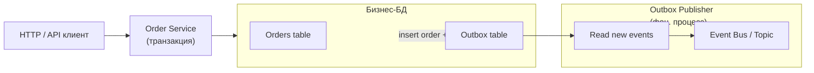

[← Назад к индексу части 12](index.md)

## 12.4. Outbox, ordering и идемпотентность

### Цель раздела

Разобраться, **как сделать событийную систему надёжной в реальном мире**: когда БД и шина могут падать, сообщения могут дублироваться, а порядок событий важен. Познакомиться с **Outbox‑паттерном, подходами к ordering и созданию идемпотентных обработчиков**, а также понять роль **consumer lag и мониторинга**.

### В этом разделе главное

- Outbox‑паттерн решает проблему **согласованности БД и шины**.
- Порядок сообщений обеспечивается **в пределах партиции / агрегата**, но не глобально.
- Идемпотентные обработчики — стандарт для работы при at‑least‑once доставке.
- Consumer lag — важная метрика здоровья событийной системы.

### Термины

- **Outbox table** — таблица рядом с бизнес‑данными, где временно хранятся события для публикации.
- **Publisher / Outbox processor** — процесс, который читает outbox и публикует события в шину.
- **Idempotent consumer** — потребитель, который корректно работает при повторной доставке событий.

### Теория и правила

1. **Проблема двойной записи (две системы):**
   - «Сначала пишем в БД, потом публикуем в шину» → риск, что шина упадёт после коммита БД.
   - «Сначала публикуем, потом пишем в БД» → риск несогласованности в другую сторону.

2. **Суть Outbox (варианты реализации).**
   - Общая идея:
     - в одной транзакции с бизнес‑данными сохраняем бизнес‑объект (например, `Order`);
     - в эту же транзакцию включаем запись события в `outbox` таблицу.
   - Далее есть два основных варианта:
     - **polling outbox** — отдельный процесс периодически читает таблицу и публикует новые события в шину; проще внедрить, но есть небольшая задержка;
     - **transactional outbox** (tight integration) — публикация события «подвешивается» к тем же транзакциям/логам, что и запись в БД (часто через встроенные механизмы БД или лог‑шиппинг); даёт меньший лаг, но сложнее в настройке.

3. **Ordering и ключ партиционирования.**
   - Для агрегатов, где порядок критичен (заказ, платёж), выбирают **ключ партиционирования** так, чтобы все события по агрегату были в одной партиции.

4. **Идемпотентные потребители.**
   - Хранят **ид обработанных событий** (или natural key), чтобы не выполнять работу дважды;
   - или реализуют операции как идемпотентные по своей природе (например, `set status = X` вместо «инкрементировать»).

5. **Consumer lag и мониторинг.**
   - Нужно измерять, **насколько потребитель отстаёт**;
   - лаг влияет на UX и бизнес‑инварианты (отчёты, нотификации, SLA).

### Простыми словами

Outbox — это как **черновик исходящих писем**:

- когда ты отправляешь важное письмо, оно сначала попадает в папку «Исходящие»;
- пока подключение к серверу нестабильно, клиент пытается дослать письмо позже;
- письмо не «теряется» между моментом написания и моментом фактической отправки.

В EDA мы делаем подобное:

- бизнес‑событие фиксируем в **БД + Outbox**;
- отдельный процесс «почтовый клиент» надёжно публикует это в шину.

### Картинка в голове



### Как запомнить

Формула:

> **Outbox = «записали событие рядом с бизнес‑данными, а публикуем потом»**.  
> **Идемпотентность = «не боимся повторов»**.

### Примеры

**Структура таблицы outbox (упрощённо, SQL):**

```sql
CREATE TABLE outbox_events (
  id            UUID PRIMARY KEY,
  aggregate_id  UUID NOT NULL,
  aggregate_type TEXT NOT NULL,
  type          TEXT NOT NULL,
  payload       JSONB NOT NULL,
  created_at    TIMESTAMPTZ NOT NULL DEFAULT now(),
  published_at  TIMESTAMPTZ
);
```

**Псевдокод транзакции:**

```pseudo
begin transaction
  insert into orders (...)
  insert into outbox_events (id, aggregate_id, type, payload)
commit
```

**Publisher (упрощённая логика):**

```pseudo
loop forever:
  events = select * from outbox_events
           where published_at is null
           order by created_at
           limit 100

  for each event in events:
    publish_to_bus(event.type, event.payload)
    mark_published(event.id, now())

  sleep(small_interval)
```

### Практика / реальные сценарии

- **Платежи:** запись факта списания в БД + outbox → публикация `PaymentCompleted` в шину для нотификаций и учёта.
- **Заказы:** `OrderPlaced` фиксируется вместе с заказом; если брокер временно недоступен, события «висят» в outbox, но не теряются.

### Типичные ошибки

- Писать в БД и публиковать в шину **в разных транзакциях без outbox**.
- Делать обработку событий **неидемпотентной** (инкрементировать баланс без учёта повторов).
- Не хранить информацию об обработанных событиях у потребителя.

### Что будет, если…

1. Если не использовать Outbox при критичных доменах (платежи, заказы)?  
2. Если потребитель не будет идемпотентным?

Коротко:

- при сбое между БД и шиной ты можешь навсегда потерять событие и нарушить интеграции (заказ создан, а `OrderPlaced` никто не увидел);  
- при повторной доставке события ты можешь дважды списать деньги, дважды начислить бонусы или дважды отправить одно и то же письмо.

### Проверь себя

1. Для сценария «оплата заказа» опиши, где ты поставишь Outbox и какие сущности туда будут писать.  
2. Придумай стратегию идемпотентности для обработчика события `PaymentCompleted`.  
3. Как ты будешь измерять и интерпретировать **lag** для потребителя отчётности?

<details><summary>Ответ</summary>

1. Outbox можно разместить в **той же БД, где живут заказы и платежи**. Транзакция: создать запись платежа, обновить статус заказа, записать событие `PaymentCompleted` в outbox. Publisher потом публикует событие в шину.  
2. Можно хранить `event_id` (или `paymentId`) в таблице «обработанные события» и перед выполнением операции проверять: если уже обработано — просто пропустить. Альтернативно — строить обработку как «установить статус в `PAID`», а не «инкрементировать», и использовать UPSERT.  
3. Lag — это разница между текущим offset в партиции и offset, до которого дошёл потребитель. Если lag растёт, отчёты строятся на устаревших данных. При большом lag нужно или усиливать мощность потребителей, или уменьшать поток, или отдельно коммуницировать бизнесу о задержке обновления отчётов.  

</details>

### Запомните

- Outbox + идемпотентные потребители — **обязательный фундамент** для серьёзной EDA.
- Ordering нужно проектировать **осознанно, по ключу домена**, а не надеяться на глобальный порядок.

---
