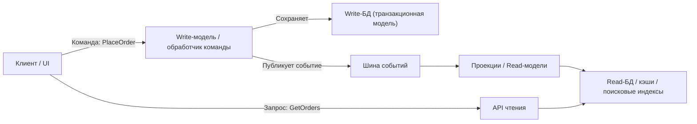

[← Назад к индексу части 13](index.md)

## 13.1. Интуиция CQRS: команды и запросы в реальных системах

### Цель раздела

Сформировать **интуитивное понимание**, зачем разделять чтение и запись: показать, как команды и запросы ведут себя в реальных системах, какую боль создаёт единая модель «на всё», и почему CQRS — это про **разные модели и потоки** для разных типов операций.

### В этом разделе главное

- Команды и запросы имеют **разные требования** к модели, производительности и сложности — это естественный повод разделить ответственность.
- CQRS особенно полезен, когда **логика команд сложная**, а чтения — многочисленные и разнообразные (дашборды, списки, фильтры).
- CQRS **не обязательно** означает два разных сервиса; иногда это всего лишь **разделение моделей и слоёв** внутри одного приложения.
- CQRS **почти всегда сопровождается eventual consistency** между write‑ и read‑моделями — это нужно осознавать заранее.
- Начинать «с CQRS» на маленьком CRUD‑сервисе — обычно **ошибка**; это инструмент для конкретных проблем.

### Термины

- **Команда** — операция, которая **меняет состояние**: `PlaceOrder`, `CancelOrder`, `ChargePayment`.
- **Запрос** — операция, которая **возвращает данные**, но ничего не меняет: `GetOrderDetails`, `ListOrders`, `GetSalesStats`.
- **Транзакционная модель** — модель, которая отвечает за выполнение команд с сохранением инвариантов (часто совпадает с write‑моделью).
- **Операции чтения (queries)** — запросы к данным, часто с фильтрацией, сортировкой, агрегацией.

### Теория и правила

1. **Разные типы нагрузки.**  
   В типичном бизнес‑приложении:
   - команд **существенно меньше**, чем запросов (запросы UI, отчёты, фильтры);
   - команды требуют **строгих инвариантов и транзакций**;
   - запросы требуют **гибких и быстрых выборок**.

2. **Разные приоритеты.**
   - Для команд важнее **корректность** (нельзя провести платёж дважды).
   - Для чтения важнее **скорость и удобство** (страница со списком заказов должна открываться за сотни мс).

3. **Единая модель часто приводит к компромиссам.**
   - Таблицы нормализованы под транзакции → сложные и медленные JOIN‑ы для отчётов.
   - Модель раздутой сущности `Order` содержит поля для всех случаев жизни → сложно читать и поддерживать.

4. **CQRS предлагает разделить ответственность.**
   - Одна модель (write‑модель) **оптимизирована под команды**.
   - Другая (read‑модели/проекции) **оптимизирована под чтения**.

5. **Разделение может быть логическим или физическим.**
   - Логическое: разные классы/слои в одном приложении.
   - Физическое: разные сервисы/БД для чтения и записи.

### Простыми словами

Представь интернет‑магазин:

- Пользователь **создаёт заказ** (команда).
- Потом он **10 раз открывает страницу «Мои заказы»** (запросы).
- Команда должна:
  - проверить наличие товаров,
  - зарезервировать их,
  - создать платёж,
  - сохранить всё в БД.
- Запрос **не меняет ничего**, он просто достаёт и красиво показывает данные.

Если у нас одна модель БД и один набор запросов «на все случаи», то:

- мы либо **усложняем SQL для чтения** (много JOIN‑ов, фильтров),
- либо **компрометируем дизайн write‑модели** ради удобства чтения.

CQRS говорит:  
**давай не будем пытаться одной моделью удовлетворить всех.**  
Сделаем:

- **write‑модель**, которая идеально поддерживает команды;
- и **одну или несколько read‑моделей**, которые идеально поддерживают чтение для конкретных экранов/отчётов.

### Картинка в голове

Полезно представить себе:

- **две дороги**, идущие параллельно:
  - **дорога команд** — узкая, с проверками, светофорами и шлагбаумами (инварианты);
  - **дорога запросов** — широкая магистраль для чтения, где важны пропускная способность и удобные съезды (индексы, проекции).

**Главная идея диаграммы:** команды идут по одной цепочке (через write‑модель), запросы — по другой (через read‑модели), между ними есть **событийный мост**.

### Как запомнить

Короткая формула:

> **CQRS = разные модели для «что сделать» и «что показать».**  
> «Что сделать» (команды) → write‑модель.  
> «Что показать» (запросы) → read‑модели/проекции.

### Примеры

1. **Система задач (task tracker).**
   - Команды: `CreateTask`, `AssignTask`, `ChangeStatus`.
   - Запросы: «Мои задачи», «Задачи по проекту», «Диаграмма загрузки команды».
   - Write‑модель сосредоточена на правилах: нельзя закрыть задачу без обязательных полей и т.п.
   - Read‑модели: отдельная таблица/индекс под «Мои задачи» с нужными фильтрами и сортировками.

2. **Финансовый сервис.**
   - Команды: `CreatePayment`, `RefundPayment`, `BlockCard`.
   - Запросы: «История операций», «Отчёт по оборотам».
   - Write‑модель обеспечивает корректность балансов.
   - Read‑модели обеспечивают быстрый расчёт отчётов, часто в отдельном хранилище.

### Практика / реальные сценарии

- Высоконагруженные системы, где:
  - чтений в разы больше, чем записей;
  - отчёты и UI‑страницы требуют сложных агрегаций.
- Сложные домены, где:
  - команды содержат богатую бизнес‑логику (много правил, состояний);
  - модель для команд и модель для чтения заметно отличаются по структуре.

### Типичные ошибки

- Внедрять CQRS «по учебнику» в маленький CRUD‑сервис, где:
  - модель простая,
  - запросы тривиальны,
  - нагрузка невысока.
- Путать CQRS с «отдельной репликой для чтения»:
  - реплика — это просто копия БД;
  - read‑модели — **осознанно спроектированные** представления, часто денормализованные.

### Что будет, если…

- **…мы не разделим модели, а будем всё делать на одной?**
  - С ростом требований к отчётам и UI появятся **адские запросы**, сложные `JOIN`‑ы, ручные оптимизации.
  - Модель станет тяжёлой и хрупкой: каждое изменение будет риском сломать что‑то ещё.

- **…мы разделим модели слишком рано и без необходимости?**
  - Поддержка усложнится,
  - появится дополнительная инфраструктура,
  - команда будет тратить силы на синхронизацию моделей, хотя реальной пользы мало.

### Проверь себя

1. Почему в большинстве систем **запросов больше, чем команд**, и как это влияет на архитектуру?
2. В чём принципиальная разница между **репликой БД для чтения** и **read‑моделью/проекцией**?
3. Приведи пример, когда CQRS **явно избыточен**.

Ответ

1. Потому что пользователи и интеграции **гораздо чаще смотрят на данные**, чем меняют их: открывают списки, фильтруют, строят отчёты. Это значит, что архитектура, оптимизированная только под команды, часто **плохо масштабируется по чтениям**; CQRS позволяет это разделить.
2. Реплика — это копия той же схемы, что и основная БД, просто на другом узле. Read‑модель/проекция может иметь **совсем другую схему**, агрегаты, предрасчитанные поля, удобные индексы под конкретные запросы. Она — не просто копия, а **новое представление**.
3. Например, небольшой админский сервис с десятком CRUD‑таблиц и низкой нагрузкой, где и запросы, и команды просты, а отчёты строятся редко. Здесь разделение моделей и добавление событий только усложнит жизнь без реального выигрыша.

### Запомните

- CQRS — это **про разделение ответственности**, а не про модные слова.
- Команды и запросы имеют **разные требования** — это естественное основание для двух разных моделей.
- Важно не начинать с CQRS «по умолчанию», а **приходить к нему как к ответу на конкретную боль**.

---
