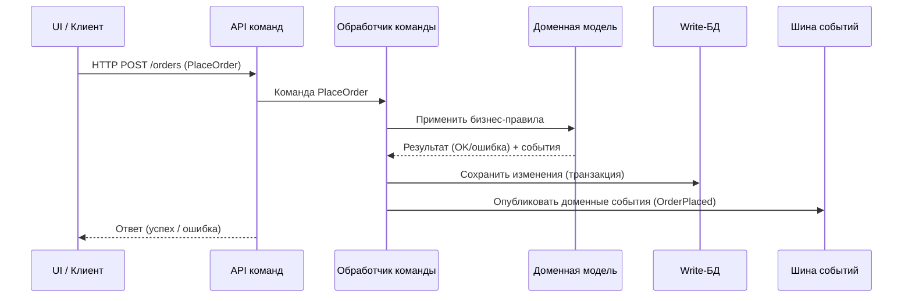

[← Назад к индексу части 13](index.md)

## 13.2. Write‑модель: команды, инварианты, доменная логика

### Цель раздела

Показать, как устроена **write‑сторона в CQRS‑системе**: какие роли выполняют команды, обработчики команд и доменные модели, как здесь используются гексагональная и Clean Architecture, где живут инварианты и транзакции, и как write‑модель связана с событиями и EDA.

### В этом разделе главное

- Write‑модель — это **сердце доменной логики**: сюда приходят команды, здесь проверяются правила и сохраняются изменения.
- Команда **не равна HTTP‑запросу**; это отдельный объект/понятие в модели.
- Обработчики команд работают **через доменные сущности и сервисы**, а не напрямую через таблицы.
- Инварианты (то, что «должно всегда быть верно») должны быть **выражены внутри write‑модели**, а не размазаны по UI и БД.
- Write‑модель может **публиковать события** (domain events), которые затем используются для обновления read‑моделей.

### Термины

- **Обработчик команды (Command Handler)** — компонент, который принимает команду, валидирует её и применяет к write‑модели.
- **Инвариант** — условие, которое должно быть истинно всегда (например, «баланс не может быть отрицательным ниже лимита кредита»).
- **Доменная модель** — сущности, агрегаты и доменные сервисы, которые реализуют бизнес‑правила.
- **Domain Event (доменное событие)** — факт, который произошёл в домене (например, `OrderPlaced`, `PaymentAuthorized`).

### Теория и правила

1. **Команда как отдельный объект.**
   - У команды есть **имя** (глагол в повелительной форме), параметры и контекст.
   - Команда **не знает**, как именно реализовано сохранение — этим занимается write‑модель.

2. **Обработчик команды и доменная модель.**
   - Обработчик:
     - принимает команду;
     - валидирует базовые условия (есть ли пользователь, достаточно ли данных);
     - загружает нужный агрегат/сущность;
     - вызывает методы доменной модели;
     - сохраняет изменения.

3. **Инварианты живут рядом с моделью.**
   - Инварианты формулируются **в коде доменной модели**:
     - нельзя провести платёж без авторизации;
     - нельзя отменить заказ после отправки.
   - Не полагайся только на UI и БД‑ограничения: это разные уровни защиты.

4. **Write‑модель и транзакции.**
   - Обычно внутри write‑модели операции выполняются в **одной транзакции** (в пределах одного агрегата/контекста).
   - Если нужно затронуть больше, используются **саги/оркестраторы** и события (см. части 9 и 12).

5. **События как результат команд.**
   - После успешного применения команды write‑модель может **выпустить доменные события**.
   - Эти события используются для:
     - обновления read‑моделей;
     - интеграции с другими сервисами.

### Простыми словами

Возьмём пример: **создание заказа**.

- Команда: `PlaceOrder(customerId, items, address)`.
- Обработчик команды:
  - проверяет, что пользователь существует;
  - загружает контекст корзины/товаров;
  - создаёт агрегат `Order` через доменный конструктор;
  - проверяет правила (есть ли товар в наличии, лимиты и т.д.);
  - сохраняет заказ и, возможно, резервирует сток.
  - публикует событие `OrderPlaced`.

Клиент (фронтенд или другой сервис) **не знает всех этих деталей** — он просто отправляет команду.  
Write‑модель заботится о том, чтобы **правила были соблюдены** и изменения были **атомарными** (в пределах своей транзакции).

### Картинка в голове

Представь write‑модель как **контрольный пункт на границе**:

- На вход приходят «пакеты команд» (декларации).
- Пограничник (обработчик) проверяет документы (валидация).
- Если всё в порядке — ставит печать (меняет состояние, сохраняет).
- После этого отправляет сообщение «человек пересёк границу» (доменное событие).



### Как запомнить

> **Write‑модель — это «место, где происходят серьёзные вещи».**  
> Сюда приходят команды, здесь проверяются правила, здесь рождаются доменные события.

### Примеры

1. **Сервис бронирования отелей.**
   - Команда `BookRoom`:
     - проверяет доступность номера;
     - учитывает правила отмены, предоплаты;
     - создаёт бронирование.
   - Доменные события:
     - `RoomBooked`,
     - `PrepaymentAuthorized`.

2. **Биллинговый сервис.**
   - Команда `ChargeInvoice`:
     - проверяет статус инвойса,
     - применяет налоги и скидки,
     - создаёт транзакцию списания.
   - Событие: `InvoiceCharged`.

3. **Условный пример кода обработчика команды и агрегата заказа.**

```csharp
// Команда
public record PlaceOrderCommand(Guid CustomerId, List<OrderItemDto> Items);

// Обработчик команды
public class PlaceOrderHandler
{
    private readonly IOrderRepository _orders;
    private readonly IInventoryService _inventory;
    private readonly IEventBus _eventBus;

    public async Task Handle(PlaceOrderCommand cmd)
    {
        // 1. Загрузить данные, нужные доменной модели
        var itemsAvailability = await _inventory.CheckAvailability(cmd.Items);

        // 2. Создать агрегат с проверкой инвариантов
        var order = Order.Place(
            customerId: cmd.CustomerId,
            items: cmd.Items,
            availability: itemsAvailability
        );

        // 3. Сохранить изменения в write‑хранилище
        await _orders.Save(order);

        // 4. Опубликовать доменные события
        foreach (var @event in order.DequeueEvents())
        {
            await _eventBus.Publish(@event);
        }
    }
}

// Агрегат заказа
public class Order
{
    private readonly List<OrderItem> _items = new();
    private readonly List<object> _events = new();

    public Guid Id { get; private set; }
    public Guid CustomerId { get; private set; }
    public OrderStatus Status { get; private set; }

    private Order() {}

    public static Order Place(Guid customerId, IEnumerable<OrderItemDto> items, ItemsAvailability availability)
    {
        // Инварианты: нет недоступных товаров, сумма > 0 и т.д.
        if (!availability.AllAvailable)
            throw new DomainException("Некоторые товары недоступны");

        var order = new Order
        {
            Id = Guid.NewGuid(),
            CustomerId = customerId,
            Status = OrderStatus.Placed
        };

        // наполнение позиций и прочая доменная логика

        order.Raise(new OrderPlaced(order.Id, customerId /* другие данные */));
        return order;
    }

    private void Raise(object @event) => _events.Add(@event);
    public IReadOnlyCollection<object> DequeueEvents()
    {
        var copy = _events.ToArray();
        _events.Clear();
        return copy;
    }
}
```

Здесь важно не столько конкретное API, сколько **структура**:

- есть явная команда;
- есть обработчик, который оркестрирует доменную модель и инфраструктуру;
- доменная модель внутри себя проверяет инварианты и генерирует события;
- события выходят наружу как «рассказ о произошедшем».

### Практика / реальные сценарии

- Сложные B2B‑продукты, где команды:
  - имеют много шагов и условий;
  - требуют тщательного логирования и аудита.
- Финансовые приложения:
  - строгие ограничения, регуляторика;
  - важность корректности выше, чем скорость.

### Типичные ошибки

- Реализовать обработчики команд как **тонкие прокси к БД**:
  - `UPDATE orders SET status = ... WHERE id = ...` прямо в обработчике,
  - без доменных моделей и явных инвариантов.
- Размазать бизнес‑правила по:
  - контроллерам,
  - серверам BFF,
  - фронтенду.

### Что будет, если…

- **…инварианты жить только в БД (constraints, triggers)?**
  - Их меньше видно и сложнее проверять юнит‑тестами.
  - Логика становится «размазанной» между кодом и БД.

- **…события не публиковать из write‑модели?**
  - Read‑моделям и другим системам **нечего будет слушать**.
  - CQRS сведётся к «двум контроллерам», а не к полноценной архитектуре.

### Проверь себя

1. Почему write‑модель должна быть **богатой и выразительной**, а не просто набором SQL‑запросов?
2. В чём роль **доменных событий** в связи write‑модели с остальной системой?
3. Какие инварианты твоей текущей системы ты бы **перенёс(ла) в write‑модель**, если сейчас они спрятаны в UI или в БД?

<details><summary>Ответ</summary>

1. Потому что write‑модель — это **носитель бизнес‑правил**. Если всё сводится к SQL, логика теряется в запросах и триггерах; сложно тестировать, эволюционировать и объяснять, «как система должна себя вести». Богатая модель делает правила явными и проверяемыми.
2. Доменные события — это «**рассказ о том, что произошло**» внутри write‑модели. Они позволяют другим частям системы (read‑моделям, интеграциям) реагировать на изменения без прямой зависимости от write‑модели. Это ключ к loosely coupled дизайну.
3. Ответ зависит от конкретной системы: типичный пример — валидации на фронтенде («нельзя скидку > 50%»), бизнес‑правила в stored procedures, проверки статусов в контроллерах. Всё это кандидаты на миграцию в write‑модель.

</details>

### Запомните

- Write‑модель — это **центр принятия решений** и **источник доменных событий**.
- Хорошая write‑модель делает систему **предсказуемой, тестируемой и расширяемой**.
- CQRS без сильной write‑модели превращается в «два разных контроллера» и теряет смысл.

---
