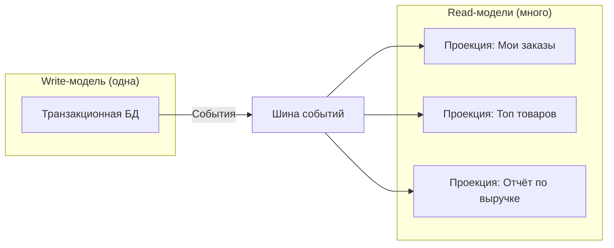

[← Назад к индексу части 13](index.md)

## 13.3. Read‑модели и проекции: быстрые чтения для UI и отчётов

### Цель раздела

Показать, как проектировать **read‑модели и проекции** в CQRS: как превращать сложную транзакционную схему в **удобные, быстрые представления** под конкретные запросы; где и как хранить эти проекции; как они связаны с UI, отчётами и аналитикой.

### В этом разделе главное

- Read‑модели — это **материализованные представления**, спроектированные под конкретные сценарии чтения.
- Проекций может быть **много**, каждая под свой экран/отчёт/виджет.
- Read‑модели **не обязаны** жить в той же БД, что write‑модель; они могут использовать:
  - отдельные SQL‑таблицы,
  - NoSQL‑хранилища,
  - поисковые движки.
- Денормализация — **нормальная практика** для read‑моделей: мы храним данные в форме, удобной для чтения.
- Read‑модели чаще всего **строятся и обновляются по событиям** (см. 13.4).

### Термины

- **Проекция (projection)** — преобразование потока событий или изменений состояния в структуру, удобную для чтения.
- **Материализованное представление (materialized view)** — read‑модель, которая хранится физически (в таблице/коллекции) и обновляется по мере изменений.
- **Денормализация** — сохранение дублированных данных, чтобы упростить и ускорить чтение.

### Теория и правила

1. **Ориентация на сценарии.**
   - Проекцию нужно проектировать **от конкретных вопросов**:
     - «Какие заказы показываем на главной?»
     - «Какая статистика нужна на дашборде?»

2. **Одна write‑модель → много read‑моделей.**
   - Write‑модель «одна и серьёзная».
   - Read‑моделей может быть **много и лёгких**.

3. **Денормализация и специализированные хранилища.**
   - Для быстрых списков — отдельные таблицы.
   - Для поиска — Elasticsearch/OpenSearch.
   - Для аналитики — колоночные БД или OLAP.

4. **Обновление по событиям.**
   - Проекция **слушает события** от write‑модели.
   - На каждое событие меняет своё состояние.

### Простыми словами

Вернёмся к интернет‑магазину.  
Нам нужны разные представления:

- «Мои заказы» — таблица с датой, суммой, статусом.
- «Топ товаров недели» — агрегированная статистика.
- «Детали заказа» — подробная информация по одному заказу.

Транзакционная схема может содержать:

- `orders`, `order_items`, `payments`, `shipments`, …

Строить каждый раз сложные JOIN‑ы — **дорого и неудобно**, особенно при высокой нагрузке.  
Проще держать:

- отдельную таблицу `user_orders_view`:
  - `user_id`, `order_id`, `status`, `total_price`, `created_at`, `last_update`;
- отдельную таблицу `top_products_view`:
  - `product_id`, `week`, `sales_count`, `revenue`.

Эти таблицы обновляются **по событиям** (`OrderPlaced`, `OrderShipped`, `OrderCancelled`, `OrderPaid` и т.д.).

### Картинка в голове

Представь write‑модель как **источник воды**, а read‑модели — как **отдельные краны** по дому:

- Источник один (скважина).
- Но вода разводится по:
  - крану на кухне,
  - крану в ванной,
  - поливу сада.

Каждый кран настроен **под свою задачу** (температура, напор), хотя вода — одна.  
Точно так же:

- события и изменения в write‑модели — это «вода»,
- а проекции — это «краны» с нужной формой подачи.



### Как запомнить

> **Write‑модель — «источник истины», read‑модели — «представления под задачи».**  
> Проекции можно выбросить и перестроить из источника (событий/данных).

### Примеры

1. **Read‑модель для списка задач.**
   - Проекция `user_tasks_view`:
     - `user_id`, `task_id`, `title`, `status`, `priority`, `due_date`.
   - Обновляется по событиям:
     - `TaskCreated`, `TaskUpdated`, `TaskCompleted`.

2. **Read‑модель для дашборда продаж.**
   - Проекция `sales_by_day_view`:
     - `day`, `total_orders`, `total_revenue`, `avg_check`.
   - Обновляется по событиям:
     - `OrderPaid`, `OrderRefunded`.

3. **Пример схемы read‑модели и обработчика проекции.**

```sql
-- Транзакционная таблица заказов (упрощённо)
CREATE TABLE orders (
  id           UUID PRIMARY KEY,
  customer_id  UUID NOT NULL,
  total_amount NUMERIC(12,2) NOT NULL,
  status       TEXT NOT NULL,
  created_at   TIMESTAMP NOT NULL
);

-- Read‑модель для списка заказов пользователя
CREATE TABLE user_orders_view (
  user_id      UUID NOT NULL,
  order_id     UUID PRIMARY KEY,
  status       TEXT NOT NULL,
  total_amount NUMERIC(12,2) NOT NULL,
  created_at   TIMESTAMP NOT NULL,
  last_update  TIMESTAMP NOT NULL
);
```

Условный обработчик проекции на псевдокоде:

```python
def handle_order_placed(event: OrderPlaced):
    """
    Обновляем user_orders_view при создании заказа.
    Считаем, что OrderPlaced содержит все нужные данные.
    """
    db.execute(
        """
        INSERT INTO user_orders_view (user_id, order_id, status, total_amount, created_at, last_update)
        VALUES (:user_id, :order_id, :status, :total_amount, :created_at, :last_update)
        ON CONFLICT (order_id) DO UPDATE
        SET status = EXCLUDED.status,
            total_amount = EXCLUDED.total_amount,
            last_update = EXCLUDED.last_update
        """,
        {
            "user_id": event.customer_id,
            "order_id": event.order_id,
            "status": "PLACED",
            "total_amount": event.total_amount,
            "created_at": event.created_at,
            "last_update": now(),
        },
    )
```

Здесь видно несколько ключевых идей:

- read‑модель держит данные в **форме, удобной для UI**;
- мы **не обращаемся к транзакционной схеме** в момент обработки события — все необходимые данные приходят в событии;
- обработчик проекции **идемпотентен** за счёт `ON CONFLICT` (одно и то же событие можно применить дважды без «дублирования»).

### Практика / реальные сценарии

- **Веб‑UI**, где:
  - нужно показывать богатые списки и дашборды;
  - важно, чтобы страницы открывались быстро.
- **Аналитика и отчётность**:
  - агрегации по времени, регионам, сегментам.

### Типичные ошибки

- Пробовать сделать **одну read‑модель «на все случаи»**:
  - она быстро разрастается и повторяет проблему «единой модели».
- Не считать read‑модели **вторичными** (derived data):
  - начинать писать в них напрямую,
  - терять связь с источником истины.

### Что будет, если…

- **…read‑модели не будут вторичными?**
  - Появятся противоречия между ними и write‑моделью.
  - Станет невозможно «перестроить их заново» после сбоя.

- **…ты будешь строить отчёты только на write‑модели?**
  - С ростом данных и требований отчёты станут:
    - медленными,
    - хрупкими,
    - сложными для оптимизации.

### Проверь себя

1. В чём ключевое отличие **read‑модели** от **основной транзакционной схемы**?
2. Почему для read‑моделей **денормализация — друг, а не враг**?
3. Как ты поймёшь, что пора вынести часть запросов в отдельные read‑модели?

<details><summary>Ответ</summary>

1. Транзакционная схема оптимизирована под **корректные изменения** и поддержание инвариантов; read‑модель — под **быстрое чтение** для конкретных сценариев. Read‑модель — это производные данные, которые можно восстановить.
2. Потому что в read‑модели мы **не выполняем сложные изменения**; мы храним данные в удобной форме для чтения. Дублирование считается приемлемым, если оно даёт выигрыш в производительности и простоте запросов — источником истины остаётся write‑модель.
3. Типичные сигналы: тяжёлые запросы с множеством JOIN‑ов и агрегаций; отчёты, которые «падают» при нагрузке; дашборды, которые грузятся слишком долго. Если эти проблемы становятся постоянными — время проектировать отдельные проекции.

</details>

### Запомните

- Read‑модели/проекции — это **настраиваемые представления под конкретные запросы**.
- Они обычно **вторичны** и могут быть перестроены из источника (write‑модели/событий).
- В CQRS сила именно в том, что write‑модель и read‑модели **живут своей жизнью**, решая разные задачи.

---
