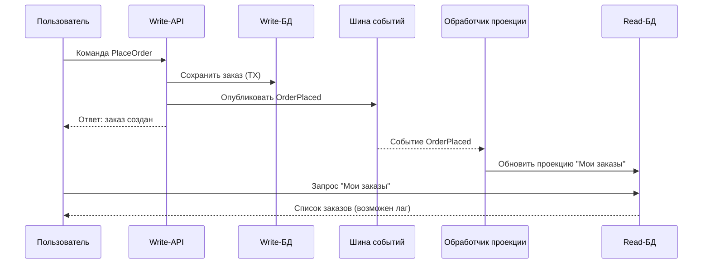

[← Назад к индексу части 13](index.md)

## 13.4. CQRS и события: обновление проекций и eventual consistency

### Цель раздела

Показать, как **события связывают write‑ и read‑модели** в CQRS, как выглядит поток «команда → событие → проекции», где появляется **eventual consistency**, какие возникают задержки и как с ними жить на уровне UX и архитектуры.

### В этом разделе главное

- События — естественный «мост» между write‑моделью и read‑моделями.
- Проекции **слушают события** и обновляются реактивно.
- Eventual consistency — норма: read‑модели могут **на короткое время отставать** от write‑модели.
- Нужно **явно договариваться**, где допустима eventual consistency, а где нужна сильная консистентность.
- Мониторинг **lag'а проекций** и обработка ошибок — критическая часть продакшн‑CQRS.

### Термины

- **Lag проекций** — отставание read‑модели по событиям от текущего состояния write‑модели.
- **Слушатель событий (projection handler)** — компонент, который обрабатывает события и обновляет проекции.
- **Outbox‑паттерн** — способ надёжно публиковать события из write‑модели (подробно — в части 12).

### Теория и правила

1. **События как связующее звено.**
   - После успешной обработки команды write‑модель:
     - меняет своё состояние,
     - пишет это в БД,
     - публикует одно или несколько доменных событий.

2. **Проекции слушают события.**
   - Каждая проекция подписана на интересующие её события:
     - `OrderPlaced`, `OrderShipped`, `OrderCancelled` и т.д.
   - На каждое событие она:
     - создаёт/обновляет/удаляет записи в своей read‑БД.

3. **Eventual consistency.**
   - Между командой и обновлением всех проекций есть **время**:
     - сеть,
     - брокер сообщений,
     - скорость потребителей.
   - В это время:
     - write‑модель уже изменилась,
     - но некоторые read‑модели ещё нет.

4. **Компенсация на уровне UX и бизнес‑правил.**
   - Можно:
     - показывать «загрузка / обновляем данные»;
     - перенаправлять на «страницу результата» с отдельным запросом;
     - временно отображать старые данные с пометкой.

### Простыми словами

Вообразим сценарий:

1. Пользователь оформляет заказ → команда `PlaceOrder`.
2. Write‑модель создаёт запись в `orders`, публикует `OrderPlaced`.
3. Проекция `user_orders_view` получает `OrderPlaced` и добавляет строку в свою таблицу.

Если пользователь **сразу же** откроет страницу «Мои заказы», возможны варианты:

- Проекция уже успела обработать событие → заказ виден.
- Проекция ещё не успела → заказ **временно не виден**.

Это и есть **eventual consistency**.  
Наши задачи:

- сделать это **редким и коротким**;
- **объяснить пользователю**, что происходит;
- там, где важно, использовать **сильную консистентность** (например, при проверке доступности лимита).

### Картинка в голове

Полезная метафора — **новость и газета**:

- Событие — это **факт, который уже произошёл** (новость).
- Read‑модель — это **газета/лента новостей**, которая публикует информацию **с небольшим лагом**.

Факт произошёл **сразу**,  
но газета пишет о нём **чуть позже**.  
Если ты читаешь газету «за сегодня», она может быть немного позади реальности — но в разумных пределах.

### Как запомнить

> **Событие — это факт, read‑модель — «новостная лента о фактах».**  
> Лента может немного отставать, но факт уже произошёл.

### Примеры

1. **Статистика по продажам.**
   - События `OrderPaid` обновляют проекцию `sales_by_day_view`.
   - Дашборд «Выручка за сегодня» может отставать на минуты.

2. **Уведомления пользователя.**
   - События `CommentAdded`, `TaskAssigned` обновляют проекцию `user_notifications_view`.
   - Пользователь может иногда видеть уведомление с небольшой задержкой.

### Практика / реальные сценарии

- Системы, где:
  - важна масштабируемость чтения,
  - допустима небольшая задержка данных в UI/отчётах.
- Связка CQRS + EDA:
  - обновление проекций по шине событий;
  - мониторинг lag'а и ошибок обработки.

### Типичные ошибки

- Обещать пользователю **мгновенное отражение изменений**, когда используется eventual consistency, не объяснив возможную задержку.
- Не мониторить **lag проекций**:
  - проекции могут отставать на часы/дни из‑за ошибки,
  - команда этого не замечает, пока не станет слишком поздно.

### Что будет, если…

- **…проекция перестанет обрабатывать события (ошибка, баг)?**
  - Данные в read‑модели устареют.
  - Пользователи будут видеть неверную информацию.

- **…игнорировать eventual consistency на уровне UX?**
  - Пользователь может:
    - повторно отправить команду («не вижу заказ — оформлю ещё раз»),
    - считать систему ненадёжной.

### Проверь себя

1. Почему в CQRS почти неизбежно появляется **eventual consistency**?
2. Как ты можешь **минимизировать негативный эффект** eventual consistency на уровне UX?
3. Какие метрики и алерты стоит настроить для мониторинга **lag'а проекций**?

Ответ

1. Потому что между write‑ и read‑моделями почти всегда есть **асинхронный этап** (события, брокер, обработчики). Пока события не дойдут до всех проекций, данные в них будут «старее», чем в write‑модели. Это и есть eventual consistency.
2. Например:
   - перенаправлять пользователя на «страницу результата», которая делает **прямой запрос** к write‑модели (там, где критично);
   - показывать статус «обрабатываем» и обновлять UI после подтверждения;
   - явно объяснять, что некоторые данные (отчёты) «могут обновляться с небольшой задержкой».
3. Важно следить за:
   - максимальной и средней задержкой обработки событий (разница по времени/offset между шиной и проекцией);
   - числом неуспешных обработок;
   - отставанием по количеству непрочитанных сообщений. На эти метрики стоит повесить алерты.

### Запомните

- События — естественный способ **поддерживать read‑модели в актуальном состоянии**.
- Eventual consistency — **особенность, а не баг** CQRS; с ней нужно сознательно работать.
- Без мониторинга и понятного UX evenual consistency превратится в **источник боли** для пользователей и команды.

---
