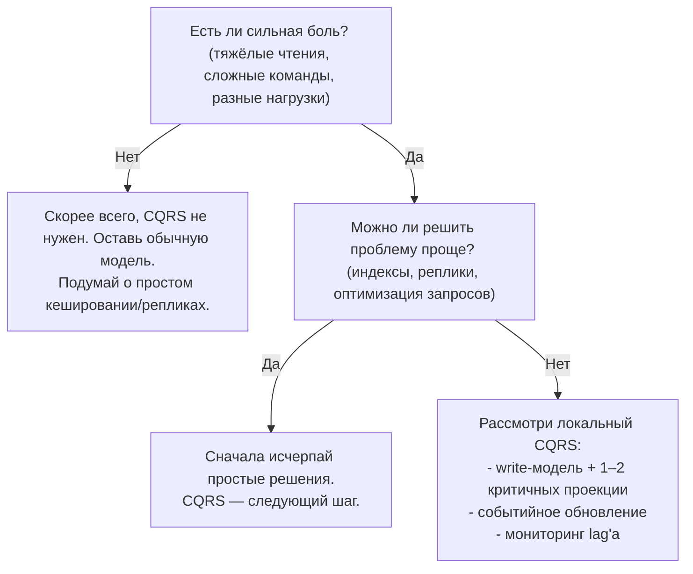

[← Назад к индексу части 13](index.md)

## 13.5. Когда CQRS помогает, а когда нет: ошибки и чек‑лист

### Цель раздела

Помочь тебе **осознанно решать, нужен ли CQRS в конкретном проекте**, распознавать типичные ошибки и антипаттерны, понимать связь CQRS с микросервисами, EDA и Event Sourcing, и использовать **чек‑лист вопросов** перед внедрением.

### В этом разделе главное

- CQRS — **дорогой инструмент**; применять его стоит только там, где выгода оправдывает сложность.
- Типичные боли, которые CQRS лечит:
  - тяжёлые и медленные чтения,
  - очень сложная write‑логика,
  - разные требования к чтению и записи.
- CQRS часто работает **в связке** с микросервисами и EDA, но **не требует обязательного перехода** к тому или другому.
- CQRS можно применять **локально**, внутри одного сервиса/контекста.
- Главная ошибка — **«CQRS ради CQRS»**: когда система становится сложнее, но бизнес‑проблем это не решает.

### Термины

- **Овер‑инжиниринг** — чрезмерное усложнение архитектуры относительно реальных потребностей.
- **Distributed monolith** — система с множеством сервисов, но без реальной независимости (часто усугублённая неконтролируемым CQRS/EDA).

### Теория и правила

1. **Сигналы, что CQRS уместен.**
   - Запросов **на порядки больше**, чем команд.
   - Команды содержат **богатую доменную логику**.
   - Отчёты/дашборды **регулярно «роняют» БД** или сильно тормозят.

2. **Сигналы, что CQRS избыточен.**
   - Небольшая CRUD‑система.
   - Нет тяжёлых отчётов.
   - Команды просты и тривиальны.

3. **Связь с микросервисами и EDA.**
   - CQRS *можно* внедрять внутри монолита.
   - EDA помогает обновлять read‑модели, но не является обязательной.
   - Микросервисы дают границы; CQRS можно применять внутри и между ними.

4. **CQRS и Event Sourcing.**
   - CQRS **не обязан** использовать Event Sourcing.
   - Но в связке они хорошо работают: события — естественный источник для проекций.

### Простыми словами

Подумай о CQRS как о **специализированном инструменте**, вроде хирургического микроскопа:

- Он очень полезен, когда нужно:
  - делать сложные операции на «тонкой материи» (сложный домен),
  - видеть детали (отчёты, аналитика, UX).
- Но он:
  - дорогой,
  - требует обучения,
  - не нужен для «простой перевязки» (маленький CRUD‑сервис).

### Картинка в голове

Представь карту «**когда CQRS уместен**»:



### Как запомнить

> **CQRS — это не стиль «по умолчанию», а реакция на конкретные боли.**  
> Сначала исчерпай простые решения, потом смотри на CQRS.

### Примеры

1. **Когда CQRS помог.**
   - Большой интернет‑магазин:
     - дашборды и поиск тормозили основную БД;
     - сложные SQL‑запросы были трудны в поддержке.
   - Решение:
     - выделили write‑модель,
     - создали read‑модели под UI и отчёты,
     - обновление по событиям.

2. **Когда CQRS навредил.**
   - Небольшой стартап:
     - решили «сразу сделать правильно»;
     - внедрили CQRS, EDA, микросервисы.
   - Итог:
     - сложность зашкаливает,
     - продукт развивается медленно,
     - команда тратит время на поддержку инфраструктуры вместо ценности для пользователей.

3. **Минимальный CQRS (как “не переусложнить”).**
   - Ситуация: один тяжёлый экран/отчёт «роняет» БД и мешает остальному продукту.
   - Подход:
     - оставить write‑модель обычной (транзакционной) в основной БД;
     - выделить **одну** read‑проекцию под этот экран (денормализованную таблицу/индекс);
     - обновлять проекцию событиями (Outbox/EDA) или батч‑джобой по расписанию;
     - добавить мониторинг лагов/актуальности проекции и UX‑обработку «данные обновляются».
   - Почему это хороший старт: вы получаете пользу CQRS там, где она нужна, не превращая весь продукт в “две вселенные”.

### Практика / реальные сценарии

- **Эволюция:** обычно приходят к CQRS:
  - после монолита и модульного монолита,
  - после микросервисов и EDA,
  - когда понятны реальные узкие места.
- **Локальное применение:** начать можно:
  - с одного bounded context'а (например, биллинг),
  - с одной read‑модели для критичного отчёта.

### CQRS и фронтенд/BFF

Частый практический вопрос: **как фронтенд и BFF взаимодействуют с разделённой моделью чтения и записи**.

Вариант, который хорошо ложится на часть 30 (BFF):

- у тебя есть **отдельные endpoint'ы** для команд и запросов;
- BFF:
  - отправляет команды на write‑API;
  - читает данные из read‑API/проекций.

```mermaid
flowchart LR
    FE["Фронтенд (UI)"] --> BFF["BFF / API‑шлюз"]

    subgraph WriteSide["Сторона записи"]
      WAPI["Write‑API (команды)"]
      WDB2["Write‑БД"]
    end

    subgraph ReadSide2["Сторона чтения"]
      RAPI["Read‑API (запросы)"]
      RDB2["Read‑БД / проекции"]
    end

    BFF -->|Команды (HTTP POST /commands/...)| WAPI
    WAPI --> WDB2
    WAPI -->|События| EBus2["Шина событий"]
    EBus2 --> RDB2
    BFF -->|Запросы (HTTP GET /views/...)| RAPI
    RAPI --> RDB2
```

Ключевые моменты:

- фронтенд **не обязан знать** о деталях CQRS — он просто:
  - отправляет команду (POST/PUT/DELETE),
  - запрашивает нужное представление (GET);
- BFF может:
  - скрывать eventual consistency (например, делать прямой запрос к write‑стороне для «страницы результата»);
  - кэшировать read‑модели и использовать их для оптимизации.

### Типичные ошибки

- «**Мы делаем современную систему, значит, нам нужен CQRS**» — без анализа проблем.
- «**CQRS везде**» — навязывать разделение чтения/записи там, где оно только добавляет бойлерплейт.
- Игнорировать **eventual consistency** и не обучать команду, что это значит.

### Что будет, если…

- **…игнорировать критерии и просто внедрить CQRS по всей системе?**
  - Архитектура станет:
    - сложнее,
    - дороже,
    - менее понятной.
  - Пользователи при этом **могут не заметить никаких улучшений**.

- **…пытаться «подделать» CQRS, не разделяя модели и потоки?**
  - Получится «слеза архитектора»: много слов, мало смысла.
  - Команда будет путаться, почему мы называем это CQRS, если всё по‑старому.

### Проверь себя

1. Назови **3 признака**, что CQRS может быть уместен в твоём проекте.
2. Назови **2 признака**, что CQRS, скорее всего, избыточен.
3. Как бы ты объяснил(а) команде, почему **мы не внедряем CQRS прямо сейчас**, даже если это «модно»?

<details><summary>Ответ</summary>

1. Например:
   - сложные и тяжёлые отчёты регулярно влияют на прод;
   - команды содержат богатую бизнес‑логику с жёсткими инвариантами;
   - чтений в десятки/сотни раз больше, чем записей, и их сложно масштабировать.
2. Например:
   - система маленькая, CRUD‑подобная, без сложной аналитики;
   - текущая БД и запросы легко выдерживают нагрузку, а основные проблемы — не в чтении/записи (например, в UX или организации работы).
3. Пример объяснения: «Сейчас наша главная боль — не в тяжёлых чтениях или сложных командах, а в X. CQRS — мощный инструмент, но он добавит нам много сложности: отдельные модели, события, eventual consistency. Пока нам выгоднее вложиться в простые улучшения (индексы, кеши, оптимизацию запросов, улучшение UX). К CQRS вернёмся, если возникнут реальные боли, которые он решает лучше других».

</details>

### Запомните

- CQRS — **не серебряная пуля**, а инструмент для конкретных задач.
- Важно **начинать с боли**, а не с паттерна.
- Начинать лучше **локально и постепенно**, а не переписывать всю систему «под CQRS».

---
