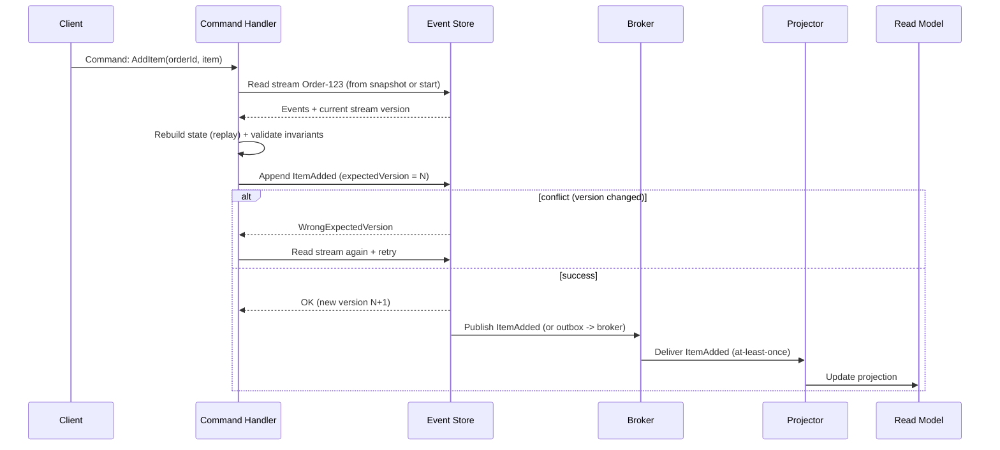

[← Назад к индексу части 14](index.md)

## 14.2. Механика: stream, append, replay, конкуренция

### Цель раздела

Понять «двигатель» ES: как события организованы в **streams**, как происходит запись (**append**) и восстановление (**replay**), как решается конкуренция и почему без этого ES легко ломается.

### В этом разделе главное

- События обычно группируются в поток **на агрегат**: `Order-123`, `Account-42`.
- Запись событий — **append с проверкой версии** (optimistic concurrency).
- Состояние агрегата получается реплеем событий (или снапшот + хвост).
- Доставка событий наружу (в шину) — отдельный вопрос (часто Outbox/публикация).
- At‑least‑once и повторы — нормальны; значит, нужны идемпотентные обработчики проекций.

### Термины

| Термин | Определение |
|---|---|
| **Aggregate (агрегат)** | Доменная сущность/кластер сущностей, где соблюдаются инварианты (см. часть 13 как write‑модель). |
| **Stream version** | Номер версии потока (обычно = количество событий или отдельный счетчик). |
| **Expected version** | Версия, которую мы ожидаем при записи новых событий; если не совпало — конфликт. |

### Теория и правила

#### 1) Потоки событий и границы агрегата

Чаще всего «один агрегат — один поток событий», потому что:

- порядок событий внутри агрегата должен быть стабильным;
- инварианты агрегата проверяются «внутри» этой границы;
- проще контролировать конкуренцию: одна версия потока.

Если попытаться сделать «один поток на весь сервис» — ты потеряешь управляемость: конфликтов станет больше, реплеи тяжелее, и инварианты смешаются.

#### 2) Append + optimistic concurrency

Принцип:

1. Загружаем агрегат: читаем события потока (или снапшот + хвост) и строим состояние.
2. Обрабатываем команду: проверяем инварианты и решаем, какие новые события должны произойти.
3. Пытаемся записать новые события в event store, указав **expected version**.
4. Если версия изменилась (кто-то успел записать события раньше) — получаем конфликт и повторяем: перечитываем, пересчитываем, пробуем снова.

Это похоже на «optimistic locking» в обычной БД (версия строки), только в терминах потока событий.

#### 3) Replay: состояние как функция событий

Формально:

\[
State_0 = \varnothing,\quad State_{i+1} = apply(State_i, Event_{i})
\]

Важно: `apply` должен быть **детерминированным** (одно и то же событие → одно и то же изменение состояния), иначе реплеи будут давать разные результаты.

### Пошагово

Ниже — практический «скелет» обработки команды в ES‑агрегате.

#### Шаг 1. Прочитать текущую историю агрегата

- получить последний снапшот (если есть);
- дочитать события после снапшота;
- применить события.

#### Шаг 2. Принять команду и решить, какие события должны произойти

Команда: `CreateOrder(items, customerId)`  
Если всё валидно → событие: `OrderCreated(...)`.

#### Шаг 3. Append событий с expected version

Пишем «продолжение истории» только если никто не успел изменить поток.

#### Шаг 4. Опубликовать события наружу (если нужно)

Для ES обычно критично, чтобы события:

- были доступны проектору (проекции);
- попадали в интеграцию (другие сервисы).

Здесь часто применяют подходы из части 12: Outbox, ретраи, идемпотентность.

### Простыми словами

ES‑агрегат — это как «книга учёта»:

- ты сначала перечитываешь последние записи (или берёшь «итог на вчера» — снапшот);
- потом добавляешь новые записи;
- но добавляешь их только если никто другой не успел сделать это раньше (версия).

### Картинка в голове

**Stream как цепочка блоков**:

```
Order-123 stream:
v1: OrderCreated
v2: ItemAdded
v3: ItemAdded
v4: PaymentAuthorized
v5: OrderShipped
```

Чтобы узнать «что сейчас», мы читаем цепочку и применяем события.

### Как запомнить

- **ES = append + replay**
- **Конкуренция = expected version**
- **Проекции = подписчики на события**

### Примеры

#### Пример: события и применение (псевдокод)

```text
Aggregate Order:
  state:
    status
    items[]
    paymentStatus

  apply(event):
    if event.type == OrderCreated:
      status = "NEW"
      items = event.items
    if event.type == ItemAdded:
      items.append(event.item)
    if event.type == PaymentAuthorized:
      paymentStatus = "AUTHORIZED"
```

Ключевая мысль: `apply` не делает внешних вызовов и не зависит от времени — он просто обновляет состояние.

#### Пример: последовательность обработки команды (sequence)



### Практика / реальные сценарии

1) **Заказ (Order)**: конкуренция при добавлении товара, отмене, оплате.  
2) **Счёт (Account)**: конкурентные списания/пополнения, жёсткие инварианты «баланс не может стать отрицательным» (или может, но по правилам).  
3) **Бронирование (Booking)**: конкуренция «кто первый занял слот».

### Типичные ошибки

- Реплей делает внешние вызовы («проверить скидку по API») → реплей становится недетерминированным и хрупким.
- Нет expected version → теряются обновления (две команды «перетрут» друг друга историей).
- Проектор не идемпотентен → повторы событий приводят к «двойным начислениям» в проекции.

### Что будет, если…

- …не контролировать конкуренцию: история получится неверной (два параллельных изменения «оба успешны», но нарушают инварианты).
- …делать реплей «со сторонними эффектами»: восстановление состояния начнёт менять мир (заново отправлять письма, списывать деньги).

### Проверь себя

1. Зачем ES‑системе expected version (optimistic concurrency)?
2. Почему `apply(event)` должен быть детерминированным?
3. Почему проектор обязан быть идемпотентным?

<details><summary>Ответ</summary>

1. Чтобы не потерять обновления и не нарушить инварианты при параллельных командах: если история изменилась, мы обязаны пересчитать решение на актуальном состоянии.  
2. Потому что состояние агрегата должно восстанавливаться одинаково при каждом реплее; иначе у тебя будет «плавающая реальность».  
3. Потому что доставка событий часто at‑least‑once, возможны повторы; идемпотентность защищает от удвоения эффектов (двойные записи в read‑модель, двойные начисления и т.п.).

</details>

### Запомните

Механика ES держится на трёх опорах: **append‑only события**, **replay для состояния**, **optimistic concurrency по версии потока**.

#### 4) Что хранить в событии: payload vs metadata (практический минимум)

Это место часто «проваливают», и тогда ES начинает ломаться не потому, что “ES сложный”, а потому что **события спроектированы как случайный JSON**.

**Идея простыми словами**:

- **payload** — то, что бизнес считает фактом: *«платёж авторизован на такую-то сумму»*;
- **metadata** — служебная «этикетка» события: *когда это случилось, из какой команды, как связать цепочку событий, как дедуплицировать повторы*.

##### Теория и правила

1) **Не пытайся класть в payload “всё состояние целиком” по умолчанию**.  
Это превращает ES в «снапшоты под видом событий» и мешает эволюции.

2) **Но и не делай payload “слишком тонким”** (*только `id` и “что-то поменялось”*).  
Если событие не несёт данных, которые нужны проекциям, вы либо:

- начнёте делать N+1 чтений (каждый проектор будет “дотягивать” данные откуда-то ещё),
- либо превратите проекции в «слишком умные» и зависящие от внутренностей write‑модели.

3) **Metadata должна помогать пережить at‑least‑once и отладку**:

- `eventId` — уникальный идентификатор события (для дедупликации);
- `occurredAt` — когда факт произошёл (время события);
- `streamId` / `aggregateId` — к какому потоку относится;
- `streamVersion` — версия потока (часто задаётся event store);
- `correlationId` — связывает цепочку действий в рамках одного «пользовательского запроса»;
- `causationId` — “какое событие/команда стало причиной этого события” (важно для диагностики);
- `schemaVersion` — версия схемы payload’а.

##### Пример (учебный): событие с payload и metadata

```json
{
  "type": "PaymentAuthorized",
  "schemaVersion": 2,
  "payload": {
    "orderId": "123",
    "amount": 1000,
    "currency": "RUB",
    "paymentProvider": "tinkoff",
    "providerAuthId": "auth_987"
  },
  "meta": {
    "eventId": "01J3K0B3V5F6G7H8J9K0L1M2N3",
    "occurredAt": "2026-03-16T12:00:00Z",
    "correlationId": "req_4f8d... (цепочка запроса)",
    "causationId": "cmd_93a1... (команда/предыдущее событие)",
    "producer": "payments-service"
  }
}
```

##### Картинка в голове

Событие — это **посылка**:

- внутри — полезный груз (payload),
- снаружи — наклейки для доставки и отслеживания (metadata).

##### Типичные ошибки

- класть в payload внутренние структуры БД/ORM («как у нас в таблицах») → любой рефакторинг БД превращается в миграцию истории;
- не иметь `eventId`/`correlationId` → отладка и дедупликация становятся мучением;
- хранить PII «как есть» (например, паспорт/телефон) без политики ретеншна/шифрования → через год это станет проблемой хранения и регуляторики (связь с частью 18).

##### Проверь себя

1. Что относится к payload, а что — к metadata?
2. Зачем нужны `correlationId` и `causationId`, если у нас есть логи?
3. Почему «полное состояние в каждом событии» — это не всегда хорошо?

<details><summary>Ответ</summary>

1. Payload — доменный факт (что произошло и с какими значимыми параметрами). Metadata — служебные поля для доставки, версий, трассировки и дедупликации.  
2. Логи могут быть разрозненными. `correlationId/causationId` дают **структурную связь** событий, команд и шагов пайплайна, что ускоряет расследования и построение трасс.  
3. Потому что это повышает связность событий с текущей моделью, усложняет эволюцию, раздувает лог и часто маскирует отсутствие нормальных снапшотов/проекций.

</details>

##### Запомните

Хорошее событие в ES — это **доменно осмысленный payload + минимально достаточная metadata для трассировки, версий и повторной доставки**.

#### 5) Идемпотентные проекторы на практике: как не “задвоить” мир

В тексте выше мы уже несколько раз сказали “проектор должен быть идемпотентным”. Здесь — **как именно** это обычно делают, чтобы фраза превратилась в практику.

##### В этом блоке главное

- Доставка событий почти всегда **at‑least‑once** → повторы реальны.
- Идемпотентность — это не “проверим флажок”, а **конкретный механизм дедупликации**.
- Нужны два состояния: **checkpoint** (где мы остановились) и **dedup** (что уже применили).

##### Теория и правила

Есть 3 базовых подхода, которые можно комбинировать:

1) **Дедуп по `eventId` (таблица обработанных событий)**  
   Проектор хранит `processed_events(eventId, processedAt, projectorName)` и перед применением проверяет, было ли событие уже обработано.

2) **Идемпотентный апдейт проекции (UPSERT/уникальные ключи)**  
   Например, проекция “платежи” хранит `payment(providerAuthId)` с уникальным индексом. Повтор события не создаст вторую запись.

3) **Транзакционность “dedup + apply + checkpoint”**  
   Если проекция живёт в БД, хорошо, когда:
   - вы фиксируете факт обработки (`eventId`),
   - применяете изменения,
   - обновляете checkpoint  
   в одной транзакции. Тогда сбой не оставит систему в полу‑состоянии.

##### Пошагово (минимальный алгоритм проектора)

1) Прочитать следующее событие из подписки (по checkpoint/offset).  
2) Начать транзакцию в БД read‑модели.  
3) Проверить `processed_events` по `eventId`.  
   - если уже есть → только обновить checkpoint и выйти;  
   - если нет → применить изменения к проекции, вставить `eventId`, обновить checkpoint.  
4) Commit.  

##### ASCII‑схема “как это склеивается”

```
Subscription -> (eventId, payload, meta)
      |
      v
  [Tx in read DB]
      |
      +--> processed_events contains eventId?
      |        |yes -> advance checkpoint -> commit
      |        |no  -> apply projection changes
      |                  + insert eventId
      |                  + advance checkpoint
      v
    commit
```

##### Важный граничный случай: “ядовитое событие” (poison message)

Иногда одно событие ломает проектор (неожиданная схема, баг, данные). Если проектор бесконечно ретраит его, проекция “застывает”.

Практические меры:

- **DLQ / dead letter** для событий, которые не удаётся обработать после N попыток;
- алерт на “subscription stuck” (checkpoint не двигается);
- ручной инструмент: “пропустить событие” или “переобработать после фикса” (с осторожностью и журналированием).

##### Проверь себя

1. Почему одного checkpoint недостаточно для идемпотентности?
2. Чем дедуп по `eventId` отличается от “уникального индекса”?
3. Что произойдёт, если `apply` упал после изменения проекции, но до записи `eventId`?

<details><summary>Ответ</summary>

1. Checkpoint говорит “где мы в потоке”, но при сбое мы можем получить повтор события (или частичный коммит). Дедуп говорит “что уже применено”. Обычно нужны оба механизма.  
2. `eventId`‑дедуп работает независимо от структуры проекции и защищает от повторной обработки “как факта”. Уникальный индекс защищает конкретную таблицу/модель от дубля, но не всегда покрывает все побочные эффекты (например, две таблицы, агрегаты, счётчики).  
3. При рестарте событие придёт снова, и проектор применит его ещё раз — получится дубль/разъезд. Поэтому важно делать “dedup + apply + checkpoint” атомарно (транзакцией) или иметь компенсации.

</details>

##### Запомните

Идемпотентность проектора — это всегда **дедуп + атомарность + наблюдаемость** (алерты на лаг/застревание), иначе ES+CQRS будет регулярно “дублировать реальность”.

---
