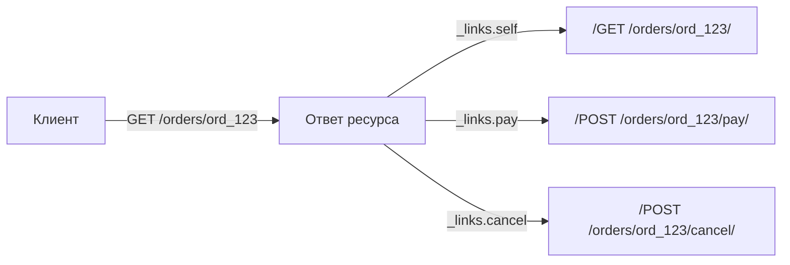

[← Назад к индексу части 15](index.md)

## 15.1. REST: ресурсы, URI и операции

### Цель раздела

Научиться **видеть API как набор ресурсов** и проектировать:

- понятные URI,
- корректные методы,
- предсказуемые операции над ресурсами,
- без «RPC-эндоинтов в маске REST».

### В этом разделе главное

- REST начинается с **ресурсов**, а не с «команд».
- URI — это **адрес ресурса**, а не «название функции».
- GET — читаем (safe), POST — создаём/триггерим (обычно не идемпотентен), PUT — заменяем целиком (идемпотентен), PATCH — частично меняем (может быть идемпотентным), DELETE — удаляем (обычно идемпотентен).
- Коллекции требуют **пагинации/фильтрации** почти всегда.
- В хорошо спроектированном REST **ответы содержат ссылки (HATEOAS)**, которые помогают клиенту «ходить» по API.
- Типичная ошибка: **глаголы в URL** (`/createOrder`) вместо ресурсов (`/orders`).
- Не путай «ресурс домена» и «табличку БД»: ресурсы — это **контракт**, а не отражение хранилища.

### Термины

| Термин | Определение |
|---|---|
| **URI** | Строка-идентификатор ресурса (например, `/orders/123`). |
| **Коллекция** | URI, представляющий набор ресурсов: `/orders`. |
| **Подресурс** | URI, представляющий «часть» ресурса: `/orders/123/items`. |
| **Safe** | Метод не меняет состояние на сервере (GET/HEAD/OPTIONS). |
| **Idempotent** | Повтор запроса не меняет итоговый эффект (в идеале). |

### Теория и правила

#### 1) Как выбирать ресурсы

Хороший ресурс — это **существительное**, которое клиенту понятно как «вещь»:

- `orders`, `users`, `invoices`, `payments`, `files`

Часто ресурсы образуют иерархию:

- `/orders/{orderId}`
- `/orders/{orderId}/items`
- `/users/{userId}/sessions`

Но важно: иерархия — это не обязаловка. Если подресурс имеет свой жизненный цикл, ему может быть удобнее отдельный «корень»:

- `/order-items/{itemId}` (если item имеет независимые ссылки/права/операции)

#### 2) Как выбирать методы (и что они «обещают»)

Свойства методов — не «просто теория»: инфраструктура и клиенты часто делают выводы из них.

| Метод | Типичная семантика | Safe | Идемпотентен |
|---|---|---:|---:|
| GET | получить представление ресурса | да | да |
| POST | создать в коллекции / запустить обработку | нет | обычно нет |
| PUT | заменить ресурс целиком | нет | да |
| PATCH | частично изменить | нет | зависит от патча |
| DELETE | удалить ресурс | нет | обычно да |

Важно: «идемпотентен» — это **про эффект**, а не про «всегда возвращает одинаковое тело». Например, повторный DELETE может вернуть:

- `204 No Content` (удалили/уже удалён),
- или `404 Not Found` (если политика такая),

и это всё ещё может быть идемпотентно по смыслу: «ресурс отсутствует».

#### 3) Типовые ошибки дизайна REST (и почему они вредны)

1) **Глаголы в URL**

- Плохо: `POST /createOrder`, `POST /orders/123/cancelOrder`
- Лучше: `POST /orders` (создать), `POST /orders/123/cancel` (если отмена — отдельный подресурс/операция) или `PATCH /orders/123` со сменой статуса (если это изменение ресурса)

Почему вредно: URL начинает отражать «вызовы функций», а не модель ресурсов. Теряется унифицированность и предсказуемость.

2) **Смешение уровней абстракции**

- Плохо: `/orders/123/items/456/applyDiscountAndRecalculateShipping`

Почему вредно: превращает API в «сценарный комбайн», сложно эволюционировать, тестировать и документировать.

3) **Отсутствие пагинации**

- Плохо: `GET /orders` возвращает всё за 5 лет.

Почему вредно: риск DDoS «случайно», перегрузка БД, нестабильная латентность.

4) **Ресурс = таблица БД**

Часто так делают: «у нас таблица `order_items`, значит ресурс `/order_items`». Это иногда ок, но чаще приводит к тому, что контракт начинает зависеть от схемы БД и ломается при любой миграции.

#### 4) HATEOAS: ссылки как часть контракта

**HATEOAS (Hypermedia As The Engine Of Application State)** — идея о том, что ответ API содержит **ссылки на следующие допустимые действия**. Клиенту не нужно «зашивать» все URL внутрь; он может следовать ссылкам, как пользователь следует ссылкам на сайте.

Пример ответа с ссылками:

```json
{
  "id": "ord_123",
  "status": "created",
  "_links": {
    "self":  { "href": "/orders/ord_123" },
    "pay":   { "href": "/orders/ord_123/pay",   "method": "POST" },
    "cancel":{ "href": "/orders/ord_123/cancel","method": "POST" }
  }
}
```

Здесь клиент:

- не «угадывает» URL оплаты/отмены;
- может подсказать пользователю только те действия, которые есть в `_links` (например, если заказа уже нельзя отменить, ссылка `cancel` исчезает).

Визуально это можно представить так:



На практике многие команды используют «облегчённый» HATEOAS: хотя бы ссылки пагинации (`next/prev`) и важные действия (`confirm`, `cancel`) в `_links`. Это уже заметно снижает связность клиентов с «жёстко пришитыми» URL.

##### Проверь себя по HATEOAS

1. Почему наличие `_links` в ответе уменьшает связанность клиентов с конкретными URI?
2. В каких случаях добавление HATEOAS‑ссылок особенно полезно, а где можно осознанно обойтись без них?
3. Что будет проще менять через год: структуру URL или набор ссылок в `_links`, и почему?

<details><summary>Ответ</summary>

1. Клиенту не нужно «знать» и хардкодить все URL — он следует ссылкам, которые отдаёт сервер. Если путь изменился, но смысл ссылки сохранился, клиент продолжит работать без перекомпиляции.
2. Особенно полезно там, где клиентский код живёт долго и обновляется медленно (мобильные приложения, интеграции партнёров), а также в сложных процессах с разными шагами (workflow, заказы, биллинги). Обойтись без HATEOAS можно в небольших внутренних сервисах с плотным контролем версий клиентов, где URL меняются редко и есть строгая контрактная спецификация.
3. Проще и безопаснее эволюционирует именно слой ссылок: можно временно поддерживать старые и новые URI за одной и той же «логической» ссылкой (`self`, `pay` и т.п.), постепенно мигрируя клиентов. Перепривязывать всех клиентов к новым жёстко прошитым URL дороже и рискованнее.

</details>

### Пошагово: как спроектировать один ресурс

Будем проектировать ресурс «заказ».

1) Назови «вещь»: **Order**.
2) Определи идентификатор: `orderId` (строка/UUID/число).
3) Определи коллекцию и элемент:

- `GET /orders` — список (с пагинацией и фильтрами)
- `POST /orders` — создать
- `GET /orders/{orderId}` — получить один
- `PATCH /orders/{orderId}` — частично изменить
- `DELETE /orders/{orderId}` — удалить/архивировать (в зависимости от домена)

4) Определи подресурсы:

- `GET /orders/{orderId}/items`
- `POST /orders/{orderId}/items`

5) Определи представления (JSON) и минимальные поля.
6) Определи коды ответа и формат ошибок (в 15.2).
7) Определи версионирование и совместимость (в 15.3).
8) Определи политику идемпотентности для «опасных» операций (в 15.4).

### Простыми словами

REST — это как библиотека:

- **URI** — это «адрес книги на полке»
- **метод** — это «что ты хочешь сделать»: посмотреть, добавить, заменить, вычеркнуть
- **ресурс** — это «сама книга/запись», а не «инструкция библиотекарю»

Если ты пишешь `/doSomething`, это как если бы вместо адреса книги ты писал: «Сделай мне магию с книгой».

### Картинка в голове

Представь город и адреса:

```
/orders            = улица "Заказы" (коллекция)
/orders/123        = дом 123 (конкретный заказ)
/orders/123/items  = подъезд "Позиции заказа"
```

Ты не делаешь адресом «позвони в домофон и попроси отменить» — ты адресом указываешь объект, а действие выражаешь методом/телом.

### Как запомнить

- **URL = существительное**, **метод = глагол**.
- Если в URL много глаголов — ты, скорее всего, строишь RPC.
- Коллекции почти всегда требуют: **page/limit** (или cursor), **sort**, **filter**.

### Примеры

#### Пример 1. Список заказов с пагинацией

```http
GET /orders?limit=20&cursor=eyJpZCI6IjEyMyJ9&status=paid&sort=-createdAt
Accept: application/json
```

Ответ:

```http
200 OK
Content-Type: application/json
```

```json
{
  "items": [
    { "id": "ord_123", "status": "paid", "createdAt": "2026-03-16T10:00:00Z" }
  ],
  "nextCursor": "eyJpZCI6IjEyMiJ9"
}
```

#### Пример 2. Создание заказа (POST)

```http
POST /orders
Content-Type: application/json
Accept: application/json
```

```json
{
  "userId": "usr_1",
  "items": [
    { "sku": "sku_42", "qty": 2 }
  ]
}
```

Вариант ответа (часто хороший):

```http
201 Created
Location: /orders/ord_123
Content-Type: application/json
```

```json
{
  "id": "ord_123",
  "status": "created"
}
```

#### Пример 3. Полная замена ресурса (PUT) vs частичное изменение (PATCH)

Полная замена:

```http
PUT /orders/ord_123
Content-Type: application/json
```

```json
{
  "id": "ord_123",
  "deliveryAddress": { "city": "Kazan", "street": "Main", "house": "10" },
  "comment": "Позвонить за 10 минут"
}
```

Частичное изменение:

```http
PATCH /orders/ord_123
Content-Type: application/json
```

```json
{
  "comment": "Лучше написать в чат"
}
```

### Практика / реальные сценарии

- **Мобильный клиент + плохая сеть**: пользователь нажал «Оплатить», запрос ушёл, таймаут — пользователь нажимает ещё раз. Без идемпотентности/Idempotency-Key вы получите **двойное списание** (или два заказа).
- **Несколько клиентов** (веб, мобильный, партнёр): без дисциплины по ресурсам и версиям API становится «зоопарком эндпоинтов», а изменения превращаются в боль.
- **Сервисная архитектура**: REST-контракт — это «стык» между командами. Ошибки в контракте дороже ошибок в коде: они размножаются во всех клиентах.

### Типичные ошибки

- **RPC-эндпоинты** (`/doX`, `/runY`) вместо ресурсов.
- **PATCH как «выполни действие»**: если PATCH меняет не ресурс, а запускает процесс, это перестаёт быть предсказуемым.
- **Списки без пагинации** и без ограничений по фильтрам.
- **Смешение представлений**: один и тот же `GET /orders/{id}` возвращает «то много, то мало» без явной договорённости.

### Что будет, если…

- …делать «глаголы в URL»?  
  Со временем API превратится в набор «команд», которые сложно сочетать, кэшировать, документировать и эволюционировать.
- …не думать об идемпотентности?  
  В реальной сети вы будете ловить дубли, неконсистентность, финансовые инциденты и трудноуловимые баги.

### Проверь себя

1. Почему `PUT /orders/{id}` обычно проще сделать идемпотентным, чем `POST /orders`?
2. Приведи пример, когда подресурс лучше вынести в отдельный корневой ресурс.
3. Какие 3 параметра ты почти всегда добавишь к эндпоинту коллекции?

<details><summary>Ответ</summary>

1. PUT адресует конкретный ресурс и задаёт целевое состояние: «сделай ресурс ровно таким». Повтор приводит к тому же состоянию. POST «создай новый» без дополнительных правил обычно создаёт новый экземпляр при каждом повторе.
2. Если подресурс имеет самостоятельный жизненный цикл/права/ссылки. Например, «вложение» может использоваться в разных местах: тогда удобнее `/files/{fileId}` вместо только `/orders/{id}/files/{fileId}`.
3. Пагинацию (limit+cursor/page), фильтрацию (status, date range), сортировку (sort).

</details>

### Запомните

- Проектируй API **как модель ресурсов**.
- Старайся, чтобы **URL были существительными**, а действия — методами/телом.
- В реальном мире REST = контракт + дисциплина (пагинация, коды, ошибки, версии, идемпотентность).

---
