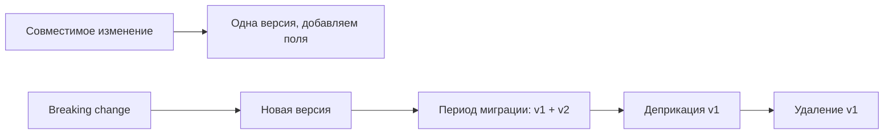

[← Назад к индексу части 15](index.md)

## 15.3. Версионирование: как менять контракт без поломок

### Цель раздела

Понять, **когда версия действительно нужна**, какие изменения считаются «ломающими», и как вводить новые версии так, чтобы не «умножать поддержку» бесконечно.

### В этом разделе главное

- Лучшее версионирование — **минимальное и осознанное**: не версионируй «на всякий случай».
- Различай **совместимые** изменения (добавить поле) и **breaking changes** (переименовать/удалить поле, изменить смысл).
- Версия в URL (`/v1/...`) — практично, но может влиять на кэши и договорённости.
- Версия в заголовке/Accept — чище с точки зрения «ресурсности», но сложнее в инструментах и отладке.
- Обязательно делай **deprecation**: сначала предупреждаем, потом удаляем.

### Термины

| Термин | Определение |
|---|---|
| **Breaking change** | Изменение, из-за которого старый клиент перестаёт работать. |
| **Backward compatible change** | Изменение, которое не ломает старых клиентов. |
| **Deprecation** | Объявление устаревания: «это будет удалено/изменено позже». |

### Теория и правила

#### 1) Что считается breaking change в JSON API

Обычно ломает:

- удаление поля;
- изменение типа поля (`string` → `number`);
- изменение смысла поля («amount теперь в центах, а раньше в рублях»);
- изменение обязательности: было optional → стало required;
- изменение поведения по умолчанию без явного флага;
- изменение правил сортировки/пагинации так, что клиент больше не может «перелистывать».

Совместимо (чаще всего):

- добавление нового optional поля;
- добавление нового значения enum (если клиенты готовы к «неизвестному значению»);
- добавление новых эндпоинтов.

#### 2) Где хранить версию

**В URL:**

```
/api/v1/orders
/api/v2/orders
```

Плюсы: видно в логах, просто в роутинге, понятно партнёрам.  
Минусы: «версия» становится частью адреса ресурса, иногда плодит копии.

**В заголовках (content negotiation):**

```http
Accept: application/vnd.example.orders+json; version=2
```

Плюсы: концептуально ближе к «representation», версия как часть формата.  
Минусы: сложнее руками тестировать, сложнее в некоторых прокси/кэшах, выше порог для интеграций.

Практический вывод: выбирай то, что **лучше подходит вашей среде** и команде, но главное — единообразие.

#### 3) Стратегия эволюции

1) Пытайся делать совместимые изменения.  
2) Если нужен breaking change — вводи **новую версию** и поддерживай обе на период миграции.  
3) Делай **deprecation policy**:

- объявить дату устаревания,
- добавить предупреждения (документация, заголовки `Deprecation`, `Sunset` где уместно),
- мониторить долю клиентов на старой версии,
- удалить только после фактической миграции.

### Пошагово: как провести breaking change без пожара

Сценарий: нужно заменить поле `status` (строка) на объект `status { code, updatedAt }`.

1. В v1 добавь новое поле рядом: `statusInfo` (optional).
2. Документируй: «`statusInfo` — новое; `status` будет deprecated».
3. Дай клиентам период миграции.
4. Введи v2, где `status` удалён/изменён.
5. Поддерживай v1 ещё N недель/месяцев (по политике).
6. Удали v1 после метрик/подтверждений.

### Простыми словами

Версионирование — это «переезд на новую квартиру».  
Если ты просто поменял замок (breaking change) и не выдал ключи, все жильцы останутся на улице.

### Картинка в голове



### Как запомнить

- Сначала пытайся **добавлять**, а не менять.
- Breaking change = новая версия или очень аккуратный переход через «два поля».
- Версия — это обязанность поддержки. Чем больше версий, тем дороже жизнь.

### Примеры

#### Пример 1. Версия в URL

```http
GET /api/v1/orders/ord_123
```

```http
GET /api/v2/orders/ord_123
```

#### Пример 2. Deprecation (идея)

Сервер может добавить заголовки:

```http
Deprecation: true
Sunset: Wed, 01 Jul 2026 00:00:00 GMT
Link: </docs/api/v1-deprecation>; rel="deprecation"
```

### Практика / реальные сценарии

- **Мобильные клиенты** обновляются медленно: иногда месяцами. Поэтому «сломали API — все обновились» не работает.
- **Партнёры** могут быть вообще не под вашим контролем: без версии и деprecation вы будете «бояться менять всё».
- **BFF** может выступать «адаптером»: иногда выгодно держать внешний API стабильным, а внутри менять, адаптируя через BFF.

### Типичные ошибки

- Версионировать каждую мелочь (быстро получаете v17 и ад поддержки).
- Делать breaking change без периода миграции.
- Не мониторить, кто ещё на старой версии.

### Что будет, если…

- …не версионировать при breaking change?  
  Вы сломаете клиентов и потеряете доверие к контракту.
- …держать слишком много версий?  
  Вы заморозите развитие: любое изменение надо будет повторять и тестировать в N версиях.

### Проверь себя

1. Назови 3 примера breaking change в JSON API.
2. Чем версия в URL проще для эксплуатации, чем версия в заголовках?
3. Почему «добавить новое optional поле» чаще всего безопасно?

<details><summary>Ответ</summary>

1. Удалить поле; изменить тип поля; изменить смысл/единицы измерения; сделать поле обязательным; изменить пагинацию так, что старый клиент ломается.
2. Её видно в логах и маршрутизации, проще тестировать curl’ом и дебажить; меньше требований к content negotiation.
3. Старые клиенты просто игнорируют неизвестное поле (если они написаны адекватно). Ломается это только если клиенты строго валидируют схему без допусков — но тогда это отдельная договорённость.

</details>

### Запомните

- Версионирование — инструмент для **breaking change**, а не для «красоты».
- Деприкация и метрики клиентов — обязательная часть процесса.

---
