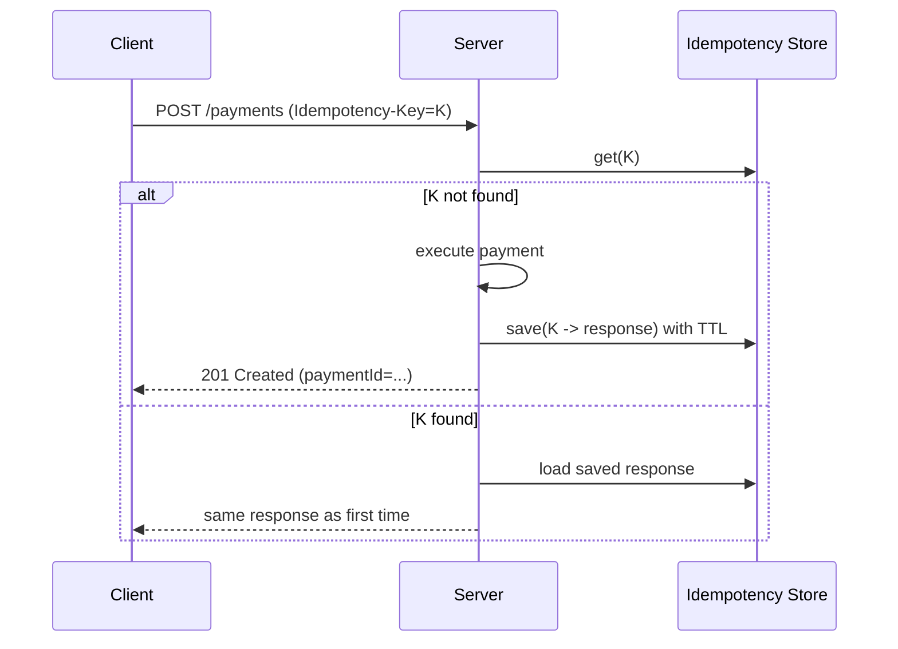

[← Назад к индексу части 15](index.md)

## 15.4. Idempotency-Key для POST/мутаций

### Цель раздела

Научиться защищаться от дублей в реальной сети: таймауты, ретраи, «нажал два раза», повторные запросы от прокси.

### В этом разделе главное

- POST «создать» по умолчанию **не идемпотентен**.
- Сеть часто даёт состояние «не знаю, выполнилось ли» — это нормальная реальность.
- `Idempotency-Key` позволяет серверу распознать повтор и вернуть результат первого выполнения.
- Нужно хранить ключи и результаты некоторое время (TTL), иначе защита не работает.
- Идемпотентность — это не «магия заголовка», а **протокол между клиентом и сервером**.

### Термины

| Термин | Определение |
|---|---|
| **Unknown outcome** | Клиент не знает, был ли запрос обработан (таймаут/сбой). |
| **Dedupe** | Удаление дублей запросов по ключу. |
| **TTL** | Время жизни записи ключа идемпотентности. |

### Теория и правила

#### Зачем нужен Idempotency-Key

Сценарий:

1) Клиент делает `POST /payments` (списать деньги).  
2) Сервер списал деньги, но ответ потерялся (таймаут/сеть).  
3) Клиент повторяет запрос.  
4) Без защиты — деньги спишутся второй раз.

#### Как работает Idempotency-Key (идея)

Клиент генерирует уникальный ключ для операции и отправляет его:

```http
POST /payments
Idempotency-Key: 7f3a0c3c-9e52-4b41-8d6a-b2a5b6c7d3c1
Content-Type: application/json
```

Сервер:

- если ключ **новый** — выполняет операцию, сохраняет «ключ → результат/идентификатор»;
- если ключ **уже был** — **не выполняет** операцию заново, а возвращает сохранённый результат (или эквивалентный ответ).

Визуально:



#### Границы и тонкости

- Ключ должен быть уникален **на операцию**, а не «в целом навсегда».
- Нужен TTL (например, 24 часа), иначе хранилище вырастет бесконечно.
- Нужно определить, что считать «тем же запросом»:
  - часто ключ + идентификатор клиента (userId/apiKey) — чтобы разные клиенты не могли «подглядеть» ответы друг друга.
- Что возвращать при повторе:
  - ideally тот же статус/тело, что и в первый раз.

### Пошагово: внедряем идемпотентность для создания заказа

1) Клиент всегда генерирует `Idempotency-Key` при `POST /orders`.  
2) Сервер валидирует ключ (формат, длина).  
3) Сервер делает atomic check-and-set:

- если ключ новый — сохраняет как «in progress», выполняет операцию, затем сохраняет результат;
- если ключ найден «in progress» — возвращает 409/202 (по политике) или ждёт завершения;
- если ключ найден «done» — возвращает сохранённый результат.

4) Сервер хранит запись с TTL.

### Простыми словами

Idempotency-Key — это как «номер талона» в банке.  
Если ты потерял чек и попросил повторить операцию, кассир по талону видит: «мы уже сделали» — и не делает второй раз.

### Картинка в голове

```
Операция: "создать/списать"
Ключ: "уникальный билет"
Сервер: "по билету понимает, повтор это или нет"
```

### Как запомнить

- Любая «деньги/заказ/важная мутация» должна жить в мире ретраев.
- Если клиент может повторить запрос — сервер должен уметь **не сделать дубль**.

### Примеры

#### Пример. Повтор POST с тем же ключом

Первый запрос:

```http
POST /orders
Idempotency-Key: 2e6a...b91
```

Ответ:

```http
201 Created
Location: /orders/ord_123
```

Повтор:

```http
POST /orders
Idempotency-Key: 2e6a...b91
```

Ответ (тот же смысл):

```http
201 Created
Location: /orders/ord_123
```

### Практика / реальные сценарии

- **Ретраи на клиенте**: библиотека автоматически повторяет запрос после таймаута.
- **Прокси/балансер**: может повторить запрос, если соединение оборвалось.
- **Пользователь «тапнул два раза»**: UI не заблокировал кнопку.

### Типичные ошибки

- Не хранить результат (только «ключ был»): тогда непонятно, что возвращать.
- Делать ключ глобальным без привязки к клиенту: риск утечек/коллизий.
- Делать слишком короткий TTL: повтор придёт позже — и вы всё равно создадите дубль.

### Что будет, если…

- …не внедрить идемпотентность на «денежных» операциях?  
  Рано или поздно будут дубли и инциденты (и это будет «редко, но больно»).

### Проверь себя

1. Что такое «unknown outcome» и почему он неизбежен?
2. Почему одного факта «ключ уже был» недостаточно?
3. Какие два параметра (кроме ключа) часто нужны, чтобы избежать «чужих повторов»?

<details><summary>Ответ</summary>

1. Это ситуация, когда клиент не знает, выполнился ли запрос: ответ потерялся/таймаут. Она неизбежна из-за сети и распределённости.
2. Потому что при повторе нужно вернуть **осмысленный результат**: какой ресурс создан, какой статус, что показать пользователю. Без сохранённого результата вы либо сделаете повторную операцию, либо не сможете корректно ответить.
3. Идентификатор клиента/пользователя (или API key) и «контекст операции» (например, endpoint/тип операции), чтобы ключи не пересекались между разными актёрами.

</details>

### Запомните

- Idempotency-Key — продакшн-инструмент против дублей.
- Он особенно важен там, где есть ретраи и деньги.

---
