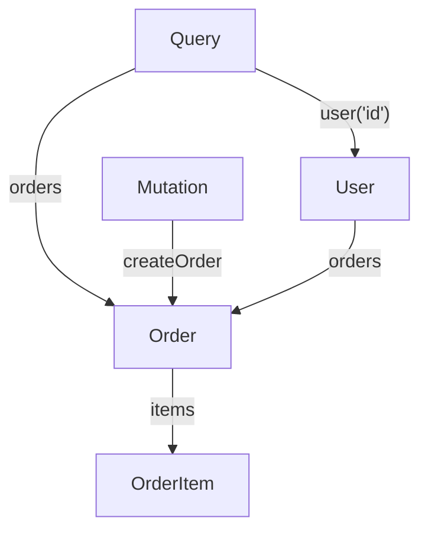

[← Назад к индексу части 16](index.md)

## 16.2. Схема, типы, запросы и мутации

### Цель раздела

Разобраться, **как устроена схема GraphQL**, как описывать типы и связи, как выглядят `Query` и `Mutation`, и как из этого вырастает **контракт API**, который может использоваться десятками клиентов.

### В этом разделе главное

- Схема описывает:
  - корневые типы: `Query`, `Mutation`, `Subscription`;
  - объектные типы (`type User`, `type Order` и т.п.);
  - скаляры и перечисления.
- Каждое поле в схеме имеет **тип** и может иметь **аргументы**.
- Запросы декларативно описывают **какие поля и связи нужны**, а сервер возвращает **JSON того же shape**.
- Мутации меняют состояние и обычно возвращают:
  - сам изменённый объект,
  - или «payload» с полями `success`, `errors`, `record`.
- Схема — это «истина» о контракте; документация, кодогенерация и инспекция базируются на ней.

### Термины

- **Scalar (скаляр)** — базовый тип: `Int`, `String`, `Boolean`, `ID`, `Float`, плюс кастомные (например, `DateTime`).
- **Enum** — перечисление допустимых значений (например, `OrderStatus`).
- **Non‑null (`!`)** — поле **обязательное** (нельзя вернуть `null` при успехе, иначе это ошибка).
- **List (`[T]`)** — список значений типа `T`.

### Теория и правила

#### 1) Минимальная схема для домена «Пользователи и заказы»

```graphql
schema {
  query: Query
  mutation: Mutation
}

type Query {
  me: User
  user(id: ID!): User
  orders(limit: Int, offset: Int): [Order!]!
  order(id: ID!): Order
}

type Mutation {
  createOrder(input: CreateOrderInput!): CreateOrderPayload!
}

type User {
  id: ID!
  name: String!
  email: String!
  orders(limit: Int, offset: Int): [Order!]!
}

type Order {
  id: ID!
  total: Float!
  status: OrderStatus!
  createdAt: String!
  items: [OrderItem!]!
}

type OrderItem {
  id: ID!
  productId: ID!
  quantity: Int!
  price: Float!
}

enum OrderStatus {
  CREATED
  PAID
  SHIPPED
  CANCELLED
}

input CreateOrderInput {
  userId: ID!
  items: [CreateOrderItemInput!]!
}

input CreateOrderItemInput {
  productId: ID!
  quantity: Int!
}

type CreateOrderPayload {
  order: Order
  errors: [UserError!]
}

type UserError {
  code: String!
  message: String!
  field: String
}
```

#### 2) Пример запросов и мутаций

Запрос текущего пользователя с последними заказами:

```graphql
query MeWithOrders {
  me {
    id
    name
    orders(limit: 3) {
      id
      status
      total
    }
  }
}
```

Мутация создания заказа:

```graphql
mutation CreateOrder($input: CreateOrderInput!) {
  createOrder(input: $input) {
    order {
      id
      status
      total
    }
    errors {
      code
      message
      field
    }
  }
}
```

### Пошагово: от REST‑ресурсов к GraphQL‑схеме

1. **Определи основные сущности домена** (как для REST): `User`, `Order`, `OrderItem`, `Product`.  
2. Для каждой сущности определи **набор полей**, которые будут видны клиенту.  
3. Описывай эти сущности как **тип GraphQL** (`type User { ... }`).  
4. Определи, **какие запросы на чтение** реально нужны UI:
   - список заказов,
   - детали заказа,
   - текущий пользователь.
5. Оформи их как поля `Query`: `orders`, `order`, `me`.  
6. Определи **какие изменения** (команды) нужны:
   - `CreateOrder`,
   - `CancelOrder`,
   - `PayOrder`.
7. Оформи их как поля `Mutation` с входными `input` и `payload` с `errors`.  
8. Для связей (`User.orders`, `Order.items`) **реши, какие аргументы** нужны (пагинация, фильтры).

### Простыми словами

Схема GraphQL — это **чёткий словарь**:

- какие «существительные» есть в API (`User`, `Order`);
- какие у них «прилагательные и принадлежности» (поля и связи);
- какие «глаголы» (операции) разрешены (`createOrder`, `cancelOrder`).

**Запрос** — это «фраза» на этом языке: он должен подчиняться грамматике (схеме).

### Картинка в голове



### Как запомнить

> **Schema** = словарь и грамматика.  
> **Query/Mutation** = предложения на этом языке.  
> **Resolver** = переводчик, который находит реальные данные под слова.

### Примеры

#### Пример 1. Запрос с аргументами и переиспользуемым фрагментом

```graphql
fragment OrderSummary on Order {
  id
  total
  status
}

query UserOrders($userId: ID!, $limit: Int) {
  user(id: $userId) {
    id
    name
    orders(limit: $limit) {
      ...OrderSummary
    }
  }
}
```

#### Пример 2. Несколько «экранов» одним GraphQL‑запросом

```graphql
query Dashboard {
  me {
    id
    name
  }
  recentOrders: orders(limit: 5) {
    id
    status
    total
  }
  notifications {
    id
    text
    read
  }
}
```

### Практика / реальные сценарии

- **Дашборд**: потребности в данных сильно отличаются от «деталей сущности»; GraphQL‑запрос позволяет описать комбинацию полей в одном запросе.
- **Мобильный клиент**: можно запрашивать более компактные наборы полей, чем веб, при той же схеме.

### Типичные ошибки

- Проецировать **таблицы БД 1:1** в типы GraphQL, не думая про доменную модель и потребности клиентов.
- Использовать один огромный `Query` с кучей аргументов вместо нескольких чётких полей.
- Не использовать `input`‑типы для мутаций и зашивать параметры мутаций как примитивы.

### Что будет, если…

- …бурно менять схему без версионирования и договорённостей?  
  - Клиенты будут ломаться; потеряется доверие к контракту; появится хаос из разных версий схемы.

### Проверь себя

1. Почему `input`‑типы для мутаций удобнее, чем просто список аргументов?  
2. В чём отличие `type` и `input` в GraphQL?  
3. Придумай два поля для `Query` и две `Mutation` для домена «подписка на сервис».

<details><summary>Ответ</summary>

1. `input`‑тип можно переиспользовать, версионировать и документировать как единый объект; он проще для валидации и расширения (добавление полей). Список аргументов быстро становится неудобным и хрупким.  
2. `type` используется в возвращаемых значениях (ответы сервера), `input` — только для входных данных (аргументы мутаций и иногда запросов). `input` не может содержать поля‑функции/резолверы и ссылки на `Query/Mutation`.  
3. Примеры: `Query { subscription(id: ID!): Subscription, mySubscriptions: [Subscription!]! }`; `Mutation { startSubscription(input: StartSubscriptionInput!): StartSubscriptionPayload!, cancelSubscription(...) }`.

</details>

### Запомните

- Схема GraphQL — это **единый контракт** для всех клиентов.
- Хорошая схема отражает **домен и реальные сценарии UI**, а не только структуру БД.

---
