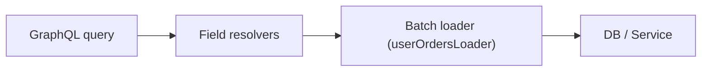

[← Назад к индексу части 16](index.md)

## 16.3. Резолверы, N+1 и DataLoader

### Цель раздела

Понять, как **GraphQL‑сервер превращает запрос в реальные обращения к БД и сервисам**, откуда берётся N+1, почему это архитектурная проблема, и как использовать батч‑загрузчики (DataLoader‑подход) и слои доступа к данным, чтобы GraphQL не «убивал» инфраструктуру.

### В этом разделе главное

- Каждый запрос GraphQL раскладывается на **дерево полей**, и для каждого поля вызывается резолвер.
- Наивные резолверы часто вызывают **отдельный запрос в БД для каждого объекта** → N+1.
- DataLoader/батч‑загрузчики позволяют **сгруппировать множество запросов** в один (например, `SELECT ... WHERE id IN (...)`).
- Резолверы должны работать **через слой доменных сервисов/репозиториев**, а не напрямую через ORM из каждого места.
- Важны **кэш** и **ограничение глубины/сложности** запросов.

### Термины

- **Resolver** — функция `(parent, args, context, info) => result`, привязанная к конкретному полю/типу.
- **N+1** — шаблон: 1 запрос за N сущностями + N запросов за их связями.
- **Batching** — объединение множества запросов к данным в один.
- **Caching** — запоминание результатов внутри одного запроса (per‑request cache) или дольше.

### Теория и правила

#### 1) Как GraphQL вызывает резолверы

Для запроса:

```graphql
query {
  users {
    id
    name
    orders {
      id
      total
    }
  }
}
```

Процесс:

1. Вызывается резолвер `Query.users`.
2. Для каждого пользователя вызывается резолвер `User.orders`.
3. Для каждого заказа — свои поля и т.д.

Наивный код:

```pseudo
resolve Query.users:
  return db.query("SELECT * FROM users")

resolve User.orders(user):
  return db.query("SELECT * FROM orders WHERE user_id = :user.id")
```

Если `users` вернул 100 пользователей, то:

- 1 запрос за users,
- 100 запросов за orders — **N+1**.

#### 2) DataLoader / батч‑загрузчик: идея

Идея DataLoader:

- Внутри одного GraphQL‑запроса мы **копим ключи**, по которым нужно получить данные,
- периодически **делаем один батч‑запрос**, 
- раскладываем результаты обратно по ключам.

Псевдокод:

```pseudo
userOrdersLoader = new DataLoader(keys => 
  db.query("SELECT * FROM orders WHERE user_id IN (:keys)")
    .groupBy(user_id)
)

resolve User.orders(user, args, ctx):
  return ctx.userOrdersLoader.load(user.id)
```

Теперь для 100 пользователей будет:

- 1 запрос за users,
- 1 запрос за orders **для всех этих пользователей**.

### Пошагово: как построить слой резолверов

1. **Введи слой доменных сервисов/репозиториев**: `UserService`, `OrderService`.  
2. В резолверах **не пиши SQL/ORM напрямую**; используй сервисы:

   - `Query.users` → `userService.listUsers(...)`;
   - `User.orders` → `orderService.getOrdersByUserIds` (через DataLoader).

3. Для каждой «горячей» связи (`User.orders`, `Order.user`) сделай **батч‑загрузчик**:

   - вход: список ключей,
   - выход: карта `ключ → список сущностей`.
4. Добавь **per‑request кэширование** в DataLoader, чтобы при повторном `load(id)` данные брались из кэша.
5. Введи **ограничения глубины/сложности** запросов (чтобы кто‑то не запросил «весь граф вселенной»).

### Простыми словами

Наивный GraphQL‑слой похож на:

- «каждому покупателю — отдельный курьер за его покупками в склад»:
  - 100 покупателей → 100 поездок.

DataLoader превращает это в:

- «один грузовик забирает все покупки для 100 покупателей сразу».

### Картинка в голове



### Как запомнить

> **GraphQL‑дерево → дерево резолверов.**  
> Наивная реализация = «каждый резолвер ходит в БД сам».  
> Здоровая реализация = «резолверы используют батч‑загрузчики и кэш внутри запроса».

### Примеры

#### Пример 1. N+1 в ORM без DataLoader

На ORM это часто выглядит так:

```pseudo
resolve Query.users:
  return db.users.findAll()

resolve User.orders(user):
  return user.getOrders()  // ORM лениво делает SELECT ... WHERE user_id = ?
```

Для 100 пользователей ORM сделает 101 запрос (N+1).

#### Пример 2. DataLoader (на псевдокоде)

```pseudo
class OrderRepository {
  async findByUserIds(userIds: ID[]): Promise<Map<ID, Order[]>> {
    rows = await db.query(
      "SELECT * FROM orders WHERE user_id IN (:userIds)",
      { userIds }
    )
    return groupBy(rows, row => row.user_id)
  }
}

// В контексте запроса:
ctx.userOrdersLoader = new DataLoader(async (userIds) => {
  const map = await orderRepo.findByUserIds(userIds)
  return userIds.map(id => map.get(id) || [])
})

resolve User.orders(user, args, ctx):
  return ctx.userOrdersLoader.load(user.id)
```

### Практика / реальные сценарии

- **CRM/дашборды**: много связанных сущностей (`company → contacts → deals → activities`); без батч‑загрузчиков N+1 убивает БД.
- **Мобильный GraphQL‑API**: сотни «тонких» запросов могут превратиться в тысячи SQL‑запросов, если не думать о N+1.

### Типичные ошибки

- Строить резолверы как «тонкий слой над ORM» без батчей.
- Пытаться бороться с N+1 чисто на уровне БД, не реорганизуя слой резолверов.
- Не вводить лимиты глубины/сложности запроса (depth/complexity limit).

### Что будет, если…

- …не бороться с N+1?  
  - Локальные тесты будут выглядеть нормально, но **под нагрузкой** БД начнёт «умирать»; латентность вырастет, появятся таймауты и деградация.

### Проверь себя

1. Опиши своими словами, что такое N+1 в GraphQL‑контексте.  
2. Как DataLoader уменьшает количество обращений к БД?  
3. Какие два типа лимитов запросов GraphQL ты бы ввёл в первую очередь?

<details><summary>Ответ</summary>

1. Это когда запрос за коллекцией сущностей (N штук) порождает N дополнительных запросов за связанными данными (например, для каждого пользователя — отдельный запрос за заказами). В сумме получается N+1 запрос к БД вместо 2–3 батчей.  
2. Он собирает множество отдельных `load(key)` в один список ключей, выполняет **один батч‑запрос**, а потом распределяет результаты по ключам. Внутри запроса он также кэширует результаты.  
3. Лимит глубины (максимальная вложенность полей) и лимит «сложности» (взвешенная оценка, сколько сущностей потенциально вернёт запрос). Это защищает от слишком тяжёлых и «рекурсивных» запросов.

</details>

### Запомните

- GraphQL по умолчанию **провоцирует N+1**, если не думать о слое доступа к данным.
- DataLoader‑подход и лимиты сложности — **обязательные элементы** продакшн‑GraphQL.

---
