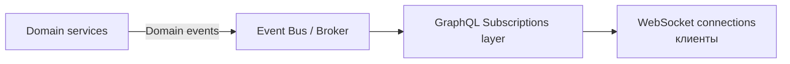
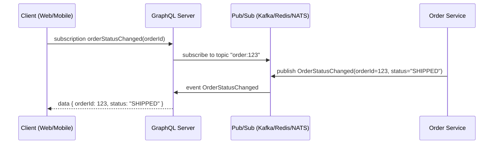

[← Назад к индексу части 16](index.md)

## 16.5. Подписки (subscriptions) и real‑time

### Цель раздела

Понять, как **GraphQL‑подписки** вписываются в архитектуру real‑time: какие транспортные механизмы используются (WebSocket, SSE), какие сценарии они покрывают, как связаны с событийной архитектурой (EDA), и где их уместно применять.

### В этом разделе главное

- `Subscription` — это **долгоживущая операция**, по которой сервер пушит клиенту данные.
- Под капотом чаще всего используется **WebSocket** или SSE.
- Подписки **не заменяют** EDA и брокеры сообщений; они — адаптер real‑time для клиентов.
- Важно думать:
  - о **масштабировании соединений**,
  - о **stickiness** (липкость сессий),
  - о **привязке к доменным событиям**.

### Термины

- **Subscription** — GraphQL‑операция вида `subscription OnOrderStatusChanged { ... }`.
- **Pub/Sub** — модель «издатель/подписчик»; подписки GraphQL обычно опираются на внутренний Pub/Sub.

### Теория и правила

#### 1) Как выглядит подписка

Схема:

```graphql
type Subscription {
  orderStatusChanged(orderId: ID!): OrderStatusUpdate!
}

type OrderStatusUpdate {
  orderId: ID!
  status: OrderStatus!
  updatedAt: String!
}
```

Клиент:

```graphql
subscription OnOrderStatusChanged($orderId: ID!) {
  orderStatusChanged(orderId: $orderId) {
    orderId
    status
    updatedAt
  }
}
```

#### 2) Архитектурное место подписок

Внутри:

- **бекенд‑сервисы** публикуют доменные события (EDA, шины, брокеры),
- **GraphQL‑слой** подписывается на эти события (через Pub/Sub),
- при получении событий GraphQL‑слой **доставляет их активным подпискам** клиентов.



#### 3) Масштабирование и липкость

- Каждый WebSocket‑клиент — долговременное соединение к определённому инстансу GraphQL‑сервера.
- Подписки требуют:
  - sticky sessions (в простых реализациях),
  - или внешнего shared Pub/Sub (Redis, Kafka, NATS), чтобы любой инстанс мог доставить событие нужному клиенту.

### Пошагово: от доменных событий к подписке

1. Определи, **какое доменное событие** важно для real‑time UI:
   - `OrderStatusChanged`,
   - `MessageSent`,
   - `TaskUpdated`.
2. В EDA‑слое (часть 12) это событие уже существует или будет добавлено.  
3. В GraphQL‑схеме опиши `Subscription` для этого события.  
4. В резолвере подписки:
   - подпишись на внутренний Pub/Sub по ключу (`orderId`, `userId`),
   - при каждом событии прокинь его в активные GraphQL‑подписки.
5. Продумай:
   - лимиты подключений,
   - авторизацию (кто имеет право видеть это событие),
   - поведение при отвале соединения (reconnect).

### Простыми словами

GraphQL‑подписка — это **мост**:

- снизу — «обычные» доменные события (Kafka, RabbitMQ, брокеры);
- сверху — удобный **типизированный real‑time API для клиентов**.

### Картинка в голове



### Как запомнить

> Подписки GraphQL = «типизированный WebSocket‑API», который питается **доменных событий**.  
> Они не создают события, а **транслируют** их клиентам.

### Примеры

- Трекинг доставки (карта, статус заказа).
- Онлайн‑чат (новые сообщения приходят по подписке).
- Real‑time дашборды (метрики, алерты).

### Практика / реальные сценарии

- Заменять/дополнять long‑polling в UI:
  - раньше: `GET /notifications` раз в X секунд,
  - теперь: `subscription { notifications }`.
- Локальное приложение: GraphQL‑подписки внутри компании (админские панели, мониторинги).

### Типичные ошибки

- Пытаться использовать подписки для **всего подряд**, даже когда достаточно polling/SSE.
- Не ограничивать количество активных подписок и потребление ресурсов.
- Не завязывать подписки на доменные события (стримить «сырые» данные из БД напрямую).

### Что будет, если…

- …делать GraphQL‑подписки без продуманной инфраструктуры (Pub/Sub, sticky, лимиты)?  
  - Получишь сложные для отладки и масштабирования real‑time‑фичи; возможны пропуски/дубли событий и проблемы с памятью.

### Проверь себя

1. В чём принципиальное отличие GraphQL‑подписки от GraphQL‑запроса?  
2. Почему для подписок почти всегда нужен отдельный Pub/Sub‑слой под капотом?  
3. Приведи пример сценария, где subscription явно лучше, чем polling.

<details><summary>Ответ</summary>

1. Запрос (`query`) — одноразовая операция: клиент запросил → сервер ответил → соединение (для этой операции) закрыто. Подписка (`subscription`) — долгоживущая: сервер отправляет множество сообщений по одному запросу до закрытия подключением/подписки.  
2. Потому что несколько инстансов GraphQL‑сервера должны получать события от доменных сервисов и маршрутизировать их к конкретным подпискам; без общего Pub/Sub сложно гарантировать доставку независимо от того, на каком инстансе висит клиент.  
3. Например, статус доставки заказа или приём новых сообщений в чате: пользователь хочет видеть обновления сразу, а не по таймеру.

</details>

### Запомните

- Подписки GraphQL — мощный инструмент для **real‑time‑UI**, но требуют **зрелой событийной и сетевой инфраструктуры**.

---
