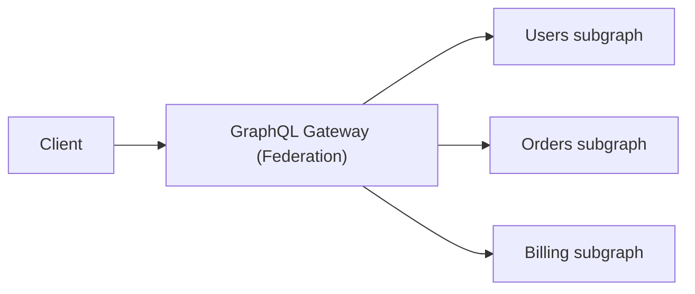

[← Назад к индексу части 16](index.md)

## 16.6. GraphQL Federation и архитектура микросервисов

### Цель раздела

Понять, как **GraphQL вписывается в микросервисную архитектуру**: что такое Federation, как несколько сервисов могут предоставлять свои под‑схемы (subgraphs), которые объединяются в **единый GraphQL‑gateway**, и какие новые риски и сложности при этом появляются.

### В этом разделе главное

- Federation — это способ **объединить несколько GraphQL‑схем сервисов** в одну логическую схему.
- Gateway отвечает за:
  - объединение схем,
  - маршрутизацию запросов к нужным сервисам,
  - агрегацию ответов.
- Federation помогает скрыть:
  - внутреннюю топологию микросервисов,
  - разрезание данных по сервисам.
- При этом:
  - N+1 и проблемы производительности могут появиться уже **на уровне федерации**,
  - авторизация и наблюдаемость усложняются,
  - есть риск построить **распределённый монолит**.

### Термины

- **Subgraph** — схема и резолверы отдельного микросервиса в федерации.
- **Gateway** — федеративный шлюз, который собирает subgraphs в единую схему.
- **Key field** — поле, по которому федерация сшивает типы между сервисами (`@key(fields: "id")` в Apollo Federation).

### Теория и правила

#### 1) Зачем нужна Federation

В большой системе:

- сервис `Users` отвечает за пользователей,
- сервис `Orders` — за заказы,
- сервис `Billing` — за платежи.

У каждого может быть своя схема GraphQL. Клиентам неудобно:

- ходить в три разных GraphQL‑endpoint,
- самим объединять данные.

Federation:

- даёт **единый GraphQL‑API для клиентов** (gateway),
- позволяет каждому сервису:
  - владеть своим куском схемы,
  - эволюционировать независимо.

#### 2) Как выглядит федерация (на уровне схем, концептуально)

Упрощённая картина в духе Apollo Federation (идея, не конкретный синтаксис):

Сервис `Users`:

```graphql
type User @key(fields: "id") {
  id: ID!
  name: String!
}

type Query {
  user(id: ID!): User
}
```

Сервис `Orders`:

```graphql
type Order {
  id: ID!
  userId: ID!
  total: Float!
}

extend type User @key(fields: "id") {
  id: ID! @external
  orders: [Order!]!
}
```

Gateway собирает:

- базовое определение `User` из `Users`‑сервиса,
- расширение `User.orders` из `Orders`‑сервиса,
- тип `Order` от `Orders`‑сервиса.

Клиент видит единую схему:

```graphql
type User {
  id: ID!
  name: String!
  orders: [Order!]!
}
```

и делает запрос:

```graphql
query {
  user(id: "u1") {
    id
    name
    orders {
      id
      total
    }
  }
}
```

Gateway:

- часть запроса (`user`) отправляет в `Users`,
- часть (`orders`) — в `Orders`,
- соединяет результаты и отдаёт клиенту.

### Пошагово: как подходить к Federation

1. **Начни с обычного BFF/GraphQL‑gateway без Federation**, если сервисов немного:
   - один GraphQL‑слой, который ходит по REST/gRPC к сервисам.
2. Когда сервисов и команд становится много, а **один GraphQL‑layer становится узким местом**, рассмотри Federation:
   - каждый сервис владеет своей частью схемы;
   - gateway только «сшивает» и маршрутизирует.
3. Определи **границы владения типами**:
   - кто владелец `User`,
   - кто владелец `Order`, и т.д.
4. Определи **key‑поля** и связи между типами:
   - как `Orders` найдёт `User` и наоборот.
5. Подумай про:
   - **N+1 на уровне федерации** (когда gateway для каждого `User` делает отдельный call в `Orders`),
   - лимиты сложности и depth на уровне gateway,
   - трассировку (кто медленный — gateway или конкретный сервис).

### Простыми словами

Federation — это как **единая витрина** над несколькими магазинами:

- на витрине ты видишь «User» и «Order» как единый каталог,
- но на самом деле:
  - товары/заказы лежат в одном магазине,
  - данные о пользователях — в другом,
  - витрина просто знает, **куда за чем сходить**.

### Картинка в голове



### Как запомнить

> Federation = «несколько владельцев схемы, один gateway».  
> Главное — **чётко определить владение типами и ключи связей**, иначе получится распределённый монолит.

### Примеры

- Большая платформа:
  - команда «Профили» владеет `User`,
  - команда «Заказы» — `Order`,
  - команда «Платежи» — `Payment`.
- Все они экспонируют под‑схемы, которые gateway объединяет.

### Практика / реальные сценарии

- Когда GraphQL‑слой становится «бутылочным горлышком» и «командой‑фронтендером», которая знает обо всём, — Federation позволяет распределить знания и ответственность по сервисам.
- Когда несколько продуктов/клиентов используют одну огромную GraphQL‑схему — Federation помогает **делегировать эволюцию частей схемы** конкретным продуктовым командам.

### Типичные ошибки

- Включать Federation **слишком рано**, когда достаточно обычного BFF‑/gateway‑подхода.
- Размывать владение типами (`User` меняют три разных сервиса).
- Игнорировать производительность (N+1) и трассировку на уровне gateway.

### Что будет, если…

- …построить Federation без ясных границ владения?  
  - Схема станет «болотом» с пересекающимися расширениями и конфликтами; любая эволюция будет опасной и медленной.

### Проверь себя

1. В чём основная выгода Federation по сравнению с одним монолитным GraphQL‑сервером?  
2. Какие новые риски появляются при Federation?  
3. В каком случае ты бы **не стал(а)** вводить Federation, даже если GraphQL уже есть?

<details><summary>Ответ</summary>

1. Возможность разделить владение схемой и её эволюцию по нескольким командам/сервисам, сохранив для клиентов **единый API**. Это уменьшает зависимость всех от одного «GraphQL‑монолита».  
2. Дополнительный уровень N+1 (между gateway и subgraphs), сложность трассировки, необходимость хорошей договорённости по владению типами и key‑полям, рост сложности отладки и деплоя (gateway + несколько subgraphs).  
3. Если сервисов мало, команды небольшие и один GraphQL‑gateway справляется по производительности, а также если команда ещё не выстроила дисциплину схемы и резолверов — Federation преждевременна и только добавит сложность.

</details>

### Запомните

- Federation — это инструмент для **масштабирования GraphQL‑схемы и владения ею** в микросервисной архитектуре.
- Он требует дисциплины владения типами, продуманных ключей и хорошей наблюдаемости.

---
